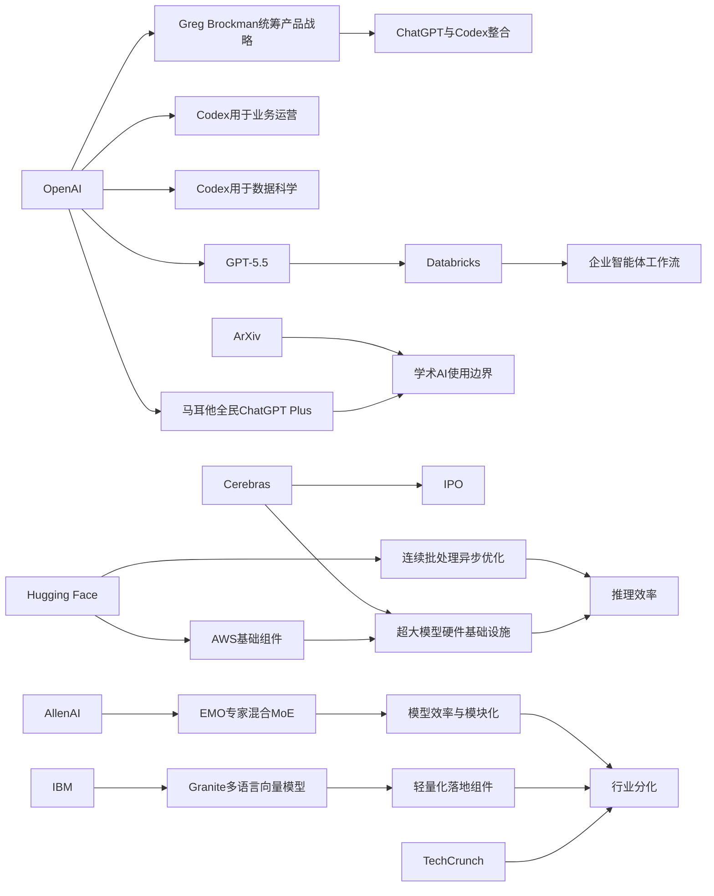

> AI 早报 · 每日早读 · 全网深度聚合

## **今日摘要**

马耳他将与 OpenAI 合作向全民推广 ChatGPT Plus 和 AI 培训，同时云端大模型基础设施与超大模型硬件能力也成为产业关注重点，体现出 AI 普及和底层竞争正在同步加速。  
研究与应用层面，EMO 探索让专家混合模型形成更清晰分工，Codex 也开始从编程走向业务运营分析与汇报，说明 AI 正在同时推进模型效率提升和通用办公落地。  
在社会与行业影响上，ArXiv 明确收紧“AI 包办论文”的边界，而企业则继续把更强模型接入智能体流程，反映出 AI 发展正一边扩张应用，一边建立责任与规范。

### 🔵 产品与功能更新

1. **马耳他将向全民提供 ChatGPT Plus。**  
OpenAI 与马耳他达成合作，计划把 ChatGPT Plus 和相关培训带给更多公民，帮助大家学习实用的 AI 技能。这个动作不只是“送会员”，更强调如何负责任地使用 AI，并把工具真正用于学习、工作和日常生活。对普通用户来说，这代表国家层面的 AI 普及开始从口号走向具体服务。🚀  
[全民AI合作计划(briefing)](https://openai.com/index/malta-chatgpt-plus-partnership)

2. **Cerebras 以 IPO 引发市场关注。**  
Cerebras 因首次公开募股（IPO，企业上市融资）成为当天焦点。公司高管特别强调，其硬件不仅能支持小模型，也能承载万亿参数级别的大模型，试图打消外界对其能力边界的质疑。这也说明，AI 基础设施竞争正在从“谁更快”转向“谁能真正托起超大模型”。🚀  
[Cerebras上市看点(briefing)](https://news.smol.ai/issues/26-05-15-not-much/)

3. **AWS 上训练与部署大模型的基础组件被系统梳理。**  
Hugging Face 发布文章，介绍在 AWS（亚马逊云）上进行基础模型训练和推理（让模型实际运行回答问题）的关键模块。内容聚焦企业如何拼装算力、存储和软件工具，搭出一套可用的大模型工作流。对希望上云做 AI 的团队来说，这类“积木式”指南能降低理解门槛。🚀  
[AWS大模型积木(briefing)](https://huggingface.co/blog/amazon/foundation-model-building-blocks)

### 🟢 前沿研究

1. **EMO 探索专家混合模型的“涌现模块化”。**  
AllenAI 介绍了 EMO，这是一种专家混合（MoE，多个子模型分工协作）预训练方法，目标是让模型自然形成更清晰的功能分工。简单说，就是让不同“专家”更擅长不同任务，而不是所有部分都做同样的事。这样的方向有望提升模型效率，也可能让未来模型更容易理解和优化。🚀  
[EMO研究速览(briefing)](https://huggingface.co/blog/allenai/emo)

2. **Codex 被用于业务运营团队的日常分析与汇报。**  
OpenAI 展示了业务运营团队如何使用 Codex，把真实工作输入转成项目简报、策略更新和管理层决策材料。虽然这更像应用案例，但它反映出 AI 正从“写代码工具”扩展为通用办公助手。对非技术团队来说，生成结构化文档可能是最先落地的价值之一。🚀  
[运营团队用Codex(briefing)](https://openai.com/academy/codex-for-work/how-business-operations-teams-use-codex)

3. **iNaturalist-clumper 0.1 发布，面向自然观察数据整理。**  
Simon Willison 记录了 inaturalist-clumper 0.1，这是一款与自然观察平台数据处理相关的小工具。虽然体量不大，但这类工具常常体现 AI 之外的数据组织、筛选和聚合思路。它说明围绕数据清洗与整理的“小而实用”工具仍在持续涌现。🚀  
[自然数据小工具(briefing)](https://simonwillison.net/2026/May/15/inaturalist-clumper/#atom-everything)

### 🟡 行业展望与社会影响

1. **ArXiv 将严打“让 AI 包办论文”的投稿。**  
研究论文平台 ArXiv 表示，如果作者让大语言模型（能生成文本的 AI）完成过多实质工作，可能面临一年禁投稿处罚。平台想传递的信号很明确：AI 可以辅助，但不能替代作者应承担的研究与写作责任。这将进一步推动学术界明确 AI 使用边界。🚀  
[ArXiv新规解读(briefing)](https://techcrunch.com/2026/05/16/research-repository-arxiv-will-ban-authors-for-a-year-if-they-let-ai-do-all-the-work/)

2. **Databricks 将 GPT-5.5 引入企业智能体流程。**  
Databricks 宣布在企业智能体（Agent，可自动执行部分任务的 AI 系统）工作流中使用 GPT-5.5。官方提到，该模型在 OfficeQA Pro 基准测试（用于评估办公任务能力的测试）上创下新成绩，因此被纳入企业场景。这表明，企业购买 AI 不再只看“会不会聊天”，而是更关注能否稳定处理真实业务流程。🚀  
[企业智能体升级(briefing)](https://openai.com/index/databricks)

3. **AI 淘金热正在拉大行业内外的差距。**  
TechCrunch 关注 AI 热潮中的“有者”与“无者”，指出这场繁荣并没有让所有参与者都同等受益。资本、算力、数据和人才继续向头部公司集中，让不少创业者和普通从业者感受到机会与焦虑并存。这类讨论提醒我们，AI 的影响不仅是技术进步，也包括资源分配和行业结构变化。🚀  
[AI淘金热分化(briefing)](https://techcrunch.com/2026/05/16/the-haves-and-have-nots-of-the-ai-gold-rush/)

### 🟣 开源TOP项目

1. **Granite 多语言向量模型主打小体积高检索表现。**  
IBM 发布 Granite Embedding Multilingual R2，这是一款开源多语言向量模型（把文本转成可计算向量，便于搜索和匹配）。文章强调它在 1 亿参数以下模型中实现了很强的检索质量，并支持 32K 上下文（可处理更长输入）。对做知识库、搜索和问答系统的团队来说，这是很实用的基础组件。🚀  
[Granite开源向量(briefing)](https://huggingface.co/blog/ibm-granite/granite-embedding-multilingual-r2)

2. **Codex 被展示为数据科学团队的工作助手。**  
OpenAI 介绍数据科学团队如何用 Codex 生成根因分析简报、KPI 备忘录和分析范围说明。它的核心价值不在替代分析师，而在于把零散输入整理成更清楚的工作产出。对于经常要写汇报、对齐口径的团队，这种能力比单纯“自动写代码”更容易体现效率提升。🚀  
[数据团队用Codex(briefing)](https://openai.com/academy/codex-for-work/how-data-science-teams-use-codex)

3. **OpenAI 产品战略或由 Greg Brockman 亲自统筹。**  
据报道，OpenAI 联合创始人 Greg Brockman 正接手产品战略，这一变化发生在公司计划整合 ChatGPT 与 Codex 之际。若消息属实，意味着 OpenAI 可能把聊天、创作和编程能力进一步打包，做成更统一的产品体验。对行业来说，高层调整往往预示下一阶段的产品方向。🚀  
[OpenAI战略变动(briefing)](https://techcrunch.com/2026/05/16/openai-co-founder-greg-brockman-reportedly-takes-charge-of-product-strategy/)

### 🔴 社媒分享

1. **OpenAI 审判收尾，AI 领导者信任问题再被热议。**  
TechCrunch 播客回顾了 Musk 与 Altman 相关审判的收尾阶段，讨论焦点始终围绕“我们是否信任掌舵 AI 的人”。节目还把这一事件与 SpaceX 潜在超级 IPO 放在一起看，展现出科技权力、资本叙事与公众观感的交织。对普通读者来说，这类内容更像是理解 AI 舆论温度的窗口。🚀  
[审判与信任争议(briefing)](https://techcrunch.com/podcast/the-openai-trial-wraps-up-and-the-musk-founder-machine-keeps-spinning/)

2. **OpenClaw 更名话题引发关注。**  
Simon Willison 记录了从 Warelay 到 OpenClaw 的命名变化。虽然只是名称调整，但在开源和产品传播中，一个更清晰、更易记的名字往往会影响社区接受度。社媒上的这类短消息，常常反映项目在定位与品牌上的微妙变化。🚀  
[OpenClaw更名记(briefing)](https://simonwillison.net/2026/May/16/openclaw-names/#atom-everything)

3. **连续批处理中的异步能力成为推理优化话题。**  
Hugging Face 分享了 continuous batching（连续批处理）里的异步机制优化，重点在提升模型推理（模型实际生成结果）的吞吐与效率。对非技术读者来说，可以把它理解为“让同一套 AI 服务器更顺畅地同时服务更多请求”。这类底层优化虽然不显眼，却直接影响 AI 产品是否更快、更省钱。🚀  
[异步推理优化(briefing)](https://huggingface.co/blog/continuous_async)

---

📊 行业洞察

1. 事实  
  OpenAI 与马耳他合作，计划向更多公民提供 ChatGPT Plus 与 AI 培训；同时，ArXiv 明确收紧“AI 代写论文”边界，若大语言模型承担过多实质工作，作者可能被禁投稿一年。  
  【洞察】判断：AI 普及正在进入“国家级渗透 + 制度化约束”并行阶段。也就是说，AI 不再只是企业采购的软件工具，而开始成为公共数字基础设施的一部分；但伴随渗透加深，治理框架也同步升级。未来竞争不只是谁先把模型送到用户手里，更是谁能建立“负责任使用（Responsible AI）”与可审计边界，这会成为教育、科研、政务等高敏感场景落地的前置条件。

2. 事实  
  Cerebras 借 IPO 强调其硬件可支撑万亿参数级大模型；Hugging Face 系统梳理了 AWS 上训练与部署基础模型的关键组件；Hugging Face 还讨论了 continuous batching（连续批处理，一种提升推理吞吐的调度机制）中的异步优化。  
  【洞察】判断：AI 基础设施竞争正从“单点算力性能”转向“端到端系统能力”。上游芯片/加速器（Accelerator，AI 计算硬件）只是入口，真正形成壁垒的是训练、存储、调度、推理优化到云交付的全链路协同。资本市场关注 Cerebras，说明市场仍押注“大模型底座”；但 AWS 积木式工作流和推理侧异步优化则表明，企业客户真正买单的是“可部署、可扩展、可控成本”的完整方案，而非孤立硬件指标。

3. 事实  
  Databricks 将 GPT-5.5 引入企业智能体流程，并强调其在 OfficeQA Pro 基准测试上的表现；OpenAI 分别展示了 Codex 在业务运营团队、数据科学团队中的文档生成、简报整理与分析协作能力；另有消息称 Greg Brockman 或将统筹 OpenAI 产品战略，背景是 ChatGPT 与 Codex 的进一步整合。  
  【洞察】判断：企业 AI 的价值锚点正从“聊天体验”迁移到“工作流执行”。智能体（Agent，可自动执行部分任务的系统）和办公场景生成正在融合，模型被要求直接产出简报、KPI 备忘录、策略材料等可交付物，而不是只提供灵感或问答。OpenAI 若推进 ChatGPT 与 Codex 一体化，实质上是在把“对话入口 + 任务执行 + 文档产出”打包成统一工作台，这会加速企业软件从 SaaS（软件即服务）走向“AI 原生协作界面”。

4. 事实  
  AllenAI 的 EMO 研究探索专家混合（MoE，多个子模型分工协作）中的“涌现模块化”；IBM 发布小体积高检索表现的 Granite 多语言向量模型；TechCrunch 则指出 AI 淘金热正在加剧资本、算力、数据和人才向头部集中。  
  【洞察】判断：行业正在形成“两极化创新”格局——一端是头部机构推动更复杂的模型架构创新，另一端是开源社区用更小、更专用的模型抢占实际应用。MoE 代表“更大更复杂”的效率路线，Granite 代表“更轻更实用”的落地路线；而资源持续向头部集中，意味着中小团队若继续追逐通用大模型正面竞争将更加困难，转而聚焦检索、嵌入（Embedding，将文本转为向量表示）、垂直数据工具等高性价比模块，反而更有生存空间。

🗺️ 今日关系图

