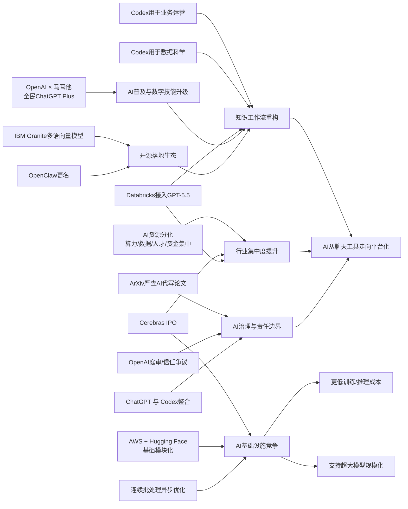

> AI 早报 · 每日早读 · 全网深度聚合

## **今日摘要**

本周 AI 动态主要集中在三条线：一是基础设施和产品侧持续加速，比如 Cerebras 推进上市、强调可支撑超大模型，OpenAI 与马耳他合作推动全民使用 ChatGPT Plus，AWS 与 Hugging Face 也在把大模型训练部署流程进一步模块化。  
二是研究与应用层面，MoE 模型的“自然分工”能力、Codex 在业务运营中的文档与分析辅助，以及 AI 资源向大公司集中的趋势，都显示 AI 正在同时走向更高效率和更强资源门槛。  
三是行业治理和企业落地方向也在升温，ArXiv 开始收紧“由 AI 包办论文”的行为，反映出社会对 AI 使用边界与责任归属的重视，而企业则继续把更强模型接入实际工作流。

### 🔵 产品与功能更新

1. **Cerebras推进上市，并强调可服务超大模型。**  
Cerebras 启动 IPO（首次公开募股），让这家以“不同于主流路线”的 AI 芯片公司再次成为焦点。公司高管特别回应了外界对其能力的质疑，表示其系统并不只适合小模型，也能支持万亿参数级别的大模型训练与推理。对普通用户来说，这意味着 AI 基础设施竞争正在加速，未来大模型的速度和成本都有机会继续改善。🚀  
[Cerebras上市进展(briefing)](https://news.smol.ai/issues/26-05-15-not-much/)

2. **OpenAI与马耳他合作，向全国居民提供ChatGPT Plus。**  
OpenAI 宣布与马耳他合作，推动更广泛的 AI 普及，让更多公民可以接触 ChatGPT Plus，并接受相关培训。重点不只是“能用上 AI”，还包括学习如何把 AI 用在日常工作与生活中，以及如何负责任地使用。对非技术用户来说，这更像是一项全民数字技能升级计划。🚀  
[马耳他全民AI合作(briefing)](https://openai.com/index/malta-chatgpt-plus-partnership)

3. **AWS与Hugging Face总结大模型训练和部署基础模块。**  
这篇内容梳理了在 AWS（亚马逊云）上训练和推理基础模型时常见的关键组件，包括算力、存储、调度和部署等环节。虽然偏基础设施，但它反映出云厂商正在把复杂的大模型流程“模块化”，让企业更容易搭建自己的 AI 系统。对业务团队来说，这意味着以后上线 AI 功能的门槛可能会进一步降低。🚀  
[AWS大模型模块化(briefing)](https://huggingface.co/blog/amazon/foundation-model-building-blocks)

### 🟢 前沿研究

1. **EMO探索专家混合模型的“自然分工”能力。**  
EMO 研究聚焦 MoE（专家混合模型，一种把任务分给不同子模型处理的架构）在预训练阶段如何形成“模块化”能力。简单说，就是希望模型里的不同“专家”能自己学会分工，而不是全都做差不多的事。这类研究有助于提升大模型效率，也可能让模型在复杂任务上更稳更省算力。🚀  
[EMO模块化研究(briefing)](https://huggingface.co/blog/allenai/emo)

2. **Codex被用于业务运营团队的日常分析与写作。**  
OpenAI 展示了业务运营团队如何使用 Codex 来生成项目简报、战略更新、管理层决策材料和进展总结。虽然它更像应用案例，但也体现出生成式 AI 正在从“写代码”扩展到更广义的知识工作辅助。对企业来说，这类工具的价值在于把零散输入整理成更清晰、可执行的文档。🚀  
[Codex运营应用例(briefing)](https://openai.com/academy/codex-for-work/how-business-operations-teams-use-codex)

3. **AI淘金热中的资源分化问题引发关注。**  
这篇报道讨论了当前 AI 热潮背后“有资源者更强、缺资源者更难追赶”的现实。算力、数据、人才和资金正越来越集中在少数大公司手中，使得行业创新机会与竞争格局都在发生变化。对研究圈和创业者来说，这提醒大家：AI 的前沿突破不只取决于想法，也越来越取决于资源配置。🚀  
[AI淘金热分化观察(briefing)](https://techcrunch.com/2026/05/16/the-haves-and-have-nots-of-the-ai-gold-rush/)

### 🟡 行业展望与社会影响

1. **ArXiv将严查“让AI包办论文”的投稿行为。**  
ArXiv 表示，如果作者让大语言模型（能生成文本的 AI 系统）代替自己完成主要学术写作，可能面临一年禁投稿处罚。这说明学术界正在划定 AI 使用边界：可以辅助，但不能取代研究者本人的核心工作。对公众而言，这也是一个信号——AI 工具越普及，内容真实性与责任归属越重要。🚀  
[ArXiv收紧AI论文(briefing)](https://techcrunch.com/2026/05/16/research-repository-arxiv-will-ban-authors-for-a-year-if-they-let-ai-do-all-the-work/)

2. **Databricks把GPT-5.5引入企业智能体流程。**  
Databricks 宣布在企业级 agent（智能体，可自动执行多步任务的 AI 系统）工作流中使用 GPT-5.5。官方强调该模型在 OfficeQA Pro 基准测试中取得了新的领先成绩，也意味着企业对高性能模型的采购和整合正在加速。对行业来说，这会推动 AI 从“聊天工具”进一步走向实际业务自动化。🚀  
[Databricks接入GPT-5.5(briefing)](https://openai.com/index/databricks)

### 🟣 开源TOP项目

1. **Granite多语种向量模型主打小体积高检索质量。**  
IBM 发布的 Granite Embedding Multilingual R2 是一款开源多语种 embedding（向量表示，用于搜索和匹配文本）模型，支持 32K 上下文，并强调在 1 亿参数以下模型中具备很强的检索效果。对企业和开发者来说，这类模型适合做知识库搜索、问答系统和跨语言信息检索。它采用 Apache 2.0 开源协议，也更利于实际落地。🚀  
[Granite多语检索模型(briefing)](https://huggingface.co/blog/ibm-granite/granite-embedding-multilingual-r2)

2. **Codex进入数据科学团队的分析写作流程。**  
OpenAI 展示了数据科学团队如何使用 Codex 生成问题定位报告、影响分析、指标备忘录和仪表盘需求说明。虽然不是传统意义上的开源项目，但它反映了 AI 正在成为数据团队的“文档与分析助手”。对非技术读者来说，可以理解为把原本分散的表格、结论和说明自动整理成可读材料。🚀  
[Codex数据团队应用(briefing)](https://openai.com/academy/codex-for-work/how-data-science-teams-use-codex)

3. **OpenAI产品战略或将进一步整合ChatGPT与Codex。**  
报道指出，OpenAI 联合创始人 Greg Brockman 正更多负责产品战略，公司还计划把 ChatGPT 与 Codex 做更紧密整合。虽然这不是开源发布，但它说明 AI 产品线正在向“统一入口”发展，用户以后可能在一个界面里完成聊天、写作和编程辅助。对市场而言，这将加大一体化 AI 平台之间的竞争。🚀  
[OpenAI产品整合动向(briefing)](https://techcrunch.com/2026/05/16/openai-co-founder-greg-brockman-reportedly-takes-charge-of-product-strategy/)

### 🔴 社媒分享

1. **OpenAI庭审收尾，AI领导者信任问题继续发酵。**  
这期播客聚焦 OpenAI 相关庭审进入尾声，以及围绕 AI 公司治理和领导者可信度的持续讨论。内容把法律争议、公司控制权和行业影响放在一起看，反映出 AI 竞争已不只是技术竞赛。对普通读者来说，AI 未来由谁主导、如何被约束，正在成为越来越重要的公共议题。🚀  
[OpenAI庭审播客(briefing)](https://techcrunch.com/podcast/the-openai-trial-wraps-up-and-the-musk-founder-machine-keeps-spinning/)

2. **Hugging Face讨论连续批处理中的异步优化。**  
这篇分享聚焦 continuous batching（连续批处理，一种提升模型服务效率的方法）中的异步机制优化。核心目标是让模型在处理多用户请求时更顺滑、更高效，从而减少等待时间并提升资源利用率。虽然偏技术，但它关系到大家实际使用 AI 产品时“回得够不够快”。🚀  
[异步批处理优化(briefing)](https://huggingface.co/blog/continuous_async)

3. **OpenClaw更名动态引发社区关注。**  
这则社媒内容记录了项目从 Warelay 改名为 OpenClaw 的信息。虽然信息量不大，但项目更名往往意味着品牌定位、社区方向或后续发布节奏的调整。对关注开源生态的人来说，这类动向常是后续项目扩展的前置信号。🚀  
[OpenClaw更名信息(briefing)](https://simonwillison.net/2026/May/16/openclaw-names/#atom-everything)

---

📊 行业洞察

1. 事实：Cerebras 启动 IPO（首次公开募股），并强调其架构可支持万亿参数级大模型训练与推理；AWS 与 Hugging Face 系统梳理大模型训练、存储、调度、部署等基础模块；Hugging Face 还讨论了 continuous batching（连续批处理）中的异步优化。  
  【洞察】AI 基础设施竞争正从“单点性能比拼”转向“全栈效率竞争”。一方面，Cerebras 试图用差异化芯片路线切入超大模型市场；另一方面，云平台与开源生态正在把训练和推理流程模块化、工程化。未来胜负不仅取决于芯片算力（compute），还取决于系统软件、调度机制和服务效率能否协同降低单位推理成本。

2. 事实：OpenAI 与马耳他合作，向全国居民提供 ChatGPT Plus 与培训；Databricks 把 GPT-5.5 接入企业级 agent（智能体）工作流；Codex 已被业务运营团队和数据科学团队用于分析、写作、汇报和需求整理。  
  【洞察】生成式 AI 正快速完成从“工具试用”到“制度化渗透”的跃迁。To C（面向消费者）侧，AI 开始以国家级数字普惠项目的形式进入公众教育；To B（面向企业）侧，高性能模型已嵌入企业流程自动化与知识工作流。行业拐点不再只是“模型能不能用”，而是“组织如何系统性重构人机协作流程”。

3. 事实：AI 淘金热报道指出算力、数据、人才和资金正向大公司集中；Cerebras 借 IPO 扩大资本市场支持；Databricks 等企业正在采购并整合 GPT-5.5 级别模型能力。  
  【洞察】AI 产业正在进入“资本密集+平台集成”双重壁垒阶段。前沿能力越来越依赖大规模资金、算力供应和生态整合能力，这使头部公司更容易形成资源闭环（capital-compute-data loop，资本—算力—数据闭环）。对创业公司而言，单纯做通用模型的生存空间继续收缩，转向垂直场景、低成本开源组件或企业落地集成，可能是更现实的突围方向。

4. 事实：ArXiv 将严查“让 AI 包办论文”的投稿行为；OpenAI 庭审及领导者信任问题持续发酵；OpenAI 还在推动 ChatGPT 与 Codex 的产品整合。  
  【洞察】AI 行业的竞争焦点正在从“能力边界”延伸到“治理边界”。随着模型被整合进统一产品入口，AI 对知识生产和决策流程的影响更深，学术界、监管环境与公众舆论也会同步要求更清晰的责任归属（accountability，问责机制）与使用边界。未来平台型 AI 公司的护城河，不仅是技术领先，还包括治理可信度与社会接受度。

🗺️ 今日关系图

