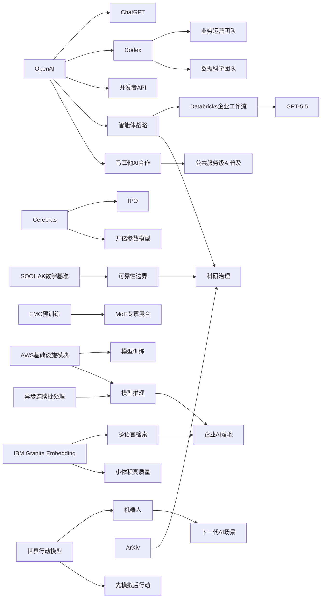

> AI 早报 · 每日早读 · 全网深度聚合

## **今日摘要**

本期更新显示，AI产业正同时沿着三条线加速：硬件侧如Cerebras借IPO强调其可承载万亿参数模型，产品侧如OpenAI把Codex从写代码扩展到业务运营和数据科学文档自动化，研究侧则有EMO和世界行动模型推动模型模块化与机器人“先模拟后行动”的能力演进。  
企业应用也在明显升级，Databricks将GPT-5.5接入企业智能体工作流，而OpenAI进一步整合ChatGPT、Codex和API团队，表明行业竞争正从单纯比拼模型能力转向比拼智能体产品整合与落地效率。  
与此同时，AI的社会与制度影响正在加深，ArXiv开始严查“AI代写论文”，说明随着生成式AI深入科研与办公场景，关于使用边界、责任归属和诚信规范的约束也在迅速成形。

### 🔵 产品与功能更新

1. **Cerebras冲刺IPO，强调可承载万亿参数模型。**
Cerebras因启动IPO（首次公开募股）成为焦点。这家公司以“非主流”AI芯片路线著称，其高管特别强调，自家系统并不只适合小模型，也能服务万亿参数级别的大模型。报道还提到，Cerebras称其已可支持OpenAI内部部分超大模型运行，意在回应外界对其能力边界的质疑🚀  
[IPO动态与能力表态(briefing)](https://news.smol.ai/issues/26-05-15-not-much/)

2. **Codex开始面向业务运营团队给出工作流示例。**
OpenAI展示了业务运营团队如何使用Codex（代码与任务助手）整理项目简报、战略更新、管理层决策材料和进度汇报。重点不是“写代码”，而是把真实工作输入转成结构化文档，减少重复整理时间。对非技术岗位来说，这意味着AI开始更直接进入日常协作和内部沟通流程🚀  
[运营团队用法示例(briefing)](https://openai.com/academy/codex-for-work/how-business-operations-teams-use-codex)

3. **EMO提出专家混合预训练，探索“模块化”能力自然涌现。**
EMO介绍了一种MoE（专家混合）预训练思路，目标是让模型在训练过程中自然形成更清晰的模块分工。简单说，就是让不同“专家子模型”逐步擅长不同类型任务，而不是所有能力都混在一起。这类方向有望提升模型效率，也可能让后续调优和部署更灵活🚀  
[EMO方法解读原文(briefing)](https://huggingface.co/blog/allenai/emo)

### 🟢 前沿研究

1. **世界行动模型让机器人先“脑补后行动”。**
世界行动模型（World Action Models）试图补足机器人AI的一大短板：不仅学习“看到什么就怎么动”，还要理解“动了以后世界会怎样变化”。相关综述梳理了约百篇论文，并指出这类模型可利用日常视频学习，而不必完全依赖带机器人动作标注的数据。对机器人来说，这相当于先在脑中模拟后果，再决定下一步动作🚀  
[机器人先模拟再行动(briefing)](https://the-decoder.com/world-action-models-give-robots-the-ability-to-simulate-consequences-before-they-move/)

2. **Databricks把GPT-5.5用于企业智能体工作流。**
Databricks宣布在企业智能体（可自动执行多步任务的AI系统）工作流中引入GPT-5.5。报道提到，该模型在OfficeQA Pro基准测试中刷新了成绩，因此被用于更复杂的企业流程自动化。对企业用户而言，这意味着AI不再只是问答工具，而更像能参与业务流程的“数字同事”🚀  
[企业智能体新进展(briefing)](https://openai.com/index/databricks)

### 🟡 行业展望与社会影响

1. **OpenAI整合产品团队，押注“智能体未来”。**
OpenAI正把ChatGPT、Codex和开发者API团队进一步整合，目标是打造更统一的产品体系。报道显示，新方向瞄准“超级应用”，并可能结合浏览器等入口，让AI从单一聊天工具变成持续执行任务的平台。这说明头部公司竞争焦点，正从“模型能力”转向“产品整合能力”🚀  
[OpenAI产品整合动向(briefing)](https://the-decoder.com/greg-brockman-consolidates-openais-product-teams-to-build-an-agentic-future/)

2. **ArXiv将严查“AI代写论文”，违规者或禁一年。**
学术论文平台ArXiv表示，将对把大语言模型（可生成文本的AI）当作主要写作替代工具的作者采取更严格措施，严重者可能被禁投稿一年。此举反映出学术界开始更明确地区分“辅助使用AI”和“让AI代替研究表达”的边界。随着生成式AI普及，科研诚信规则也在同步升级🚀  
[ArXiv新规看点(briefing)](https://techcrunch.com/2026/05/16/research-repository-arxiv-will-ban-authors-for-a-year-if-they-let-ai-do-all-the-work/)

3. **Codex面向数据科学团队，推进分析文档自动化。**
OpenAI展示了数据科学团队如何用Codex生成根因分析简报、影响评估、KPI备忘录和仪表盘需求说明。对很多团队来说，真正耗时的往往不是建模本身，而是把分析结果整理成业务能看懂的材料。AI若能承担这部分工作，将明显改变数据团队的协作方式🚀  
[数据团队使用案例(briefing)](https://openai.com/academy/codex-for-work/how-data-science-teams-use-codex)

4. **IBM发布多语言向量模型，主打小体积高检索质量。**
Granite Embedding Multilingual R2是一款多语言嵌入模型（把文本转成可检索向量的模型），支持32K上下文，并强调在1亿参数以下模型中取得较强检索效果。对企业知识库、搜索和问答系统来说，这类模型价值在于兼顾多语言能力、部署成本和实际检索表现。开源许可也有助于它更快进入真实场景🚀  
[多语言检索模型发布(briefing)](https://huggingface.co/blog/ibm-granite/granite-embedding-multilingual-r2)

### 🟣 开源TOP项目

1. **GDS发声：英国NHS后退开源路线引发讨论。**
围绕英国国家医疗服务体系NHS在开源策略上的“后退”，GDS相关表态引发关注。虽然原文较短，但这一事件反映出公共部门在软件采购、可控性与开放生态之间仍有明显拉扯。对开源社区而言，这类政策变化往往比单个项目更新更具长期影响🚀  
[英国开源政策讨论(briefing)](https://simonwillison.net/2026/May/17/gds-weighs-in/#atom-everything)

2. **连续批处理加入异步机制，提升推理吞吐。**
这篇Hugging Face文章讨论如何在continuous batching（连续批处理）中引入asynchronicity（异步执行），以改善模型推理效率。简单理解，就是让不同请求在系统里更灵活地排队和执行，减少等待与资源浪费。对部署大模型服务的团队来说，这直接关系到响应速度和算力成本🚀  
[异步批处理优化解读(briefing)](https://huggingface.co/blog/continuous_async)

### 🔴 社媒分享

1. **新数学基准发现：AI会自信回答“无解题”。**
SOOHAK是由64位数学家共同构建的新基准，包含439道手写题目，其中99道故意设计为无解。结果显示，模型在解题上会因更多算力而提升，但在承认“这题没有答案”方面并没有同步进步。这提醒大家，AI“答得像真的”不等于它真的理解问题边界🚀  
[数学基准关键发现(briefing)](https://the-decoder.com/new-math-benchmark-reveals-ai-models-confidently-solve-problems-that-have-no-solution/)

2. **OpenAI与马耳他合作，向全民提供ChatGPT Plus。**
OpenAI宣布与马耳他合作，计划扩大AI使用覆盖，为当地居民提供ChatGPT Plus和相关培训。除了工具本身，合作也强调“负责任使用AI”和实用技能培养。此类国家级合作，显示AI普及正在从企业采购走向公共服务层面🚀  
[马耳他合作计划(briefing)](https://openai.com/index/malta-chatgpt-plus-partnership)

3. **AWS基础模型训练与推理模块被系统梳理。**
Hugging Face发布文章，总结在AWS上进行基础模型训练和推理所需的关键构件。内容聚焦算力、训练流程和部署环节，帮助团队理解搭建大模型基础设施需要哪些模块配合。对关注云端AI落地的人来说，这类梳理很适合快速建立全局认识🚀  
[AWS模型基础设施梳理(briefing)](https://huggingface.co/blog/amazon/foundation-model-building-blocks)

---

📊 行业洞察

1. 事实  
   OpenAI正整合ChatGPT、Codex与开发者API团队，明确押注“智能体未来”；同时，Databricks已将GPT-5.5引入企业智能体工作流，用于更复杂的企业流程自动化；Codex也开始面向业务运营与数据科学团队，直接生成简报、决策材料、KPI备忘录等工作文档。  
   【洞察】AI竞争正在从“模型单点能力”转向“智能体平台化落地”。头部厂商不再只比拼基准分数，而是比谁能把模型、工作流、入口与组织协同整合成统一产品体系。对企业而言，AI采购对象也将从“聊天工具/模型API”升级为“可嵌入业务流程的数字员工（Agent，智能体）平台”。

2. 事实  
   Cerebras在IPO过程中强调其系统可承载万亿参数模型，试图证明非主流芯片架构也能服务超大模型；与此同时，Hugging Face讨论通过连续批处理异步化（asynchronicity，异步执行）提升推理吞吐，AWS相关文章则系统梳理了基础模型训练与推理所需的云基础设施模块。  
   【洞察】AI基础设施竞争正在进入“全栈效率战”：上游是芯片架构差异化，中游是训练/推理系统优化，下游是云端部署工程化。市场已不再满足于“能训练/能跑模型”，而是要求在吞吐、延迟、成本和规模之间取得最优解。未来基础设施厂商的胜负手，将更多取决于软硬件协同（hardware-software co-design，软硬件协同设计）能力，而非单一算力指标。

3. 事实  
   EMO提出MoE（Mixture of Experts，专家混合）预训练，尝试让模型在训练中自然形成模块化分工；IBM发布多语言嵌入模型Granite Embedding Multilingual R2，主打小参数量下的高检索质量；世界行动模型（World Action Models）则推动机器人先模拟后行动，减少对高成本动作标注数据的依赖。  
   【洞察】下一阶段模型演进的关键词不是“更大”，而是“更结构化、更高效、更面向场景”。无论是MoE的模块化、嵌入模型的小型高效，还是机器人通过世界模型提升数据利用率，都说明产业正在从粗放堆参数转向可解释分工、成本可控和任务适配。这对企业部署尤为关键，因为真正决定ROI（投资回报率）的往往不是参数规模，而是可部署性与稳定产出。

4. 事实  
   ArXiv将严查“AI代写论文”，严重者或禁投一年；SOOHAK数学基准显示，模型会自信回答“无解题”，即算力提升并不自动带来边界感；OpenAI与马耳他的合作则把ChatGPT Plus和AI培训推进到国家级公共服务层面。  
   【洞察】AI普及速度已快于社会治理机制，因此“能力扩张”与“使用边界”正在同步成为产业主线。一方面，AI正从企业工具走向公共基础服务；另一方面，学术、教育与专业场景开始强化真实性、责任归属与误用约束。未来行业分水岭将不仅是谁的模型更强，还包括谁能建立更可信的治理框架（governance，治理机制）与用户教育体系。

🗺️ 今日关系图

