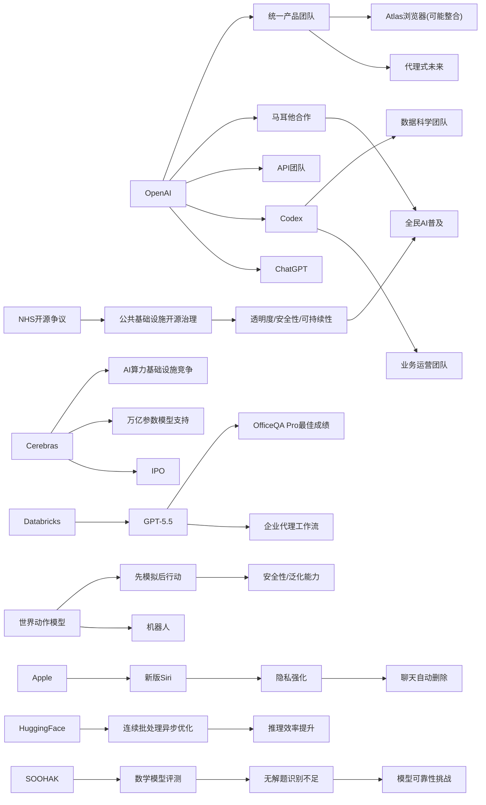

> AI 早报 · 每日早读 · 全网深度聚合

## **今日摘要**

苹果可能在新版 Siri 中加入聊天自动删除功能，OpenAI 也展示了 Codex 如何从写代码扩展到帮助运营团队生成简报和决策材料，说明 AI 产品正同时朝着“更重隐私”和“更深融入办公流程”发展。  
在技术与基础设施层面，Cerebras 借 IPO 强调其硬件可支持万亿参数模型，Databricks 将 GPT-5.5 引入企业代理工作流，而机器人领域的“世界动作模型”则让机器先模拟后行动，反映出 AI 能力正在从算力、模型到执行链条全面升级。  
行业上，OpenAI 正整合 ChatGPT、Codex 和 API 团队押注“代理式未来”，与此同时，社会舆论对 AI 的兴奋感开始趋于平淡，意味着 AI 竞争正从“概念热度”转向“真实产品力与实际影响”。

### 🔵 产品与功能更新

1. **苹果新版 Siri 或加入聊天自动删除。**
苹果准备更新 Siri，隐私会成为这次发布的核心主题。报道提到，新版 Siri 可能支持自动删除聊天记录，进一步减少个人信息长期留存的风险。对普通用户来说，这意味着语音助手不仅更“会说”，也会更注重“少留痕”。如果最终上线，这会成为苹果在 AI 助手竞争中强调差异化的重要功能。🚀  
[苹果Siri隐私新动向(briefing)](https://techcrunch.com/2026/05/17/apples-siri-revamp-could-include-auto-deleting-chats/)

2. **OpenAI 展示运营团队如何使用 Codex。**
OpenAI 发布了面向业务运营团队的 Codex 使用案例。内容显示，团队可以把真实工作材料交给 Codex，生成项目简报、战略更新、管理层决策材料和进度汇报。对非技术岗位而言，这类编码代理（能理解任务并协助完成工作的 AI 工具）正在从“写代码”扩展到“写业务文档”。这说明 AI 工具正加速进入公司日常协作流程。🚀  
[运营团队Codex案例(briefing)](https://openai.com/academy/codex-for-work/how-business-operations-teams-use-codex)

3. **Cerebras 借 IPO 强调可服务超大模型。**
Cerebras 因首次公开募股（IPO，企业上市融资）受到关注。公司高管特别回应了外界对其硬件能力的质疑，称其系统能够支持万亿参数模型（参数可理解为 AI 模型“记忆”和“能力”的规模指标），并提到可承载 OpenAI 内部大型模型。对市场来说，这不仅是一次资本动作，也是在大模型基础设施竞争中争取话语权。硬件厂商正在更积极证明自己不只是“替代方案”，而是主流算力选择。🚀  
[Cerebras上市与算力(briefing)](https://news.smol.ai/issues/26-05-15-not-much/)

### 🟢 前沿研究

1. **世界动作模型让机器人先“脑补后行动”。**
一项关于世界动作模型（让机器人先模拟行动后果的 AI 方法）的综述指出，这类技术正试图补上机器人“只会对图像做反应、不真正理解世界变化”的短板。研究把近百篇论文整理为两条主要技术路线，并强调其一个重要优势：可以利用没有机器人动作标注的日常视频进行学习。简单说，机器人未来可能先在“脑内彩排”，再决定怎么动。这样有望提升安全性、泛化能力（在新场景中也能工作）和学习效率。🚀  
[机器人世界动作模型(briefing)](https://the-decoder.com/world-action-models-give-robots-the-ability-to-simulate-consequences-before-they-move/)

2. **Databricks 将 GPT-5.5 引入企业代理工作流。**
Databricks 宣布在企业代理工作流中使用 GPT-5.5。官方表示，这一模型在 OfficeQA Pro 基准测试中刷新了当前最佳成绩，因此被用于企业级任务流转与自动处理。这里的代理工作流（Agent Workflow）可以理解为 AI 不只回答问题，而是能跨多个步骤执行任务。对企业用户来说，这意味着更复杂的办公流程正逐步被 AI 接管和协助。🚀  
[Databricks接入GPT5.5(briefing)](https://openai.com/index/databricks)

### 🟡 行业展望与社会影响

1. **OpenAI 整合产品团队，押注“代理式未来”。**
OpenAI 正把 ChatGPT、编码代理 Codex 和开发者 API 团队合并为一个统一产品团队，由 Codex 负责人领导。报道指出，这一调整目标是打造一个更像“超级应用”的统一入口，并可能整合 Atlas 浏览器。联合创始人 Greg Brockman 也将正式接手产品战略。对行业来说，这反映出 AI 公司正从“单点工具”转向“全能平台”的竞争。🚀  
[OpenAI产品线整合(briefing)](https://the-decoder.com/greg-brockman-consolidates-openais-product-teams-to-build-an-agentic-future/)

2. **毕业演讲谈 AI，正变得越来越难打动人。**
TechCrunch 观察称，在 2026 年的毕业演讲里，AI 话题已经不再天然令人振奋。原因在于，很多毕业生面对的是一个被 AI 重塑、但也更不确定的就业与社会环境。AI 不再只是“机会”叙事，也开始伴随焦虑、替代风险和前景分化。这个变化说明，公众对 AI 的情绪正在从兴奋走向更复杂的现实判断。🚀  
[毕业演讲中的AI焦虑(briefing)](https://techcrunch.com/2026/05/17/if-youre-giving-a-commencement-speech-in-2026-maybe-dont-mention-ai/)

3. **OpenAI 展示数据科学团队如何使用 Codex。**
OpenAI 还发布了面向数据科学团队的 Codex 使用案例。文中提到，团队可以用它生成问题归因报告、影响分析、关键指标备忘录和仪表盘需求说明。也就是说，AI 正从辅助写代码进一步延伸到辅助分析、汇报和组织知识。对企业管理者而言，这类工具的价值越来越接近“数字分析同事”。🚀  
[数据科学Codex用法(briefing)](https://openai.com/academy/codex-for-work/how-data-science-teams-use-codex)

### 🟣 开源TOP项目

1. **英国政府数字服务部门评论 NHS 远离开源。**
Simon Willison 转引了一则关于英国政府数字服务部门（GDS）对 NHS 退出开源路线的评论。虽然内容偏政策与软件治理，但核心争议是：公共数字基础设施是否应继续依赖开源软件（公开源代码、可被外部审查和复用的软件）。这类讨论对 AI 时代尤其重要，因为越来越多公共服务系统正在与智能能力深度结合。开源与否，直接影响透明度、安全性和可持续维护。🚀  
[NHS开源路线争议(briefing)](https://simonwillison.net/2026/May/17/gds-weighs-in/#atom-everything)

2. **Hugging Face 讨论连续批处理中的异步优化。**
Hugging Face 发布文章，介绍如何在连续批处理（让多个请求更高效共享计算资源）中释放异步能力（不同任务不必同步等待）。这类优化主要面向模型推理（模型实际运行回答问题的阶段），目标是在高并发场景下提升吞吐量与响应速度。虽然偏底层，但它关系到用户是否能更快用上 AI 服务。对开源社区来说，这种工程优化往往能快速外溢到大量项目中。🚀  
[连续批处理异步优化(briefing)](https://huggingface.co/blog/continuous_async)

### 🔴 社媒分享

1. **新数学基准发现：AI 会自信回答“无解题”。**
一组数学家推出 SOOHAK 基准测试，其中包含 439 道手写任务，刻意加入了 99 道无解题。结果显示，模型在解题能力上会因算力增加而提升，但在识别“这题根本无解”上并没有明显进步。换句话说，AI 不只是会答错，还可能非常自信地答错。这个发现对教育、科研和高风险场景的 AI 应用都很关键。🚀  
[AI自信解无解题(briefing)](https://the-decoder.com/new-math-benchmark-reveals-ai-models-confidently-solve-problems-that-have-no-solution/)

2. **OpenAI 与马耳他合作，向全民提供 ChatGPT Plus。**
OpenAI 宣布与马耳他合作，扩大 AI 普及范围。项目内容包括向公民提供 ChatGPT Plus，并配套培训，帮助大家掌握实用 AI 技能和负责任使用方式。这类全国级合作说明，AI 正被一些国家视为基础能力建设的一部分。未来类似“全民 AI 普及计划”可能会越来越常见。🚀  
[马耳他全民ChatGPT计划(briefing)](https://openai.com/index/malta-chatgpt-plus-partnership)

---

📊 行业洞察

1. 事实  
   OpenAI 正把 ChatGPT、Codex 和开发者 API 团队整合为统一产品团队，并由 Codex 负责人主导，目标是打造更像“超级应用”的统一入口；同时，OpenAI 又分别展示了业务运营团队、数据科学团队如何使用 Codex 生成简报、分析备忘录、管理层材料等。  
   【洞察】AI 平台竞争正在从“模型能力”转向“工作入口”之争。OpenAI 的动作说明，代理式产品（Agentic Product，能跨步骤执行任务的产品）不再只是给开发者或程序员用的工具，而是在向企业全员协作界面升级。未来真正有护城河的，可能不是单一大模型，而是把聊天、分析、文档、流程执行、开发接口统一起来的“AI 工作操作系统”。

2. 事实  
   Databricks 将 GPT-5.5 引入企业代理工作流，强调其在 OfficeQA Pro 基准上刷新成绩；OpenAI 也在内部案例中展示 Codex 已从写代码扩展到业务运营和数据科学文档生产；同时 Hugging Face 讨论连续批处理中的异步优化，以提升推理吞吐与响应速度。  
   【洞察】企业 AI 落地正在进入“效果+工程”双轮驱动阶段。前端看是更强模型接管复杂办公流程，后端看则是推理基础设施（Inference Infrastructure，支撑模型在线运行的系统）必须同步优化成本、延迟和并发能力。换言之，企业级代理工作流的普及，不只取决于模型是否聪明，也取决于系统是否足够快、稳、便宜。

3. 事实  
   苹果新版 Siri 可能加入聊天自动删除，把隐私作为核心卖点；英国 NHS 远离开源的争议则再次引发对公共数字基础设施透明度、安全性和可持续性的讨论；与此同时，OpenAI 与马耳他合作向全民提供 ChatGPT Plus 并配套培训。  
   【洞察】AI 正从“可用性竞争”转向“治理可信度竞争”。一端是苹果用最小化数据留存强化个人隐私叙事，另一端是政府和公共服务体系开始把开源、透明、责任边界纳入 AI 基础设施讨论。随着 AI 进入全民普及和公共服务场景，用户和机构采购决策将越来越看重隐私治理（Privacy Governance）、审计能力（Auditability，可审查性）和社会接受度，而不只是功能多少。

4. 事实  
   Cerebras 借 IPO 强调其系统可支持万亿参数模型，并试图证明自己能够承载 OpenAI 级别的大模型；机器人领域的世界动作模型则强调通过“先模拟后行动”提升安全性、泛化能力和学习效率；此外，SOOHAK 数学基准显示模型在识别“无解题”上并未随算力提升而明显改进。  
   【洞察】AI 产业正在同时追求“更大规模”与“更高可靠性”，但两者并不自动等价。算力厂商和模型厂商仍在推动更大参数、更强基础设施，但研究侧已明确暴露出模型在世界理解、边界判断和不确定性表达上的短板。下一阶段竞争焦点，可能不是谁先把模型做得更大，而是谁先把模型做得“知道自己什么时候不该行动、什么时候该说不知道”。

🗺️ 今日关系图

