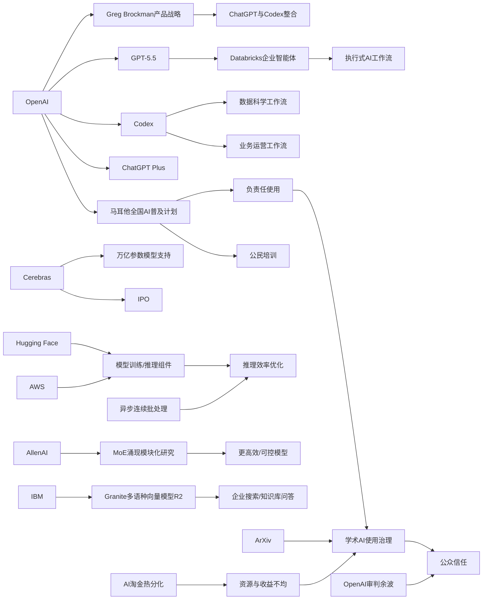

> AI 早报 · 每日早读 · 全网深度聚合

## **今日摘要**

马耳他与 OpenAI 合作向全国推广 ChatGPT Plus 和培训，Cerebras 冲刺 IPO 强调其硬件可支撑万亿参数模型，同时 AWS 与 Hugging Face 也在总结云上训练和推理大模型的关键组件，反映 AI 基础设施和普及正在同步加速。  
研究与应用层面，EMO 探索混合专家模型中“涌现模块化”现象，OpenAI 展示业务运营团队如何用 Codex 处理真实办公流程，而 iNaturalist-clumper 0.1 则体现了 AI 和数据工具向垂直细分场景渗透。  
行业与社会层面，ArXiv 开始严查过度依赖 AI 代写的论文，说明学术界正建立更明确的使用边界，而 Databricks 将 GPT-5.5 引入企业智能体工作流，则显示企业级 AI 自动化还在持续升温。

### 🔵 产品与功能更新

1. **马耳他与OpenAI合作，向全国居民提供ChatGPT Plus。**
马耳他将把 ChatGPT Plus 和配套培训带给更多公民，重点是帮助大家建立实用的 AI 使用能力，而不只是“会聊天”。这次合作还强调“负责任使用”，说明官方希望在普及工具的同时，降低误用风险。对普通用户来说，这更像是一次全国范围的 AI 普及计划。🚀
[全民AI合作计划(briefing)](https://openai.com/index/malta-chatgpt-plus-partnership)

2. **Cerebras冲刺IPO，强调可服务万亿参数模型。**
Cerebras 以不同于主流的 AI 硬件路线闻名，这次启动 IPO（首次公开募股）成为当天的重要动态。其高管特别强调，自家系统不仅能跑小模型，也能支持万亿参数模型（参数量极大的 AI 模型），并提到可服务 OpenAI 内部更大规模模型。对市场来说，这释放了一个信号：AI 算力竞争正在从“能不能做”转向“能支撑多大规模”。🚀
[算力公司IPO动态(briefing)](https://news.smol.ai/issues/26-05-15-not-much/)

3. **AWS与Hugging Face总结大模型训练与推理组件。**
这篇内容聚焦 AWS 云平台上用于基础模型（可通用适配多任务的大模型）训练和推理的关键“积木模块”。对于企业和团队来说，它相当于一份如何搭建 AI 基础设施的路线图。虽然偏技术，但核心意义很直接：让更多团队更容易在云上部署和运行大模型。🚀
[AWS模型积木指南(briefing)](https://huggingface.co/blog/amazon/foundation-model-building-blocks)

### 🟢 前沿研究

1. **EMO探索混合专家预训练中的“涌现模块化”。**
EMO 研究关注的是 MoE（混合专家模型，一种把不同任务分给不同“专家模块”的架构）在预训练阶段，是否会自然形成更清晰的分工。所谓“涌现模块化”，就是模型不用人工硬编码，也能逐渐长出更有组织的内部结构。这类研究的重要性在于，它可能帮助未来模型更高效、更可控。🚀
[EMO研究解读(briefing)](https://huggingface.co/blog/allenai/emo)

2. **业务运营团队如何使用Codex处理真实工作流。**
OpenAI 展示了业务运营团队如何用 Codex（面向工作任务的 AI 助手）生成项目简报、策略更新、决策材料和进度汇报。这不是单纯的“写文案”，而是把零散工作输入整理成可供管理层直接使用的产出。对非技术团队来说，这代表 AI 正更深入地进入日常办公室流程。🚀
[Codex办公案例(briefing)](https://openai.com/academy/codex-for-work/how-business-operations-teams-use-codex)

3. **iNaturalist-clumper 0.1发布，面向自然观察数据聚合。**
这是一个围绕 iNaturalist（自然观察与物种记录平台）数据处理的小工具更新，重点在于“聚合”和整理相关记录。虽然应用场景较垂直，但它体现了 AI 与数据工具正在深入细分兴趣社区。类似项目往往不是大而全的平台，而是解决具体用户的小痛点。🚀
[自然数据小工具(briefing)](https://simonwillison.net/2026/May/15/inaturalist-clumper/#atom-everything)

### 🟡 行业展望与社会影响

1. **ArXiv将严查论文中过度依赖AI代写的行为。**
ArXiv 表示，如果作者让大语言模型（能生成文本的 AI）“完成全部工作”，可能会被禁发一年。这说明学术界对 AI 写作的态度正在从“观察”转向“明确立规矩”。对研究者和公众来说，核心问题不是能不能用 AI，而是作者是否仍对内容真实性与质量负责。🚀
[学术平台新规(briefing)](https://techcrunch.com/2026/05/16/research-repository-arxiv-will-ban-authors-for-a-year-if-they-let-ai-do-all-the-work/)

2. **Databricks把GPT-5.5引入企业级智能体工作流。**
Databricks 正把 GPT-5.5 用于企业 agent（智能体，可自动执行多步任务的软件助手）工作流中，强调模型在 OfficeQA Pro 基准测试上取得领先表现。对企业客户而言，这意味着 AI 不再只是回答问题，而是进一步参与流程执行和协作。也说明高性能模型正更快走向具体商业场景。🚀
[企业智能体升级(briefing)](https://openai.com/index/databricks)

3. **AI淘金热中的“有者”与“无者”分化加剧。**
这篇报道讨论了 AI 热潮背后资源、机会与回报分配不均的问题，即并非所有参与者都能从这轮浪潮中受益。即便在科技行业内部，围绕 AI 的情绪也不全是乐观，更多现实问题开始浮现。它提醒我们，AI 发展不仅是技术竞赛，也是一场资源与权力重组。🚀
[AI淘金热分化(briefing)](https://techcrunch.com/2026/05/16/the-haves-and-have-nots-of-the-ai-gold-rush/)

### 🟣 开源TOP项目

1. **IBM发布Granite多语种向量模型R2。**
Granite Embedding Multilingual R2 是一款支持多语言的 embedding（向量表示，用于搜索和匹配文本含义）模型，采用 Apache 2.0 开源协议。它主打 32K 长上下文，并强调在 1 亿参数以下模型中具备很强的检索质量。对开发者来说，这类模型适合做企业搜索、知识库问答和多语种信息检索。🚀
[多语检索开源模型(briefing)](https://huggingface.co/blog/ibm-granite/granite-embedding-multilingual-r2)

2. **Codex展示数据科学团队的实际使用方式。**
OpenAI 介绍了数据科学团队如何借助 Codex 生成问题归因简报、影响分析、KPI 备忘录和仪表盘规格说明。它的重点不是替代分析师，而是把分散的数据工作整理成更清晰的沟通成果。对组织来说，这有助于缩短“分析完成”到“业务理解”的距离。🚀
[数据团队用Codex(briefing)](https://openai.com/academy/codex-for-work/how-data-science-teams-use-codex)

3. **OpenAI产品战略或将由Greg Brockman主导。**
报道称，OpenAI 联合创始人 Greg Brockman 正接手产品战略，背景是公司可能整合 ChatGPT 与编程产品 Codex。虽然这不是传统意义上的开源项目更新，但对开发者生态影响很大，因为它可能改变未来工具形态与入口。尤其如果聊天与编程能力融合，用户使用路径会更统一。🚀
[OpenAI战略调整(briefing)](https://techcrunch.com/2026/05/16/openai-co-founder-greg-brockman-reportedly-takes-charge-of-product-strategy/)

### 🔴 社媒分享

1. **OpenAI审判收尾，AI领导者可信度再成焦点。**
这期播客围绕 OpenAI 相关审判的收尾展开，并把讨论落在一个更大的问题上：公众能否信任掌握 AI 权力的人。与此同时，马斯克系公司的资本动作也让“创始人影响力”话题持续升温。它反映出，AI 讨论已经不只是产品竞争，更是治理与公众信任问题。🚀
[播客谈审判余波(briefing)](https://techcrunch.com/podcast/the-openai-trial-wraps-up-and-the-musk-founder-machine-keeps-spinning/)

2. **Warelay更名为OpenClaw。**
这则分享记录了 Warelay 改名为 OpenClaw 的消息。虽然信息量不大，但名称变化往往意味着项目定位、品牌策略或社区沟通方式的调整。对关注独立项目和开发者社区的人来说，这类改名通常是后续动作的前兆。🚀
[项目更名动态(briefing)](https://simonwillison.net/2026/May/16/openclaw-names/#atom-everything)

3. **连续批处理中的异步机制被进一步解锁。**
这篇内容讨论 continuous batching（连续批处理，一种提升模型服务效率的方法）中的 asynchronicity（异步机制，即任务不必按同一步调等待完成）。核心意义在于提升模型推理服务时的吞吐量和响应效率。虽然技术味较强，但最终会反映到普通用户体验上，比如更快的生成速度和更稳定的服务。🚀
[异步批处理分享(briefing)](https://huggingface.co/blog/continuous_async)

---

📊 行业洞察

1. 事实  
   - 马耳他与 OpenAI 合作，面向全国居民提供 ChatGPT Plus 与配套培训。  
   - OpenAI 同时展示了 Codex 在业务运营团队、数据科学团队中的真实工作流应用。  
  【洞察】AI 正从“个人工具试用”升级为“国家级普及 + 组织级落地”的双轮渗透。前者解决全民 AI 素养（AI literacy）与使用门槛，后者证明 AI 已进入非技术岗位的标准工作流。这意味着未来竞争不只是谁有模型，而是谁能把模型嵌入教育、办公、管理与决策链条。

2. 事实  
   - Cerebras 冲刺 IPO，并强调可支撑万亿参数模型。  
   - AWS 与 Hugging Face 系统化总结大模型训练与推理组件。  
   - 社媒中还提到连续批处理中的异步机制，可提升推理吞吐与响应效率。  
  【洞察】AI 基础设施竞争已从“单点算力”转向“端到端系统能力”。上游是 Cerebras 这类芯片/算力厂商争夺超大模型训练入口，中游是 AWS 这类云平台标准化模型构建栈（stack，技术栈），下游则通过异步推理与连续批处理优化服务效率。行业正在形成“芯片—云—推理服务”一体化竞赛，护城河越来越依赖系统协同，而非单一硬件指标。

3. 事实  
   - Databricks 将 GPT-5.5 引入企业级智能体工作流。  
   - OpenAI 可能在 Greg Brockman 主导下整合 ChatGPT 与 Codex 产品战略。  
   - Codex 已被用于业务运营、数据科学等跨部门任务。  
  【洞察】企业软件正在从“问答式 AI”迈向“执行式 AI”（agentic AI，具备多步任务执行能力的智能体）。Databricks 强调智能体工作流，OpenAI 则在推进聊天、编程、办公能力入口统一，这说明未来主战场不是单次生成质量，而是任务编排（orchestration）、跨工具协作与可交付结果。AI 产品形态正从“模型即产品”转向“工作流即产品”。

4. 事实  
   - ArXiv 将严查过度依赖 AI 代写论文的行为，严重者可能禁发一年。  
   - 马耳他合作项目强调“负责任使用”。  
   - 围绕 OpenAI 审判收尾的讨论，再次聚焦 AI 领导者的公众可信度。  
  【洞察】AI 治理正从原则讨论进入“制度化约束”阶段。学术平台开始明确处罚边界，政府级合作主动加入责任框架，公众舆论则持续审视 AI 权力与信任问题。可以预见，未来 AI 竞争将同时取决于能力、合规（compliance，合规性）与社会许可（social license，社会接受度），缺一不可。

🗺️ 今日关系图

