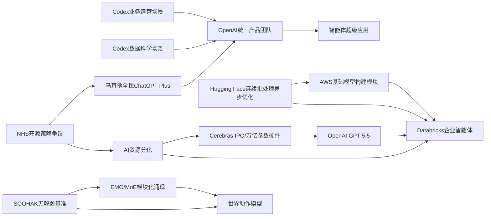

> AI 早报 · 每日早读 · 全网深度聚合

## **今日摘要**

近期AI行业一边在升级底层算力与模型架构，例如Cerebras推进IPO并强调可支撑万亿参数模型、AllenAI探索更高效的专家混合模型训练，同时机器人领域也在研究让系统先模拟后果再行动的“世界动作模型”。  
另一边，OpenAI和Databricks等公司正把更强的大模型与Codex、GPT-5.5等工具深入接入业务运营、数据科学和企业智能体工作流，说明AI正从技术演示走向日常办公与企业流程。  
与此同时，OpenAI也在整合产品团队押注“智能体未来”，但伴随这股AI淘金热，资本、人才和算力正进一步向头部公司集中，行业分化可能持续加剧。

### 🔵 产品与功能更新

1. **Cerebras推进上市，并强调可承载万亿参数模型。**  
Cerebras因首次公开募股（IPO，企业上市融资）成为焦点。公司高管特别回应了外界对其硬件路线的质疑，称其并不只适合“小模型”，也能服务万亿参数级别的大模型。报道还提到其可支持内部版本的OpenAI 5.4和5.5模型，显示其在高性能AI算力市场中的定位更进一步。对普通读者来说，这意味着AI底层“算力基础设施”竞争正在升温🚀  
[查看上市与算力解读(briefing)](https://news.smol.ai/issues/26-05-15-not-much/)

2. **OpenAI展示Codex在业务运营团队中的实际用法。**  
OpenAI发布案例，说明业务运营团队如何用Codex辅助生成项目简报、战略更新、管理决策材料和进度汇报。Codex本质上是面向工作场景的代码与文档助手，但这里更强调它对日常办公流程的支持。对于非技术团队而言，这代表AI工具正从“写代码”扩展到“写业务材料”和“整理信息”🚀  
[查看运营团队案例(briefing)](https://openai.com/academy/codex-for-work/how-business-operations-teams-use-codex)

3. **EMO探索专家混合模型的“模块化涌现”。**  
AllenAI在Hugging Face发布EMO相关介绍，聚焦“专家混合模型”（MoE，一种把不同子模型分工协作的架构）预训练。其核心方向是让模型在训练中自然形成更清晰的功能分工，也就是“涌现的模块化”。这类研究虽然偏底层，但可能帮助未来模型更高效地处理复杂任务，同时降低计算成本🚀  
[查看EMO项目介绍(briefing)](https://huggingface.co/blog/allenai/emo)

### 🟢 前沿研究

1. **世界动作模型让机器人先“想后动”。**  
World Action Models（世界动作模型）试图解决机器人AI的一个基础短板：会模仿动作，却不真正理解动作如何改变现实世界。相关综述梳理了约一百篇论文，指出这类模型的优势在于可从普通视频中学习，而不必依赖大量机器人动作标注。简单说，就是让机器人更像是在“预演后果”，而不是只做机械匹配🚀  
[查看机器人研究综述(briefing)](https://the-decoder.com/world-action-models-give-robots-the-ability-to-simulate-consequences-before-they-move/)

2. **Databricks将GPT-5.5用于企业智能体工作流。**  
Databricks宣布在企业智能体（Agent，可自动执行多步任务的软件助手）工作流中采用GPT-5.5。文章提到，该模型在OfficeQA Pro基准测试上刷新了当前最好成绩，因此被引入企业场景。对行业来说，这表明更强的大模型正加速进入企业内部流程，而不只是停留在聊天界面🚀  
[查看企业集成详情(briefing)](https://openai.com/index/databricks)

### 🟡 行业展望与社会影响

1. **OpenAI整合产品团队，押注“智能体未来”。**  
OpenAI正在把ChatGPT、编程助手Codex和开发者API整合进一个统一产品团队，由Codex负责人领导。报道还提到其目标是构建一个“超级应用”，并整合Atlas浏览器，由Greg Brockman主导整体产品战略。这反映出AI公司正在从单点产品走向平台化布局，希望把聊天、执行任务和开发能力放进同一个入口🚀  
[查看团队整合动向(briefing)](https://the-decoder.com/greg-brockman-consolidates-openais-product-teams-to-build-an-agentic-future/)

2. **AI淘金热中的“有与没有”正在分化。**  
TechCrunch指出，当前AI热潮带来的并不只是机会，也让行业内外的资源差距更明显。无论是资本、人才还是算力，掌握关键资源的公司与普通参与者之间的差距都在扩大。对社会层面而言，这种“赢家更强”的趋势，可能会影响就业、创业和技术普惠的节奏🚀  
[查看AI财富分化分析(briefing)](https://techcrunch.com/2026/05/16/the-haves-and-have-nots-of-the-ai-gold-rush/)

3. **Codex开始进入数据科学团队的日常工作。**  
OpenAI介绍了数据科学团队使用Codex的方式，包括撰写根因分析简报、影响评估、KPI备忘录和仪表盘需求说明。这里的重点不是替代分析师，而是帮助他们更快整理输入材料并形成可执行输出。对企业来说，这类工具可能改变数据团队与业务团队之间的协作方式🚀  
[查看数据团队案例(briefing)](https://openai.com/academy/codex-for-work/how-data-science-teams-use-codex)

### 🟣 开源TOP项目

1. **GDS发声：关注NHS在开源上的“后退”。**  
Simon Willison转引了GDS对英国国家医疗服务体系（NHS）在开源软件策略上转向的评论。核心争议在于，公共部门是否应减少对开源方案的依赖，转向更封闭的技术体系。对开源社区而言，这不仅是技术选择问题，也关系到透明度、可审计性和长期成本🚀  
[查看开源政策评论(briefing)](https://simonwillison.net/2026/May/17/gds-weighs-in/#atom-everything)

2. **Hugging Face讨论连续批处理中的异步优化。**  
这篇文章聚焦continuous batching（连续批处理，一种提升模型推理吞吐量的服务方式）中的异步能力。其目标是在模型推理时更高效地调度请求，减少等待和资源浪费。虽然主题偏工程，但它直接关系到开源大模型部署的成本与速度体验🚀  
[查看异步推理优化(briefing)](https://huggingface.co/blog/continuous_async)

### 🔴 社媒分享

1. **新数学基准发现：AI会自信解答“无解题”。**  
SOOHAK是由64位数学家构建的新基准，包含439道手写题，其中99道被故意设计为无解。结果显示，模型在做题能力上会因更多算力而提升，但在识别“这题没答案”上并没有明显进步。换句话说，AI不仅会犯错，还可能很自信地给出根本不存在的答案，这对教育和科研场景尤其值得警惕🚀  
[查看数学基准解读(briefing)](https://the-decoder.com/new-math-benchmark-reveals-ai-models-confidently-solve-problems-that-have-no-solution/)

2. **OpenAI与马耳他合作，向全国公民提供ChatGPT Plus。**  
OpenAI宣布与马耳他合作，扩大AI工具的全民可及性，为公民提供ChatGPT Plus和相关培训。合作目标不仅是让更多人用上AI，也包括提升公众“负责任使用AI”的能力。这样的国家级合作，显示AI服务正在从个人订阅工具走向公共能力建设🚀  
[查看马耳他合作计划(briefing)](https://openai.com/index/malta-chatgpt-plus-partnership)

3. **AWS上的大模型训练与推理“基础模块”被系统梳理。**  
Hugging Face发布文章，介绍在AWS（亚马逊云）上进行基础模型训练和推理的关键构建模块。内容涵盖模型训练、部署和推理所需的基础设施组合，有助于理解大模型背后的云服务拼装方式。对关注产业的人来说，这类内容体现了AI能力正越来越依赖成熟的云端工程体系🚀  
[查看AWS构建指南(briefing)](https://huggingface.co/blog/amazon/foundation-model-building-blocks)

---

📊 行业洞察

1. 事实  
   - Cerebras推进IPO（首次公开募股），并强调其硬件可承载万亿参数模型，且可支持内部版本的OpenAI 5.4/5.5。  
   - Databricks宣布将GPT-5.5用于企业智能体（Agent，可自动执行多步任务的软件助手）工作流。  
   - Hugging Face系统梳理AWS上的基础模型训练与推理“构建模块”，并讨论连续批处理（continuous batching，提升推理吞吐的服务方式）中的异步优化。  
   【洞察】AI竞争正在从“谁有模型”转向“谁能把训练、推理、部署、企业接入整成一条链”。上游算力芯片、中游云基础设施、下游企业工作流开始加速耦合，行业壁垒从单点技术壁垒升级为“全栈交付能力”壁垒。

2. 事实  
   - OpenAI展示Codex在业务运营团队中的实际用法，可生成项目简报、战略更新和管理材料。  
   - OpenAI还展示了Codex进入数据科学团队日常，用于根因分析、影响评估、KPI备忘录和需求说明。  
   - OpenAI同步整合ChatGPT、Codex和开发者API进入统一产品团队，押注“智能体未来”和“超级应用”。  
   【洞察】企业AI正从“个人助手”进化为“组织操作系统（Operating System，承载多角色协作的统一入口）”。Codex不再局限于编程场景，而是在业务、数据、开发之间形成共用工作界面，这预示未来AI产品的核心竞争点将是跨部门流程渗透率，而不仅是模型能力排名。

3. 事实  
   - AllenAI推进EMO，探索专家混合模型（MoE，多个子模型分工协作的架构）中的“模块化涌现”。  
   - 世界动作模型（World Action Models）试图让机器人先模拟动作后果再执行，可从普通视频学习而非大量动作标注。  
   - SOOHAK数学基准显示，模型即使算力提升，也未明显改善识别“无解题”的能力。  
   【洞察】前沿研究正在从“更大参数”转向“更强结构化认知”。无论是MoE的功能分工、机器人对世界后果的预演，还是对“无解”边界的识别，本质都指向同一问题：下一阶段模型突破不只是扩大规模，而是提升模块化推理、因果理解与不确定性判断能力。

4. 事实  
   - OpenAI与马耳他合作，向全国公民提供ChatGPT Plus及相关培训。  
   - TechCrunch指出AI淘金热正在加剧资本、人才和算力上的“有与没有”分化。  
   - 英国NHS开源策略争议引发对公共部门透明度、可审计性和长期成本的讨论。  
   【洞察】AI正在从商业软件采购走向公共能力建设，但“普及”与“控制权”会成为同时上升的政策议题。国家和公共机构在引入AI时，不只要考虑覆盖率，还要权衡平台依赖、开源可审计性与长期数字主权（Digital Sovereignty，核心技术自主可控能力）。

🗺️ 今日关系图

