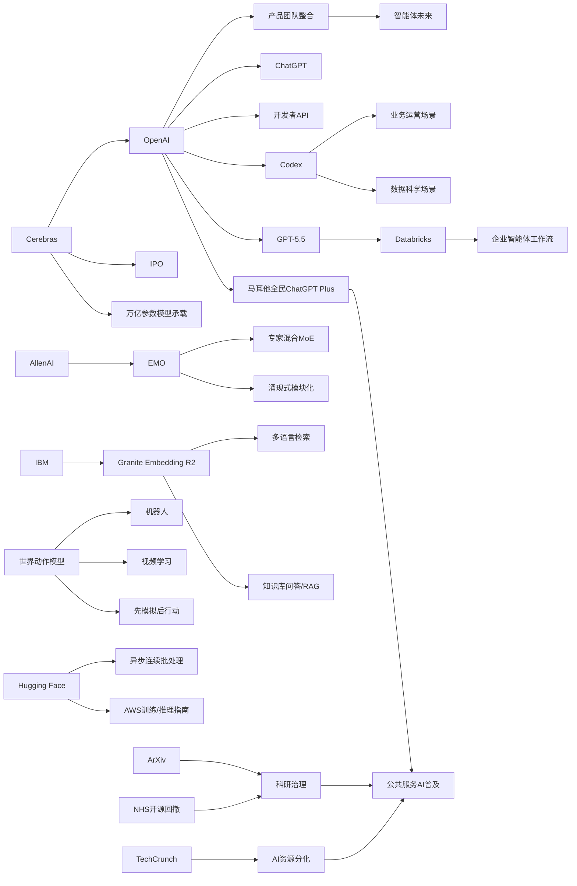

> AI 早报 · 每日早读 · 全网深度聚合

## **今日摘要**

本期动态显示，AI 产业正同时在基础设施、企业应用和模型架构上加速推进：Cerebras借 IPO 强调其可承载万亿参数模型，OpenAI 与 Databricks 则展示了 Codex 和 GPT-5.5 在企业运营与智能体流程中的落地价值。  
在研究前沿，EMO 的专家混合预训练、机器人“世界动作模型”以及 IBM 的多语言嵌入模型，都反映出行业正努力提升模型效率、可解释分工以及跨语言检索与行动推理能力。  
与此同时，OpenAI 整合产品团队押注“智能体未来”，也说明 AI 竞争已从单一模型或工具，转向平台化、生态化整合，并可能进一步拉大行业资源与能力差距。

### 🔵 产品与功能更新

1. **Cerebras推进IPO并强调大模型承载能力。**  
Cerebras 因首次公开募股（IPO，企业上市融资）成为当天焦点。公司高管特别回应了外界对其硬件路线的质疑，表示自家系统不仅能支持小模型，也能服务“万亿参数模型”（参数可理解为模型规模的核心指标）。报道还提到其可支持 OpenAI 内部 5.4 和 5.5 版本模型，进一步强化其在高性能 AI 基础设施上的定位。🚀  
[查看IPO与硬件进展](https://news.smol.ai/issues/26-05-15-not-much/)

2. **OpenAI展示Codex在业务运营团队中的用法。**  
OpenAI 发布案例，介绍业务运营团队如何使用 Codex（面向代码与文档任务的 AI 助手）处理日常工作。文中提到它可基于真实工作输入，生成项目简报、战略更新、管理层决策材料与进度汇报等内容。这说明 AI 工具正从“写代码”进一步走向更广泛的企业办公场景。🚀  
[查看Codex运营案例](https://openai.com/academy/codex-for-work/how-business-operations-teams-use-codex)

3. **EMO提出专家混合预训练的新方向。**  
AllenAI 在 Hugging Face 发布 EMO，主题是“专家混合”（Mixture of Experts，一种把任务分给不同子模型处理的架构）预训练与“涌现式模块化”。这类方法希望让模型在训练过程中自然形成更清晰的能力分工，从而提高效率与表现。虽然偏研究，但也直接影响未来产品在速度、成本和能力上的平衡。🚀  
[阅读EMO方法简介](https://huggingface.co/blog/allenai/emo)

### 🟢 前沿研究

1. **世界动作模型让机器人先模拟后行动。**  
World Action Models（世界动作模型）试图解决机器人 AI 的一个核心短板：不仅看见画面，还要理解动作会如何改变真实世界。相关综述整理了约一百篇论文，并指出这类模型的一大优势是可利用日常视频学习，而不必依赖大量机器人动作标注。对机器人来说，这意味着未来有望像人类一样“先想后动”。🚀  
[查看机器人研究综述](https://the-decoder.com/world-action-models-give-robots-the-ability-to-simulate-consequences-before-they-move/)

2. **Databricks把GPT-5.5用于企业智能体流程。**  
Databricks 宣布在企业智能体（Agent，可自动执行多步任务的 AI 系统）工作流中使用 GPT-5.5。OpenAI 介绍称，该模型在 OfficeQA Pro 基准测试上刷新了当前最佳成绩，这也为其企业落地提供了依据。对企业用户而言，这类能力将主要体现在更稳定的文档处理、问答与流程自动化上。🚀  
[了解企业智能体应用](https://openai.com/index/databricks)

3. **IBM发布多语言向量模型Granite Embedding R2。**  
IBM Granite 团队推出 Granite Embedding Multilingual R2，这是一款开放的多语言嵌入模型（Embedding，可把文本转成便于搜索和匹配的向量表示）。其特点包括支持 32K 上下文，以及在参数量低于 1 亿的模型中实现较强检索质量。对跨语言搜索、知识库问答和企业检索系统来说，这是很实用的基础能力。🚀  
[查看多语言模型发布](https://huggingface.co/blog/ibm-granite/granite-embedding-multilingual-r2)

### 🟡 行业展望与社会影响

1. **OpenAI整合产品团队，押注“智能体未来”。**  
OpenAI 正将 ChatGPT、Codex 和开发者 API 团队合并为统一产品团队，由 Codex 负责人领导。报道显示，此举目标是打造一款“超级应用”，并整合 Atlas 浏览器，推动更完整的智能体生态。对行业来说，这意味着头部公司正在从单点工具竞争转向平台级整合。🚀  
[查看团队整合动向](https://the-decoder.com/greg-brockman-consolidates-openais-product-teams-to-build-an-agentic-future/)

2. **AI淘金热中的“有者”与“无者”差距扩大。**  
TechCrunch 文章指出，当下 AI 热潮并未带来普遍乐观情绪，反而加深了资源与机会分化。无论是资金、算力还是人才，优势都在向少数大公司和核心参与者集中。这种趋势可能影响创业环境、就业机会，以及公众对 AI 红利分配是否公平的看法。🚀  
[阅读AI财富分化分析](https://techcrunch.com/2026/05/16/the-haves-and-have-nots-of-the-ai-gold-rush/)

3. **Codex开始进入数据科学团队日常工作。**  
OpenAI 介绍了数据科学团队如何使用 Codex 生成根因分析简报、影响评估、KPI 备忘录与仪表盘规范。相比传统只辅助编程的定位，这说明 AI 正更深地嵌入分析、汇报和业务沟通流程。对企业组织而言，数据团队与 AI 工具的结合正在从“提效”走向“流程重构”。🚀  
[查看数据团队案例](https://openai.com/academy/codex-for-work/how-data-science-teams-use-codex)

### 🟣 开源TOP项目

1. **Hugging Face介绍连续批处理中的异步化优化。**  
文章讨论如何在 continuous batching（连续批处理，一种提升模型服务吞吐量的推理调度方式）中释放异步能力。核心价值在于让推理请求更灵活地并行执行，从而提升系统利用率并降低等待时间。对于部署大模型服务的团队来说，这类工程优化往往直接影响成本和用户体验。🚀  
[查看异步批处理解析](https://huggingface.co/blog/continuous_async)

2. **NHS退回非开源路线引发开源讨论。**  
Simon Willison 转引关于英国 NHS 在开源策略上后撤的讨论，GDS 也对此发声。事件反映出公共机构在安全、采购、维护与开放之间仍面临复杂取舍。对开源社区而言，这不仅是技术路线问题，也关系到公共数字基础设施的长期治理。🚀  
[阅读开源政策讨论](https://simonwillison.net/2026/May/17/gds-weighs-in/#atom-everything)

3. **ArXiv将严管“AI代写”论文。**  
ArXiv 表示，如果作者让大语言模型（能生成文本的 AI 模型）完成几乎全部论文工作，可能面临一年禁投稿处罚。此举显示学术界正试图划清“辅助写作”与“替代研究”的边界。随着 AI 越来越会写，科研诚信与署名责任问题也变得更加迫切。🚀  
[查看ArXiv新规解读](https://techcrunch.com/2026/05/16/research-repository-arxiv-will-ban-authors-for-a-year-if-they-let-ai-do-all-the-work/)

### 🔴 社媒分享

1. **新数学基准暴露AI“不知道也硬答”的问题。**  
SOOHAK 是由 64 位数学家构建的新基准，共含 439 道手写题，其中 99 道被故意设计为“无解题”。结果显示，模型算力提升有助于解题，但并不能明显改善它们承认“这题无解”的能力。这说明当前 AI 在“知道自己不知道”方面仍然很弱。🚀  
[查看数学基准结果](https://the-decoder.com/new-math-benchmark-reveals-ai-models-confidently-solve-problems-that-have-no-solution/)

2. **OpenAI与马耳他合作向全民提供ChatGPT Plus。**  
OpenAI 宣布与马耳他合作，向当地所有公民提供 ChatGPT Plus，并配套培训资源。合作目标不仅是扩大 AI 使用机会，也强调培养实际技能与负责任使用习惯。这样的国家级合作，反映出 AI 普及正在从企业与个人订阅走向公共服务层面。🚀  
[了解马耳他合作计划](https://openai.com/index/malta-chatgpt-plus-partnership)

3. **AWS训练与推理基础模块被系统梳理。**  
Hugging Face 发布面向 AWS 的基础模型训练与推理指南，梳理了构建大模型系统所需的关键模块。内容覆盖训练与推理（模型运行生成结果）两个阶段，帮助团队理解云平台上的基础设施组合方式。对关注“怎么把模型真正跑起来”的读者来说，这类材料很适合作为全景入口。🚀  
[查看AWS模型指南](https://huggingface.co/blog/amazon/foundation-model-building-blocks)

---

📊 行业洞察

1. 事实  
   OpenAI 正将 ChatGPT、Codex 和开发者 API 团队整合为统一产品团队，并以“智能体未来”为方向推进平台化；同时，Codex 已从代码场景扩展到业务运营、数据科学等团队，用于生成简报、决策材料、KPI 备忘录和流程文档；Databricks 也宣布把 GPT-5.5 用于企业智能体（Agent，可自动执行多步任务的 AI 系统）工作流。  
   【洞察】行业竞争正从“单模型/单功能”转向“智能体平台+组织流程重构”。头部厂商不再只卖模型能力，而是在把模型、工作流、办公入口和开发接口打包成统一产品层，争夺企业内部的默认 AI 操作系统地位。

2. 事实  
   Cerebras 在 IPO 过程中重点强调其硬件可承载“万亿参数模型”，并可支持 OpenAI 内部 5.4/5.5 版本模型；Hugging Face 讨论了 continuous batching（连续批处理，一种提升模型服务吞吐量的推理调度方式）中的异步优化；AWS 基础模型训练与推理模块也被系统梳理。  
   【洞察】AI 基础设施的竞争焦点已从“能不能训练/推理”升级为“能否以更高吞吐、更低延迟、更优成本稳定承载超大模型”。这意味着算力公司、云平台与推理工程栈正在形成新的价值分层，未来资本市场会更看重“全栈可交付性”而非单点芯片性能。

3. 事实  
   AllenAI 发布 EMO，探索专家混合（Mixture of Experts，把任务分给不同子模型处理的架构）预训练与“涌现式模块化”；IBM 推出 Granite Embedding Multilingual R2，以较小参数量实现多语言检索能力；机器人方向的 World Action Models（世界动作模型）则强调通过视频学习“先模拟后行动”。  
   【洞察】模型创新正在从“盲目堆大参数”转向“结构化效率提升”，即通过模块化、专用化和任务分层来提高性价比。无论是 MoE（专家混合）、Embedding（嵌入模型）还是世界模型，本质上都在回答同一个问题：如何让 AI 在特定任务上更便宜、更稳、更可迁移。

4. 事实  
   TechCrunch 指出 AI 红利正向资金、算力和人才更集中的少数参与者倾斜；OpenAI 与马耳他合作向全民提供 ChatGPT Plus，推动国家级普及；ArXiv 开始严管“AI 代写”论文，NHS 的开源策略回撤也引发治理讨论。  
   【洞察】AI 正加速进入“社会基础设施化”阶段：一方面，技术和资源更集中，强化平台垄断趋势；另一方面，政府、学术和公共机构开始建立使用边界、分配机制与治理规则。未来行业胜负不仅取决于模型能力，也取决于谁能更早适配公共治理与制度约束。

🗺️ 今日关系图

