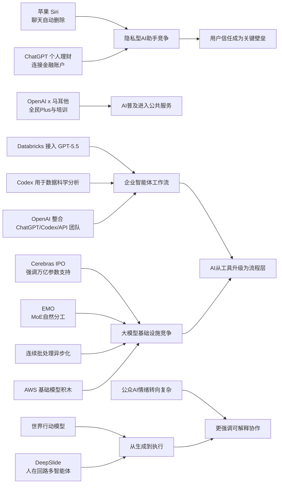

> AI 早报 · 每日早读 · 全网深度聚合

## **今日摘要**

新版 Siri 可能加入聊天自动删除，把“隐私更强、记录更少”作为重要升级方向，同时 ChatGPT 正从聊天助手扩展到能结合用户金融账户提供个性化理财建议。  
在技术与研究层面，Cerebras 借 IPO 强调其硬件也能支撑万亿参数大模型，DeepSlide 和 EMO 分别探索“更会讲的幻灯片 AI”与混合专家模型中的自然分工，而 Codex 也开始深入数据科学团队的日常分析工作。  
行业趋势上，世界行动模型让机器人先模拟后行动、降低训练成本，Databricks 则将 GPT-5.5 引入企业智能体流程，说明 AI 正同时朝更强隐私、更大规模能力和更完整业务自动化加速发展。

### 🔵 产品与功能更新

1. **苹果新版 Siri 或加入聊天自动删除。**
新版 Siri 的重点之一将是隐私，报道提到苹果可能加入聊天自动删除功能。对普通用户来说，这意味着和语音助手的对话记录可能不再长期保留。苹果显然希望把“更安全、更少留痕”作为这次升级的重要卖点。若最终落地，也会让 AI 助手的隐私竞争进一步升温🚀  
[苹果Siri隐私升级简报](https://techcrunch.com/2026/05/17/apples-siri-revamp-could-include-auto-deleting-chats/)

2. **ChatGPT 推出个人理财新体验。**
OpenAI 宣布面向美国 Pro 用户预览一项个人理财功能，用户可安全连接自己的金融账户。系统会基于你的财务背景、目标和优先级，给出 AI 驱动的洞察与建议。简单说，它想把 ChatGPT 从“会聊天”推进到“更懂你财务状况的助手”🚀  
[ChatGPT理财功能说明](https://openai.com/index/personal-finance-chatgpt)

3. **Cerebras 借 IPO 强调可服务超大模型。**
Cerebras 因首次公开募股（IPO，企业上市融资）成为焦点。其高管特别强调，公司并不只适合小模型，还能支持万亿参数模型（参数可理解为 AI 模型规模的重要指标），包括文中提到的 OpenAI 内部 5.4 和 5.5 模型。这个表态是在回应外界对其硬件路线的质疑，也说明大模型基础设施竞争仍在加速🚀  
[Cerebras上市关键信号](https://news.smol.ai/issues/26-05-15-not-much/)

### 🟢 前沿研究

1. **DeepSlide 试图把 AI 做幻灯片推进到“会帮你讲”。**
这篇论文介绍了 DeepSlide，一个“人在回路”（human-in-the-loop，指人持续参与决策）的多智能体系统。它不只生成看起来像样的幻灯片，还关注演讲节奏、叙事结构和演讲准备过程。换句话说，研究者认为“做好 PPT”不够，真正难的是“把内容讲明白”🚀  
[DeepSlide论文速览](https://arxiv.org/abs/2605.15202)

2. **EMO 探索混合专家预训练中的“自然分工”。**
EMO 研究的是混合专家模型（Mixture of Experts，可理解为让不同“子模型”分工协作的大模型架构）如何在预训练阶段产生模块化能力。它关注的不是单一模型会不会答题，而是不同“专家”能否逐渐形成各自擅长的任务区域。这类研究有助于让大模型在保持性能的同时，更高效地扩展规模🚀  
[EMO研究解读入口](https://huggingface.co/blog/allenai/emo)

3. **Codex 被用于数据科学团队的日常分析工作。**
OpenAI 展示了数据科学团队如何使用 Codex，完成根因分析简报、影响评估、KPI 备忘录和仪表盘说明等任务。这里的重点不是单次写代码，而是把真实工作输入转成结构化分析产出。对企业来说，这说明 AI 编程助手正从“帮工程师写代码”扩展到“帮分析团队整理业务结论”🚀  
[Codex团队应用指南](https://openai.com/academy/codex-for-work/how-data-science-teams-use-codex)

### 🟡 行业展望与社会影响

1. **世界行动模型让机器人先“脑补后行动”。**
世界行动模型（World Action Models）试图补上机器人 AI 的一个弱点：它不只学动作和画面的对应关系，还要理解动作会如何改变现实世界。报道提到，这类模型的一大优势是可以从日常视频中学习，而不必依赖大量机器人动作标注数据。如果这条路线成熟，机器人训练成本有望明显下降🚀  
[机器人新模型观察](https://the-decoder.com/world-action-models-give-robots-the-ability-to-simulate-consequences-before-they-move/)

2. **Databricks 把 GPT-5.5 引入企业智能体流程。**
Databricks 宣布在企业智能体工作流中使用 GPT-5.5，并提到该模型在 OfficeQA Pro 基准测试中达到新的先进水平。这里的“智能体工作流”可以理解为 AI 自动串联多个步骤完成复杂工作。对行业而言，这显示企业级 AI 正从单点问答走向更完整的流程自动化🚀  
[企业智能体合作简报](https://openai.com/index/databricks)

3. **毕业演讲谈 AI，可能越来越难打动学生。**
TechCrunch 这篇文章指出，在 2026 年的毕业语境里，单纯把 AI 说成美好未来，未必还能激励学生。背后反映的是公众情绪正在变化：AI 不再只是机会，也伴随就业、焦虑和不确定性。对于企业和学校，这提醒大家在讨论 AI 时，必须更真实地回应社会感受🚀  
[毕业演讲中的AI情绪](https://techcrunch.com/2026/05/17/if-youre-giving-a-commencement-speech-in-2026-maybe-dont-mention-ai/)

### 🟣 开源TOP项目

1. **英国政府数字部门发声，关注 NHS 退出开源。**
这则内容围绕英国国家医疗服务体系（NHS）在开源上的“后退”决定，以及英国政府数字服务部门（GDS）的回应。虽然不是新项目发布，但它触及开源在公共系统中的长期价值，包括透明度、可维护性和供应商依赖问题。对开源社区来说，这类政策动向往往比单个仓库更新更具风向意义🚀  
[英国开源政策风向](https://simonwillison.net/2026/May/17/gds-weighs-in/#atom-everything)

2. **Hugging Face 讨论连续批处理中的异步化。**
这篇文章聚焦 continuous batching（连续批处理，可理解为让模型推理请求更高效排队和执行）中的异步能力。核心是通过更灵活的调度，提高模型服务吞吐量并减少等待。对开源推理基础设施来说，这类优化直接关系到成本和用户体验🚀  
[推理异步优化解读](https://huggingface.co/blog/continuous_async)

3. **OpenAI 正整合产品团队，瞄准“智能体未来”。**
报道称，OpenAI 正把 ChatGPT、Codex 和开发者 API 团队合并，目标是打造更统一的产品体系，甚至朝“超级应用”方向推进。虽然这不是传统意义上的开源项目，但它清楚展示了 AI 产品形态正围绕“智能体”重新组织。对开发生态来说，这意味着未来工具链、入口和能力边界可能进一步融合🚀  
[OpenAI团队整合动态](https://the-decoder.com/greg-brockman-consolidates-openais-product-teams-to-build-an-agentic-future/)

### 🔴 社媒分享

1. **Mistral CEO 警告欧洲别在军用代码上过度依赖美国 AI。**
Mistral 首席执行官 Arthur Mensch 表示，法国军方代码库不应交由美国 AI 模型扫描。这番表态把 AI 讨论从“好不好用”拉到“数字主权与网络安全”层面。尤其是在 AI 已能协助攻击编排和漏洞建议的背景下，谁来处理敏感代码，已不只是技术问题🚀  
[欧洲AI主权争议](https://the-decoder.com/mistral-ceo-arthur-mensch-warns-france-against-letting-anthropics-mythos-scan-military-code-bases/)

2. **OpenAI 与马耳他合作，向全民推广 ChatGPT Plus。**
OpenAI 宣布与马耳他合作，向当地居民提供 ChatGPT Plus 和相关培训。目标不只是扩大使用量，也包括帮助公众建立实用 AI 技能，并以负责任的方式使用 AI。这类国家级合作，显示 AI 普及正在从个人订阅走向公共服务层面的试点🚀  
[马耳他全民AI计划](https://openai.com/index/malta-chatgpt-plus-partnership)

3. **AWS 上的大模型训练与推理“积木”被系统梳理。**
Hugging Face 这篇内容介绍了在 AWS 上进行基础模型训练和推理的关键组成部分。它像一份“搭建指南”，帮助团队理解从训练到部署需要哪些模块协同工作。对很多关注云上 AI 的从业者和观察者来说，这类内容很适合快速建立整体认知🚀  
[AWS大模型搭建指南](https://huggingface.co/blog/amazon/foundation-model-building-blocks)

---

📊 行业洞察

1. 事实  
   苹果新版 Siri 可能加入聊天自动删除；OpenAI 为美国 Pro 用户上线可连接金融账户的个人理财能力；OpenAI 又与马耳他合作推进 ChatGPT Plus 全民普及与培训。  
   【洞察】AI 助手正在从“通用问答入口”升级为“高敏感数据代理（agent，能代表用户执行任务的系统）”，但前提是先解决信任基础设施。苹果押注“少留痕”隐私卖点，OpenAI则押注“更深数据接入+更强服务价值”，两条路线指向同一竞争核心：谁能在身份、金融、生活场景里取得用户授权，谁就更可能占据下一代个人操作系统入口。

2. 事实  
   Databricks 将 GPT-5.5 引入企业智能体工作流；OpenAI 展示 Codex 在数据科学团队中完成根因分析、影响评估和KPI备忘录；OpenAI 同时整合 ChatGPT、Codex 与开发者 API 团队，瞄准“智能体未来”。  
   【洞察】企业 AI 已从“模型调用”进入“工作流重构”阶段。竞争焦点不再只是模型基准分数，而是能否把分析、决策、执行串成闭环智能体工作流（agentic workflow，AI 自动完成多步骤流程）。这意味着未来平台壁垒将更多来自产品一体化、工具链接入能力和组织级部署深度，而不是单点模型能力。

3. 事实  
   Cerebras 在 IPO 语境下强调可支持万亿参数模型；EMO 研究混合专家模型（Mixture of Experts，MoE，用多个子模型分工协作）在预训练中的自然分工；Hugging Face 讨论连续批处理中的异步化；同时梳理 AWS 上训练与推理的基础设施“积木”。  
   【洞察】大模型基础设施的竞争正从“堆算力”转向“系统级效率优化”。上游芯片厂商需要证明自己不仅能训练超大模型，还能匹配 MoE 架构、推理调度和云端部署的全链路效率。未来胜出的基础设施平台，不只是拥有更强芯片，而是能把训练、服务、调度、成本控制统一优化的“全栈算力系统”。

4. 事实  
   世界行动模型（World Action Models，让系统先模拟动作后果再执行）被视为降低机器人训练数据成本的新方向；DeepSlide 采用人在回路（human-in-the-loop，人在关键环节参与决策）的多智能体系统，关注“生成内容”到“完成表达”；与此同时，公众对 AI 的情绪在毕业演讲等语境中趋于复杂。  
   【洞察】AI 正从“生成答案”走向“理解后果并协作执行”，但人类监督不会消失，反而会成为高价值环节。无论是机器人先模拟再行动，还是办公智能体辅助演讲与分析，都说明下一阶段产品设计重点将是“可解释的协作式自动化”，而不是完全替代人。这也更符合当前社会对 AI 的谨慎预期。

🗺️ 今日关系图

