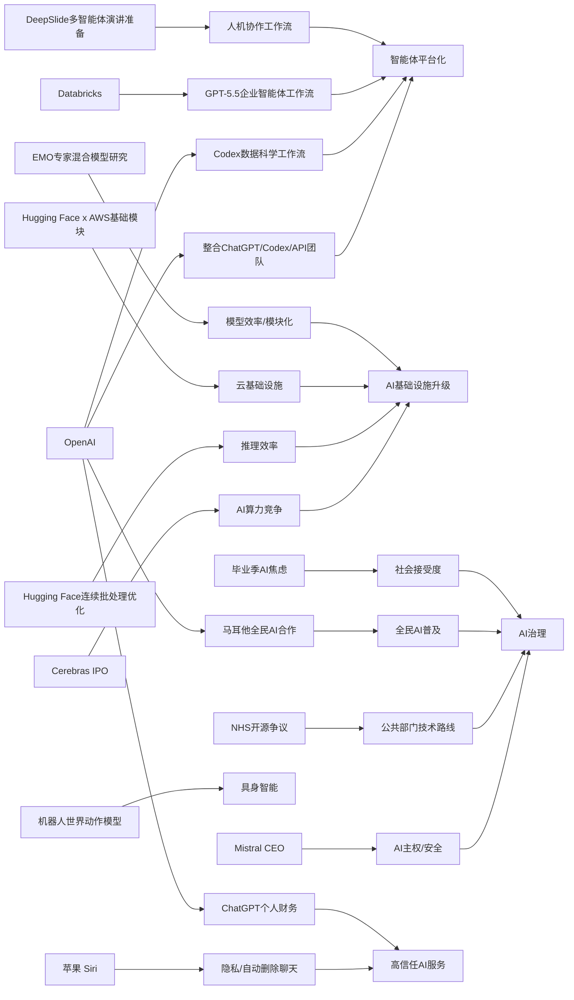

> AI 早报 · 每日早读 · 全网深度聚合

## **今日摘要**

苹果、OpenAI 和 Cerebras 分别在产品与市场层面推进 AI：新版 Siri 或加入聊天自动删除以强化隐私，ChatGPT 开始试水个人财务助手，而 Cerebras 的 IPO 则再次凸显 AI 算力竞争持续升温。  
研究方面，DeepSlide 试图把 AI 幻灯片生成升级为覆盖整场演讲准备的协作系统，Codex 正从写代码扩展到支持数据科学团队分析协作，EMO 则探索大模型是否能在训练中自然形成更清晰的模块分工。  
行业与社会层面，机器人“世界动作模型”让机器具备先模拟后行动的能力，有望提升训练效率与安全性；与此同时，公众对 AI 的情绪也更复杂，毕业演讲中反复强调 AI 甚至可能加剧年轻人的就业焦虑。

### 🔵 产品与功能更新

1. **苹果或为新版 Siri 加入聊天自动删除。**  
苹果准备发布新版 Siri（语音助手），隐私会成为这次更新的核心卖点。报道提到，新功能可能包含自动删除聊天记录，进一步减少用户对对话留存的担忧。对普通用户来说，这意味着 AI 助手不仅更聪明，也会更强调“聊完即走”的私密体验。🚀  
[苹果Siri隐私新动向(briefing)](https://techcrunch.com/2026/05/17/apples-siri-revamp-could-include-auto-deleting-chats/)

2. **ChatGPT 推出个人财务新体验。**  
OpenAI 面向美国 Pro 用户预览了 ChatGPT 的个人财务功能，支持安全连接金融账户。系统可以基于你的收支、目标和优先级，给出更贴近个人情况的分析与建议。简单说，ChatGPT 正从“会聊天”进一步走向“懂你的财务助手”。🚀  
[ChatGPT理财功能预览(briefing)](https://openai.com/index/personal-finance-chatgpt)

3. **Cerebras 以 IPO 再次吸引市场关注。**  
这家公司以不同于主流的 AI 硬件路线闻名，此次首次公开募股（IPO，上市融资）成为焦点。其高管强调，Cerebras 不只是适合小模型，也能支撑万亿参数模型（参数可理解为 AI 的“记忆与能力规模”），甚至提到可服务 OpenAI 内部的大模型。对市场而言，这释放出一个信号：AI 算力（计算能力）竞争仍在升级。🚀  
[Cerebras上市看点速览(briefing)](https://news.smol.ai/issues/26-05-15-not-much/)

### 🟢 前沿研究

1. **DeepSlide 想把“做幻灯片”扩展到“准备整场演讲”。**  
这篇论文指出，很多 AI 幻灯片工具只重视成品页面是否好看，却忽略演讲节奏、叙事结构和准备过程。DeepSlide 是一个人机协作的多智能体系统（多个 AI 模块分工协作），目标是帮助用户完成从材料整理到正式呈现的完整流程。对教育、科研和商务汇报场景来说，这比单纯“自动生成 PPT”更接近真实需求。🚀  
[DeepSlide论文导读(briefing)](https://arxiv.org/abs/2605.15202)

2. **Codex 被用于数据科学团队的日常分析工作。**  
OpenAI 展示了数据科学团队如何使用 Codex（编程与分析助手）完成根因分析、指标说明、影响评估和仪表盘需求整理。它不是只写代码，而是开始介入团队沟通与分析文档生产。对企业来说，这类工具的价值正在从“提效一个人”走向“提效一个团队”。🚀  
[Codex数据团队用法(briefing)](https://openai.com/academy/codex-for-work/how-data-science-teams-use-codex)

3. **EMO 探索专家混合模型中的“自然分工”。**  
EMO 研究关注专家混合模型（MoE，可理解为让多个“专长不同”的小模块协同工作）在预训练阶段如何形成模块化能力。它试图回答一个重要问题：模型能否自己长出更清晰的“分工结构”，而不是完全依赖人工设计。若这条路线成立，未来大模型可能在效率与能力上同时受益。🚀  
[EMO模块化研究简介(briefing)](https://huggingface.co/blog/allenai/emo)

### 🟡 行业展望与社会影响

1. **机器人“世界动作模型”让机器先想后动。**  
这类模型的核心能力，是让机器人在行动前先模拟后果，而不只是把画面和动作机械对应起来。报道提到，这一方向还能利用大量日常视频学习，不一定依赖昂贵的机器人标注数据。长远看，这可能降低机器人训练成本，并提升其在真实环境中的安全性与适应力。🚀  
[机器人先模拟再行动(briefing)](https://the-decoder.com/world-action-models-give-robots-the-ability-to-simulate-consequences-before-they-move/)

2. **毕业演讲里，AI 话题正在变得“不讨喜”。**  
TechCrunch 这篇评论认为，面对毕业生，反复强调 AI 改变未来未必能带来鼓舞，反而可能触发就业与前景焦虑。这反映出公众情绪正在变化：AI 不再只是令人兴奋的新技术，也成了现实压力的来源。对行业来说，“社会接受度”将越来越重要。🚀  
[毕业季里的AI焦虑(briefing)](https://techcrunch.com/2026/05/17/if-youre-giving-a-commencement-speech-in-2026-maybe-dont-mention-ai/)

3. **Databricks 将 GPT-5.5 引入企业智能体流程。**  
Databricks 表示，GPT-5.5 已用于企业级智能体工作流（可理解为让 AI 自动完成多步业务任务）。其依据之一，是该模型在 OfficeQA Pro 基准测试中取得新成绩。对企业客户来说，这说明更强模型正在从聊天场景走入真实业务流程。🚀  
[Databricks接入GPT-5.5(briefing)](https://openai.com/index/databricks)

### 🟣 开源TOP项目

1. **英国政府数字服务部门发声，讨论 NHS 退回闭源路线。**  
这篇内容围绕英国国家医疗服务体系（NHS）在开源软件上的态度变化展开。政府数字服务部门（GDS）对此作出回应，说明开源在公共部门技术建设中的争议仍在持续。对开源社区来说，这类公共机构的立场往往会影响长期生态与采购方向。🚀  
[英国公共部门开源争议(briefing)](https://simonwillison.net/2026/May/17/gds-weighs-in/#atom-everything)

2. **Hugging Face 介绍连续批处理的异步优化。**  
这篇文章聚焦 continuous batching（连续批处理，一种提升模型服务吞吐量的方法）里的异步机制。简单理解，就是让模型推理（生成回答的过程）在等待和执行之间更少“空转”，从而提高效率。对于开源推理系统和模型部署团队，这类底层优化非常关键。🚀  
[连续批处理异步优化(briefing)](https://huggingface.co/blog/continuous_async)

3. **OpenAI 正整合产品团队，押注“智能体未来”。**  
OpenAI 将 ChatGPT、Codex 和开发者 API 团队合并，目标是打造更统一的产品体系，甚至指向“超级应用”。虽然这不是开源项目本身，但它会直接影响开发工具、应用接口和产品生态的演进。对于整个开发者圈层，这种组织调整通常意味着下一轮平台战略开始成形。🚀  
[OpenAI产品整合信号(briefing)](https://the-decoder.com/greg-brockman-consolidates-openais-product-teams-to-build-an-agentic-future/)

### 🔴 社媒分享

1. **Mistral CEO 警告：不要让美国 AI 扫描法国军方代码库。**  
Mistral 首席执行官 Arthur Mensch 公开表示，法国不应把军事代码库交给美国 AI 模型扫描，因为这会带来网络安全与主权风险。他同时指出，现代 AI 甚至能帮助组织攻击路径和漏洞利用建议。这个表态把“AI 能力竞争”进一步拉到了国家安全层面。🚀  
[法国AI主权警示录(briefing)](https://the-decoder.com/mistral-ceo-arthur-mensch-warns-france-against-letting-anthropics-mythos-scan-military-code-bases/)

2. **OpenAI 与马耳他合作，向全民推广 ChatGPT Plus。**  
双方合作将为马耳他居民提供 ChatGPT Plus 使用机会和相关培训，帮助公众学习实用 AI 技能。重点不只是“送订阅”，还包括推动负责任使用 AI。对其他国家和地区来说，这可能成为“全民 AI 普及”政策的参考样板。🚀  
[马耳他全民AI合作(briefing)](https://openai.com/index/malta-chatgpt-plus-partnership)

3. **Hugging Face 总结 AWS 上训练与推理基础模型的关键模块。**  
这篇文章介绍了在 AWS（亚马逊云）上进行基础模型训练与推理（模型运行）的关键基础设施组件。虽然偏技术，但它反映出云平台、开源框架与模型工程之间的协同正在加深。对关注 AI 落地的人来说，这是“模型能力如何真正跑起来”的一环。🚀  
[AWS大模型基础模块(briefing)](https://huggingface.co/blog/amazon/foundation-model-building-blocks)

---

📊 行业洞察

1. 事实  
   苹果计划在新版 Siri 中加入聊天自动删除，强调隐私体验；OpenAI 则为 ChatGPT 推出可连接金融账户的个人财务功能，开始处理更高敏感度的用户数据。  
   【洞察】判断：AI 助手正从“通用问答”进入“高信任服务”阶段，隐私与安全将从加分项变成准入门槛。尤其在个人财务、长期助理等场景，数据最小化（Data Minimization，尽量少留存数据）和可解释安全连接能力，会成为产品竞争的核心分水岭。

2. 事实  
   OpenAI 将 ChatGPT、Codex 和开发者 API 团队整合，押注“智能体未来”；Databricks 已把 GPT-5.5 引入企业级智能体工作流；同时 OpenAI 展示了 Codex 在数据科学团队中的根因分析、影响评估和文档协作中的实际用法。  
   【洞察】判断：AI 行业竞争正在从“模型对话能力”转向“工作流接管能力”。智能体（Agent，能自主执行多步任务的系统）不再只是演示概念，而是在企业分析、协作、自动化流程中形成产品闭环。未来平台胜负，取决于谁能把模型、工具调用和团队协作整合成统一操作层。

3. 事实  
   Cerebras 通过 IPO 再度吸引市场关注，并强调其系统可支撑万亿参数模型；Hugging Face 一方面介绍 continuous batching（连续批处理，一种提升推理吞吐的技术）的异步优化，另一方面总结 AWS 上训练与推理基础模型的关键基础设施模块；EMO 研究则探索专家混合模型（MoE，让多个专长模块协同）在预训练中的自然分工。  
   【洞察】判断：算力竞赛已进入“硬件架构 + 推理系统 + 模型结构”三层联动优化期。行业不再只追求更大模型，而是同时追求更高训练/推理效率和更低单位成本。未来领先者未必只是参数最多者，而是能把芯片、服务栈与模型架构协同做到最优的玩家。

4. 事实  
   Mistral CEO 警告法国不要让美国 AI 扫描军方代码库，强调 AI 主权与网络安全风险；英国公共部门围绕 NHS 是否回归闭源路线产生争议；OpenAI 与马耳他合作推动全民 ChatGPT Plus 与 AI 培训；与此同时，毕业演讲中的 AI 话题开始引发公众焦虑而非单纯兴奋。  
   【洞察】判断：AI 正快速从商业技术议题升级为“治理议题”，涵盖国家主权、公共采购、全民普及和社会接受度。未来各国竞争不只是比模型能力，还要比制度设计、公共信任和本土生态控制力，AI 的地缘政治（Geopolitics，围绕国家利益的技术与政策博弈）属性正在显著增强。

🗺️ 今日关系图

