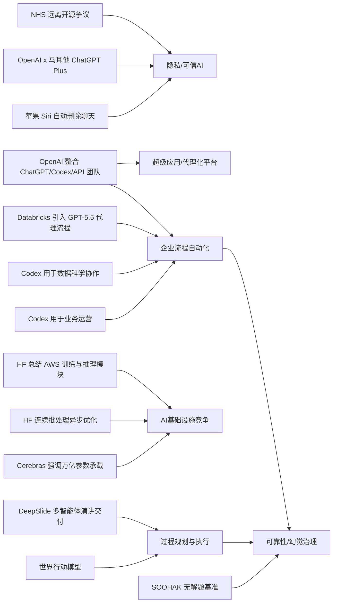

> AI 早报 · 每日早读 · 全网深度聚合

## **今日摘要**

本周 AI 动向显示，产品层面正同时朝两个方向推进：一是更强的隐私与可信体验，例如苹果计划让新版 Siri 支持聊天自动删除；二是更深入的办公与企业落地，例如 OpenAI 展示 Codex 在业务运营中的实际用途、Databricks 将 GPT-5.5 引入企业代理流程。  
研究与基础设施方面，机器人领域的“世界行动模型”强调先模拟后执行、拓宽了训练数据来源，而 Cerebras 也借 IPO 强调其硬件可承载万亿参数级模型，说明行业正在同时补齐“智能能力”和“算力平台”两端。  
从行业趋势看，OpenAI 整合 ChatGPT、Codex 与 API 团队，反映出 AI 公司正从分散工具转向统一的“代理化超级平台”，而像 DeepSlide 这类系统也表明，AI 正从生成内容进一步走向辅助完成完整工作流程。

### 🔵 产品与功能更新

1. **苹果新版 Siri 或加入聊天自动删除。**
苹果准备在新版 Siri 中把“隐私”作为核心卖点，其中一个方向是让对话内容支持自动删除。这个设计很适合担心聊天记录长期留存的普通用户，也显示出苹果想把 AI 助手做得更像“默认可信”的个人工具。若最终落地，Siri 的竞争点可能不只是能力提升，还包括更强的数据控制体验🚀  
[查看 Siri 隐私更新](https://techcrunch.com/2026/05/17/apples-siri-revamp-could-include-auto-deleting-chats/)

2. **OpenAI 展示 Codex 在业务运营团队的用法。**
OpenAI 介绍了业务运营团队如何使用 Codex（代码与文档智能助手）处理日常工作。它可以根据真实工作材料生成项目简报、战略更新、管理层决策材料和进展汇报，减少重复整理信息的时间。对非技术团队来说，这说明 AI 不只会写代码，也正在进入更常见的办公室流程🚀  
[查看 Codex 办公场景](https://openai.com/academy/codex-for-work/how-business-operations-teams-use-codex)

3. **Cerebras 借 IPO 强调超大模型承载能力。**
Cerebras 借上市（IPO，首次公开募股）进一步强调，自家硬件并不只适合小模型，也能支持万亿参数级模型。公司高管特别提到其系统能够服务包括 OpenAI 5.4 和 5.5 在内的内部模型，试图回应市场对其路线的质疑。这让 Cerebras 的产品叙事从“另类芯片公司”进一步转向“能承接最前沿大模型需求的平台”🚀  
[查看 Cerebras 动向](https://news.smol.ai/issues/26-05-15-not-much/)

### 🟢 前沿研究

1. **世界行动模型让机器人先“脑补后行动”。**
世界行动模型（World Action Models）试图解决机器人“会动但不真懂后果”的问题，让机器人在执行动作前先模拟可能结果。相关综述梳理了大约 100 篇论文，并指出这类方法的优势是能从普通视频中学习，而不一定需要机器人动作标注。对机器人研究来说，这意味着训练数据来源更广，也更接近人类通过观察学习的方式🚀  
[查看机器人新综述](https://the-decoder.com/world-action-models-give-robots-the-ability-to-simulate-consequences-before-they-move/)

2. **Databricks 将 GPT-5.5 引入企业代理流程。**
Databricks 宣布把 GPT-5.5 用于企业代理（agent，能自动执行多步任务的 AI 系统）工作流。官方提到，这一模型在 OfficeQA Pro 基准测试上创下了新的最好成绩，因此被用于企业级自动化场景。这个进展说明更强的大模型正在加速进入企业日常流程，而不只是停留在演示层面🚀  
[查看企业代理合作](https://openai.com/index/databricks)

3. **DeepSlide 关注“做幻灯片”之外的演讲交付。**
DeepSlide 是一套“人类参与、多智能体协作”的系统，不只帮用户生成幻灯片，还覆盖演讲节奏、叙事组织和演示准备。论文指出，很多 AI 幻灯片工具只优化成品页面，却忽略了真正的表达过程。它的意义在于把 AI 辅助从“做文件”推进到“帮人完成一次完整展示”🚀  
[查看 DeepSlide 论文](https://arxiv.org/abs/2605.15202)

### 🟡 行业展望与社会影响

1. **OpenAI 合并产品团队，押注“代理化未来”。**
OpenAI 正把 ChatGPT、Codex 和开发者 API 团队整合为一个统一产品团队，并由 Codex 负责人 Thibault Sottiaux 领导。报道指出，公司目标是打造一个整合 Atlas 浏览器的“超级应用”，而 Greg Brockman 将正式接手产品战略。这说明 OpenAI 正从“多个独立产品”转向“一个大一统 AI 平台”🚀  
[查看团队整合动向](https://the-decoder.com/greg-brockman-consolidates-openais-product-teams-to-build-an-agentic-future/)

2. **毕业演讲里的 AI 话题，正在失去鼓舞效果。**
TechCrunch 认为，在 2026 年的毕业演讲里，AI 已不再天然代表希望与激动人心的未来。对许多毕业生而言，AI 更常与就业焦虑、不确定性和被替代担忧联系在一起。这反映出社会对 AI 的情绪正在从“兴奋期待”转向更复杂、更加分裂的阶段🚀  
[查看社会情绪观察](https://techcrunch.com/2026/05/17/if-youre-giving-a-commencement-speech-in-2026-maybe-dont-mention-ai/)

3. **Codex 开始进入数据科学团队的日常协作。**
OpenAI 还展示了数据科学团队如何使用 Codex 处理根因分析简报、影响评估、KPI 备忘录和分析需求说明。相比“自动写代码”，这更接近企业内部的跨职能协作场景，强调 AI 在沟通和整理中的价值。它说明数据团队的 AI 工具正在从个人助手，走向流程级助手🚀  
[查看数据团队用法](https://openai.com/academy/codex-for-work/how-data-science-teams-use-codex)

### 🟣 开源TOP项目

1. **Hugging Face 介绍连续批处理的异步优化。**
这篇文章讨论如何在连续批处理（continuous batching，一种提升模型推理吞吐量的方法）中引入异步机制。核心目的是让模型服务在处理不同请求时更灵活，减少等待、提升整体效率。对于部署开源大模型的团队来说，这是非常实用的性能优化方向🚀  
[查看异步批处理方案](https://huggingface.co/blog/continuous_async)

2. **英国政府数字服务团队评论 NHS 远离开源。**
Simon Willison 转引了英国政府数字服务团队（GDS）对 NHS 从开源软件策略后退的看法。这个话题本身不只是软件选型争论，也关系到公共部门的透明度、可维护性和技术自主权。放在 AI 时代看，开源路线的取舍会进一步影响公共基础设施的可控性🚀  
[查看开源政策讨论](https://simonwillison.net/2026/May/17/gds-weighs-in/#atom-everything)

3. **OpenClaw 完成更名，延续开源项目演进。**
“Warelay -> OpenClaw” 记录了项目名称的调整。虽然这是一个相对轻量的更新，但项目更名往往意味着定位、社区传播方式或未来发展方向的重新梳理。对关注开源生态的人来说，这类变化常常是后续动作的前置信号🚀  
[查看 OpenClaw 更名](https://simonwillison.net/2026/May/16/openclaw-names/#atom-everything)

### 🔴 社媒分享

1. **新数学基准显示，AI 很会“自信答错”。**
SOOHAK 是由 64 位数学家构建的新基准测试，包含 439 道手写题目，其中 99 道是故意设置为“无解”的。结果显示，模型算题能力会随着算力增加而提升，但识别“这题根本无解”的能力并没有同步变强。这个发现很适合社交媒体传播，因为它直观揭示了 AI 常见的“幻觉”（看似合理但其实错误）问题🚀  
[查看数学基准发现](https://the-decoder.com/new-math-benchmark-reveals-ai-models-confidently-solve-problems-that-have-no-solution/)

2. **OpenAI 与马耳他合作，向全民提供 ChatGPT Plus。**
OpenAI 与马耳他达成合作，计划向该国公民提供 ChatGPT Plus，并配套培训项目。重点不只是工具发放，还包括帮助民众建立实际使用能力和负责任使用意识。这类全国级合作，很容易在社交平台上引发对“AI 普惠化”与公共教育的讨论🚀  
[查看马耳他合作计划](https://openai.com/index/malta-chatgpt-plus-partnership)

3. **Hugging Face 总结 AWS 上训练与推理基础模块。**
这篇文章梳理了在 AWS（亚马逊云）上进行基础模型训练与推理所需的关键组件。内容适合作为理解“云上大模型基础设施” 的入门地图，帮助读者快速看懂训练、部署和运行环节如何衔接。因为平台覆盖面广，这类总结也很适合在社媒上被二次传播🚀  
[查看 AWS 模型模块](https://huggingface.co/blog/amazon/foundation-model-building-blocks)

---

📊 行业洞察

1. 事实  
   苹果计划在新版 Siri 中加入聊天自动删除，把隐私作为核心卖点；与此同时，OpenAI 与马耳他合作，向全民提供 ChatGPT Plus 并配套培训；英国政府数字服务团队还对 NHS 远离开源表达担忧，讨论公共技术体系的透明度与可控性。  
   【洞察】AI 竞争正在从“谁更聪明”转向“谁更可信”。面向消费端，苹果试图用默认隐私保护建立差异化；面向公共部门与国家级落地，OpenAI 的普惠合作和开源政策争议都说明，数据治理、技术主权（technology sovereignty，国家/机构对关键技术的自主掌控能力）与可审计性，正成为 AI 采购和 adoption（采用）决策的关键变量。

2. 事实  
   OpenAI 将 ChatGPT、Codex 和开发者 API 团队整合为统一产品团队，目标指向整合 Atlas 浏览器的“超级应用”；同时，OpenAI 展示了 Codex 在业务运营和数据科学团队中的日常使用；Databricks 也宣布把 GPT-5.5 引入企业代理工作流。  
   【洞察】AI 正从“单点助手”升级为“流程操作系统”。一方面，OpenAI 在组织架构上推动产品一体化，意味着未来入口、模型、工具调用和执行链路会被统一；另一方面，Codex 和 GPT-5.5 已深入简报、汇报、根因分析、KPI 沟通等非技术流程，说明企业级 agent（代理，可自动执行多步任务的 AI 系统）正在从 demo（演示）走向 workflow（工作流）重构，AI 的价值重心也从内容生成转向任务闭环。

3. 事实  
   Cerebras 借 IPO 强调其硬件可承载万亿参数级模型，并提到可服务包括 OpenAI 5.4 和 5.5 在内的内部模型；Hugging Face 则介绍连续批处理中的异步优化方案，并总结 AWS 上训练与推理基础模块。  
   【洞察】大模型基础设施竞争进入“软硬一体”阶段。上游不再只是比拼芯片峰值性能，而是要同时证明训练承载力、推理吞吐（throughput，单位时间处理请求能力）、云上部署兼容性和成本效率。Cerebras 强调超大模型承载，Hugging Face 聚焦推理调度优化，反映出市场正从“能不能跑”过渡到“能否规模化、稳定且经济地跑”。

4. 事实  
   世界行动模型让机器人在行动前先模拟后果，可利用普通视频学习；DeepSlide 采用人类参与、多智能体协作，覆盖幻灯片生成到演讲交付全过程；SOOHAK 数学基准则显示，模型在识别“题目无解”方面并未随算力同步提升。  
   【洞察】下一阶段 AI 能力评估将从“生成结果像不像”转向“过程判断对不对”。无论是机器人先模拟后行动，还是 DeepSlide 关注演讲准备全流程，都体现出 AI 正从静态内容生成迈向过程规划与执行支持；而 SOOHAK 暴露的“自信答错”问题表明，缺乏边界感知（boundary awareness，对不确定/无解情况的识别能力）仍是通用模型落地的核心短板，这会直接影响 agent 和 embodied AI（具身智能，能与物理或任务环境交互的 AI）的可靠性上限。

🗺️ 今日关系图

