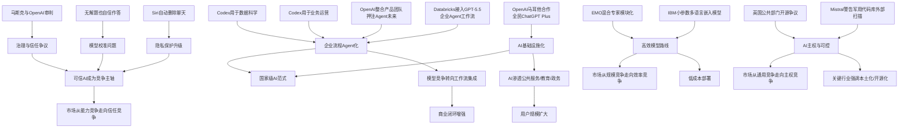

> AI 早报 · 每日早读 · 全网深度聚合

## **今日摘要**

OpenAI与马耳他合作，向全国公民提供 ChatGPT Plus，显示生成式 AI 正从个人工具走向国家级数字基础设施；同时 Databricks 将 GPT-5.5 接入企业 Agent 工作流，说明大模型竞争正转向真实业务落地与自动化执行。  
苹果 Siri 改版或加入聊天自动删除功能，而 OpenAI 也展示了 Codex 在业务运营和数据科学团队中的应用，反映出 AI 助手与编程工具正同时朝着“更可信”和“更通用办公化”发展。  
在研究层面，世界动作模型让机器人能先模拟后行动、提升自主性与安全性，而新的数学基准则暴露出 AI 会自信回答“无解题”，再次提醒用户在关键场景中谨慎使用模型输出。

### 🔵 产品与功能更新

1. **OpenAI与马耳他合作，向全国公民提供ChatGPT Plus**
这项合作显示，生成式AI（可生成文本、图像等内容的人工智能）正在从个人订阅服务走向国家级公共数字基础设施。对普通用户而言，这意味着更广泛的人群将直接接触高级AI助手，也可能推动教育、政务与日常信息获取方式变化。对行业而言，这类“全民AI接入”模式可能成为其他国家参考的新范式。  
[OpenAI and Malta partner to bring ChatGPT Plus to all citizens](https://openai.com/index/malta-chatgpt-plus-partnership)

2. **Databricks将GPT-5.5引入企业Agent工作流**
Databricks此次接入GPT-5.5，重点不只是模型升级，而是把AI Agent（可自主执行多步任务的智能体）嵌入企业流程。对于企业客户来说，这意味着AI不再局限于问答，而是更接近自动处理数据、分析结果和推动业务动作。也说明大模型（大型人工智能模型）竞争正从“谁更聪明”转向“谁更能接入真实业务系统”。  
[Databricks brings GPT-5.5 to enterprise agent workflows](https://openai.com/index/databricks)

3. **苹果Siri改版或将加入聊天自动删除功能**
这一变化反映出AI助手竞争正在向隐私保护靠拢。自动删除聊天记录，可能帮助用户降低敏感信息长期留存的风险，也符合当前市场对“可控AI”的期待。对于苹果来说，Siri若想在新一轮AI助手竞争中追赶，功能更新之外，信任感也会是关键卖点。  
[Apple’s Siri revamp could include auto-deleting chats](https://techcrunch.com/2026/05/17/apples-siri-revamp-could-include-auto-deleting-chats/)

4. **OpenAI介绍业务运营团队如何使用Codex**
Codex是面向代码与任务自动化场景的AI系统，此次案例说明它的应用已从工程团队扩展到业务运营。运营团队可借助它处理流程自动化、数据整理和跨系统任务，提高日常执行效率。这类案例也在强化一个趋势：AI编程工具正逐步变成“通用办公自动化工具”。  
[How business operations teams use Codex](https://openai.com/academy/codex-for-work/how-business-operations-teams-use-codex)

5. **OpenAI展示数据科学团队如何使用Codex**
数据科学团队通常涉及分析脚本、实验流程和结果复现，Codex在这些环节的价值更容易体现。此次分享表明，AI不仅能帮助写代码，还能加速数据处理、模型试验与分析协作。对企业来说，这意味着数据团队的工作链条中，越来越多步骤可由AI辅助完成。  
[How data science teams use Codex](https://openai.com/academy/codex-for-work/how-data-science-teams-use-codex)

### 🟢 前沿研究

1. **世界动作模型让机器人行动前先模拟后果**
所谓世界动作模型（World Action Models，能在内部预测动作后果的模型），核心价值是让机器人像人一样“先想再动”。这能帮助机器人在真实环境中减少试错成本，提升安全性与任务成功率。若该方向持续成熟，机器人在家庭、仓储和工业场景中的自主性可能显著增强。  
[World Action Models give robots the ability to simulate consequences before they move](https://the-decoder.com/world-action-models-give-robots-the-ability-to-simulate-consequences-before-they-move/)

2. **新数学基准测试显示，AI会自信解答“无解题”**
这项基准测试（用于评估模型能力的标准化测试）揭示了一个关键问题：模型并非只是“算错”，而是可能对根本无解的问题也给出看似合理的答案。对普通用户而言，这提醒我们不能把模型输出等同于事实，尤其在教育、科研和决策场景中更要谨慎。研究意义在于，它为衡量模型“知道自己不知道”的能力提供了新方向。  
[New math benchmark reveals AI models confidently solve problems that have no solution](https://the-decoder.com/new-math-benchmark-reveals-ai-models-confidently-solve-problems-that-have-no-solution/)

3. **IBM发布Granite多语言嵌入模型R2，主打小参数高检索质量**
嵌入模型（把文本转换为可计算向量的模型）是搜索、推荐和知识库问答的重要底层技术。Granite Embedding Multilingual R2强调在不到1亿参数规模下实现较强的多语言检索效果，说明高效模型依然有很大创新空间。对于企业和开发者来说，这类轻量模型更利于低成本部署。  
[Granite Embedding Multilingual R2: Open Apache 2.0 Multilingual Embeddings with 32K Context — Best Sub-100M Retrieval Quality](https://huggingface.co/blog/ibm-granite/granite-embedding-multilingual-r2)

4. **EMO研究探索混合专家预训练带来的“涌现模块化”**
混合专家（Mixture of Experts，一种让不同子模型分工处理任务的架构）一直被视为提升模型效率的重要路线。EMO这项工作关注“涌现模块化”，也就是模型是否会在训练中自然形成更清晰的功能分工。若这一方向得到验证，未来大模型可能在更低成本下获得更强能力与更好的可解释性（更容易理解模型为何这样输出）。  
[EMO: Pretraining mixture of experts for emergent modularity](https://huggingface.co/blog/allenai/emo)

### 🟡 行业展望

1. **Greg Brockman整合OpenAI产品团队，押注“Agent式未来”**
此次组织调整表明，OpenAI正在把资源集中到Agent（可自主完成复杂任务的智能体）方向。相比单次问答，Agent更强调连续执行、调用工具和完成目标，这被视为下一阶段AI产品竞争核心。对行业来说，这也预示大模型公司将更加重视产品闭环，而不只是底层模型能力。  
[Greg Brockman consolidates OpenAI's product teams to build an "agentic future"](https://the-decoder.com/greg-brockman-consolidates-openais-product-teams-to-build-an-agentic-future/)

2. **Mistral CEO警告法国，不应让Anthropic的Mythos扫描军用代码库**
这则消息反映出AI竞争已深入国家安全与技术主权层面。围绕军用代码库这类高敏感资产，争议焦点不只是模型性能，更包括数据控制权、供应商依赖和战略风险。对欧洲而言，本土AI能力建设正在从商业议题升级为安全议题。  
[Mistral CEO Arthur Mensch warns France against letting Anthropic's Mythos scan military code bases](https://the-decoder.com/mistral-ceo-arthur-mensch-warns-france-against-letting-anthropics-mythos-scan-military-code-bases/)

3. **马斯克与OpenAI审判中，“信任”成为核心问题**
这起审判背后的关键，不仅是公司治理或商业纠纷，更是公众如何看待AI机构的承诺与边界。TechCrunch将焦点放在“信任”，说明AI行业发展到今天，透明度、使命一致性和治理结构已成为影响外部评价的重要因素。未来大型AI公司的竞争，可能越来越取决于社会信任而非单纯技术领先。  
[Why trust is a big question at the Elon Musk-OpenAI trial](https://techcrunch.com/2026/05/17/why-trust-is-a-big-question-at-the-elon-musk-openai-trial/)

4. **汽车行业将迎来AI技能军备竞赛**
汽车产业的AI化正从自动驾驶扩展到制造、供应链和车内软件体验。所谓“技能军备竞赛”，意味着企业将争夺既懂汽车又懂AI的人才，这可能改变传统车企的人才结构与研发节奏。长期看，谁能更快建立AI能力，谁就可能在下一阶段汽车竞争中占据主动。  
[TechCrunch Mobility: The AI skills arms race is coming for automotive](https://techcrunch.com/2026/05/17/techcrunch-mobility-the-ai-skills-arms-race-is-coming-for-automotive/)

5. **2026年毕业演讲“最好别提AI”折射社会情绪变化**
这篇报道并非技术新闻本身，而是对社会氛围的观察：AI已从新鲜话题变成容易引发疲劳甚至焦虑的公共议题。对行业而言，这是一种提醒，说明大众沟通不能只讲颠覆和效率，也要回应就业、教育和人的价值感受。AI叙事正在从“乐观愿景”转向“现实协商”。  
[If you’re giving a commencement speech in 2026, maybe don’t mention AI](https://techcrunch.com/2026/05/17/if-youre-giving-a-commencement-speech-in-2026-maybe-dont-mention-ai/)

### 🟣 开源TOP

1. **英国政府数字服务部门就NHS退出开源作出回应**
这则内容聚焦开源软件（源代码公开、可自由修改和分发的软件）在公共部门的角色。NHS的选择之所以引发讨论，是因为它触及成本、可控性与长期技术依赖等现实问题。对于AI和数字化建设来说，开源路线是否被持续支持，会直接影响创新生态与公共采购方式。  
[GDS weighs in on the NHS's decision to retreat from Open Source](https://simonwillison.net/2026/May/17/gds-weighs-in/#atom-everything)

2. **Warelay更名为OpenClaw**
项目更名看似是小事，但往往意味着定位、社区传播和品牌策略的调整。对于开源项目而言，一个更清晰、易传播的名字有助于吸引开发者和使用者关注。也说明当前开源生态竞争加剧，项目不仅要有技术特色，也要有更易识别的品牌表达。  
[Warelay -> OpenClaw](https://simonwillison.net/2026/May/16/openclaw-names/#atom-everything)

3. **iNaturalist-clumper 0.1发布**
这是一个新版本发布信息，体现出小而实用的开源工具仍在持续活跃。此类工具虽然不一定具备“大模型”光环，但常常能解决具体工作流中的实际问题。对开发者社区来说，开源生态的价值正体现在这些细分工具不断补足真实需求。  
[inaturalist-clumper 0.1](https://simonwillison.net/2026/May/15/inaturalist-clumper/#atom-everything)

4. **Granite多语言嵌入模型以Apache 2.0协议开放**
除了研究价值，这一模型的另一大看点是开放许可协议。Apache 2.0（允许较宽松商用与修改的开源协议）通常更利于企业采用和二次开发。对于希望构建多语言搜索、知识库和检索增强生成（RAG，先检索再生成答案）的团队来说，这类开放模型具备很强吸引力。  
[Granite Embedding Multilingual R2: Open Apache 2.0 Multilingual Embeddings with 32K Context — Best Sub-100M Retrieval Quality](https://huggingface.co/blog/ibm-granite/granite-embedding-multilingual-r2)

5. **Hugging Face总结AWS上的基础模型训练与推理构建模块**
这篇内容从基础设施角度梳理了基础模型（可适配多任务的大型通用模型）在云平台上的训练与推理方案。它的价值不在于发布某个单独模型，而在于帮助开发者理解开源模型如何更系统地落地。对想进入大模型开发的团队来说，这类“搭积木式”方法有助于降低实践门槛。  
[Building Blocks for Foundation Model Training and Inference on AWS](https://huggingface.co/blog/amazon/foundation-model-building-blocks)

### 🔴 社媒分享

1. **“今天没发生太多事”背后，透露AI新闻节奏正在常态化**
这则日报式标题本身很有代表性：当AI行业进入高频更新阶段，“没有爆炸性大新闻”反而成了一种新鲜感。它说明市场情绪正从追逐单点突破，转向持续跟踪产品、组织和落地进展。对读者来说，这也意味着理解AI行业需要更长期的观察，而非只看轰动性事件。  
[not much happened today](https://news.smol.ai/issues/26-05-15-not-much/)

2. **Simon Willison转引Julia Evans内容，延续开发者社群讨论热度**
这类转引内容往往不是正式论文或产品发布，但能快速放大社区中的有价值观点。开发者社群的信息传播，很大程度依赖这类“个人节点”进行筛选和二次解读。对于非技术读者而言，关注这些意见领袖有助于更早看到趋势苗头。  
[Quoting Julia Evans](https://simonwillison.net/2026/May/16/julia-evans/#atom-everything)

3. **Hugging Face讨论连续批处理中的异步化问题**
连续批处理（continuous batching，持续把多个请求组合处理以提升效率）是大模型服务优化中的关键技术点。此次内容聚焦“异步化”（任务不必按顺序等待完成），说明AI应用的竞争正深入到底层性能与成本优化。虽然话题偏技术，但它直接关系到用户能否获得更快、更便宜的AI服务。  
[Unlocking asynchronicity in continuous batching](https://huggingface.co/blog/continuous_async)

4. **Hugging Face发布AWS基础模型构建指南，具备较强社区传播属性**
这类指南型内容往往在社交平台和开发者社区中传播较快，因为它兼具实用性和入门价值。相比单一模型发布，系统化教程更容易帮助团队上手真实部署。它也反映出当前社区讨论重点，正从“哪个模型最好”转向“如何真正用起来”。  
[Building Blocks for Foundation Model Training and Inference on AWS](https://huggingface.co/blog/amazon/foundation-model-building-blocks)

---

## 📊行业洞察

- **1. AI正从“工具订阅”升级为“基础设施级服务”**
  - 由OpenAI与马耳他合作向全国公民提供ChatGPT Plus，以及Databricks将GPT-5.5接入企业Agent工作流两条新闻可见，AI正在同时进入**公共基础设施**与**企业核心流程**。
  - 这意味着行业竞争焦点从“模型能力展示”转向“覆盖率+嵌入度”：
    - 面向国家：比拼**普惠接入能力**与**公共服务适配能力**
    - 面向企业：比拼**工作流集成能力**与**系统互操作性**（Interoperability，系统之间协同工作的能力）
  - 未来“全民AI接入”与“企业Agent落地”可能形成双轮驱动：一端培养大规模用户习惯，另一端沉淀高价值商业闭环。

- **2. Agent化正在成为大模型厂商的统一产品路线**
  - OpenAI整合产品团队押注“Agent式未来”、Databricks将GPT-5.5引入企业Agent工作流，以及Codex从工程场景扩展到业务运营、数据科学团队，几条信息共同说明：AI正在从**回答问题**转向**执行任务**。
  - 这背后是产品范式变化：
    - **Copilot范式**：以辅助生成为主
    - **Agent范式**：以目标驱动、多步执行、工具调用（Tool Use，调用外部系统/API完成任务）为主
  - 行业含义在于，未来企业采购大模型时，评估标准会从模型“聪不聪明”扩展到：
    - 能否接CRM/ERP/数据库等业务系统
    - 能否稳定完成长链路任务
    - 能否在权限、审计、回滚上满足企业治理要求  
  - 因此，Agent不只是产品功能升级，更是AI商业化进入深水区的标志。

- **3. “可信AI”正从附加项变成竞争主轴**
  - Siri可能加入聊天自动删除功能、数学基准暴露模型会自信回答“无解题”、马斯克与OpenAI审判聚焦“信任”，这些新闻共同反映：行业已从“能力焦虑”转向“可信焦虑”。
  - 可信AI包含三层要求：
    - **隐私可信**：如自动删除、最小化留存
    - **认知可信**：模型要具备“不知道就说不知道”的校准能力（Calibration，输出置信度与真实正确率的匹配程度）
    - **治理可信**：企业使命、透明度、组织结构是否让外界信服
  - 这意味着未来头部厂商的护城河，不只来自参数规模或推理性能，也来自**信任架构**（Trust Architecture，围绕隐私、安全、审计、治理建立的体系化能力）。

- **4. AI竞争正在分化为“两条底层路线”：高效模型与主权可控**
  - IBM发布小参数多语言嵌入模型R2、EMO探索混合专家的涌现模块化、Mistral就军用代码库发出主权警告、英国公共部门围绕开源路线争议，几条新闻可整合出一个清晰趋势：未来AI底层能力不再单押“更大模型”，而是转向**效率优化**与**自主可控**并行。
  - 一条路线是**高效化**：
    - 小参数嵌入模型降低部署成本
    - 混合专家（MoE，Mixture of Experts）提升推理效率与模块分工
  - 另一条路线是**主权化**：
    - 军事、政务、医疗等高敏场景更关注数据边界
    - 开源与本土模型成为降低供应商锁定（Vendor Lock-in，过度依赖单一供应商）的重要抓手
  - 这说明未来市场不会只有“最强模型赢家通吃”，而会出现按场景分层的格局：
    - 通用消费市场看体验
    - 企业市场看集成
    - 政府与关键行业看可控与合规

## 🗺️ Mermaid关系图

