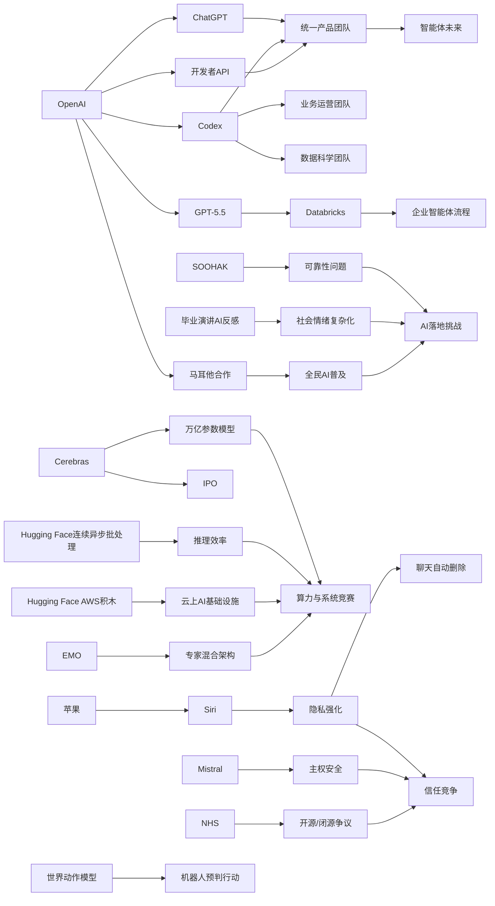

> AI 早报 · 每日早读 · 全网深度聚合

## **今日摘要**

本轮信息显示，AI 产品竞争正从“更强能力”扩展到“更隐私、更平台化、更深入工作流”，例如苹果强化 Siri 隐私、OpenAI 推动 Codex 进入业务运营，并整合团队押注统一的智能体平台。  
在技术与基础设施层面，行业一边推进更大规模模型与算力竞争，如 Cerebras 强调支持万亿参数模型，一边探索更高效、更智能的路径，如机器人世界动作模型、企业接入 GPT-5.5，以及 EMO 对专家混合架构自然分工的研究。  
整体来看，AI 正加速从单一聊天工具走向企业流程、硬件体系和社会讨论的核心，但公众态度也更复杂，既期待效率提升，也更关注隐私、安全与真实价值。

### 🔵 产品与功能更新

1. **苹果新版 Siri 或加入聊天自动删除。**  
苹果准备更新 Siri（语音助手），其中“隐私”会成为发布重点，自动删除聊天记录可能是新功能之一。这个方向说明，AI 助手竞争不只看“更聪明”，也越来越看“更安心”。对于普通用户来说，这类设计有助于减少敏感对话长期留存的担忧。🚀  
[查看苹果隐私新动向(briefing)](https://techcrunch.com/2026/05/17/apples-siri-revamp-could-include-auto-deleting-chats/)

2. **OpenAI 展示业务运营团队如何使用 Codex。**  
OpenAI 介绍了业务运营团队使用 Codex（编程与文档生成助手）的方式，包括制作项目简报、战略更新、管理层决策材料和进度汇报。重点不是“写代码”本身，而是把真实工作输入快速整理成可执行文档。对企业用户来说，这类工具正在从技术部门走向更广泛的日常办公场景。🚀  
[查看运营团队用法(briefing)](https://openai.com/academy/codex-for-work/how-business-operations-teams-use-codex)

3. **Cerebras 借 IPO 强调可服务万亿参数模型。**  
Cerebras 在 IPO（首次公开募股）消息带动下再次受到关注。公司高管特别强调，其硬件不仅适合小模型，也能支持万亿参数级别的大模型训练与服务。对市场而言，这释放出一个信号：AI 算力竞争仍在继续，非主流硬件路线也在争夺大型模型机会。🚀  
[查看 Cerebras 最新进展(briefing)](https://news.smol.ai/issues/26-05-15-not-much/)

### 🟢 前沿研究

1. **世界动作模型让机器人先“脑补后行动”。**  
World Action Models（世界动作模型）尝试解决机器人“会动但不真正理解后果”的问题。这类模型能先模拟动作可能带来的环境变化，再决定如何执行，因此更像人类在行动前做预判。研究综述显示，它还可以利用普通视频学习，而不必完全依赖带机器人动作标注的数据。🚀  
[了解机器人新模型(briefing)](https://the-decoder.com/world-action-models-give-robots-the-ability-to-simulate-consequences-before-they-move/)

2. **Databricks 将 GPT-5.5 用于企业智能体流程。**  
Databricks 宣布把 GPT-5.5 接入企业智能体（能自动执行多步任务的 AI 系统）工作流。官方提到，该模型在 OfficeQA Pro 基准测试中取得了新的领先成绩，这也是其进入企业流程的重要依据。对公司用户来说，这类集成意味着 AI 不再只是问答工具，而是逐步参与实际业务流程。🚀  
[查看企业接入细节(briefing)](https://openai.com/index/databricks)

3. **EMO 研究探索专家混合模型的“自然分工”。**  
EMO 关注的是 Mixture of Experts（专家混合模型，一种把任务分配给不同子模型的架构）如何在预训练阶段形成更强的模块化能力。简单说，就是让模型内部不同部分更自然地“各司其职”。这有望提升大模型的效率与扩展性，也为未来更大规模模型设计提供新思路。🚀  
[查看 EMO 研究解读(briefing)](https://huggingface.co/blog/allenai/emo)

### 🟡 行业展望与社会影响

1. **OpenAI 合并产品团队，押注“智能体未来”。**  
OpenAI 正把 ChatGPT、Codex 和开发者 API 团队整合为一个统一产品团队，目标是打造更完整的 AI“超级应用”。报道还提到，这一方向可能纳入 Atlas 浏览器，并由 Greg Brockman 主导整体产品战略。对行业来说，这意味着头部公司正从“单点工具”转向“统一 AI 平台”。🚀  
[查看团队整合动向(briefing)](https://the-decoder.com/greg-brockman-consolidates-openais-product-teams-to-build-an-agentic-future/)

2. **毕业演讲谈 AI，年轻人未必买账。**  
TechCrunch 观察指出，在 2026 年的毕业演讲中，AI 已不再天然代表令人兴奋的未来。对不少毕业生而言，AI 更多关联的是就业焦虑、职业变化和不确定性，而非单纯的技术乐观。这个变化提醒行业，社会对 AI 的情绪正在变得更复杂。🚀  
[查看社会情绪观察(briefing)](https://techcrunch.com/2026/05/17/if-youre-giving-a-commencement-speech-in-2026-maybe-dont-mention-ai/)

3. **OpenAI 展示数据科学团队如何使用 Codex。**  
OpenAI 介绍了数据科学团队使用 Codex 的典型场景，包括根因分析简报、影响评估、关键指标备忘录和仪表盘需求整理。它体现出 AI 正在帮助团队把分析结果更快转成业务可读内容。对非技术管理者来说，这类能力能缩短“发现问题”到“推动决策”的距离。🚀  
[查看数科团队用法(briefing)](https://openai.com/academy/codex-for-work/how-data-science-teams-use-codex)

### 🟣 开源TOP项目

1. **NHS 退回闭源路线，引发开源讨论。**  
围绕英国 NHS（国家医疗服务体系）在开源上的退步，有观点公开表达了担忧。讨论焦点不只是软件授权方式，更涉及公共部门是否应保留透明、可审查和可持续的技术路线。对开源社区来说，这类案例反映出“开源是否值得坚持”仍是现实议题。🚀  
[查看开源争议原文(briefing)](https://simonwillison.net/2026/May/17/gds-weighs-in/#atom-everything)

2. **连续批处理引入异步机制，提高推理效率。**  
这篇 Hugging Face 文章讨论了 continuous batching（连续批处理）如何通过 asynchronicity（异步处理）进一步提升模型推理效率。简单理解，就是让系统更灵活地安排请求，减少等待和资源浪费。对于开源推理部署来说，这类优化直接关系到速度、成本和用户体验。🚀  
[查看推理优化解析(briefing)](https://huggingface.co/blog/continuous_async)

3. **法国 AI 公司 Mistral 警惕军事代码依赖美国模型。**  
Mistral CEO Arthur Mensch 警告称，法国不应让美国 AI 模型扫描本国军方代码库。核心担忧在于，现代 AI 不仅能辅助开发，也可能帮助发现漏洞或组织攻击路径。这个表态把“开源、主权、安全”三者之间的矛盾再次摆上台面。🚀  
[查看主权安全争议(briefing)](https://the-decoder.com/mistral-ceo-arthur-mensch-warns-france-against-letting-anthropics-mythos-scan-military-code-bases/)

### 🔴 社媒分享

1. **新数学测试显示，模型常自信解答“无解题”。**  
一个由 64 位数学家参与构建的新基准 SOOHAK 收录了 439 道手写题，其中 99 道故意设置为无解。结果显示，模型算力更强后，解题能力会提升，但并不更擅长承认“这题没有答案”。这再次说明，AI 的“自信表达”不等于“可靠判断”。🚀  
[查看数学基准发现(briefing)](https://the-decoder.com/new-math-benchmark-reveals-ai-models-confidently-solve-problems-that-have-no-solution/)

2. **OpenAI 与马耳他合作，向全民提供 ChatGPT Plus。**  
OpenAI 宣布与马耳他合作，推广 ChatGPT Plus，并配套培训资源，帮助公民学习实用 AI 技能与负责任使用方式。这个合作不只是产品分发，更像一次面向全国范围的 AI 普及实验。它也反映出国家层面对“全民 AI 能力”的重视正在提升。🚀  
[查看马耳他合作计划(briefing)](https://openai.com/index/malta-chatgpt-plus-partnership)

3. **AWS 场景下的大模型训练与推理“基础积木”被系统梳理。**  
Hugging Face 发布文章，总结在 AWS（亚马逊云）上进行基础模型训练和推理所需的关键模块。内容聚焦于从底层资源到部署流程的“搭积木”方法，帮助团队理解大模型系统如何搭建。对社媒传播来说，这类内容很适合做成技术路线图式分享。🚀  
[查看 AWS 模型搭建(briefing)](https://huggingface.co/blog/amazon/foundation-model-building-blocks)

---

📊 行业洞察

1. 事实  
   - OpenAI 正把 ChatGPT、Codex 和开发者 API 团队整合为统一产品团队，押注“智能体未来”。  
   - Databricks 将 GPT-5.5 接入企业智能体工作流。  
   - OpenAI 又分别展示了业务运营团队、数据科学团队如何使用 Codex 处理简报、决策材料、影响评估等日常工作。  
   【洞察】AI 正从“对话入口”升级为“工作流操作系统”。行业竞争焦点已不只是模型能力，而是能否把模型、工具调用、文档流转与组织协作整合成统一平台。这意味着“智能体”（Agent，能自动执行多步任务的 AI 系统）商业化正在从 demo 阶段走向企业流程重构阶段。

2. 事实  
   - 苹果准备在新版 Siri 中强调隐私，并可能加入聊天自动删除。  
   - Mistral CEO 警告法国不应让美国模型扫描本国军方代码库。  
   - 英国 NHS 的闭源回撤争议，也引发了关于公共部门透明性、可审查性的讨论。  
   【洞察】AI 竞争正在从“能力竞赛”转向“信任架构”竞争。这里的信任不只是隐私保护，还包括数据主权（Data Sovereignty，数据受本国法律与控制约束）、可审计性（Auditability，可检查与追溯）和供应链安全。未来政企采购中，“谁的模型更强”将越来越需要与“谁更可控、更合规”一起评估。

3. 事实  
   - Cerebras 借 IPO 再次强调其硬件可服务万亿参数模型。  
   - Hugging Face 讨论了连续批处理结合异步机制如何提升推理效率。  
   - Hugging Face 还系统梳理了 AWS 场景下基础模型训练与推理的关键基础设施模块。  
   - EMO 研究则进一步探索专家混合模型（Mixture of Experts, MoE，一种把任务分配给不同子模型的架构）的效率与扩展性。  
   【洞察】AI 基础设施竞争已进入“硬件路线 + 系统优化 + 模型架构”三线并进阶段。单纯堆 GPU 已不足以形成长期壁垒，未来胜负更取决于全栈效率：芯片是否适配超大模型、推理系统是否能压低单位成本、模型架构是否能提升稀疏计算（Sparse Compute，只激活部分参数参与计算）收益。

4. 事实  
   - SOOHAK 数学基准显示，模型即便能力更强，也未更擅长承认“无解题”。  
   - 毕业演讲中的 AI 话题开始引发年轻人反感，背后是就业焦虑与不确定性。  
   - OpenAI 与马耳他合作，向全民推广 ChatGPT Plus，并提供培训资源。  
   【洞察】AI 普及正在遭遇“能力提升”与“社会接受度”不同步的问题。一方面，模型被更快推向教育、办公和公共服务；另一方面，可靠性不足与就业焦虑正在侵蚀公众信任。下一阶段行业不只要提升性能，还要补上“可信使用教育 + 风险边界说明 + 人机协作规范”这套社会基础设施。

🗺️ 今日关系图

