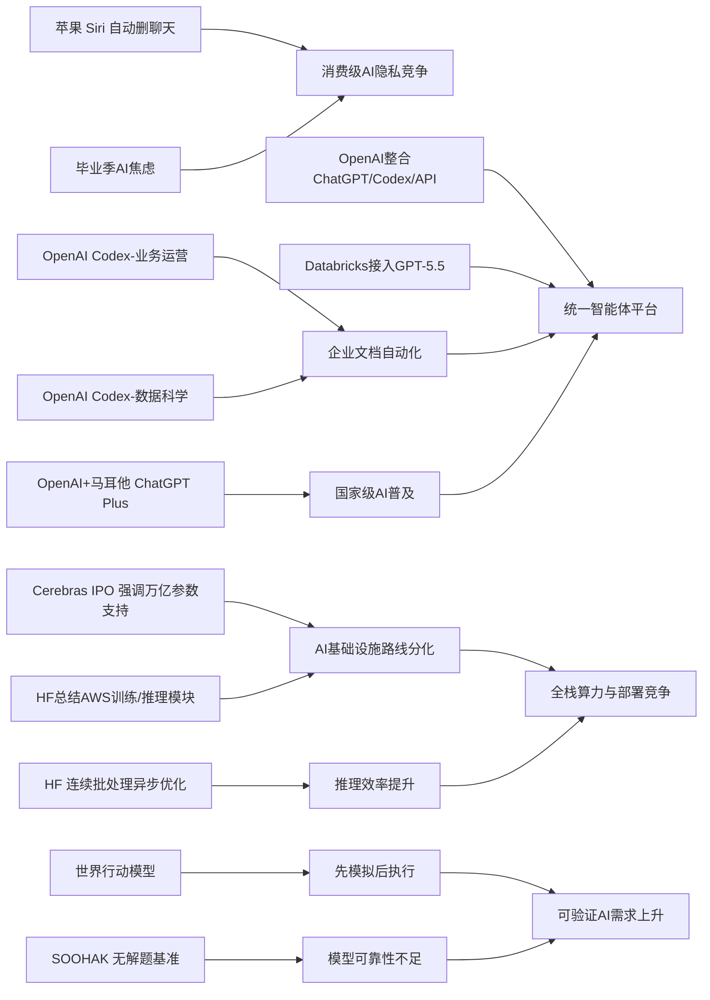

> AI 早报 · 每日早读 · 全网深度聚合

## **今日摘要**

苹果、OpenAI 和 Cerebras 的最新动态显示，AI 产品与基础设施正在同时推进：苹果强调 Siri 隐私保护，OpenAI 展示 Codex 在业务运营中的文档整理价值，Cerebras 则借 IPO 强调其硬件可支持超大模型。  
前沿研究与企业应用方面，世界行动模型让机器人具备“先模拟后行动”的能力，而 Databricks 引入 GPT-5.5，进一步推动企业智能体在复杂流程中的落地。  
与此同时，行业正走向更强整合与更复杂的社会讨论：OpenAI 正统一产品团队押注“智能体未来”，而公众对 AI 的态度也从单纯乐观转向对就业与替代风险的现实焦虑。

### 🔵 产品与功能更新

1. **苹果新版 Siri 或加入聊天自动删除。**
苹果正在准备新版 Siri，把“隐私保护”作为核心卖点之一，其中可能包括聊天记录自动删除功能。对普通用户来说，这意味着与语音助手的互动可以减少长期留存带来的顾虑。若功能最终上线，苹果有望继续把“本地处理”和“少留痕”作为其 AI 产品差异化方向。🚀  
[苹果Siri隐私新动向(briefing)](https://techcrunch.com/2026/05/17/apples-siri-revamp-could-include-auto-deleting-chats/)

2. **OpenAI 展示 Codex 在业务运营团队中的用法。**
OpenAI 发布案例，说明业务运营团队如何使用 Codex（代码与文档智能助手）生成项目简报、战略更新、管理层决策材料和进度汇报。重点不只是“写得更快”，而是把零散工作输入整理成可直接沟通的正式文档。对企业用户来说，这类能力有助于减少重复整理信息的时间。🚀  
[Codex运营团队用法(briefing)](https://openai.com/academy/codex-for-work/how-business-operations-teams-use-codex)

3. **Cerebras 借 IPO 强调可支持超大模型。**
Cerebras 因启动 IPO（首次公开募股）受到关注，公司高管强调其硬件路线并不只适合“小模型”。其首席财务官表示，平台能够服务万亿参数模型，并提到包括 OpenAI 内部 5.4、5.5 版本模型在内的大规模需求。对市场而言，这是在为其“不同于主流 GPU（图形处理器）路线”的定位争取更强认可。🚀  
[Cerebras上市与大模型(briefing)](https://news.smol.ai/issues/26-05-15-not-much/)

### 🟢 前沿研究

1. **世界行动模型让机器人先“脑补后行动”。**
世界行动模型（World Action Models）试图解决机器人只会“看图配动作”、却不理解后果的问题。相关综述梳理了近百篇论文，指出这类模型能先模拟动作会带来什么结果，再决定是否执行。更重要的是，它们还可以利用日常视频学习，而不必依赖大量带机器人动作标注的数据。🚀  
[机器人先模拟再行动(briefing)](https://the-decoder.com/world-action-models-give-robots-the-ability-to-simulate-consequences-before-they-move/)

2. **Databricks 将 GPT-5.5 引入企业智能体流程。**
Databricks 宣布在企业智能体（Agent，可自动执行多步任务的 AI 系统）工作流中采用 GPT-5.5。官方提到，该模型在 OfficeQA Pro 基准测试中创下新最好成绩，这为其进入企业办公与流程自动化场景提供了依据。对企业客户来说，重点在于更稳定地处理复杂问答、资料整合和流程协作任务。🚀  
[GPT5.5进入企业流程(briefing)](https://openai.com/index/databricks)

### 🟡 行业展望与社会影响

1. **OpenAI 整合产品团队，押注“智能体未来”。**
OpenAI 正把 ChatGPT、Codex 和开发者 API（应用接口）整合进统一产品团队，由 Codex 负责人 Thibault Sottiaux 领导。报道显示，其目标是打造一个“超级应用”，并进一步整合 Atlas 浏览器。联合创始人 Greg Brockman 也正式接手产品战略，显示公司正在加快统一产品与智能体布局。🚀  
[OpenAI产品线大整合(briefing)](https://the-decoder.com/greg-brockman-consolidates-openais-product-teams-to-build-an-agentic-future/)

2. **毕业演讲谈 AI，正变得越来越难打动人。**
TechCrunch 文章指出，在 2026 年的毕业季语境里，AI 已不再天然代表“令人兴奋的未来”。相反，许多毕业生面对的是就业焦虑、岗位变化和被自动化替代的担忧。这个现象说明，AI 的社会叙事正在从“技术乐观”转向更复杂的现实讨论。🚀  
[毕业季里的AI焦虑(briefing)](https://techcrunch.com/2026/05/17/if-youre-giving-a-commencement-speech-in-2026-maybe-dont-mention-ai/)

3. **OpenAI 展示 Codex 在数据科学团队中的应用。**
OpenAI 介绍了数据科学团队如何用 Codex 生成根因分析简报、影响评估、KPI 备忘录和仪表盘规范。这里的价值不只在建模，而在把分析过程转成业务团队能直接使用的表达方式。对组织来说，这意味着 AI 正逐步进入“分析到沟通”的完整链路。🚀  
[Codex数据团队用法(briefing)](https://openai.com/academy/codex-for-work/how-data-science-teams-use-codex)

### 🟣 开源TOP项目

1. **英国政府数字服务部门评论 NHS 退出开源。**
Simon Willison 转引了 GDS（英国政府数字服务部门）对 NHS（英国国家医疗服务体系）减少开源采用的回应。这个话题虽然不聚焦某个具体模型，但涉及公共部门在软件治理、透明度和长期可维护性上的选择。对开源社区而言，公共机构是否持续支持开源，往往会影响生态活力与协作方式。🚀  
[英国公共部门谈开源(briefing)](https://simonwillison.net/2026/May/17/gds-weighs-in/#atom-everything)

2. **Hugging Face 介绍连续批处理的异步优化。**
这篇文章讨论如何在 continuous batching（连续批处理）中释放 asynchronicity（异步能力），以提升推理（模型生成结果）效率。简单说，就是让系统更灵活地安排不同请求，不必所有任务都“排队同步走”。对开源推理系统开发者来说，这关系到吞吐量、延迟和硬件利用率。🚀  
[异步连续批处理解析(briefing)](https://huggingface.co/blog/continuous_async)

### 🔴 社媒分享

1. **新数学基准发现：模型会自信解答“无解题”。**
一个由 64 位数学家参与的团队推出 SOOHAK 基准测试，共含 439 道手写题，其中 99 道被故意设计为无解。结果显示，模型在“做题”上可因更多算力而变强，但在承认“这题无解”方面并没有同步提升。这对普通用户是个重要提醒：AI 的流畅回答不等于答案一定成立。🚀  
[AI会自信答无解题(briefing)](https://the-decoder.com/new-math-benchmark-reveals-ai-models-confidently-solve-problems-that-have-no-solution/)

2. **OpenAI 与马耳他合作，向全民提供 ChatGPT Plus。**
OpenAI 宣布与马耳他合作，推动更广泛的 AI 使用，让当地公民获得 ChatGPT Plus，并配套相关培训。除了提高可及性，这项合作也强调“负责任使用 AI”和实用技能建设。它反映出国家层面的 AI 普及，正在从试点转向更系统化推广。🚀  
[马耳他全民ChatGPT计划(briefing)](https://openai.com/index/malta-chatgpt-plus-partnership)

3. **Hugging Face 总结 AWS 上大模型训练与推理基础模块。**
这篇文章梳理了在 AWS（亚马逊云）上进行基础模型训练与推理所需的关键构件。内容聚焦底层能力搭建，帮助团队理解从训练到部署需要哪些核心模块协同工作。对关注云上 AI 基础设施的人来说，这是一份较实用的框架型参考。🚀  
[AWS大模型基础模块(briefing)](https://huggingface.co/blog/amazon/foundation-model-building-blocks)

---

📊 行业洞察

1. 事实  
   苹果准备在新版 Siri 中加入聊天记录自动删除，并继续强化“本地处理”与“少留痕”；与此同时，毕业季舆论显示，公众对 AI 的情绪正从技术乐观转向就业焦虑与被替代担忧。  
   【洞察】AI 产品竞争正在从“能力更强”转向“可信任体验更强”。隐私保护、数据最小化（Data Minimization，尽量少收集和少保留数据）和可控留痕，正成为面向消费级 AI 的关键差异化卖点。谁能把高能力与低风险叙事打包，谁更可能在大众市场取得长期心智优势。

2. 事实  
   OpenAI 展示 Codex 在业务运营团队和数据科学团队中的应用，可生成简报、管理材料、根因分析和 KPI 备忘录；同时，OpenAI 正整合 ChatGPT、Codex 与开发者 API（应用程序接口）进入统一产品团队，Databricks 也已将 GPT-5.5 接入企业智能体工作流。  
   【洞察】企业 AI 正从“单点提效工具”升级为“统一智能体工作台”（Agent Workspace，可执行多步任务的协同系统）。其核心价值不再只是生成内容，而是打通“分析—整理—决策—汇报”的完整链路。这意味着未来企业采购重点会从模型参数表现，转向工作流集成、权限治理和跨团队协作能力。

3. 事实  
   Cerebras 借 IPO 强调其硬件可支持万亿参数模型，试图强化“不同于主流 GPU 路线”的定位；Hugging Face 则分别讨论了连续批处理中的异步优化，以及 AWS 上大模型训练与推理的关键基础模块。  
   【洞察】AI 基础设施竞争已进入“全栈效率”阶段：上游是芯片架构分化（如非 GPU 路线），中游是云资源与训练/推理编排（Orchestration，任务调度协同），下游是推理效率优化。市场不会只奖励“更大算力”，而会奖励“单位成本下更高吞吐、更低延迟、更易部署”的系统性方案。

4. 事实  
   世界行动模型让机器人能够先模拟后果再行动，并可利用日常视频学习；另一方面，SOOHAK 数学基准显示，模型即便算力增强，仍会自信回答“无解题”，在识别不可解问题上没有同步改善。  
   【洞察】AI 正从“会生成答案”走向“会验证后果”，但可靠性仍是落地瓶颈。无论是机器人还是知识工作场景，下一阶段竞争焦点都将是可验证性（Verifiability，可检查结论是否成立）与不确定性表达能力，而不是单纯提升输出流畅度。能把“先模拟、再执行、会承认不知道”做好的系统，更适合进入高风险业务场景。

🗺️ 今日关系图

