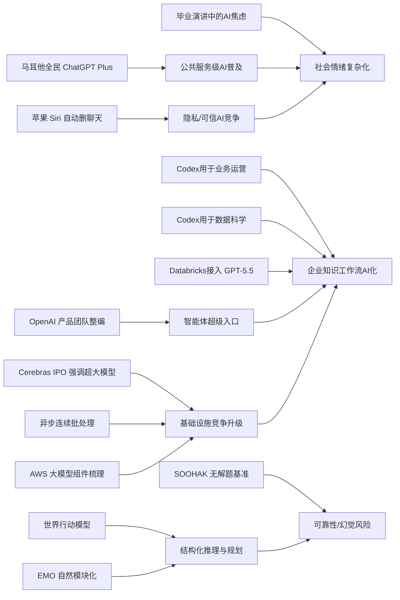

> AI 早报 · 每日早读 · 全网深度聚合

## **今日摘要**

本周动态显示，AI 产品竞争正在从“更强能力”转向“更可信、可落地、可整合”，例如苹果新版 Siri 强调隐私自动删除、OpenAI 用 Codex 进入运营协作流程、Databricks 将 GPT-5.5 接入企业智能体工作流。  
同时，底层技术与研究也在加速推进，既包括 Cerebras 借 IPO 强调对超大模型的支撑能力，也包括让机器人“先预演再行动”的世界行动模型，以及探索专家混合模型自然模块化的 EMO 研究。  
整体来看，行业正朝着一个更统一的“智能体未来”演进：AI 不再只是聊天或单点工具，而是在产品、基础设施和组织层面被整合为更完整的工作与决策入口。

### 🔵 产品与功能更新

1. **苹果新版 Siri 或加入聊天自动删除。**
苹果准备发布新一代 Siri，隐私保护会成为核心卖点之一，其中可能包含聊天记录自动删除功能。对普通用户来说，这意味着和语音助手的互动不必长期留存，敏感内容管理会更省心。若该功能正式落地，也反映出 AI 助手竞争正在从“更聪明”转向“更可信”。🚀
[苹果Siri隐私更新(briefing)](https://techcrunch.com/2026/05/17/apples-siri-revamp-could-include-auto-deleting-chats/)

2. **OpenAI 展示运营团队如何使用 Codex。**
OpenAI 发布案例，说明业务运营团队如何用 Codex（代码与文档助手）整理项目简报、战略更新、管理层决策材料和进度汇报。重点不是写代码，而是把真实工作输入快速转成结构化文档。对于非技术岗位，这说明 AI 工具正逐步进入日常协作和管理流程。🚀
[运营团队用Codex(briefing)](https://openai.com/academy/codex-for-work/how-business-operations-teams-use-codex)

3. **Cerebras 借 IPO 强调可支持超大模型。**
Cerebras 因启动 IPO（首次公开募股）受到关注，这家以不同于主流路线的 AI 芯片公司，正借机强化自身技术定位。其高管表示，公司不仅能服务小模型，也能支撑万亿参数级模型，包括文中提到的 OpenAI 内部 5.4 和 5.5 模型。对市场而言，这释放出一个信号：AI 基础设施竞争仍有新玩家在挑战英伟达式主流方案。🚀
[Cerebras上市看点(briefing)](https://news.smol.ai/issues/26-05-15-not-much/)

### 🟢 前沿研究

1. **世界行动模型让机器人先“预演”再动作。**
“世界行动模型”是一类让机器人在行动前先模拟后果的研究方向，目标是补上机器人只会“看图学动作”、却不真正理解环境变化的短板。相关综述整理了近百篇论文，并指出这类模型还能从普通日常视频中学习，不一定依赖昂贵的机器人标注数据。简单说，就是让机器人更像“先想后做”，而不是“边试边错”。🚀
[机器人预演新模型(briefing)](https://the-decoder.com/world-action-models-give-robots-the-ability-to-simulate-consequences-before-they-move/)

2. **Databricks 将 GPT-5.5 引入企业智能体工作流。**
Databricks 宣布在企业智能体（可自动执行多步任务的 AI 系统）工作流中使用 GPT-5.5。官方提到，该模型在 OfficeQA Pro 基准测试中刷新了当前最好成绩，这也是其进入企业场景的重要依据。对企业用户来说，这类整合意味着 AI 不只是聊天工具，而是开始承担更完整的办公和流程任务。🚀
[企业接入GPT5.5(briefing)](https://openai.com/index/databricks)

3. **EMO 研究探索专家混合模型的“自然模块化”。**
EMO 关注的是 Mixture of Experts（专家混合模型，一种把任务分给不同“子模型”的架构）在预训练阶段如何形成更清晰的功能分工。它试图让模型内部出现“涌现式模块化”，也就是无需人工硬编码，就能自然长出不同能力模块。这类研究的潜在价值，在于未来模型可能更高效、更容易扩展，也更便于控制资源消耗。🚀
[EMO模块化研究(briefing)](https://huggingface.co/blog/allenai/emo)

### 🟡 行业展望与社会影响

1. **OpenAI 合并产品团队，押注“智能体未来”。**
OpenAI 正把 ChatGPT、Codex 和开发者 API 合并进一个统一产品团队，希望朝“超级应用”方向推进，并整合 Atlas 浏览器。联合创始人 Greg Brockman 也将正式接手产品战略。这个调整说明，OpenAI 不再把聊天、编程、开发平台分开看，而是要把它们整合成一个更完整的 AI 入口。🚀
[OpenAI产品整编(briefing)](https://the-decoder.com/greg-brockman-consolidates-openais-product-teams-to-build-an-agentic-future/)

2. **毕业演讲谈 AI，可能越来越难激励年轻人。**
这篇文章指出，在 2026 年的毕业演讲里，AI 已不再天然代表希望与机会，反而可能引发焦虑。原因在于，很多毕业生担心未来工作会被自动化、职业路径会被重塑。它反映出一个更广泛的社会情绪：AI 的公众叙事正在从“兴奋”转向“复杂”。🚀
[毕业演讲与AI焦虑(briefing)](https://techcrunch.com/2026/05/17/if-youre-giving-a-commencement-speech-in-2026-maybe-dont-mention-ai/)

3. **OpenAI 展示数据科学团队如何使用 Codex。**
OpenAI 介绍了数据科学团队使用 Codex 的方式，包括生成问题归因简报、影响分析、KPI 备忘录和仪表盘需求说明。这里强调的是把零散分析工作转成更可复用的流程，而不仅是提高写代码速度。对企业而言，这类工具正在改变知识工作者的协作方式。🚀
[数科团队用Codex(briefing)](https://openai.com/academy/codex-for-work/how-data-science-teams-use-codex)

### 🟣 开源TOP项目

1. **英国政府数字服务部门评论 NHS 远离开源。**
这则内容围绕英国 NHS（国家医疗服务体系）在开源策略上的退缩，以及英国政府数字服务部门的相关回应。它触及一个长期争议：公共部门到底应更依赖开放技术，还是回到封闭供应商体系。对开源社区而言，这类政策信号往往会影响采购、协作和技术透明度。🚀
[NHS开源争议回应(briefing)](https://simonwillison.net/2026/May/17/gds-weighs-in/#atom-everything)

2. **连续批处理的异步化优化推理效率。**
这篇 Hugging Face 文章讨论 continuous batching（连续批处理）中的异步机制，目标是提升模型推理（模型生成答案的过程）效率。简单理解，就是让系统更聪明地安排请求处理顺序，减少资源空转。对开源部署者来说，这直接关系到服务成本、响应速度和并发能力。🚀
[异步批处理优化(briefing)](https://huggingface.co/blog/continuous_async)

3. **AWS 上大模型训练与推理的基础组件梳理。**
文章介绍了在 AWS（亚马逊云）上进行基础模型训练和推理所需的关键组件与搭建思路。它更像一份“积木清单”，帮助团队理解从算力、存储到部署流程的整体拼装方式。对于计划自建 AI 能力的组织，这是偏实用的基础设施参考。🚀
[AWS大模型组件(briefing)](https://huggingface.co/blog/amazon/foundation-model-building-blocks)

### 🔴 社媒分享

1. **新数学基准发现：AI 会自信解答“无解题”。**
SOOHAK 是由 64 位数学家共同设计的新基准测试，包含 439 道手写题，其中 99 道故意设置为无解。结果显示，模型算力变强后，做题能力会提升，但识别“这题根本没答案”的能力并没有同步改善。这暴露出一个很现实的问题：AI 不只是会出错，更可能“自信地出错”。🚀
[AI自信解无解题(briefing)](https://the-decoder.com/new-math-benchmark-reveals-ai-models-confidently-solve-problems-that-have-no-solution/)

2. **OpenAI 与马耳他合作向全民提供 ChatGPT Plus。**
OpenAI 宣布与马耳他合作，向当地所有公民提供 ChatGPT Plus，并配套培训资源，帮助公众掌握实用 AI 技能与负责任使用方式。这类国家级合作显示，AI 普及正从企业采购走向公共服务层面。它也可能成为其他国家观察和效仿的样板。🚀
[马耳他全民用Plus(briefing)](https://openai.com/index/malta-chatgpt-plus-partnership)

3. **Warelay 更名为 OpenClaw。**
这则分享主要是项目名称更新：Warelay 改名为 OpenClaw。虽然信息量不大，但对持续关注相关开源项目的人来说，名称变化会影响后续检索、文档查找和社区识别。类似动态常见于项目品牌重塑或定位调整阶段。🚀
[Warelay改名动态(briefing)](https://simonwillison.net/2026/May/16/openclaw-names/#atom-everything)

---

📊 行业洞察

1. 事实  
   - 苹果准备在新版 Siri 中加入聊天自动删除，强化隐私保护。  
   - OpenAI 正合并 ChatGPT、Codex、开发者 API 等产品团队，押注“智能体未来”。  
  【洞察】AI 助手竞争维度正在从单纯比拼能力，转向“能力 + 信任”的双重竞争。苹果用隐私做差异化，OpenAI 用统一入口和智能体（Agent，可自主执行多步任务的系统）生态做护城河，说明下一阶段的核心不是谁回答更聪明，而是谁能同时解决“能不能做”“敢不敢用”“愿不愿长期托付”三件事。

2. 事实  
   - OpenAI 展示业务运营团队使用 Codex 生成项目简报、战略更新和管理材料。  
   - OpenAI 展示数据科学团队使用 Codex 生成归因分析、KPI 备忘录和仪表盘需求。  
   - Databricks 将 GPT-5.5 引入企业智能体工作流。  
  【洞察】企业级 AI 的落地重点，正从“个人提效工具”升级为“流程操作系统”。Codex 已经不再局限于代码生成，而是在运营、数据、汇报、决策支持等知识工作链条中承担“结构化中间层”角色；Databricks 的接入则说明，大模型正在嵌入企业工作流（Workflow，流程化任务系统）而非停留在聊天界面。未来企业采购 AI，评估标准会更多转向流程嵌入深度、跨部门复用率和治理能力。

3. 事实  
   - Cerebras 借 IPO 强调其可支持万亿参数级模型，挑战英伟达主流路线。  
   - Hugging Face 讨论连续批处理异步化以提升推理效率。  
   - AWS 基础模型训练与推理组件文章梳理了自建 AI 能力所需基础设施。  
  【洞察】AI 基础设施竞争正在从“买到 GPU（图形处理器）就行”走向“全栈效率优化”。一方面，Cerebras 试图在训练侧用差异化芯片架构切入高端模型市场；另一方面，异步连续批处理和云上组件化部署表明，推理侧和平台侧的工程效率正成为成本胜负手。行业将越来越重视“芯片 + 调度 + 云架构 + 推理优化”的系统性能力，而非单点算力指标。

4. 事实  
   - 世界行动模型让机器人先模拟后执行，可从普通视频中学习。  
   - EMO 研究探索专家混合模型（Mixture of Experts，按任务分配不同子模型的架构）的自然模块化。  
   - SOOHAK 数学基准显示，AI 面对无解题时仍容易“自信出错”。  
  【洞察】前沿研究主线正在从“扩大模型规模”转向“提升结构化推理与可靠性”。无论是机器人中的世界模型（World Model，对环境后果进行内部模拟的模型），还是 MoE（专家混合）中的模块化分工，本质都在解决模型如何更好地规划、拆分任务和控制错误；而“无解题也自信回答”的结果则提醒行业，若没有更强的自我校验与不确定性表达机制，模型能力提升未必能同步转化为可信度提升。

🗺️ 今日关系图

