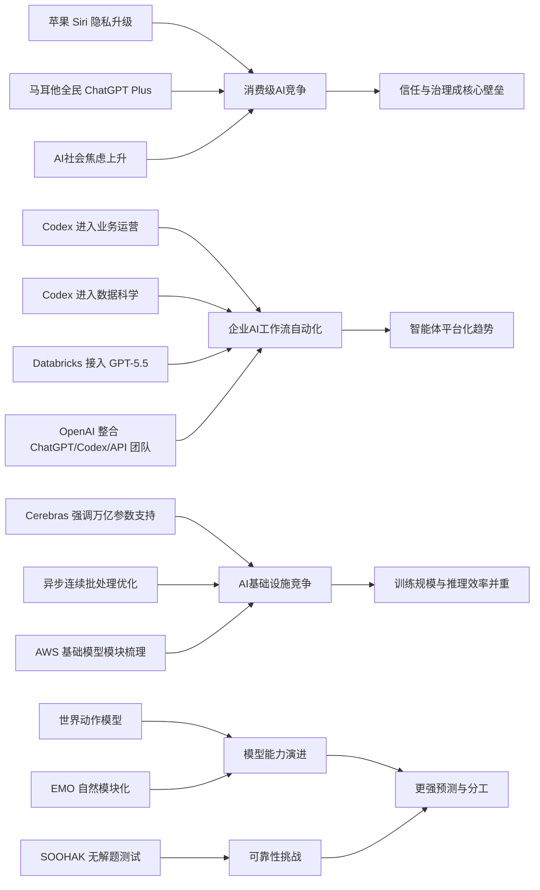

> AI 早报 · 每日早读 · 全网深度聚合

## **今日摘要**

本期信息显示，AI 产品竞争正从“更聪明”转向“更安全、更实用、更平台化”：苹果强调 Siri 隐私与聊天自动删除，OpenAI 展示 Codex 在业务运营中的办公价值，并整合产品团队押注智能体生态。  
同时，底层能力与企业落地都在升级，Cerebras 借 IPO 强调可支撑万亿参数模型，Databricks 将 GPT-5.5 引入企业智能体流程，说明大模型正加速进入核心业务自动化。  
在研究层面，机器人“世界动作模型”和 EMO 等工作表明，AI 正朝着先模拟后行动、以及更自然模块化分工的方向发展，未来有望带来更高效、更可控的系统。

### 🔵 产品与功能更新

1. **苹果新版 Siri 或加入聊天自动删除。**  
苹果准备发布新版 Siri（语音助手），隐私会成为这次升级的核心主题。报道提到，新功能可能包含聊天记录自动删除，进一步减少用户对数据长期留存的担忧🚀。这说明 AI 助手的竞争，正在从“更聪明”转向“更安全、更可控”。  
[苹果Siri隐私更新(briefing)](https://techcrunch.com/2026/05/17/apples-siri-revamp-could-include-auto-deleting-chats/)

2. **OpenAI 展示 Codex 在业务运营团队中的用法。**  
OpenAI 发布案例，说明业务运营团队如何使用 Codex（代码与文档协作助手）生成项目简报、战略更新、管理层决策材料和进度汇报🚀。重点不是写代码，而是把真实工作输入快速整理成结构化输出。对非技术岗位来说，这类工具正在变成日常办公助手。  
[Codex赋能业务运营(briefing)](https://openai.com/academy/codex-for-work/how-business-operations-teams-use-codex)

3. **Cerebras 借 IPO 强调可服务万亿参数模型。**  
Cerebras 借上市（IPO，首次公开募股）机会再次强调，其硬件不仅适合小模型，也能支撑万亿参数级别的大模型训练与推理🚀。公司高管还提到可支持 OpenAI 的内部大模型版本，回应市场对其能力边界的质疑。这让 AI 基础设施赛道的竞争，继续从“谁更省钱”扩展到“谁能撑起更大模型”。  
[Cerebras上市看点(briefing)](https://news.smol.ai/issues/26-05-15-not-much/)

### 🟢 前沿研究

1. **世界动作模型让机器人先“想后动”。**  
“世界动作模型”（World Action Models）试图补上机器人 AI 的一个短板：不仅学会动作和画面的对应关系，还能预测动作会怎样改变世界🚀。相关综述梳理了约一百篇论文，并指出这类模型还能利用普通视频学习，而不一定依赖带机器人动作标注的数据。对机器人来说，这相当于先在脑中“模拟后果”，再决定怎么行动。  
[机器人先模拟后行动(briefing)](https://the-decoder.com/world-action-models-give-robots-the-ability-to-simulate-consequences-before-they-move/)

2. **Databricks 将 GPT-5.5 引入企业智能体流程。**  
Databricks 宣布在企业“智能体工作流”（agent workflows，指可自动完成多步任务的 AI 流程）中使用 GPT-5.5🚀。官方提到，该模型在 OfficeQA Pro 基准测试中创下新成绩，因此被用于更复杂的企业任务编排。这个动作显示，大模型正从聊天工具进一步进入企业自动化主流程。  
[企业智能体接入GPT-5.5(briefing)](https://openai.com/index/databricks)

3. **EMO 研究探索专家混合模型的自然模块化。**  
EMO 是一项关于“专家混合模型”（Mixture of Experts，一种把任务分给不同子模型处理的架构）的预训练研究🚀。它关注的是，模型能否在训练过程中自然形成更清晰的模块分工，而不是靠人工硬性设计。对普通读者来说，这关系到未来模型是否能更高效、更擅长不同类型任务。  
[EMO模块化研究(briefing)](https://huggingface.co/blog/allenai/emo)

### 🟡 行业展望与社会影响

1. **OpenAI 合并产品团队，押注“智能体未来”。**  
OpenAI 正把 ChatGPT、Codex 以及开发者 API 团队整合到一个统一产品团队中，由 Codex 负责人领导🚀。报道还提到，公司希望打造一个更像“超级应用”的产品形态，并整合 Atlas 浏览器。这个调整说明，大模型公司正在从单点产品转向更完整的平台生态。  
[OpenAI整合产品线(briefing)](https://the-decoder.com/greg-brockman-consolidates-openais-product-teams-to-build-an-agentic-future/)

2. **毕业演讲谈 AI，正在变得越来越难打动人。**  
TechCrunch 认为，在 2026 年的毕业演讲里谈 AI，未必还能激发年轻人的期待🚀。原因在于，许多毕业生面对的不是技术浪漫想象，而是对就业、创造力和未来角色的真实焦虑。这反映出，AI 的社会叙事正在从“兴奋感”走向“复杂情绪”。  
[毕业演讲里的AI焦虑(briefing)](https://techcrunch.com/2026/05/17/if-youre-giving-a-commencement-speech-in-2026-maybe-dont-mention-ai/)

3. **OpenAI 展示 Codex 在数据科学团队中的应用。**  
OpenAI 介绍了数据科学团队如何用 Codex 生成问题归因简报、影响分析、关键指标备忘录和仪表盘规范🚀。这说明 AI 工具开始进入分析工作的前中后环节，不只是帮助写脚本，还在帮助整理思路与表达结论。对企业来说，这类能力可能直接改变团队协作方式。  
[Codex用于数据科学(briefing)](https://openai.com/academy/codex-for-work/how-data-science-teams-use-codex)

### 🟣 开源TOP项目

1. **英国政府数字服务部门评论 NHS 远离开源。**  
这则条目聚焦英国 NHS（国家医疗服务体系）在开源软件上的策略变化，以及 GDS（政府数字服务部门）的相关回应🚀。虽然不是新项目发布，但它反映了公共部门对开源路线的重新评估。对开源社区来说，这类政策态度往往会影响采购、协作和长期生态建设。  
[英国公部门开源争议(briefing)](https://simonwillison.net/2026/May/17/gds-weighs-in/#atom-everything)

2. **连续批处理的异步化优化推理效率。**  
Hugging Face 这篇文章讨论“连续批处理”（continuous batching，一种让多个请求更高效共享算力的推理方式）如何进一步引入异步机制🚀。核心目标是提升模型推理吞吐量，并减少等待时间。对开发者和开源部署社区来说，这是把模型服务做得更快、更稳的重要方向。  
[异步连续批处理优化(briefing)](https://huggingface.co/blog/continuous_async)

### 🔴 社媒分享

1. **新数学基准发现：模型会自信解答“无解题”。**  
SOOHAK 是一个由 64 位数学家设计的新基准测试，包含 439 道手写题，其中 99 道故意设置为无解🚀。结果显示，模型在“做题”上会因更多算力而提升，但在承认“这题没答案”方面并没有明显进步。这再次提醒我们，模型的自信表达不等于真正理解。  
[AI自信答无解题(briefing)](https://the-decoder.com/new-math-benchmark-reveals-ai-models-confidently-solve-problems-that-have-no-solution/)

2. **OpenAI 与马耳他合作，向全民提供 ChatGPT Plus。**  
OpenAI 与马耳他达成合作，将向当地公民提供 ChatGPT Plus，并配套 AI 培训资源🚀。项目目标不仅是扩大工具使用范围，也强调“负责任地使用 AI”。这类国家级合作，意味着 AI 普及正在从个人订阅走向公共服务模式。  
[马耳他全民用Plus(briefing)](https://openai.com/index/malta-chatgpt-plus-partnership)

3. **AWS 上的大模型训练与推理基础模块被系统梳理。**  
Hugging Face 发布文章，总结在 AWS（亚马逊云）上进行基础模型训练与推理的关键构建模块🚀。内容覆盖从训练到部署的主要环节，帮助团队更系统地理解云端 AI 基础设施。对关注落地的人来说，这类总结很适合作为能力地图来参考。  
[AWS大模型基础模块(briefing)](https://huggingface.co/blog/amazon/foundation-model-building-blocks)

---

📊 行业洞察

1. 事实  
   苹果准备在新版 Siri（语音助手）中加入聊天记录自动删除；同时，OpenAI 与马耳他合作，向全民提供 ChatGPT Plus，并强调“负责任使用 AI”；毕业演讲相关讨论也显示，公众对 AI 的情绪正从兴奋转向焦虑与审慎。  
   【洞察】AI 竞争重心正从“能力炫技”转向“信任基础设施”建设。隐私保护、数据留存控制、责任使用培训，正在成为消费级 AI 渗透的前置条件。未来面向大众市场的产品，不仅要比拼模型效果，也要比拼治理能力（governance，治理机制）与社会接受度。

2. 事实  
   OpenAI 展示 Codex（代码与文档协作助手）在业务运营团队和数据科学团队中的使用场景；Databricks 将 GPT-5.5 接入企业智能体工作流（agent workflows，可自动完成多步任务的 AI 流程）；OpenAI 还整合 ChatGPT、Codex 与开发者 API 团队，押注“智能体未来”。  
   【洞察】企业 AI 已从“聊天问答”升级到“流程编排 + 组织协同”阶段。价值正在从单次生成内容，迁移到把真实业务输入转化为可执行、可汇报、可追踪的工作流。这意味着下一轮竞争不只看模型参数，而看谁能打通产品层（应用入口）、模型层（推理能力）和流程层（任务闭环）的平台化能力。

3. 事实  
   Cerebras 借 IPO 强调可支撑万亿参数模型训练与推理；Hugging Face 讨论异步连续批处理（continuous batching，一种提升推理吞吐的服务方式）优化推理效率；同时还系统梳理 AWS（亚马逊云）上的基础模型训练与推理模块。  
   【洞察】AI 基础设施竞争进入“规模上限 + 服务效率”双线并进阶段。上游芯片与系统厂商强调能否承载更大模型，下游部署生态则聚焦吞吐、延迟和成本优化。行业正在形成一条更清晰的价值链：训练能力决定天花板，推理工程决定商业化地板，二者缺一不可。

4. 事实  
   世界动作模型（World Action Models，可预测动作如何改变环境的模型）推动机器人“先模拟后行动”；EMO 探索专家混合模型（Mixture of Experts，多子模型分工架构）的自然模块化；与此同时，新数学基准 SOOHAK 显示模型仍会自信回答“无解题”。  
   【洞察】前沿研究正在朝“更会分工、更会预判”的方向演进，但模型可靠性仍是核心短板。一边是模块化、可模拟的能力增强，另一边是对“不知道”和“无解”的识别不足。未来高价值 AI 系统的关键，不只是更强推理，还包括不确定性管理（uncertainty management，对错误边界的识别与控制）。

🗺️ 今日关系图

