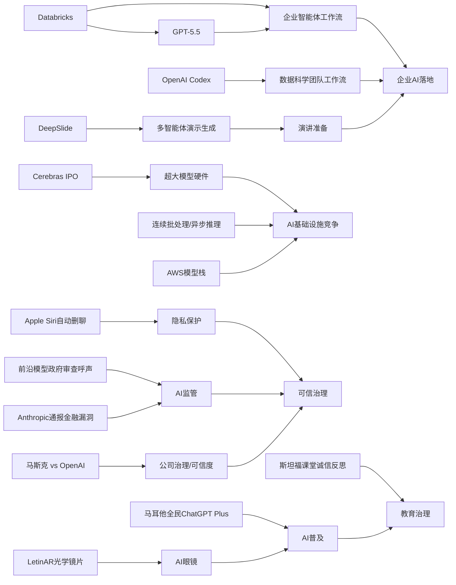

---
linkTitle: "05-18 AI资讯"
title: "AI资讯日报 2026/5/18"
weight: 18
breadcrumbs: false
comments: false
description: "## **今日摘要**  AI日报主要聚焦三类动态：产品层面上，Databricks将GPT-5.5接入企业智能体流程、LetinAR研发AI眼镜核心光学部件、Cerebras借IPO强化超大模型硬件能力叙事。   研究与应用层面，Deep..."

> AI 早报 · 每日早读 · 全网深度聚合

## **今日摘要**

AI日报主要聚焦三类动态：产品层面上，Databricks将GPT-5.5接入企业智能体流程、LetinAR研发AI眼镜核心光学部件、Cerebras借IPO强化超大模型硬件能力叙事。  
研究与应用层面，DeepSlide尝试让AI同时完成PPT制作与演讲准备，Codex展示了AI在数据科学团队中的真实工作流价值，而斯坦福学生的反思则指出ChatGPT正在改变课堂诚信边界。  
行业与社会层面，美国保守派团体开始呼吁政府审查前沿AI模型，马斯克与OpenAI诉讼也把AI公司的治理与可信度问题推到台前。

# AI日报

### 🔵 产品与功能更新

1. **Databricks把GPT-5.5接入企业智能体流程。**  
Databricks宣布在企业级智能体（Agent，指能自动执行多步任务的AI助手）工作流中使用GPT-5.5。官方提到，该模型在OfficeQA Pro基准测试中刷新了成绩，因此被用于更复杂的办公与企业任务。对企业用户来说，这意味着AI更适合处理跨文档、跨流程的协同工作。🚀  
[企业流程升级解读briefing](https://openai.com/index/databricks)

2. **韩国LetinAR押注AI眼镜核心光学部件。**  
TechCrunch报道，韩国创业公司LetinAR正在研发适配AI眼镜的小型光学镜片。其镜片尺寸接近指甲盖大小，但有机会成为下一代AI眼镜的重要显示基础。相比只做整机的厂商，LetinAR更像是在补足“看得见信息”的关键底层能力。🚀  
[AI眼镜光学观察briefing](https://techcrunch.com/2026/05/18/south-koreas-letinar-is-building-the-optics-behind-ai-glasses/)

3. **Cerebras借IPO强化超大模型硬件叙事。**  
在“not much happened today”这期汇总中，Cerebras因启动IPO（首次公开募股）受到关注。公司高管强调，其硬件不仅能支持小模型，也能服务万亿参数模型（参数可理解为模型规模与能力的重要指标），并提到已承载OpenAI内部相关模型。对市场来说，这是在AI算力竞争中再次释放“能跑更大模型”的信号。🚀  
[Cerebras近况速览briefing](https://news.smol.ai/issues/26-05-15-not-much/)

### 🟢 前沿研究

1. **DeepSlide尝试把做PPT与演讲准备一起交给AI。**  
这篇arXiv论文提出DeepSlide，一个“人在回路中”（human-in-the-loop，指人持续参与关键决策）的多智能体系统。它不只生成看起来像样的幻灯片，还试图帮助用户处理节奏、叙事和演讲准备。研究重点从“做出一份PPT”转向“把一次展示讲好”。🚀  
[演示生成研究briefing](https://arxiv.org/abs/2605.15202)

2. **斯坦福学生反思ChatGPT如何改变课堂诚信。**  
The Decoder援引一名斯坦福学生的文章，讨论ChatGPT如何影响其毕业班的学习与作业文化。作者认为，AI把原本就存在的“轻度作弊”倾向进一步推向常态化。这个案例提醒人们，AI研究不只关乎能力提升，也关乎教育场景中的行为边界。🚀  
[课堂诚信反思briefing](https://the-decoder.com/a-stanford-student-reflects-on-his-chatgpt-class-and-a-culture-of-just-a-little-bit-of-fraud/)

3. **Codex展示数据科学团队的实际用法。**  
OpenAI分享了数据科学团队如何使用Codex的案例，包括根因分析简报、影响评估、KPI备忘录和仪表盘规范等。这里的重点不是“会不会写代码”，而是AI如何把真实工作输入转成结构化输出。对非技术团队来说，这也展示了AI协助分析工作的落地方式。🚀  
[数据团队用法briefing](https://openai.com/academy/codex-for-work/how-data-science-teams-use-codex)

### 🟡 行业展望与社会影响

1. **美国保守派团体呼吁政府审查前沿AI模型。**  
The Decoder报道，一个由保守派组织组成的联盟公开致信特朗普，要求通过行政命令强制前沿AI模型上线前进行安全测试。所谓前沿模型，一般指能力最强、潜在影响也最大的AI系统。这说明AI监管已不再只是科技界议题，而在美国政治光谱内部形成更广泛讨论。🚀  
[监管呼声追踪briefing](https://the-decoder.com/maga-aligned-groups-want-government-oversight-of-frontier-ai-models/)

2. **马斯克与OpenAI官司的核心之一是“可信度”。**  
TechCrunch指出，在马斯克与OpenAI相关审理的最后阶段，一个重要主题是OpenAI CEO Sam Altman是否值得信任。案件不只是法律争议，也牵动外界对AI公司治理、承诺与转型过程的判断。对于行业而言，信任正在成为和技术能力同样关键的竞争维度。🚀  
[审判焦点梳理briefing](https://techcrunch.com/2026/05/17/why-trust-is-a-big-question-at-the-elon-musk-openai-trial/)

3. **苹果新版Siri或加入自动删除聊天功能。**  
TechCrunch称，苹果即将发布的新版本Siri可能把隐私作为重点，其中包括自动删除聊天记录的设计。对普通用户来说，这类功能直接回应了“AI助手会保存我多少信息”的担忧。隐私保护正在从附加卖点，变成AI产品竞争的基础配置。🚀  
[苹果隐私新动向briefing](https://techcrunch.com/2026/05/17/apples-siri-revamp-could-include-auto-deleting-chats/)

### 🟣 开源TOP项目

1. **Hugging Face解析连续批处理中的异步能力。**  
这篇Hugging Face文章讨论如何在continuous batching（连续批处理，指把不同用户请求持续拼接处理）中释放asynchronicity（异步性，指任务无需同步等待）。核心价值在于提升模型推理（Inference，指模型实际回答问题的运行过程）效率。对于部署开源大模型的团队来说，这是影响成本和响应速度的重要方向。🚀  
[推理提效解读briefing](https://huggingface.co/blog/continuous_async)

2. **英国政府数字部门发声讨论NHS撤离开源。**  
Simon Willison转引了英国政府数字服务部门（GDS）对NHS从开源软件退回的评论。虽然这不是新项目发布，但它直接触及公共部门是否继续采用开源的现实问题。对开源社区而言，这类政策与采购取向往往比单个项目更能影响生态走向。🚀  
[开源政策观察briefing](https://simonwillison.net/2026/May/17/gds-weighs-in/#atom-everything)

3. **Anthropic将向全球金融监管者通报AI发现的网络漏洞。**  
The Decoder报道，Anthropic计划向主要财政部门和央行说明其模型Claude Mythos Preview发现的金融系统网络安全弱点。虽然这更偏行业事件，但也反映出先进模型在安全研究中的潜在新角色。AI不再只是聊天工具，也开始被视为发现系统性风险的辅助力量。🚀  
[安全通报动态briefing](https://the-decoder.com/anthropic-to-brief-global-financial-regulators-on-cyber-flaws-found-by-claude-mythos/)

### 🔴 社媒分享

1. **AI创业公司收入达800亿美元但高度集中。**  
The Decoder援引The Information分析称，头部AI创业公司总收入已达800亿美元，但其中89%被Anthropic和OpenAI拿走。这个数字在社交媒体上很容易引发讨论，因为它一方面显示市场爆发，另一方面也说明行业集中度极高。热度背后，大家真正关心的是后来者还有多少生存空间。🚀  
[收入格局速看briefing](https://the-decoder.com/ai-startup-revenue-hits-80-billion-but-anthropic-and-openai-take-almost-all-of-it/)

2. **OpenAI与马耳他合作向全民提供ChatGPT Plus。**  
OpenAI宣布与马耳他合作，向当地公民提供ChatGPT Plus，并配套培训资源。重点不仅是扩大使用权限，也包括帮助公众建立实际应用能力和负责任使用意识。它像是一次“国家级AI普及实验”，因此具备较强传播性。🚀  
[全民AI合作briefing](https://openai.com/index/malta-chatgpt-plus-partnership)

3. **AWS上的大模型训练与推理组件被系统梳理。**  
Hugging Face发布文章，介绍在AWS上进行基础模型训练与推理的关键构件。内容覆盖从训练到部署所需的基础能力，适合关注云上AI基础设施的人快速理解全景。对社媒讨论而言，这类“平台能力地图”通常很容易被转发收藏。🚀  
[AWS模型栈概览briefing](https://huggingface.co/blog/amazon/foundation-model-building-blocks)

📊 行业洞察

1. 事实  
   Databricks把GPT-5.5接入企业级智能体（Agent，能自动执行多步任务的AI助手）流程；OpenAI又展示了Codex在数据科学团队中的实际工作流用法，覆盖根因分析、KPI备忘录、仪表盘规范等结构化任务；同时，DeepSlide论文把“做PPT”扩展到“辅助完整演讲准备”的多智能体（Multi-Agent，多个AI角色协作）流程。  
   【洞察】判断：企业AI正从“单点生成内容”走向“嵌入真实工作流的任务编排层”。竞争焦点不再只是模型会不会回答问题，而是谁能把跨文档、跨角色、跨流程的协同链条产品化。这意味着B端（企业端）价值将更多沉淀在工作流集成、权限管理和结果可审计（Auditability，可追溯核查）能力上，而不是单一模型调用。

2. 事实  
   Cerebras借IPO强化“可支撑万亿参数模型”的硬件叙事；Hugging Face讨论continuous batching（连续批处理，持续拼接不同请求统一推理）中的asynchronicity（异步性，无需同步等待）以提升Inference（推理，模型实际运行回答）效率；Hugging Face还系统梳理了AWS上的训练与推理组件。  
   【洞察】判断：AI基础设施竞争已进入“算力规模 + 推理效率 + 云平台栈”三线并进阶段。上游硬件厂商讲的是“能训更大模型”，中游优化讲的是“更便宜、更快地服务更多请求”，云平台讲的是“从训练到部署的一站式栈控制权”。未来行业壁垒将不仅来自芯片性能，还来自软硬协同（Hardware-Software Co-design，硬件与软件联合优化）和平台分发能力。

3. 事实  
   苹果新版Siri或加入自动删除聊天功能；美国保守派团体呼吁政府对前沿AI模型上线前强制安全测试；马斯克与OpenAI官司的争议焦点之一是Sam Altman是否值得信任；Anthropic还计划向全球金融监管者通报AI发现的网络漏洞。  
   【洞察】判断：AI行业的核心竞争维度正在从“能力领先”扩展为“可信治理（Trust & Governance，信任与治理）领先”。隐私删除、安全评测、公司治理、外部监管沟通，本质上都在回答同一个问题：谁能证明自己不仅强大，而且可控、可信、可被问责。未来面向政府、金融、医疗等高敏感场景，治理能力可能成为比模型分数更重要的准入门槛。

4. 事实  
   LetinAR押注AI眼镜核心光学部件；OpenAI与马耳他合作向全民提供ChatGPT Plus及培训资源；斯坦福学生反思ChatGPT正在改变课堂诚信文化。  
   【洞察】判断：AI普及正在同时沿“新硬件入口”与“社会制度重塑”两条路径推进。一方面，AI眼镜等终端试图把助手从手机内迁移到视野前方；另一方面，全民订阅、教育渗透也在让AI从工具变成基础能力设施。但伴随渗透率上升，教育诚信、使用边界、数字素养（Digital Literacy，理解并正确使用数字技术的能力）将成为决定普及质量的关键变量。

🗺️ 今日关系图

