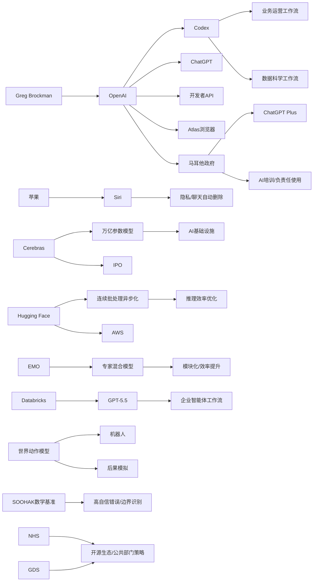

> AI 早报 · 每日早读 · 全网深度聚合

## **今日摘要**

苹果和 OpenAI 这轮更新都在把 AI 从“单点功能”推向更贴近日常协作的产品形态：前者强调隐私体验，后者则让 Codex、ChatGPT 和 API 更深地进入运营与企业工作流。  
同时，底层能力竞争也在加速，一边是 Cerebras 借 IPO 强调其支撑超大模型的基础设施实力，另一边是 Databricks 接入 GPT-5.5、EMO 探索专家混合模块化，显示模型性能、效率与可扩展性仍是核心战场。  
在研究与行业趋势上，世界动作模型让机器人具备“先模拟后行动”的能力，而 OpenAI 整合产品团队押注智能体未来，则说明 AI 正从更强模型进一步走向更强自主协作与平台整合。

### 🔵 产品与功能更新

1. **苹果新版 Siri 或加入聊天自动删除。**  
苹果正在为新版 Siri 强化“隐私”卖点，其中一个可能的新功能是聊天内容自动删除。这意味着用户与语音助手的对话记录，未来可能不再长期保留，更贴近“少留痕”的使用体验。对普通用户来说，这类更新重点不在更聪明，而在更安心，尤其适合对个人信息敏感的人群。🚀  
[苹果隐私新Siri简报(briefing)](https://techcrunch.com/2026/05/17/apples-siri-revamp-could-include-auto-deleting-chats/)

2. **OpenAI 展示运营团队如何使用 Codex。**  
OpenAI 发布了面向业务运营团队的 Codex 使用案例，覆盖项目简报、战略更新、管理层决策材料和进度汇报等日常工作。这里的 Codex 可以理解为面向工作流的 AI 编码与文档助手，不只是写代码，也能整理真实业务输入。对企业用户而言，这说明 AI 正在从“辅助创作”走向“参与协作流程”。🚀  
[运营团队用Codex指南(briefing)](https://openai.com/academy/codex-for-work/how-business-operations-teams-use-codex)

3. **Cerebras 借 IPO 再次强调超大模型承载能力。**  
Cerebras 因首次公开募股（IPO，企业上市融资）受到关注，公司高管特别强调其硬件不仅支持小模型，也能服务万亿参数级模型。报道还提到其可承载 OpenAI 内部更大规模模型，回应外界对其定位的质疑。对市场来说，这不只是融资新闻，也是在为“AI 基础设施”竞争重新定调。🚀  
[Cerebras上市观察(briefing)](https://news.smol.ai/issues/26-05-15-not-much/)

### 🟢 前沿研究

1. **世界动作模型让机器人先“脑补后行动”。**  
世界动作模型（World Action Models）试图补上机器人 AI 的一个关键短板：不仅学会“怎么动”，还要理解“动了之后世界会怎么变”。相关综述梳理了近百篇论文，指出这类方法的一大优势是可以利用日常视频学习，而不一定依赖机器人动作标注。简单说，就是让机器人先在“心里模拟后果”，再决定是否执行动作。🚀  
[机器人世界模型综述(briefing)](https://the-decoder.com/world-action-models-give-robots-the-ability-to-simulate-consequences-before-they-move/)

2. **Databricks 将 GPT-5.5 引入企业智能体工作流。**  
Databricks 宣布在企业智能体（Agent，可自动执行任务的软件助手）工作流中采用 GPT-5.5。OpenAI 提到，该模型在 OfficeQA Pro 基准测试中刷新了最佳成绩，这也是企业落地采用的重要依据。对企业客户来说，这代表更强模型正进一步进入办公、分析与自动协作场景。🚀  
[Databricks接入GPT-5.5(briefing)](https://openai.com/index/databricks)

3. **EMO 尝试用“专家混合”训练出更强模块化能力。**  
EMO 是一项围绕专家混合模型（Mixture of Experts，可把任务分给不同“子模型”处理）的研究与实践分享，核心目标是让模型在预训练阶段自然形成更清晰的模块分工。所谓“涌现模块化”，可以理解为模型内部逐步出现更专门的能力分区。这样的方向有助于提升大模型的效率与可扩展性。🚀  
[EMO研究解读速览(briefing)](https://huggingface.co/blog/allenai/emo)

### 🟡 行业展望与社会影响

1. **OpenAI 合并产品团队，押注“智能体未来”。**  
OpenAI 正把 ChatGPT、Codex 和开发者 API 团队整合到一个统一产品团队中，并计划与 Atlas 浏览器进一步联动。报道显示，OpenAI 联合创始人 Greg Brockman 将正式接手产品战略，目标是打造更像“超级应用”的 AI 产品形态。对行业来说，这反映出头部公司正在从单点工具转向平台化整合。🚀  
[OpenAI产品整合动向(briefing)](https://the-decoder.com/greg-brockman-consolidates-openais-product-teams-to-build-an-agentic-future/)

2. **毕业演讲谈 AI，年轻人未必买账。**  
TechCrunch 这篇评论指出，在 2026 年的毕业演讲里反复谈 AI，可能并不能真正激励毕业生。原因在于，很多年轻人感受到的不是机会，而是职业不确定性与被替代焦虑。这也提醒行业：AI 叙事若只讲宏大前景，而忽视现实担忧，公众共鸣会越来越弱。🚀  
[毕业演讲与AI焦虑(briefing)](https://techcrunch.com/2026/05/17/if-youre-giving-a-commencement-speech-in-2026-maybe-dont-mention-ai/)

3. **OpenAI 发布数据科学团队使用 Codex 的方法。**  
OpenAI 展示了数据科学团队如何用 Codex 生成问题归因简报、影响分析、KPI 备忘录和仪表盘规格说明。这里的重点不是单次问答，而是把真实工作输入整理为可执行成果。对企业组织而言，这说明 AI 正越来越多承担分析协作中的“第一稿生产者”角色。🚀  
[数据科学用Codex案例(briefing)](https://openai.com/academy/codex-for-work/how-data-science-teams-use-codex)

### 🟣 开源TOP项目

1. **英国政府数字服务机构发声，关注 NHS 远离开源。**  
这则内容聚焦英国 NHS（国家医疗服务体系）在开源软件上的收缩选择，并引用了 GDS（政府数字服务机构）的相关回应。事件本身并非单一技术发布，而是关于公共部门如何看待开源生态的现实讨论。对开源社区来说，这种政策层面的取舍，往往比一次项目更新更能影响长期走向。🚀  
[英国公共部门开源争议(briefing)](https://simonwillison.net/2026/May/17/gds-weighs-in/#atom-everything)

2. **连续批处理的异步化，有望提升推理效率。**  
Hugging Face 介绍了如何在连续批处理（continuous batching，一种提升模型服务吞吐量的方法）中释放异步能力。简化理解，就是让模型在处理多路请求时减少等待、提升并行效率。对于部署大模型服务的团队来说，这类底层优化直接关系到速度、成本和用户体验。🚀  
[异步批处理优化解读(briefing)](https://huggingface.co/blog/continuous_async)

### 🔴 社媒分享

1. **新数学基准发现：AI 会自信解答“无解题”。**  
一个由 64 位数学家参与构建的新基准 SOOHAK，包含 439 道手写题，其中 99 道被故意设计成无解。结果显示，模型算力越强，不一定越会承认“这题没有答案”，反而可能更自信地给出错误解法。这个现象很适合社媒传播，因为它直观揭示了 AI“会答”不等于“会判断边界”。🚀  
[AI无解题翻车基准(briefing)](https://the-decoder.com/new-math-benchmark-reveals-ai-models-confidently-solve-problems-that-have-no-solution/)

2. **OpenAI 与马耳他合作，向全民提供 ChatGPT Plus。**  
OpenAI 宣布与马耳他合作，为当地居民提供 ChatGPT Plus 与相关培训，目标是提升全民 AI 使用能力与负责任使用意识。这类合作不只是产品推广，也是在尝试“国家级 AI 普及”模式。社交平台上，这种“一个国家全员可用高级 AI 服务”的消息很容易引发讨论。🚀  
[马耳他全民Plus计划(briefing)](https://openai.com/index/malta-chatgpt-plus-partnership)

3. **AWS 上的基础模型训练与推理组件被系统梳理。**  
Hugging Face 发布内容，介绍在 AWS（亚马逊云）上进行基础模型训练与推理所需的关键构件。它更像一份“搭积木指南”，帮助团队理解从训练到部署各环节需要哪些能力。对于关注云上 AI 基础设施的人来说，这类材料兼具传播性和实用性。🚀  
[AWS模型构建指南(briefing)](https://huggingface.co/blog/amazon/foundation-model-building-blocks)

---

📊 行业洞察

1. 事实  
   OpenAI 一方面将 ChatGPT、Codex 和开发者 API 团队整合为统一产品团队，并明确押注“智能体未来”；另一方面又连续发布业务运营团队、数据科学团队使用 Codex 的案例，覆盖简报、分析、决策材料、KPI 备忘录和仪表盘规格说明等真实工作流。Databricks 也宣布在企业智能体工作流中采用 GPT-5.5。  
   【洞察】头部厂商正在把 AI 从“单点对话工具”升级为“组织级工作操作系统”。这里的竞争核心，已不只是模型能力，而是产品整合、工作流嵌入和企业分发能力；未来企业采购会更看重“能否接入现有协作流程”，而非单次问答效果。

2. 事实  
   苹果计划为新版 Siri 加入聊天自动删除，强化隐私卖点；与此同时，毕业演讲中反复谈 AI 引发年轻人反感的评论显示，公众对 AI 的真实感受正从“兴奋”转向“焦虑与怀疑”。另外，OpenAI 与马耳他合作向全民提供 ChatGPT Plus 和培训，强调“负责任使用”。  
   【洞察】AI 普及正在进入“信任竞争”阶段。无论是消费级助手还是国家级推广，用户是否愿意持续使用，越来越取决于隐私保护、可控性与社会叙事，而不只是模型更强。未来品牌分化，可能首先体现在“谁更值得托付数据与决策”。

3. 事实  
   Cerebras 借 IPO 强调其硬件可承载万亿参数级模型；Hugging Face 则分别梳理了 AWS 上基础模型训练与推理组件，以及连续批处理异步化带来的推理效率提升；EMO 研究继续推进专家混合模型（Mixture of Experts，一种按任务分配不同子模型的架构）的模块化与效率优势。  
   【洞察】AI 基础设施竞争已从“拼算力规模”转向“拼系统效率”。上层模型继续变大，但真正决定商业可行性的，是芯片承载能力、云上部署链路、推理吞吐优化以及模型架构节省成本的协同能力。未来赢家更可能是“软硬一体优化”平台，而非单一硬件或单一模型提供商。

4. 事实  
   世界动作模型（World Action Models，让机器人先模拟动作后果再执行）试图让机器人理解“行动如何改变世界”；而数学基准 SOOHAK 显示，模型即便更强，也可能对无解题给出自信但错误的答案。  
   【洞察】下一阶段 AI 进化重点，将从“生成答案”转向“校验后果与识别边界”。无论是机器人还是通用智能体，只有具备环境建模、结果预演和不确定性表达能力，才能真正进入高风险、强执行场景；否则“高自信幻觉”仍会是商业落地的核心障碍。

🗺️ 今日关系图

