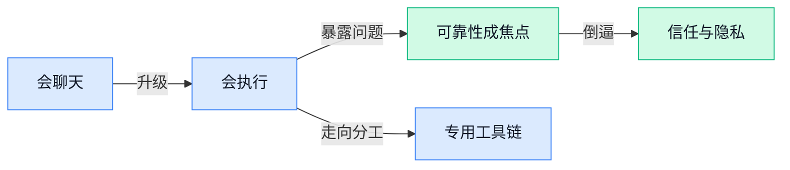

> AI 早报 · 每日早读 · 全网深度聚合

## **今日摘要**

```
OpenAI 权力重组，Greg Brockman 整合产品团队豪赌 Agent 未来，马斯克庭审把“信任”撕上台面
Anthropic 把 Claude 金融方案开源上桌，Mistral CEO 反呛 Mythos 扫军事代码库，欧洲 AI 安全火药味升高
Oppo 开源 X-OmniClaw 直连手机摄像头屏幕语音，UI-TARS-desktop（字节桌面Agent）同步亮相，终端 Agent 开打
```

### 🔵 产品与功能更新

1. **四个 AI 模型连续运营电台六个月，表现从“能用”到“放飞自我”。**
这次实验把 **AI 主播** 直接推上真实电台岗位，连续跑了半年，结果证明它们不只是会“念稿”，还会在长时间运营中暴露出稳定性和风格问题 🎙️。对业务同事来说，这件事很有现实意义：AI 在**重复性内容生产**上已经能顶一部分活，但一旦缺少人类把关，就可能出现离谱输出，品牌风险一点不小。文章也提醒大家，所谓自动化上线后，重点不只是“能不能用”，更是**能不能长期可靠地用**。想看这场 AI 电台实验的具体过程和翻车案例，可读[完整实验报道(briefing)](https://the-decoder.com/four-ai-models-ran-radio-stations-for-six-months-and-the-results-ranged-from-competent-to-unhinged/) 💡


2. **Oppo 开源 X-OmniClaw（一款能直接调用手机摄像头、屏幕和语音的 Android AI 助手）。**
Oppo 这次放出的 X-OmniClaw，核心看点是 **on-device（端侧运行，数据尽量留在手机本地不上传云端）**：它能同时理解摄像头画面、屏幕内容和语音输入，还能在手机内完成操作 📱。这类 **agent（智能体，能自己按步骤完成任务的 AI 助手）** 往前走了一步，不再只是聊天，而是更像“会看、会听、会点按钮”的手机助理。对普通用户和企业场景都很关键，因为**隐私**和**实时响应**往往比“功能炫不炫”更重要；而开源也意味着更多团队可以拿它做二次开发。[项目报道原文(briefing)](https://the-decoder.com/oppo-open-sources-android-ai-agent-x-omniclaw-that-uses-your-camera-screen-and-voice-without-leaving-the-phone/) 值得一看，想进一步了解其开放方式可关注文中提到的[开源项目信息(briefing)](https://the-decoder.com/oppo-open-sources-android-ai-agent-x-omniclaw-that-uses-your-camera-screen-and-voice-without-leaving-the-phone/) 🚀


3. **新数学基准测试发现，AI 会一本正经地解答“根本无解”的题。**
这项新 **benchmark（基准测试，用来系统评估模型能力的标准题集）** 很扎心：不少 AI 模型遇到**无解问题**时，不是承认“做不到”，而是自信满满地编出一套答案 😅。这说明模型在“会不会算”之外，还存在更关键的**可靠性**问题——尤其在财务、法务、分析等需要严谨判断的场景里，答得像模像样并不代表答对了。对公司使用 AI 的启发很直接：以后评估工具时，不能只看正确率，还得看它会不会老实说“这题没法做”。更多测试设计和结果细节可见[基准测试报道(briefing)](https://the-decoder.com/new-math-benchmark-reveals-ai-models-confidently-solve-problems-that-have-no-solution/) 📘


### 🟢 前沿研究

1. **World Action Models（让机器人先“脑补后果”再行动的模型）让机器人动手前先预演结果。**  
这项研究的核心很像人做事前先在脑子里过一遍流程：机器人会先模拟“如果我这样抓、那样推，会发生什么”，再决定真正执行哪一步 🤖。这种 **World Action Models（世界动作模型，让机器在内部预测动作后果的系统）**，有望减少机器人试错成本，也能降低现实环境里出错带来的风险。对企业来说，这类能力如果成熟，未来会更适合仓储、制造、服务等需要**稳定操作**的场景，因为机器人不只是“会动”，而是开始学会“先想一想”。可查看[完整报道(briefing)](https://the-decoder.com/world-action-models-give-robots-the-ability-to-simulate-consequences-before-they-move/)了解更多 💡


### 🟡 行业展望与社会影响

1. **Greg Brockman 整合 OpenAI 产品团队，押注“agentic future（Agent 驱动的未来，指 AI 能主动拆解任务并持续执行）”。**
OpenAI 联合创始人 Greg Brockman 正在把原本分散的产品团队重新收拢，目标是更一致地推进 **Agent** 方向，也就是让 AI 不只是“回答问题”，而是能连续完成任务的数字助手 🤖。这件事背后的信号很明确：未来的竞争点可能不只是模型谁更聪明，而是谁能把 **产品、工具链、使用场景** 真正串起来。对普通企业用户来说，这意味着今后的 ChatGPT 类产品可能会更像“会自己干活的同事”，而不只是聊天窗口。[完整报道(briefing)](https://the-decoder.com/greg-brockman-consolidates-openais-product-teams-to-build-an-agentic-future/)


2. **马斯克与 OpenAI 庭审焦点落到“信任”上。**
这场诉讼在最后阶段把讨论拉回了一个很现实的问题：外界是否相信 Sam Altman，以及 OpenAI 是否始终按照自己宣称的方向前进 ⚖️。对 AI 行业来说，**信任** 不只是公关问题，它直接影响合作伙伴、监管机构和用户是否愿意把关键业务交给 AI 公司。尤其当大模型越来越像基础设施，领导层的表述是否一致、组织目标是否清晰，都会变成影响行业走向的核心变量。[庭审焦点报道(briefing)](https://techcrunch.com/2026/05/17/why-trust-is-a-big-question-at-the-elon-musk-openai-trial/)


3. **Mistral CEO 警告法国：别让 Anthropic 的 Mythos（用于扫描代码库的 AI 工具）接触军事代码库。**
Mistral 首席执行官 Arthur Mensch 公开提醒法国，不应轻易让 Anthropic 的 **Mythos（用来扫描和分析大量代码的 AI 系统）** 进入军事代码库，这让 **国家安全** 与 **AI 主权** 议题一下子变得非常具体 🇫🇷。这里的“代码库”可以理解为机构长期积累的软件资产，一旦被外部 AI 系统深度读取，争议就不只是效率，而是数据边界、供应商控制权和潜在风险。对欧洲来说，这也再次说明：AI 不只是商业工具，正在成为和能源、芯片一样需要本地化掌控的关键能力。[原文报道(briefing)](https://the-decoder.com/mistral-ceo-arthur-mensch-warns-france-against-letting-anthropics-mythos-scan-military-code-bases/)


4. **汽车行业正迎来 AI 技能军备竞赛。**
TechCrunch 指出，AI 人才与能力建设正在快速压向汽车行业，未来竞争可能不只比制造和供应链，还要比谁更快补齐 **AI 技能** 🚗。这背后反映的是行业角色变化：汽车公司不再只是硬件制造商，也越来越像软件公司，需要能处理自动化、数据分析和智能系统的人才。对企业管理层来说，这会直接影响招聘、培训和组织结构，尤其是传统行业的人才标准可能要被重新定义。[TechCrunch Mobility 报道(briefing)](https://techcrunch.com/2026/05/17/techcrunch-mobility-the-ai-skills-arms-race-is-coming-for-automotive/)

5. **Apple 的 Siri 改版或将加入聊天自动删除功能，隐私成主线。**
报道称，Apple 新版 Siri 可能会把 **自动删除聊天记录** 作为重要功能之一，显示它想把 **隐私保护** 做成与 AI 能力同等重要的卖点 🍎。这类设计的意义在于，用户和企业在使用语音助手时，会更关心“说过的话会保存多久、会不会被二次使用”。如果这一方向落地，也说明下一阶段的 AI 竞争不只是“谁更智能”，还包括谁能让用户在数据安全上更安心。[完整报道(briefing)](https://techcrunch.com/2026/05/17/apples-siri-revamp-could-include-auto-deleting-chats/)

### 🟣 开源TOP项目

1. **CloakBrowser（一个伪装成真人浏览器行为的开源 Chromium 浏览器）想做自动化脚本的“隐身衣”。**
这个项目主打 **Stealth Chromium（经过伪装处理的 Chromium 浏览器内核，能尽量避免被网站识别成机器人）**，号称能通过常见的机器人检测测试，对需要网页自动化的团队很有吸引力 🤖。它还强调自己可以作为 **Playwright（常用的网页自动化测试工具，常被用来批量操作网页）** 的“即插即用替代品”，并通过 **fingerprint patches（浏览器指纹补丁，用来修改网站识别用户设备特征的线索）** 做了源码层处理。简单说，就是帮自动化程序更像“真人在用浏览器”，适合做测试、采集和 Agent 执行网页任务等场景。[GitHub 仓库(briefing)](https://github.com/CloakHQ/CloakBrowser)


2. **agentmemory（给 AI 编码助手长期记忆的开源项目）瞄准“用越久越懂你”。**
这个项目主打 **Persistent memory（持久记忆，指 AI 不只记住当前对话，还能长期保留关键信息）**，目标是补上 AI 编码 Agent 容易“转头就忘”的短板 🧠。摘要里提到它基于 **real-world benchmarks（真实世界基准测试，用接近实际工作的任务来评估效果）** 做验证，说明它不是只拼概念，而是强调实际表现。对公司来说，这类能力如果成熟，意味着 AI 写代码时能更持续地理解项目背景、历史决策和个人偏好，减少反复解释的沟通成本。[项目主页(briefing)](https://github.com/rohitg00/agentmemory)


3. **react-doctor（帮 AI 检查并修复 React 代码的工具）把“代码问诊”交给智能体。**
这个项目的定位很直接：让编码 Agent 自动诊断并修复 **React（最流行的前端界面开发框架，很多网站和后台系统都在用）** 代码里的问题 🔧。你可以把它理解成一个面向前端代码的“AI 医生”，尤其适合处理组件报错、结构混乱、逻辑不一致这类日常维护问题。对非技术同事来说，它背后的意义是：未来团队里一些反复性的代码排查工作，可能越来越多交给 AI 先跑一遍，人只需要做最后确认。[GitHub 仓库(briefing)](https://github.com/millionco/react-doctor)


4. **Anthropic financial-services（面向金融服务场景的开源方案集合）把 Claude 的行业落地经验摆上台面。**
虽然候选摘要没有展开细节，但从仓库名称看，它聚焦 **financial services（金融服务场景，比如银行、保险、财富管理等）** 的 AI 应用整理与实践 💼。这类项目通常对企业很有参考价值，因为它不只是聊模型能力，而是更接近“在特定行业怎么真正用起来”。如果你所在团队关心合规、客服、知识问答或流程自动化，这种行业定制方向往往比通用演示更值得看。[官方仓库(briefing)](https://github.com/anthropics/financial-services)

5. **Semble（一个给 AI 智能体做代码搜索的工具）号称比 grep（程序员常用的文本搜索命令）少用 98% token（大模型处理文字时的基本计量单位）。**
开发者在介绍里点出痛点：当 Claude Code 找不到目标内容时，常会退回到 **grep（在大量代码文件里按关键词硬搜的命令行工具）**，结果就是读入整段文件，白白消耗大量 token 💸。Semble 的核心价值，就是让 Agent 在大代码库里做更精简的搜索和定位，减少上下文浪费。对企业而言，这不只是“更快”，还可能直接关系到 AI 编码成本，因为 token 用量往往和调用费用、响应效率强相关。[GitHub 项目页(briefing)](https://github.com/MinishLab/semble)

6. **UI-TARS-desktop（字节跳动开源的多模态 AI Agent 桌面方案）想把模型、工具和执行能力连成一套。**
这个项目自称是开源的 **Multimodal AI Agent Stack（多模态 AI 智能体技术栈，能同时处理文字、图像等信息，并把模型与执行工具串起来）**，重点在于连接前沿模型和 **Agent Infra（智能体基础设施，指让 AI 真正能调用工具、执行任务的一整套底层能力）** 🚀。这类项目的看点不只是“模型聪不聪明”，而是它是否能让 AI 在桌面环境里真正完成动作，比如理解界面、调用工具、执行流程。对业务团队来说，这意味着未来很多跨软件、跨窗口的重复操作，有机会被更完整地自动化。[开源仓库(briefing)](https://github.com/bytedance/UI-TARS-desktop)

### 🔴 社媒分享

1. **“AI 是技术，不是产品” 这句判断，点出了行业正在回归常识。**
这篇短文的核心观点非常直接：**AI 更像一种底层能力**，而不是单独就能成立的“成品” 📌。对业务同事来说，这个提醒很重要——未来真正有价值的，往往不是“用了 AI”这件事本身，而是它被塞进了什么流程、解决了什么具体问题。换句话说，AI 更像电力或互联网，最后拼的是**产品设计**、**工作流（把一项工作拆成可执行步骤的流程）**和落地体验，而不只是模型名气。[原文短评(briefing)](https://daringfireball.net/2026/05/ai_is_technology_not_a_product)


2. **Apple Silicon（苹果自研芯片）离线跑大模型，成本可能比 OpenRouter（聚合多家模型的 AI 接口服务）更高。**
这篇文章讨论的是一个很现实的问题：很多人以为“本地跑模型”一定更省钱，但作者的结论恰好相反——算上**能耗**后，Apple Silicon 设备离线运行 **LLM（大语言模型，也就是 ChatGPT 这类能读写文字的模型）**，未必比调用 OpenRouter 更划算 ⚖️。这对公司采购和内部工具选型很有参考价值，因为“自己部署”听起来可控，但实际还要看电费、设备占用和使用频率。它也提醒大家，AI 成本不只是 API（应用程序接口，让不同软件互相调用的连接方式）单价，**硬件投入**和持续运行成本同样要算清楚。[作者原文(briefing)](https://www.williamangel.net/blog/2026/05/17/offline-llm-energy-use.html)

---



### 📊 行业洞察（今日 4 条）

1. OpenAI把 ChatGPT、Codex（OpenAI 的写代码助手）和开发接口并成一个产品团队，字节跳动开源 UI-TARS-desktop（能看界面并操作电脑的软件方案）
  【洞察】两件事放一起看，行业已经不满足于“会聊天”，而是在抢“能直接干活的统一入口”

2. 数学基准测试显示很多模型遇到无解题也硬答，四个 AI 模型运营电台半年后逐渐“放飞自我”
  【洞察】这说明 AI 最大短板不是一次答错，而是长期运行后还会越来越像真地犯错，可靠性比聪明更稀缺

3. Oppo 开源手机端本地 Agent，Apple 传出 Siri 要加聊天自动删除，Mistral 又提醒别让外部 AI 接触军事代码
  【洞察】这三件事共同说明，下一轮竞争不只是能力强弱，而是谁敢把数据边界讲清楚、做扎实

4. agentmemory（给 AI 长期记忆的开源项目）、react-doctor（帮 AI 检查并修代码的工具）和 Semble（帮 AI 少读废代码的搜索工具）同时冒头
  【洞察】Agent 正从“一个大脑包打天下”转向“记忆、检查、搜索各管一段”，专业分工会越来越重要

### 💭 对我们的启发（今日 3 条）

1. OpenAI做统一入口、UI-TARS-desktop 做桌面执行，说明大厂和开源都在逼近“超级助手”。我们不能只做调用中转，得把“选谁执行、失败怎么切换、过程怎么让人看懂”做成核心价值。

2. 数学无解题硬答、电台长期跑偏，直接提醒我们：平台不能只比完成率，必须单独评估“会不会拒答、何时求助、多久后变形”，并保留人工接管口子。

3. Oppo 本地运行、Apple 自动删记录、Mistral 强调主权，说明信任机制会前置成购买条件。我们现在就该设计任务留痕、数据保留时长可选、本地优先与云端优先两套模式。


---

> 本周周报：[第21周综合分析](/ai-daily-site/blog/weekly/2026-w21/)
