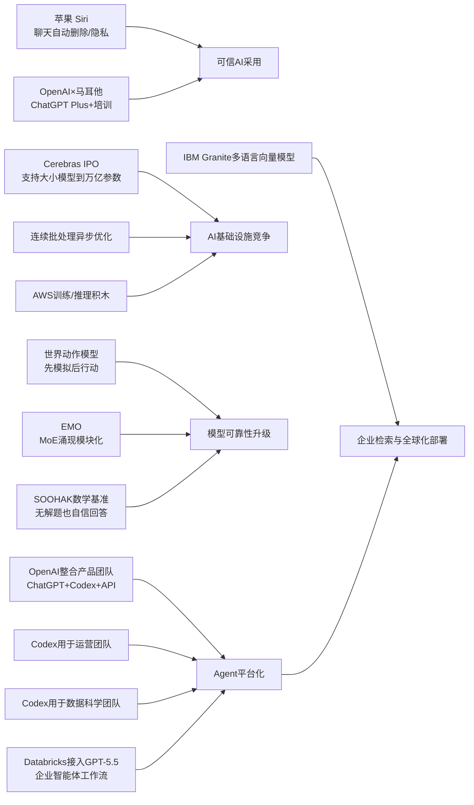

> AI 早报 · 每日早读 · 全网深度聚合

## **今日摘要**

苹果可能在新版 Siri 中加入聊天自动删除功能，强调把生成式 AI 能力与隐私保护结合；同时，OpenAI 展示了 Codex 已从写代码扩展到整理业务简报、决策材料等办公场景，Cerebras 则因 IPO 和其支持超大模型的硬件能力受到关注。  
在研究与企业应用层面，世界动作模型让机器人能先模拟动作后果再行动，Databricks 将 GPT-5.5 引入企业智能体流程，EMO 则探索专家混合模型是否能自然形成更清晰的功能分工。  
从行业趋势看，OpenAI 正整合 ChatGPT、Codex 和 API 团队押注“智能体超级应用”方向，而社会舆论对 AI 也变得更复杂——它不再只是创新象征，也越来越与就业压力和不确定性联系在一起。

### 🔵 产品与功能更新

1. **苹果新版 Siri 或加入聊天自动删除。**
新版 Siri 的一大主题会是“隐私”，其中可能包括对话自动删除功能。这个方向说明苹果希望把生成式 AI（可根据提示生成内容的人工智能）体验和本地隐私保护更紧密地结合。对普通用户来说，这类功能有助于减少敏感信息长期留存在设备或云端的担忧。若正式上线，Siri 的竞争点可能不只在“更聪明”，也在“更放心”🚀  
[查看Siri隐私更新](https://techcrunch.com/2026/05/17/apples-siri-revamp-could-include-auto-deleting-chats/)

2. **OpenAI 展示运营团队如何使用 Codex。**
OpenAI 介绍了业务运营团队使用 Codex（编程与任务协作助手）的多种方式。包括生成项目简报、战略更新、管理层决策材料和进度汇报等，把真实工作输入快速整理成结构化文档。对非技术岗位而言，这说明 AI 正在从“写代码”扩展到“整理业务信息”和“辅助管理沟通”🚀  
[了解Codex办公场景](https://openai.com/academy/codex-for-work/how-business-operations-teams-use-codex)

3. **Cerebras 以 IPO 成为今日焦点。**
Cerebras 因首次公开募股（IPO，企业上市融资）受到关注。公司高管强调，其硬件不仅能支持小模型，也能服务万亿参数模型（参数是模型内部用于学习的数字）。这一表态意在回应市场对其技术能力边界的质疑，也强化了它在 AI 基础设施赛道中的存在感🚀  
[查看Cerebras动态](https://news.smol.ai/issues/26-05-15-not-much/)

### 🟢 前沿研究

1. **世界动作模型让机器人先“脑补后行动”。**
世界动作模型（World Action Models）试图解决机器人“会动但不理解后果”的问题。与只学习“某个画面对应某个动作”不同，这类模型更关注动作会如何改变现实世界。研究综述指出，它们还能利用日常视频学习，而不必依赖大量人工标注的机器人动作数据，这对机器人训练成本是个重要突破🚀  
[读懂机器人新模型](https://the-decoder.com/world-action-models-give-robots-the-ability-to-simulate-consequences-before-they-move/)

2. **Databricks 将 GPT-5.5 引入企业智能体流程。**
Databricks 宣布在企业智能体（Agent，可自主完成多步任务的 AI 系统）工作流中使用 GPT-5.5。官方提到，该模型在 OfficeQA Pro 基准测试中取得了新的领先成绩。对企业用户来说，这意味着更复杂的文档处理、问答和流程协作任务，正被纳入更成熟的生产环境🚀  
[查看企业接入案例](https://openai.com/index/databricks)

3. **EMO 探索专家混合模型的“涌现模块化”。**
EMO 是一项关于专家混合模型（MoE，把任务分配给不同“专家”子模型处理）的预训练研究。其核心关注点是，模型是否能在训练过程中自然形成更清晰的功能分工，也就是“模块化”。如果这一方向成立，未来大模型可能在效率、可扩展性和任务专精上获得更好平衡🚀  
[了解EMO研究思路](https://huggingface.co/blog/allenai/emo)

### 🟡 行业展望与社会影响

1. **OpenAI 整合产品团队，押注“智能体未来”。**
OpenAI 正把 ChatGPT、Codex 和开发者 API（应用编程接口）整合到一个产品团队中。报道指出，其目标是打造一个“超级应用”，并可能进一步整合 Atlas 浏览器。这个动作显示出 OpenAI 不再只卖单点工具，而是希望把聊天、编程、开发与浏览等能力连接成统一入口🚀  
[查看团队整合解读](https://the-decoder.com/greg-brockman-consolidates-openais-product-teams-to-build-an-agentic-future/)

2. **毕业演讲谈 AI，正在变得越来越难。**
TechCrunch 文章指出，在 2026 年的毕业演讲里，AI 已不再天然代表“令人兴奋的未来”。对不少毕业生而言，AI 更像是就业焦虑、行业变化和不确定性的来源。这个现象说明，AI 的社会叙事正在从“乐观创新”转向“机会与压力并存”🚀  
[阅读社会情绪观察](https://techcrunch.com/2026/05/17/if-youre-giving-a-commencement-speech-in-2026-maybe-dont-mention-ai/)

3. **OpenAI 展示数据科学团队如何使用 Codex。**
OpenAI 介绍了数据科学团队使用 Codex 的典型流程，包括生成问题归因简报、影响分析、关键指标备忘录和仪表板规格说明。这里的重点不只是提高写作效率，而是帮助团队把分析工作更快转化为可执行沟通材料。对企业来说，这意味着 AI 正逐步嵌入分析到决策的完整链路🚀  
[查看数据团队案例](https://openai.com/academy/codex-for-work/how-data-science-teams-use-codex)

4. **IBM 推出多语言向量模型 Granite 新版本。**
Granite Embedding Multilingual R2 是 IBM 发布的开源多语言嵌入模型（把文本转成便于检索的数字表示）。其特点包括支持 32K 上下文（可处理更长文本）以及在较小参数规模下实现较好的检索质量。对全球化企业和多语种搜索场景来说，这类模型有助于降低部署成本并提升跨语言信息查找体验🚀  
[了解多语言模型](https://huggingface.co/blog/ibm-granite/granite-embedding-multilingual-r2)

### 🟣 开源TOP项目

1. **英国政府数字部门评论 NHS 退出开源。**
Simon Willison 转引了英国政府数字服务部门（GDS）对英国国家医疗服务体系（NHS）减少开源采用的看法。这个讨论反映出，开源软件（可公开查看、修改和分发代码的软件）在公共部门并不只是技术选择，也涉及治理、采购和长期可控性。对 AI 与软件生态而言，公共机构对开源的态度会持续影响产业方向🚀  
[查看开源政策讨论](https://simonwillison.net/2026/May/17/gds-weighs-in/#atom-everything)

2. **连续批处理的异步化能力被进一步释放。**
Hugging Face 介绍了如何在连续批处理（让多个请求持续共享计算资源的推理方式）中实现更强的异步能力。简单说，这项优化有助于提升模型推理（模型实际运行出结果的过程）的吞吐量和响应效率。对于需要同时服务大量用户的 AI 应用，这类底层优化会直接影响成本和体验🚀  
[了解推理效率优化](https://huggingface.co/blog/continuous_async)

### 🔴 社媒分享

1. **新数学基准显示：AI 会自信解答“无解题”。**
SOOHAK 是由 64 位数学家构建的新基准，包含 439 道手写题，其中 99 道被故意设计为无解。结果显示，模型算力增加后更擅长解题，却没有明显提升“承认题目无解”的能力。这揭示出当前 AI 一个很现实的问题：它可能答得流畅、自信，却未必知道自己什么时候该说“我不知道”🚀  
[查看数学基准结果](https://the-decoder.com/new-math-benchmark-reveals-ai-models-confidently-solve-problems-that-have-no-solution/)

2. **OpenAI 与马耳他合作，向全民提供 ChatGPT Plus。**
OpenAI 宣布与马耳他合作，推动更广泛的 AI 普及。计划包括向公民提供 ChatGPT Plus，以及配套培训，帮助大家学习如何负责任地使用 AI。这个案例说明，国家级 AI 普及正在从“讨论愿景”走向“直接给工具、给培训”的落地阶段🚀  
[查看马耳他合作](https://openai.com/index/malta-chatgpt-plus-partnership)

3. **AWS 上的大模型训练与推理积木被系统梳理。**
Hugging Face 发布文章，总结了在 AWS（亚马逊云）上进行基础模型训练和推理的关键构建模块。内容聚焦从训练到部署的基础设施拼装思路，帮助团队理解云平台如何支持大模型全流程。对于关注 AI 落地的人来说，这类材料能帮助看清“模型能力”背后的工程支撑🚀  
[了解AWS模型基建](https://huggingface.co/blog/amazon/foundation-model-building-blocks)

---

📊 行业洞察

1. 事实  
   苹果新版 Siri 可能加入聊天自动删除；OpenAI 与马耳他合作，向全民提供 ChatGPT Plus 并配套培训。  
   【洞察】AI 竞争正在从“模型能力”转向“可信采用体系”。一端是苹果用隐私默认项强化端侧/产品信任，另一端是 OpenAI 通过国家级普及与培训扩大使用基础，说明未来胜负不只取决于大模型（Large Language Model, LLM）本身，更取决于“隐私治理 + 用户教育 + 分发渠道”的组合能力。

2. 事实  
   OpenAI 将 ChatGPT、Codex 与开发者 API 整合进统一产品团队；同时展示了运营团队、数据科学团队使用 Codex 生成简报、分析备忘录和决策材料的流程；Databricks 也将 GPT-5.5 接入企业智能体工作流。  
   【洞察】企业 AI 正从“单点 Copilot（副驾驶式辅助）”升级为“流程级 Agent（智能体）平台”。这意味着 AI 不再只提升某个岗位的写作或编码效率，而是开始打通信息整理、分析、决策到执行的完整链路。对应的产业机会将更多落在工作流编排（Workflow Orchestration）、权限治理、企业知识接入和结果可审计性上。

3. 事实  
   Cerebras 因 IPO 受到关注，并强调可支持从小模型到万亿参数模型；Hugging Face 介绍连续批处理的异步化优化；AWS 上训练与推理基础设施积木被系统梳理。  
   【洞察】AI 基础设施赛道正在从“拼峰值算力”转向“拼全栈效率”。上游是专用算力芯片与训练系统，中游是云平台资源编排，下游是推理优化（Inference Optimization）与吞吐提升。资本市场关注 Cerebras，不只是看芯片故事，而是在押注谁能把训练、部署、推理成本曲线真正压下来。

4. 事实  
   世界动作模型让机器人先模拟后行动；EMO 研究专家混合模型的涌现模块化；SOOHAK 数学基准显示，模型更会解题，但仍不擅长承认“无解”。  
   【洞察】下一阶段模型演进的核心，不只是“更大”，而是“更会分工、更会预判、更知道边界”。无论是机器人中的世界模型（World Model）、MoE（专家混合模型）模块化，还是数学基准暴露出的不确定性表达缺陷，都说明行业正在从追求表面性能，转向追求结构化推理、可靠性和可控性。这会直接影响高风险场景中的模型选型标准。

🗺️ 今日关系图

