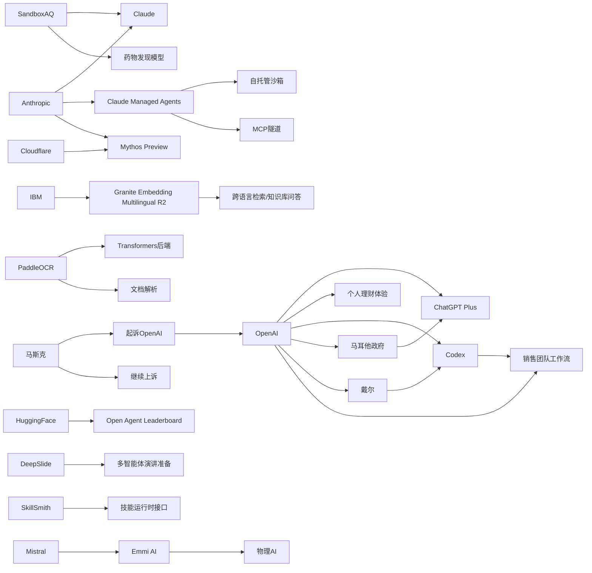

> AI 早报 · 每日早读 · 全网深度聚合

## **今日摘要**

本轮动态显示，AI产品正加速从“专家工具”走向“人人可用”的基础能力：例如SandboxAQ把药物发现模型接入Claude、OpenAI与马耳他合作推广ChatGPT Plus，IBM也发布了适合企业检索和知识库应用的多语言向量模型。  
同时，AI能力正进一步深入高价值、强场景的现实应用，包括Mistral通过收购物理AI公司切入工业与实体世界，ChatGPT试水个人理财助手，研究界也开始从“生成内容”转向“辅助完整任务流程”。  
在行业影响层面，AI已不仅提升效率，也开始承担更复杂的安全与决策支持角色，比如Cloudflare提到Anthropic模型能识别更完整的漏洞攻击链，反映出AI正在向更高信任度和更关键的应用环节渗透。

### 🔵 产品与功能更新

1. **SandboxAQ把药物发现模型带到Claude。**
SandboxAQ将其药物发现模型接入Claude，让研究人员不必具备高深计算背景，也能用自然语言探索分子设计与研发思路🚀  
这家公司的判断是，当前药物AI的核心门槛不只是模型能力，更是“能不能被更多人用起来”。  
这意味着专业科研工具正逐步从“少数专家的软件”变成“更多团队可直接对话使用的助手”。  
[药物模型接入Claude简报(briefing)](https://techcrunch.com/2026/05/18/sandboxaq-brings-its-drug-discovery-models-to-claude-no-phd-in-computing-required/)

2. **OpenAI与马耳他合作推广ChatGPT Plus。**
OpenAI宣布与马耳他合作，向全国公民推广ChatGPT Plus，并配套相关培训，帮助大家建立实用的AI使用能力🚀  
重点不只是发放产品权益，也包括如何负责任地使用AI。  
这类国家级合作显示，AI服务正从个人订阅工具，走向公共数字能力建设的一部分。  
[马耳他全民AI合作简报(briefing)](https://openai.com/index/malta-chatgpt-plus-partnership)

3. **IBM发布Granite多语言向量模型R2。**
IBM推出开源的Granite Embedding Multilingual R2，多语言向量模型（把文本转成便于检索的数字表示）支持32K长上下文🚀  
官方强调，它在小于1亿参数的体量下，检索质量表现突出。  
对企业和开发者来说，这类模型适合做跨语言搜索、知识库问答和内容匹配。  
[Granite多语检索简报(briefing)](https://huggingface.co/blog/ibm-granite/granite-embedding-multilingual-r2)

### 🟢 前沿研究

1. **Mistral AI收购物理AI初创公司Emmi AI。**
Mistral AI收购了来自维也纳的Emmi AI，希望扩展其面向欧洲工业客户的能力版图🚀  
所谓物理AI，通常指与机器人、制造设备或现实环境交互更紧密的智能系统。  
这笔收购说明，通用大模型公司正继续向工业场景和实体世界应用延伸。  
[Mistral收购物理AI简报(briefing)](https://the-decoder.com/mistral-ai-acquires-viennese-physical-ai-startup-emmi-ai/)

2. **ChatGPT上线个人理财新体验预览。**
OpenAI面向美国Pro用户预览新的个人理财体验，允许用户安全连接金融账户，并获得结合自身目标的AI建议🚀  
官方强调，这些分析和指导会建立在用户的财务背景、优先事项和目标之上。  
这标志着ChatGPT正从通用问答工具，进一步进入高信任度、强上下文的个人决策场景。  
[ChatGPT理财预览简报(briefing)](https://openai.com/index/personal-finance-chatgpt)

3. **DeepSlide关注“做PPT”之外的演讲交付。**
arXiv论文DeepSlide提出一个“人在回路中”（人类持续参与纠正与决策）的多智能体系统，用来支持完整的演讲准备流程🚀  
它不只生成看起来像样的幻灯片，还关注节奏、叙事以及演讲前准备。  
这反映出研究方向正从“生成成品”，转向“帮助人把事情真正讲好”。  
[DeepSlide研究简报(briefing)](https://arxiv.org/abs/2605.15202)

### 🟡 行业展望与社会影响

1. **Cloudflare称Anthropic安全模型发现更复杂漏洞链。**
Cloudflare表示，Anthropic面向安全的模型Mythos Preview在测试中发现了一些早期前沿模型未能识别的漏洞链🚀  
测试覆盖了Cloudflare自家的50多个代码仓库。  
这说明AI在网络安全场景中的价值，正从“找单点问题”走向“识别连锁攻击路径”。  
[安全模型漏洞测试简报(briefing)](https://the-decoder.com/cloudflare-says-anthropics-mythos-preview-finds-exploit-chains-that-earlier-frontier-models-missed/)

2. **马斯克起诉OpenAI案败诉。**
陪审团一致认定，马斯克针对Sam Altman和OpenAI的诉讼提交时间过晚，相关主张未获支持🚀  
这起案件长期牵动AI行业对公司治理、创始人关系与商业化路线的讨论。  
败诉结果意味着围绕OpenAI历史纠纷的一条重要法律战线暂时告一段落。  
[马斯克诉OpenAI败诉简报(briefing)](https://techcrunch.com/2026/05/18/elon-musk-has-lost-his-lawsuit-against-sam-altman-and-openai/)

3. **OpenAI展示销售团队如何使用Codex。**
OpenAI分享了销售团队使用Codex的多个场景，包括商机摘要、会议准备、销售预测复盘、客户计划和停滞交易诊断🚀  
Codex在这里扮演的是工作流助手，而不只是写代码工具。  
这反映出“代码代理”正在向更广泛的知识工作流程渗透。  
[销售团队用Codex简报(briefing)](https://openai.com/academy/codex-for-work/how-sales-teams-use-codex)

### 🟣 开源TOP项目

1. **PaddleOCR 3.5接入Transformers后端。**
PaddleOCR 3.5支持使用Transformers后端来运行OCR（光学字符识别）和文档解析任务🚀  
这让文档智能处理与当前主流大模型生态的结合更紧密。  
对于需要处理发票、表单、扫描件和长文档的团队，这会提升部署与扩展的灵活性。  
[PaddleOCR更新简报(briefing)](https://huggingface.co/blog/PaddlePaddle/paddleocr-transformers)

2. **Open Agent Leaderboard发布。**
Hugging Face博客介绍了Open Agent Leaderboard，用于评估开放式智能体（可自主调用工具完成任务的AI系统）表现🚀  
这类榜单有助于开发者更直观比较不同智能体方案的能力。  
随着智能体项目快速增加，公开、统一的测评框架正在变得越来越重要。  
[开放智能体榜单简报(briefing)](https://huggingface.co/blog/ibm-research/open-agent-leaderboard)

3. **Anthropic为Claude Managed Agents增加自托管沙箱。**
Anthropic为Claude Managed Agents加入自托管沙箱和MCP隧道，让企业可把工具执行放到自有基础设施中🚀  
沙箱可理解为受控隔离环境，MCP则是模型连接外部工具的一种协议方式。  
不过Anthropic并未把智能体本身的全部控制权交给客户，这显示企业级AI部署仍在安全与灵活之间寻找平衡。  
[Claude托管代理更新简报(briefing)](https://the-decoder.com/anthropic-adds-self-hosted-sandboxes-and-mcp-tunnels-to-claude-managed-agents/)

### 🔴 社媒分享

1. **马斯克将对OpenAI败诉结果提起上诉。**
在败诉之后，马斯克方面表示将继续上诉，并将裁决称为“日历技术性问题”🚀  
案件在舆论场上的热度并未因初审结果而结束，反而可能继续放大OpenAI相关争议。  
对外界来说，这起事件既是法律新闻，也是AI行业权力叙事的一部分。  
[马斯克上诉动态简报(briefing)](https://the-decoder.com/elon-musk-appeals-134-billion-openai-loss-calls-verdict-a-calendar-technicality/)

2. **OpenAI与戴尔合作推动企业版Codex部署。**
OpenAI与戴尔合作，把Codex带到混合部署（云与本地结合）和本地部署企业环境中🚀  
目标是帮助企业在更安全、可控的数据与流程条件下使用AI编程代理。  
这对监管要求高、数据敏感度强的大型组织尤其关键。  
[戴尔Codex合作简报(briefing)](https://openai.com/index/dell-codex-enterprise-partnership)

3. **SkillSmith研究智能体技能运行接口。**
arXiv论文SkillSmith讨论如何把智能体技能编译成边界引导的运行时接口，以改善任务执行方式🚀  
论文指出，现有技能机制常把能力当作上下文提示注入，可能带来效率与稳定性问题。  
这类研究有助于推动智能体系统从“会做”走向“做得更稳”。  
[SkillSmith论文简报(briefing)](https://arxiv.org/abs/2605.15215)

---

📊 行业洞察

1. 事实  
  - SandboxAQ将药物发现模型接入Claude，使科研人员可通过自然语言参与分子设计。  
  - ChatGPT上线个人理财体验预览，可连接金融账户并基于个人目标给出建议。  
  - OpenAI与马耳他合作推广ChatGPT Plus，并配套全民AI培训。  
  【洞察】AI产品正在从“通用问答入口”升级为“高信任场景操作层”。无论是药物研发还是个人理财，核心竞争已不只是模型参数，而是谁先把复杂专业能力封装为可对话、可落地、可负责任使用的服务。这意味着行业价值正从“模型可用性”转向“场景可交付性”。

2. 事实  
  - Anthropic为Claude Managed Agents增加自托管沙箱（隔离执行环境）和MCP隧道（模型连接工具协议通道）。  
  - OpenAI与戴尔合作推动Codex进入混合部署（云+本地）和本地部署企业环境。  
  - Cloudflare称Anthropic安全模型可识别更复杂的漏洞链（多步骤攻击路径）。  
  【洞察】企业级AI进入“安全架构先行”阶段。过去企业关心“模型够不够强”，现在更关注“能否在自有基础设施中安全执行、可控接入工具、满足合规要求”。部署形态、执行隔离和攻击链识别能力，正成为大模型商业化落地的关键门槛，尤其在金融、政务、制造等高监管行业。

3. 事实  
  - OpenAI展示销售团队如何使用Codex处理商机摘要、会议准备、交易诊断等非编程流程。  
  - DeepSlide提出“人在回路中”（Human-in-the-loop，人类持续参与纠正与决策）的多智能体演讲准备系统。  
  - SkillSmith研究如何把智能体技能编译成更稳定的运行时接口。  
  - Hugging Face发布Open Agent Leaderboard评估开放式智能体。  
  【洞察】智能体竞争正从“会不会调用工具”转向“工作流稳定性与可评估性”。一方面，智能体已从写代码扩展到销售、演讲等知识工作；另一方面，行业开始补齐运行时接口、统一测评和人机协作机制。下一阶段胜负手不只是智能体“能做多少”，而是“做得是否稳定、可审计、可比较”。

4. 事实  
  - Mistral AI收购物理AI公司Emmi AI，拓展工业能力。  
  - IBM发布Granite多语言向量模型R2，支持跨语言检索与知识库问答。  
  - PaddleOCR 3.5接入Transformers后端，提升文档解析与大模型生态兼容性。  
  【洞察】欧洲与企业市场正在形成一条清晰路线：从“语言模型”走向“产业AI基础设施”。Mistral押注物理AI（与现实设备/环境交互的智能系统），IBM强化多语言检索底座，PaddleOCR打通文档入口，说明行业正在围绕制造、知识管理、文档流转等真实业务构建完整链路。未来企业采购的将不只是单一大模型，而是“检索+文档+代理+实体场景”的组合能力。

🗺️ 今日关系图

