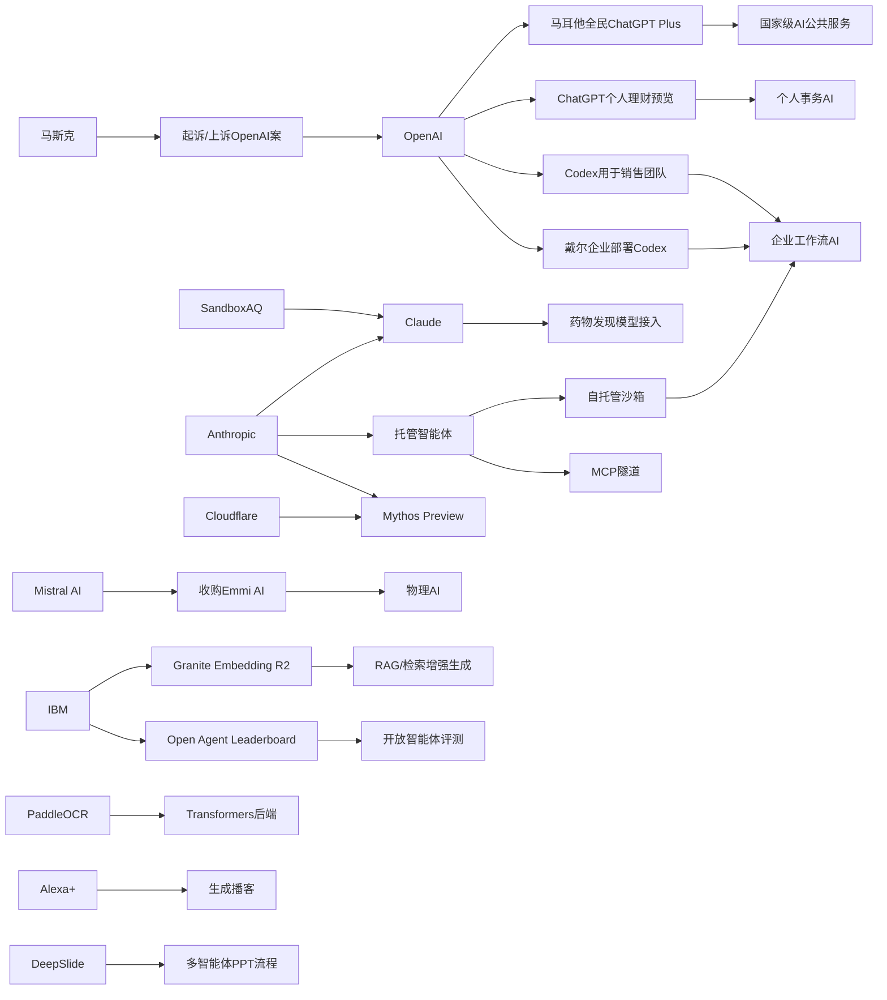

> AI 早报 · 每日早读 · 全网深度聚合

## **今日摘要**

本轮动态显示，AI产品正明显从“模型能力竞争”转向“真实可用性落地”，比如SandboxAQ把药物发现模型接入Claude、马耳他推动全民使用ChatGPT Plus、IBM发布更易部署的多语言开源嵌入模型。  
同时，AI的应用边界继续向更具体的现实场景延伸，包括Mistral布局工业与物理AI、ChatGPT试水个人理财助手，以及DeepSlide覆盖从做PPT到准备演讲的完整流程。  
在行业影响上，AI也正从通用工具走向更专业角色，例如Cloudflare称Anthropic模型已能发现更复杂的漏洞链，说明AI在安全分析等高价值任务中的作用正在增强。

### 🔵 产品与功能更新

1. **SandboxAQ把药物发现模型接入Claude。**  
SandboxAQ希望把原本偏科研和计算门槛较高的药物发现模型，直接放进Claude这样的对话式界面里，让更多研究人员无需深厚计算背景也能使用。核心思路不是继续拼“谁的模型更强”，而是先解决“谁更容易用”的问题。对非计算机背景的生物医药团队来说，这种入口变化可能比单纯模型升级更重要。🚀  
[药物模型接入Claude简报](https://techcrunch.com/2026/05/18/sandboxaq-brings-its-drug-discovery-models-to-claude-no-phd-in-computing-required/)

2. **马耳他与OpenAI合作向全民提供ChatGPT Plus。**  
OpenAI宣布与马耳他合作，扩大AI工具的全民可及性，并提供ChatGPT Plus与相关培训。重点不只是发放订阅，还包括帮助公众建立实用的AI使用技能，以及更负责任地使用AI。这个案例也显示，国家层面的AI普及正在从“试点”走向更系统化的公共服务。🚀  
[马耳他全民AI计划](https://openai.com/index/malta-chatgpt-plus-partnership)

3. **IBM发布多语言开源向量模型Granite Embedding R2。**  
IBM推出Granite Embedding Multilingual R2，这是一款支持多语言、采用Apache 2.0许可的开源嵌入模型（把文本转换为可检索向量的模型）。摘要强调它支持32K上下文，并在小于1亿参数的体量下提供很强的检索质量。对需要跨语言搜索、知识库问答和文档匹配的团队来说，这类轻量开源方案更容易落地。🚀  
[多语言嵌入模型简报](https://huggingface.co/blog/ibm-granite/granite-embedding-multilingual-r2)

### 🟢 前沿研究

1. **Mistral AI收购物理AI初创公司Emmi AI。**  
Mistral AI收购了总部位于维也纳的Emmi AI，意在扩展其面向欧洲工业客户的能力。所谓“物理AI”，通常指与机器人、工业流程或现实设备交互更紧密的智能系统。相比纯软件场景，这类方向更贴近制造业和工业自动化的实际需求。🚀  
[收购物理AI团队简报](https://the-decoder.com/mistral-ai-acquires-viennese-physical-ai-startup-emmi-ai/)

2. **ChatGPT推出个人理财体验预览。**  
OpenAI为美国Pro用户预览新的个人理财功能，用户可在安全连接金融账户后，获得结合自身财务背景、目标和优先级的AI建议。与通用问答不同，这类服务更强调基于个人上下文（具体账户和目标）给出洞察。也说明AI助手正从“会聊天”进一步走向“可处理个人事务”。🚀  
[ChatGPT理财功能预览](https://openai.com/index/personal-finance-chatgpt)

3. **DeepSlide研究瞄准“做PPT到讲PPT”的完整流程。**  
arXiv论文DeepSlide指出，很多AI幻灯片工具只关注做出“像样的PPT”，却忽视演讲节奏、叙事结构和准备过程。该系统采用人在回路（人类持续参与调整）和多智能体（多个AI分工协作）方式，支持完整的报告准备。对学术和职场用户来说，这比单纯美化页面更接近真实需求。🚀  
[DeepSlide论文速览](https://arxiv.org/abs/2605.15202)

### 🟡 行业展望与社会影响

1. **Cloudflare称Anthropic安全模型发现了更复杂漏洞链。**  
Cloudflare表示，在Project Glasswing测试中，Anthropic的Mythos Preview在其50多个代码仓库中找到了更早前沿模型遗漏的漏洞利用链。所谓漏洞链，是把多个单点漏洞串联起来形成更危险攻击路径的方式。这说明AI在网络安全中的角色，正在从“辅助扫描”升级为“更接近安全分析员”。🚀  
[安全模型测试简报](https://the-decoder.com/cloudflare-says-anthropics-mythos-preview-finds-exploit-chains-that-earlier-frontier-models-missed/)

2. **马斯克起诉OpenAI案败诉。**  
TechCrunch报道，马斯克针对Sam Altman和OpenAI的诉讼被加州陪审团一致否决，理由之一是起诉时间过晚。案件结果不仅影响双方关系，也会继续影响外界对OpenAI治理、创始团队纠纷和AI公司法律风险的关注。在AI产业高度资本化的当下，这类诉讼往往也会左右市场舆论。🚀  
[OpenAI诉讼结果简报](https://techcrunch.com/2026/05/18/elon-musk-has-lost-his-lawsuit-against-sam-altman-and-openai/)

3. **OpenAI展示销售团队如何使用Codex。**  
OpenAI介绍了销售团队可如何用Codex处理销售管道简报、会前准备、预测复盘、客户计划和停滞交易诊断。这里的重点不是编程，而是把AI编码代理（可理解为能处理复杂工作流的AI助手）延展到业务流程中。它反映出企业正在把AI工具从技术部门推广到更广泛的岗位。🚀  
[销售团队用Codex案例](https://openai.com/academy/codex-for-work/how-sales-teams-use-codex)

### 🟣 开源TOP项目

1. **PaddleOCR 3.5引入Transformers后端。**  
PaddleOCR 3.5发布，主打在文字识别（OCR）和文档解析任务中支持Transformers后端。对开发者而言，这意味着更现代的模型架构可用于票据、表单、扫描件等文档处理。文档AI一直是企业落地最稳定的方向之一，这类开源升级具有很强实用性。🚀  
[PaddleOCR更新简报](https://huggingface.co/blog/PaddlePaddle/paddleocr-transformers)

2. **Open Agent Leaderboard发布开放智能体榜单。**  
IBM Research在Hugging Face发布Open Agent Leaderboard，聚焦开放智能体（能调用工具、执行步骤任务的AI系统）的评测。榜单的意义在于让开发者更直观看到不同系统在代理任务中的表现差异。随着“会做事”的AI越来越受关注，公开评测也会更影响社区方向。🚀  
[开放智能体榜单简报](https://huggingface.co/blog/ibm-research/open-agent-leaderboard)

3. **Anthropic为托管智能体增加自托管沙箱。**  
Anthropic为Claude Managed Agents加入自托管沙箱和MCP隧道，让企业可把工具执行环节放到自有基础设施中。沙箱可以理解为受控隔离环境，用来更安全地运行任务；MCP则是模型与外部工具连接的一种协议。虽然企业获得了更强的基础设施控制权，但Anthropic并未把整个智能体完全交出去。🚀  
[托管智能体新能力简报](https://the-decoder.com/anthropic-adds-self-hosted-sandboxes-and-mcp-tunnels-to-claude-managed-agents/)

### 🔴 社媒分享

1. **马斯克称将上诉OpenAI案败诉结果。**  
在陪审团快速作出不利裁决后，马斯克方面表示将继续上诉，并把结果称为“日历技术问题”。这让OpenAI相关法律纠纷短期内仍难彻底降温。对于社交媒体和科技圈而言，这类高关注案件往往会持续制造强话题性。🚀  
[马斯克上诉动态简报](https://the-decoder.com/elon-musk-appeals-134-billion-openai-loss-calls-verdict-a-calendar-technicality/)

2. **OpenAI与戴尔合作推进企业版Codex部署。**  
OpenAI宣布与戴尔合作，把Codex带到混合部署和本地部署企业环境中。对大型企业来说，本地部署意味着数据、流程和合规控制更容易满足内部要求。这也反映出AI编码代理正在从云端服务走向更复杂的企业基础设施场景。🚀  
[戴尔合作部署Codex简报](https://openai.com/index/dell-codex-enterprise-partnership)

3. **Alexa+新增按需生成播客功能。**  
亚马逊推出由Alexa+驱动的新功能，可按需生成个性化AI播客内容。相比传统语音助手只回答问题，这一步更像把助手变成内容生产平台。它也显示，生成式AI正在继续改写音频内容的消费和制作方式。🚀  
[Alexa生成播客简报](https://techcrunch.com/2026/05/18/amazons-new-alexa-powered-feature-can-generate-podcast-episodes/)

---

📊 行业洞察

1. 事实  
   SandboxAQ把药物发现模型接入Claude；ChatGPT预览个人理财功能；OpenAI还展示了销售团队如何使用Codex处理会前准备、预测复盘和客户计划。  
   【洞察】AI产品竞争正在从“通用模型能力”转向“高价值场景封装”。无论是药物发现、个人理财，还是销售流程，核心趋势都是把大模型嵌入专业工作流，并结合用户上下文（context）给出可执行建议。这意味着下一阶段壁垒不只是谁模型更强，而是谁能更好完成“最后一公里”的场景产品化。

2. 事实  
   马耳他与OpenAI合作向全民提供ChatGPT Plus和培训；OpenAI与戴尔合作推进企业版Codex的混合部署与本地部署；Anthropic为托管智能体增加自托管沙箱和MCP隧道。  
   【洞察】AI普及正呈现“双轨基础设施化”趋势：一端是国家级公共服务普及，另一端是企业级私有化落地。前者强调数字能力建设与负责任使用，后者强调合规（compliance）、数据控制和执行环境隔离。说明AI产业已从早期“买个模型接口试试看”，走向“面向全民服务”和“嵌入核心系统”的长期建设阶段。

3. 事实  
   Cloudflare称Anthropic安全模型发现了更复杂的漏洞链；Mistral AI收购物理AI公司Emmi AI，强化面向工业客户能力；Anthropic又为Managed Agents加入自托管沙箱。  
   【洞察】AI正从“内容生成器”升级为“高风险任务执行者”。无论是安全分析中的漏洞链识别，还是工业场景中的物理AI，抑或企业内部工具调用，AI都在进入更接近真实世界执行与决策的位置。因此，安全性、可控性和环境隔离不再是附加功能，而会成为智能体（agent）落地的前置条件。

4. 事实  
   IBM发布Apache 2.0许可的多语言开源嵌入模型Granite Embedding R2；IBM Research又推出Open Agent Leaderboard；PaddleOCR 3.5引入Transformers后端。  
   【洞察】开源生态正在从“比参数规模”转向“比可落地组件”。轻量多语言嵌入、文档AI工具链、开放智能体评测，这些都指向企业更看重检索增强生成（RAG，检索增强生成）、文档处理和智能体执行等具体能力模块，而非单一大模型本身。未来开源竞争力将更多体现在“组件完整度+评测透明度+部署友好性”。

🗺️ 今日关系图

