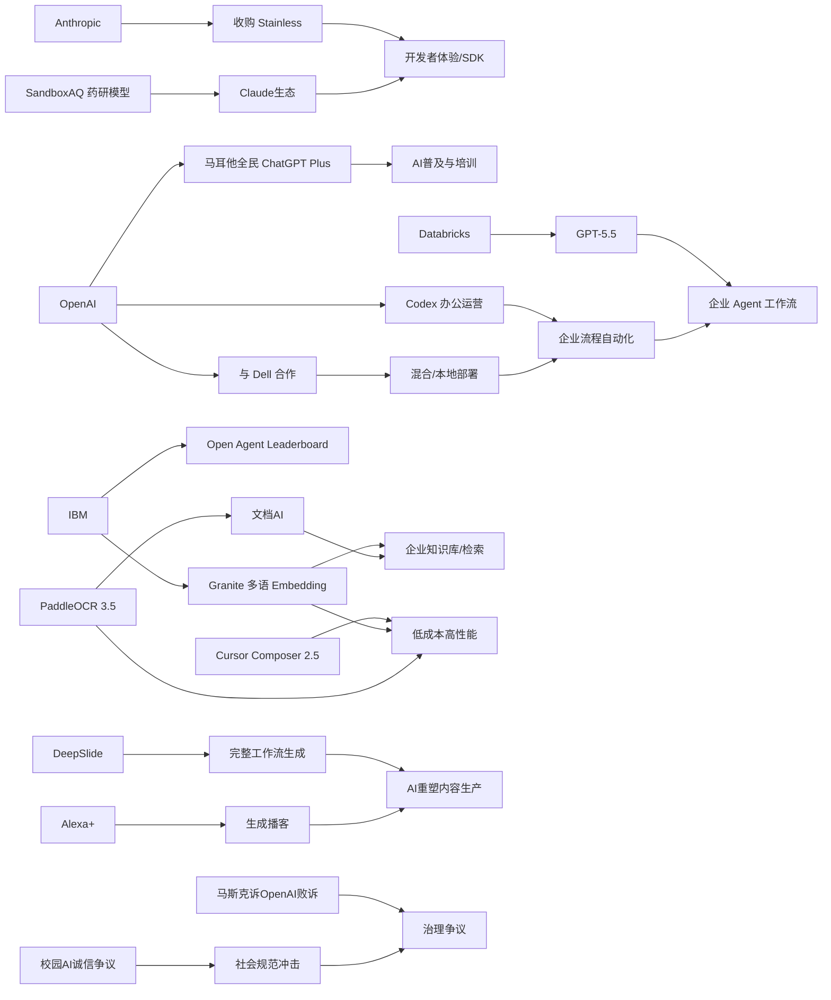

> AI 早报 · 每日早读 · 全网深度聚合

## **今日摘要**

近期AI动态显示，行业重点正从“模型更强”转向“更易用、更普及、更能接入真实工作流”：SandboxAQ将药物发现模型接入Claude、马耳他计划向全民提供ChatGPT Plus并配套培训、IBM也发布了面向企业检索的开源多语Embedding模型。  
在研究与企业应用层面，AI正在从单纯生成内容走向支持完整流程与生产环境落地，例如DeepSlide关注从做PPT到讲好报告的全流程，Databricks把GPT-5.5用于企业Agent工作流，Anthropic收购Stainless则说明开发者体验正成为平台竞争重点。  
与此同时，行业趋势也越来越明确：像Cursor Composer 2.5这类“成本更低但能力接近顶级”的模型，正在推动AI从少数高门槛工具转变为更广泛、可负担、可规模化部署的基础设施。

### 🔵 产品与功能更新

1. **SandboxAQ把药物研发模型接入Claude。**  
SandboxAQ把自己的药物发现模型带到了Claude生态里，目标不是只服务计算专家，而是让更多研究人员直接上手。文章强调，行业里不少公司都在比拼模型能力，但SandboxAQ认为“可访问性”才是更大的门槛。对非技术团队来说，这意味着可以借助对话式界面调用复杂模型，减少对高门槛计算流程的依赖🚀  
[药研模型接入Claude简报](https://techcrunch.com/2026/05/18/sandboxaq-brings-its-drug-discovery-models-to-claude-no-phd-in-computing-required/)

2. **马耳他将向全国公民提供ChatGPT Plus。**  
OpenAI与马耳他达成合作，准备把ChatGPT Plus及相关培训带给所有公民。这个合作不仅是产品订阅的扩展，也包含“如何负责任使用AI”的技能培训。对普通用户来说，这类国家级合作正在把AI从少数人的工具，变成更普遍的数字基础设施🚀  
[马耳他全民ChatGPT计划](https://openai.com/index/malta-chatgpt-plus-partnership)

3. **IBM发布多语种Embedding新模型。**  
IBM推出Granite Embedding Multilingual R2，这是一款支持多语言的Embedding（向量表示，用于搜索与检索）模型。它采用Apache 2.0开源许可，支持32K上下文，并主打在1亿参数以下体量中提供更强检索质量。对企业知识库、跨语言搜索和问答系统来说，这是很实用的基础能力更新🚀  
[IBM多语检索模型发布](https://huggingface.co/blog/ibm-granite/granite-embedding-multilingual-r2)

### 🟢 前沿研究

1. **DeepSlide想把“做幻灯片”推进到“讲好报告”。**  
DeepSlide是一套人机协同（human-in-the-loop）的多智能体系统，关注的不只是生成一套看起来像样的PPT。它更进一步覆盖演讲节奏、叙事结构和展示准备过程，试图补上当前AI幻灯片工具常忽略的“交付环节”。这反映出研究重点正从“生成内容”转向“支持完整工作流”🚀  
[DeepSlide论文速览](https://arxiv.org/abs/2605.15202)

2. **Databricks把GPT-5.5用于企业Agent流程。**  
Databricks宣布在企业级Agent（智能体）工作流中采用GPT-5.5，并强调该模型在OfficeQA Pro基准测试上刷新了成绩。这里的重点不只是模型更强，而是它开始进入企业自动化流程，承担更复杂的办公与知识处理任务。对于企业AI落地来说，这说明先进模型正越来越多地进入实际生产环境🚀  
[企业Agent接入GPT-5.5](https://openai.com/index/databricks)

3. **Anthropic收购开发者工具初创公司Stainless。**  
Anthropic收购了Stainless，这家公司以自动生成和维护SDK（软件开发工具包）闻名，客户包括OpenAI、Google和Cloudflare。虽然这是收购新闻，但背后也反映了AI公司对“开发者体验”的重视正在上升。未来模型平台的竞争，不只在模型本身，也在谁能让接入和使用更顺手🚀  
[Anthropic收购Stainless解读](https://techcrunch.com/2026/05/18/anthropic-has-acquired-the-dev-tools-startup-used-by-openai-google-and-cloudflare/)

### 🟡 行业展望与社会影响

1. **Cursor称Composer 2.5以更低成本追平顶级模型成绩。**  
Cursor发布Composer 2.5，这是一款面向编程场景的AI模型，文章称其在多项基准上接近Opus 4.7和GPT-5.5，但成本低得多。它建立在Kimi K2.5之上，并使用了比前代多25倍的合成任务数据训练。行业层面看，这类消息说明“更便宜但足够强”的模型，正在快速改写AI应用的成本结构🚀  
[Cursor低成本模型观察](https://the-decoder.com/cursors-composer-2-5-matches-opus-4-7-and-gpt-5-5-benchmarks-at-a-fraction-of-the-cost/)

2. **OpenAI展示Codex在业务运营团队中的用法。**  
OpenAI介绍了业务运营团队如何使用Codex，覆盖项目简报、战略更新、领导决策材料和进度汇报等工作。与“AI写代码”的传统印象不同，这里更强调Codex对日常办公室流程的支持。社会影响在于，AI工具正从技术部门扩散到更广泛的职能团队🚀  
[Codex办公场景案例](https://openai.com/academy/codex-for-work/how-business-operations-teams-use-codex)

3. **马斯克起诉OpenAI案败诉，行业治理争议继续。**  
陪审团在短时间内驳回了马斯克针对Sam Altman和OpenAI的诉讼，认为相关诉求提出得太晚。虽然这是一场法律结果，但它也折射出AI公司治理、创始人关系和组织使命等问题仍在持续发酵。对行业观察者来说，这类案件会继续影响公众如何理解AI公司的权力与责任🚀  
[马斯克诉OpenAI案结果](https://techcrunch.com/2026/05/18/elon-musk-has-lost-his-lawsuit-against-sam-altman-and-openai/)

### 🟣 开源TOP项目

1. **PaddleOCR 3.5支持Transformers后端。**  
PaddleOCR 3.5带来了基于Transformers（新一代深度学习架构）的OCR（文字识别）与文档解析能力。对开发者和企业用户来说，这意味着在处理扫描件、表单、票据和复杂文档时，有了更现代的模型底座可选。文档AI一直是高频需求，这次升级很有现实落地价值🚀  
[PaddleOCR 3.5更新简报](https://huggingface.co/blog/PaddlePaddle/paddleocr-transformers)

2. **Open Agent Leaderboard上线开放智能体榜单。**  
IBM Research发布了Open Agent Leaderboard，用来评估开放式Agent（智能体）系统的表现。随着越来越多团队构建能调用工具、执行任务的AI系统，统一评测变得越来越重要。这个榜单的意义在于，它为“智能体到底强不强”提供了更可比较的观察窗口🚀  
[开放智能体榜单介绍](https://huggingface.co/blog/ibm-research/open-agent-leaderboard)

3. **IBM多语Embedding模型采用Apache 2.0开源许可。**  
Granite Embedding Multilingual R2除了性能亮点外，一个重要价值是开放许可方式明确，便于企业和开发者直接使用。它聚焦多语言检索与表示学习（让文本变成可计算向量），适合知识库、搜索和问答系统。开源基础模型持续进步，也让更多团队不必完全依赖闭源服务🚀  
[Granite开源模型速览](https://huggingface.co/blog/ibm-granite/granite-embedding-multilingual-r2)

### 🔴 社媒分享

1. **斯坦福学生反思ChatGPT如何改变校园诚信。**  
一名斯坦福学生在文章中回顾，ChatGPT如何影响了整个毕业班的学习方式，并把原本就存在的“少量作弊文化”进一步推向常态化。这个讨论之所以引发关注，是因为它不再只是技术问题，而是教育制度与行为规范的问题。社交平台上，这类亲历者视角往往比抽象争论更能引发共鸣🚀  
[校园AI诚信讨论](https://the-decoder.com/a-stanford-student-reflects-on-his-chatgpt-class-and-a-culture-of-just-a-little-bit-of-fraud/)

2. **OpenAI与Dell合作把Codex带到混合与本地环境。**  
OpenAI和Dell宣布合作，把Codex带到混合部署与本地部署（on-premise，企业自有机房）环境。对很多重视数据安全和合规的企业来说，这一步很关键，因为不是所有公司都能把代码与流程放到公有云。社交讨论点也很明确：AI编码助手正加速进入传统大企业核心系统🚀  
[Dell联手部署Codex](https://openai.com/index/dell-codex-enterprise-partnership)

3. **亚马逊Alexa+可按需生成播客节目。**  
亚马逊为Alexa+加入了可生成定制播客的新能力，进一步把语音助手推向个性化内容平台。对普通用户来说，这类功能让AI不只是“回答问题”，还开始主动生产可消费的媒体内容。围绕“AI会不会重塑内容分发与收听习惯”的讨论，预计会在社媒持续升温🚀  
[Alexa生成播客功能](https://techcrunch.com/2026/05/18/amazons-new-alexa-powered-feature-can-generate-podcast-episodes/)

---

📊 行业洞察

1. 事实  
   SandboxAQ将药物发现模型接入Claude生态；Anthropic收购Stainless以强化SDK（软件开发工具包）生成与维护；OpenAI与马耳他合作，向全国公民提供ChatGPT Plus并配套培训。  
   【洞察】AI竞争正在从“模型能力”转向“可访问性+分发能力+开发者体验”三位一体。无论是科研模型通过对话界面降低使用门槛，还是国家级普及合作、平台方补强SDK链路，本质都说明行业护城河正从单点模型性能，迁移到“让谁更容易接入、部署、学会并持续使用”。

2. 事实  
   Databricks将GPT-5.5用于企业级Agent（智能体）工作流；OpenAI展示Codex在业务运营团队中的非编程办公场景；OpenAI与Dell合作推动Codex进入混合部署与本地部署（on-premise，企业自有机房）环境。  
   【洞察】企业AI落地已从“试验性Copilot（副驾驶式辅助）”升级到“可嵌入核心流程的Agent系统”。这意味着采购标准将不再只看模型效果，而会更看重安全合规、私有化部署、系统集成和跨部门适用性。AI正从IT工具预算，逐步进入企业流程再造预算。

3. 事实  
   Cursor称Composer 2.5以远低于顶级模型的成本逼近Opus 4.7和GPT-5.5成绩；IBM发布Apache 2.0许可的多语种Embedding模型；PaddleOCR 3.5升级Transformers后端以增强文档理解。  
   【洞察】“足够强且更便宜”的开源/低成本能力正在重塑AI应用的单位经济模型（unit economics，单个业务单元的成本收益结构）。在检索、OCR、编程等高频场景，企业未必再追求最强闭源模型，而更可能采用“开源底座+局部高端模型”的混合架构，以平衡性能、成本与可控性。

4. 事实  
   DeepSlide从PPT生成扩展到演讲叙事与展示准备全流程；亚马逊Alexa+可按需生成播客；斯坦福学生反思ChatGPT推动校园中“轻度作弊”常态化；马斯克诉OpenAI案败诉后，行业治理争议仍在持续。  
   【洞察】AI正在从“生成内容”走向“塑造行为与制度”。一方面，产品开始覆盖完整工作流和内容消费链条；另一方面，教育诚信、平台责任、组织治理等问题同步放大。未来行业分水岭不只是生成质量，而是谁能更好处理“AI介入人类决策与规范”的外部性（externalities，外溢影响）。

🗺️ 今日关系图

