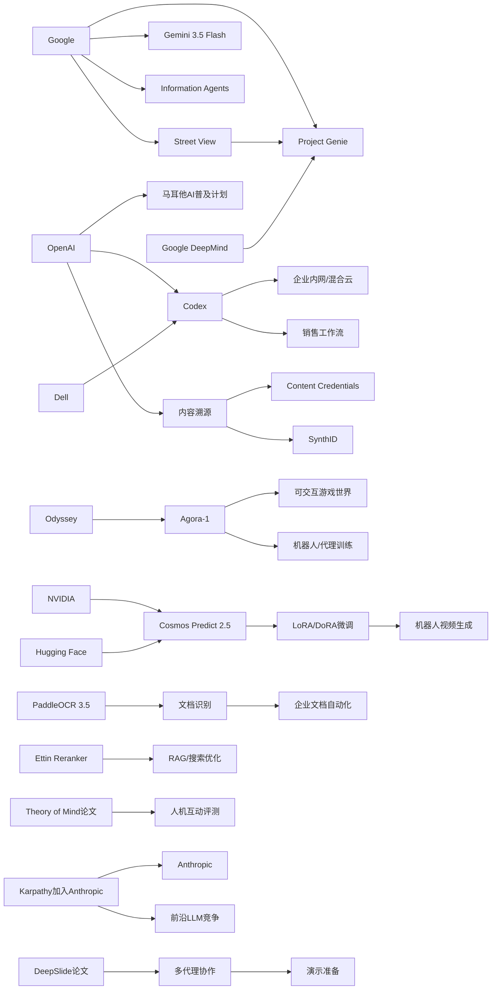

> AI 早报 · 每日早读 · 全网深度聚合

## **今日摘要**

本期更新显示，AI 正同时向更真实的世界建模、更安全的企业落地和更强的文档理解能力推进，例如 Google 用街景增强世界模型、OpenAI 联手 Dell 推进企业内网版 Codex、PaddleOCR 3.5 强化复杂文档解析。  
在研究前沿，行业焦点正从“会聊天的模型”转向“能自主完成任务的代理型 AI”，相关例子包括 Gemini 3.5 Flash、面向完整演示流程的 DeepSlide，以及 OpenAI 与马耳他合作推动全民 AI 教育。  
从更宏观的角度看，Karpathy 加入 Anthropic 这类人才流动也说明，AI 竞争已不只是模型能力之争，而是企业部署、公共普及、研究方向和行业格局的全面竞争。

### 🔵 产品与功能更新

1. **Google 的 Genie 世界模型接入街景。**  
Google DeepMind 把 Street View（街景图像）接入 Project Genie（世界模型，可模拟环境变化的系统），让 AI 能生成更接近真实街道的互动场景🚀  
这类模拟可用于机器人训练、游戏制作和虚拟出行体验，还能测试天气变化或少见路况。  
对普通用户来说，它意味着“可探索、可互动”的地图体验正在靠近现实。  
[街景世界模型更新(briefing)](https://techcrunch.com/2026/05/19/googles-genie-world-model-can-now-simulate-real-streets-with-street-view/)

2. **OpenAI 联手戴尔把 Codex 带进企业内网。**  
OpenAI 与 Dell 合作，把 Codex（AI 编程助手）部署到混合云和本地环境，方便企业在自有数据和工作流中安全使用🚀  
这类“本地部署”能减少敏感代码和内部资料外流的顾虑，尤其适合合规要求高的大公司。  
它也说明 AI 编程工具正在从个人效率工具走向企业级基础设施。  
[企业内网部署Codex(briefing)](https://openai.com/index/dell-codex-enterprise-partnership)

3. **PaddleOCR 3.5 强化文档识别能力。**  
PaddleOCR 3.5 支持以 Transformers（新一代深度学习架构）作为后端，用于 OCR（光学字符识别）和文档解析任务🚀  
这意味着它不仅能识别图片里的文字，还更擅长处理版面复杂的表格、票据和长文档。  
对企业数字化流程来说，文档自动录入和结构化提取会更高效。  
[PaddleOCR版本升级(briefing)](https://huggingface.co/blog/PaddlePaddle/paddleocr-transformers)

### 🟢 前沿研究

1. **Gemini 3.5 Flash 押注“代理型 AI”。**  
Google 发布 Gemini 3.5 Flash，并把重点从聊天机器人转向 agents（代理型 AI，可自主执行任务的软件助手）🚀  
报道提到，它更擅长写代码、处理复杂任务，甚至从零开始搭建软件。  
这代表下一波 AI 竞争，不只是“会回答”，而是“会动手完成工作”。  
[谷歌押注代理模型(briefing)](https://techcrunch.com/2026/05/19/with-gemini-3-5-flash-google-bets-its-next-ai-wave-on-agents-not-chatbots/)

2. **DeepSlide 关注“做演示”而非只做幻灯片。**  
这篇 arXiv 论文提出 DeepSlide，一个 human-in-the-loop（人在回路中参与）的多代理系统，用于辅助完整的演示准备流程🚀  
它不只生成看起来像样的幻灯片，还会兼顾节奏、叙事和演讲准备。  
这反映出学术与办公 AI 正从“生成内容”走向“支持真实交付过程”。  
[演示准备研究进展(briefing)](https://arxiv.org/abs/2605.15202)

3. **OpenAI 与马耳他推动全民 AI 普及。**  
OpenAI 与马耳他合作，为公民提供 ChatGPT Plus 和相关培训，帮助更多人掌握实用 AI 技能🚀  
除了工具可用性，这项合作也强调“负责任地使用 AI”，说明普及教育已成为国家层面的议题。  
从研究视角看，AI 的落地正在从实验室走向公共服务体系。  
[马耳他全民AI计划(briefing)](https://openai.com/index/malta-chatgpt-plus-partnership)

### 🟡 行业展望与社会影响

1. **Karpathy 选择 Anthropic 引发行业关注。**  
知名 AI 研究者 Andrej Karpathy 选择加入 Anthropic，而不是回到老东家 OpenAI，引发外界对头部实验室竞争格局的讨论🚀  
他认为未来几年会是大语言模型（LLM，能理解和生成文本的 AI）的关键塑形期。  
这类人才流动往往不只是个人选择，也会影响资本、研究方向和行业信心。  
[Karpathy去向观察(briefing)](https://the-decoder.com/prominent-ai-researcher-andrej-karpathy-picks-anthropic-over-former-home-openai-to-get-back-into-frontier-llm-research/)

2. **Google 信息代理可能改变获取资讯的方式。**  
Google 推出的 information agents（信息代理）可以在后台持续关注主题，并在有变化时主动提醒用户🚀  
这意味着用户不必反复搜索，AI 会变成“持续盯梢”的信息助手。  
从社会影响看，信息分发正从“你去找内容”转向“内容主动来找你”。  
[谷歌信息代理解读(briefing)](https://techcrunch.com/2026/05/19/how-to-use-googles-new-information-agents/)

3. **Codex 正进入销售团队日常工作。**  
OpenAI 展示了销售团队如何用 Codex 生成销售漏斗简报、会议准备材料、预测复盘和客户计划🚀  
这说明 AI 编程与自动化能力，正在从工程岗位扩展到销售、运营等业务部门。  
行业层面看，AI 工具的价值越来越体现在“接入真实工作流”而非单点功能。  
[销售团队使用Codex(briefing)](https://openai.com/academy/codex-for-work/how-sales-teams-use-codex)

### 🟣 开源TOP项目

1. **Ettin Reranker 发布新排序模型家族。**  
Hugging Face 博文介绍了 Ettin Reranker Family，这是一类 reranker（重排序模型，用来给搜索结果或候选答案重新排优先级）🚀  
这类模型常用于搜索、问答和检索增强生成（RAG，把外部资料接入大模型回答）系统中，提高最终结果质量。  
对开源社区来说，重排序模型是“更好用 AI 搜索”背后的关键组件。  
[开源重排序模型发布(briefing)](https://huggingface.co/blog/ettin-reranker)

2. **Simon Willison 用五分钟回顾近半年 LLM 变化。**  
这篇整理文快速回顾过去六个月大语言模型领域的重要变化，适合作为开源生态的鸟瞰入口🚀  
虽然不是单一项目发布，但它能帮助读者快速理解模型、工具和社区趋势的演变。  
对非技术读者来说，这类“总览型内容”很适合补齐行业背景。  
[五分钟回顾LLM(briefing)](https://simonwillison.net/2026/May/19/5-minute-llms/#atom-everything)

3. **Theory of Mind 提升是否真的改善人机互动？**  
这篇论文讨论 Theory of Mind（心理理论，指理解他人意图与想法的能力）增强后，是否真的提升 Human-AI Interaction（人机互动）效果🚀  
作者指出，很多现有评测只看“做题能力”，却忽略真实互动场景中的表现。  
这对开源模型评测也有启发：AI 不只是分数高，还要在真实交流里更自然、更可靠。  
[人机互动评测论文(briefing)](https://arxiv.org/abs/2605.15205)

### 🔴 社媒分享

1. **Agora-1 把《黄金眼 007》做成可玩的 AI 模拟。**  
Odyssey 发布 Agora-1，让最多四名玩家同时进入 AI 生成的游戏世界，并以《GoldenEye》为测试案例🚀  
系统由两个模型分别负责“游戏状态模拟”和“实时渲染”，展示了世界模型在互动娱乐中的潜力。  
团队还提到，它未来可用于协作机器人和 AI 代理训练。  
[AI版黄金眼试玩(briefing)](https://the-decoder.com/agora-1-turns-the-n64-classic-goldeneye-into-a-playable-ai-simulation-for-four-players/)

2. **OpenAI 推进 AI 内容溯源。**  
OpenAI 介绍了 Content Credentials（内容凭证）、SynthID 和验证工具，用于识别 AI 生成媒体的来源🚀  
随着图片、音频和视频生成越来越逼真，内容“是谁做的、是否被改过”变得更重要。  
这类基础设施有望提升透明度，也有助于打击误导性内容传播。  
[AI内容溯源进展(briefing)](https://openai.com/index/advancing-content-provenance)

3. **NVIDIA 分享机器人视频生成微调方案。**  
Hugging Face 博文介绍如何用 LoRA/DoRA（轻量微调方法）微调 NVIDIA Cosmos Predict 2.5，用于机器人视频生成🚀  
相比从头训练，这种方式成本更低、速度更快，更适合研究和实验分享。  
对社媒传播来说，这类“可复现的实践教程”往往更容易引发开发者关注。  
[机器人视频微调法(briefing)](https://huggingface.co/blog/nvidia/cosmos-fine-tuning-for-robot-video-generation)

---

📊 行业洞察

1. 事实  
   - OpenAI 与 Dell 合作，将 Codex 部署到企业混合云和本地环境。  
   - OpenAI 同时展示了 Codex 在销售团队中的实际用法，已从工程场景扩展到业务部门。  
   【洞察】AI 助手正从“个人生产力工具”升级为“企业级工作流基础设施”。本地部署与混合云说明企业采购重点已从模型能力转向安全、合规、系统集成（Integration，接入现有业务系统）与跨部门复用能力；谁能先打通内网数据、权限体系和真实流程，谁就更可能占据企业 AI 平台入口。

2. 事实  
   - Google DeepMind 将 Street View 接入 Project Genie，用真实街景增强世界模型。  
   - Odyssey 的 Agora-1 已展示多人可交互的 AI 生成游戏世界。  
   - NVIDIA 还提供了面向机器人视频生成的低成本微调方案。  
   【洞察】世界模型（World Model，可模拟环境与状态变化的系统）正在从“炫技演示”走向“通用仿真基础设施”。其应用边界已同时覆盖游戏、机器人训练、虚拟出行和代理测试，说明产业价值不再只取决于生成画面是否逼真，而取决于是否能提供可交互、可控制、可低成本迭代的环境层。这将推动“数据—仿真—训练”闭环成为下一阶段竞争焦点。

3. 事实  
   - Google 发布 Gemini 3.5 Flash，明确押注 agents（代理型 AI，可自主执行任务的软件助手）而非传统聊天机器人。  
   - Google 又推出 information agents，可持续追踪主题并主动提醒。  
   - DeepSlide 论文也强调 human-in-the-loop（人在回路中参与）的多代理协作来完成完整演示流程。  
   【洞察】AI 竞争正在从“回答问题”转向“持续执行任务”。代理化（Agentification，产品从问答接口转向任务执行单元）意味着产品指标将从单轮准确率，转向任务完成率、过程可控性、长期记忆和多步骤协同能力。未来平台价值将更多体现在“能不能替用户盯住任务并交付结果”，而不是“能不能聊得像人”。

4. 事实  
   - OpenAI 与马耳他合作推进全民 ChatGPT Plus 与 AI 培训。  
   - OpenAI 同时推进 Content Credentials（内容凭证）与 SynthID 等内容溯源机制。  
   - Theory of Mind 相关论文则质疑现有评测过于偏重做题能力，忽视真实互动质量。  
   【洞察】AI 落地已进入“普及教育 + 治理基础设施 + 真实交互评测”三线并进阶段。行业不再只比模型分数，而是要同步解决公民使用能力、内容可信度和人机互动质量问题。这意味着下一轮竞争优势，可能来自“社会化部署能力”而非单纯参数规模。

🗺️ 今日关系图

