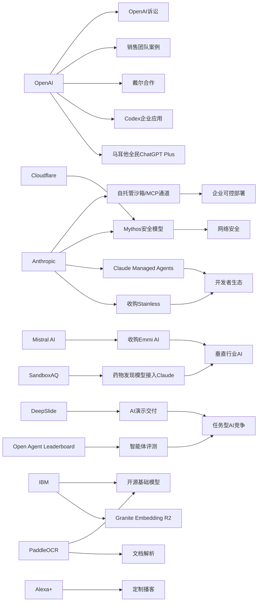

> AI 早报 · 每日早读 · 全网深度聚合

## **今日摘要**

3句话概括如下：  

OpenAI、IBM、SandboxAQ等在产品层面持续降低AI使用门槛：从全民Plus合作、专业药物模型接入Claude，到多语种开源向量模型发布，AI正加速走向普及与实用化。  
研究与收购方面，DeepSlide推动PPT生成从“做出来”升级到“讲出来”，而Mistral、Anthropic则分别通过收购补强物理AI和开发者工具链。  
行业影响上，Anthropic的安全模型已能发现旧模型遗漏的攻击链，说明AI正在网络安全等高价值场景中从辅助工具变成更强的能力引擎。

### 🔵 产品与功能更新

1. **OpenAI与马耳他合作向全民提供ChatGPT Plus。**  
OpenAI宣布与马耳他合作，计划向当地居民提供ChatGPT Plus，并配套开展人工智能使用培训。重点不只是“送会员”，还包括帮助公众建立实用技能与负责任使用AI的习惯。对普通用户来说，这类国家级合作说明AI服务正从个人尝鲜走向公共普及。🚀  
[全民AI合作计划简报(briefing)](https://openai.com/index/malta-chatgpt-plus-partnership)

2. **SandboxAQ把药物发现模型接入Claude。**  
SandboxAQ将其药物发现模型带到Claude平台，目标是让不具备高深计算背景的用户也能更容易使用相关能力。文章指出，许多公司在竞相打造更强模型，而SandboxAQ认为“可获得性”才是更大的门槛。换句话说，这次更新更像是在降低专业AI工具的使用门槛。🚀  
[药物模型接入Claude(briefing)](https://techcrunch.com/2026/05/18/sandboxaq-brings-its-drug-discovery-models-to-claude-no-phd-in-computing-required/)

3. **IBM开源多语种文本向量模型Granite Embedding R2。**  
IBM发布Granite Embedding Multilingual R2，这是一款支持多语言的文本向量模型（把文本转成便于检索的数字表示）。其特点包括Apache 2.0开源许可、32K长上下文支持，以及在小于1亿参数规模中较强的检索效果。对于做搜索、知识库和问答产品的团队来说，这类模型很适合低成本部署。🚀  
[多语向量模型发布(briefing)](https://huggingface.co/blog/ibm-granite/granite-embedding-multilingual-r2)

### 🟢 前沿研究

1. **DeepSlide尝试把AI做PPT扩展到“讲好PPT”。**  
DeepSlide是一项来自arXiv的研究，关注点不只是生成一份“像样的幻灯片”，而是覆盖演示准备全过程。论文提出一个人类参与的多智能体系统（多个AI分工协作），帮助处理节奏、叙事结构和演讲准备。对非技术用户来说，这代表AI工具开始从“生成文档”走向“辅助表达与交付”。🚀  
[DeepSlide研究速览(briefing)](https://arxiv.org/abs/2605.15202)

2. **Mistral AI收购物理AI初创公司Emmi AI。**  
法国AI公司Mistral AI收购了来自维也纳的Emmi AI，希望扩大其面向欧洲工业客户的能力版图。所谓“物理AI”，通常指面向机器人、制造或现实设备控制的智能技术。相比单纯聊天机器人，这类方向更贴近工业自动化与实体场景落地。🚀  
[物理AI收购动态(briefing)](https://the-decoder.com/mistral-ai-acquires-viennese-physical-ai-startup-emmi-ai/)

3. **Anthropic收购开发者工具公司Stainless。**  
Anthropic收购了Stainless，这家公司以自动生成和维护SDK（软件开发工具包）而知名，客户包括OpenAI、Google和Cloudflare。SDK可以帮助开发者更方便地调用API（应用程序接口）。这笔交易显示，大模型公司正在加强开发者生态与工具链布局。🚀  
[Anthropic收购Stainless(briefing)](https://techcrunch.com/2026/05/18/anthropic-has-acquired-the-dev-tools-startup-used-by-openai-google-and-cloudflare/)

### 🟡 行业展望与社会影响

1. **Cloudflare称Anthropic安全模型发现了旧模型遗漏的攻击链。**  
Cloudflare测试了Anthropic面向安全场景的模型Mythos Preview，并在50多个代码仓库中进行验证。结果显示，该模型找出了一些此前前沿模型未识别的漏洞利用链（多个安全缺陷串联形成的攻击路径）。这说明AI在网络安全中的价值，正从“辅助分析”走向更实际的威胁发现。🚀  
[安全模型测试结果(briefing)](https://the-decoder.com/cloudflare-says-anthropics-mythos-preview-finds-exploit-chains-that-earlier-frontier-models-missed/)

2. **马斯克起诉OpenAI败诉，陪审团认定起诉过晚。**  
TechCrunch报道，马斯克针对Sam Altman和OpenAI的诉讼遭遇失败。9名加州陪审员一致认为，相关诉讼提交时间过晚，因此不支持其主张。此案不仅是法律事件，也持续影响外界对OpenAI治理与创始人关系的讨论。🚀  
[OpenAI诉讼败诉简报(briefing)](https://techcrunch.com/2026/05/18/elon-musk-has-lost-his-lawsuit-against-sam-altman-and-openai/)

3. **OpenAI展示销售团队如何使用Codex。**  
OpenAI发布案例，说明销售团队可借助Codex生成销售管道简报、会前准备材料、预测复盘、客户计划和停滞交易诊断。这里的Codex可理解为面向工作流程的AI编排与生成助手。对企业而言，AI正在从技术部门扩展到销售等更广泛的业务岗位。🚀  
[Codex销售应用案例(briefing)](https://openai.com/academy/codex-for-work/how-sales-teams-use-codex)

### 🟣 开源TOP项目

1. **PaddleOCR 3.5支持基于Transformer的OCR与文档解析。**  
PaddleOCR 3.5带来了基于Transformer（擅长理解序列信息的模型架构）后端的OCR（文字识别）与文档解析能力。相比传统识别流程，这意味着在复杂版面、长文档和结构化提取方面有更强扩展空间。对企业文档处理、表单识别和数字化归档很有实际意义。🚀  
[PaddleOCR新版速览(briefing)](https://huggingface.co/blog/PaddlePaddle/paddleocr-transformers)

2. **Open Agent Leaderboard发布，聚焦开放智能体能力评测。**  
Hugging Face博客介绍了Open Agent Leaderboard，用于评估开放智能体（能够调用工具并执行任务的AI系统）表现。相比只看聊天能力，这类榜单更关注任务执行、工具使用与综合表现。它为开发者提供了一个更贴近实际应用的比较基准。🚀  
[开放智能体榜单(briefing)](https://huggingface.co/blog/ibm-research/open-agent-leaderboard)

3. **Anthropic为Claude Managed Agents增加自托管沙箱与MCP通道。**  
Anthropic扩展了Claude Managed Agents，新增自托管沙箱和MCP通道，让企业可把工具执行部分放到自家基础设施中。沙箱可以理解为隔离的安全运行环境，MCP则是连接工具与模型的协议方式。虽然企业获得了更多控制权，但Anthropic仍未完全交出智能体本体的控制。🚀  
[托管智能体新能力(briefing)](https://the-decoder.com/anthropic-adds-self-hosted-sandboxes-and-mcp-tunnels-to-claude-managed-agents/)

### 🔴 社媒分享

1. **马斯克拟就OpenAI案上诉，称败诉是“日历技术性问题”。**  
在败诉后，马斯克方面表示将保留上诉权，并将裁决描述为“日历技术性问题”。这让相关争议继续延烧，也进一步放大了OpenAI与其早期联合创始人之间的矛盾。对于关注AI行业治理的人来说，这一话题仍有较高传播度。🚀  
[马斯克拟上诉动态(briefing)](https://the-decoder.com/elon-musk-appeals-134-billion-openai-loss-calls-verdict-a-calendar-technicality/)

2. **OpenAI与戴尔合作，把Codex带到混合与本地企业环境。**  
OpenAI宣布与戴尔合作，将Codex引入混合部署和本地部署企业环境。核心卖点是帮助企业在更安全、可控的数据与工作流体系中使用AI编码智能体。对大型组织来说，这类合作回应了对隐私、合规与基础设施兼容性的长期需求。🚀  
[戴尔Codex合作简报(briefing)](https://openai.com/index/dell-codex-enterprise-partnership)

3. **Alexa+新增按需生成播客功能。**  
亚马逊推出由Alexa+驱动的新功能，可按用户需求生成定制播客节目。这个更新显示，语音助手正在从回答问题升级为个性化内容生产平台。对普通用户而言，未来“听什么”可能越来越由AI即时生成。🚀  
[Alexa播客生成功能(briefing)](https://techcrunch.com/2026/05/18/amazons-new-alexa-powered-feature-can-generate-podcast-episodes/)

---

📊 **行业洞察**

1. 事实：OpenAI与马耳他合作向全民提供ChatGPT Plus；OpenAI又与戴尔合作把Codex带入混合/本地企业环境；同时公开了销售团队使用Codex的案例。  
  【洞察】AI产品正在从“单点订阅”走向“公共普及+企业落地”双轨并行（go-to-market，商业化路径）。一边是国家级合作推动大众使用和AI素养普及，另一边是通过企业部署、业务场景案例强化ROI（投资回报）叙事，说明大模型竞争已进入“渠道+场景”阶段。

2. 事实：Anthropic收购开发者工具公司Stainless；并为Claude Managed Agents增加自托管沙箱与MCP通道；与此同时OpenAI也在推动Codex进入企业环境。  
  【洞察】大模型厂商正在围绕开发者生态做纵深整合，竞争焦点从“模型参数”转向“API（应用程序接口）-SDK（软件开发工具包）-智能体（agent）工具链”。谁能控制开发者入口、工具分发和执行环境，谁就更可能拿到企业工作流的长期粘性。

3. 事实：SandboxAQ把药物发现模型接入Claude；Mistral AI收购Emmi AI布局物理AI（面向机器人、制造等实体场景）；IBM发布开源多语种向量模型Granite Embedding R2。  
  【洞察】AI应用正从通用对话向高价值垂直领域下沉，且呈现“两头分化”：一头是生物医药、工业自动化等高门槛场景，需要更深的行业数据和工作流整合；另一头是检索、知识库、问答等基础能力，开始由开源模型承接低成本部署需求。产业链的价值分布正在从“通用模型层”向“行业模型+基础组件层”扩散。

4. 事实：Cloudflare测试Anthropic安全模型发现了旧模型遗漏的攻击链；PaddleOCR 3.5强化文档解析；Open Agent Leaderboard开始评测开放智能体能力；DeepSlide研究把AI做PPT扩展到完整演示交付。  
  【洞察】行业评价体系正在从“会不会聊”升级为“能不能干活”。安全发现、文档理解、任务执行、表达交付等能力被纳入实际评测后，AI竞争将更依赖端到端任务完成率（task completion）与工作流适配能力，而不只是单轮生成质量。

🗺️ **今日关系图**

