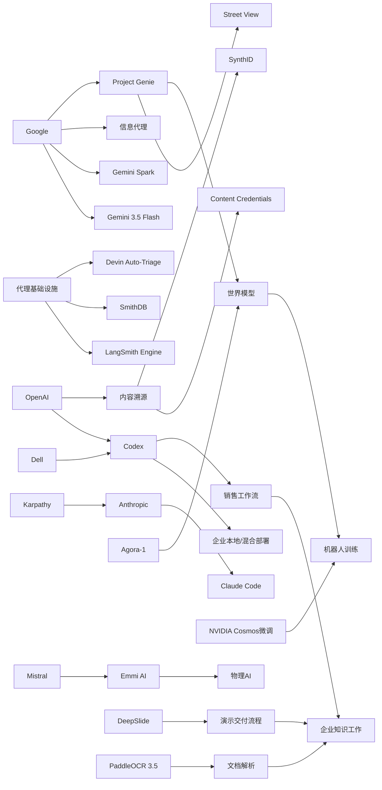

> AI 早报 · 每日早读 · 全网深度聚合

## **今日摘要**

近期AI进展显示，行业正从“会聊天”加速迈向“会执行”：谷歌把Street View接入Genie模拟真实道路、在I/O发布常驻云代理Gemini Spark与更偏任务执行的Gemini 3.5 Flash，OpenAI也联合戴尔推动Codex进入企业私有与混合部署环境。  
同时，代理基础设施和办公场景也在完善，LangSmith、Devin、Claude Code等工具强化了代理开发、监控与自动缺陷分流能力，而DeepSlide则尝试把AI从生成PPT扩展到完整演示准备与交付流程。  
从Karpathy加盟Anthropic等行业动向看，顶级人才流动与产品布局都表明，大模型竞争焦点正从单轮问答能力转向更实用、更安全、可持续运行的代理生态。

### 🔵 产品与功能更新

1. **谷歌Genie可用街景模拟真实道路。**
Google DeepMind把Street View（街景）接入Project Genie，让AI世界模型（可生成并模拟环境的模型）能直接“走进”真实街道。用户不仅能浏览环境，还能测试天气变化、少见路况等互动场景。它对机器人训练、游戏制作和虚拟出行都很有想象空间，也说明世界模型正从实验走向更实用的应用。🚀
[街景世界模拟体验(briefing)](https://techcrunch.com/2026/05/19/googles-genie-world-model-can-now-simulate-real-streets-with-street-view/)

2. **OpenAI与戴尔推动Codex进企业私有环境。**
OpenAI宣布与戴尔合作，把Codex带到混合部署和本地部署环境中。对大企业来说，这意味着AI编程代理（可自动完成部分开发任务的助手）能在更安全、合规的内部数据和工作流中运行。对于担心数据外流的公司，这类部署方式会显著降低采用门槛。🚀
[企业本地部署Codex(briefing)](https://openai.com/index/dell-codex-enterprise-partnership)

3. **LangSmith与Devin推动代理基础设施升级。**
今天产品更新不算密集，但代理基础设施（支持AI代理开发、测试、监控的底层工具）在继续推进。LangSmith Engine强调给代理加入CI/CD（持续集成与持续交付）闭环，SmithDB则主打低延迟观测查询；与此同时，Cognition的Devin Auto-Triage尝试把缺陷分流自动化做成常驻流程。Anthropic也在优化Claude Code，让其更适合大代码库使用。🚀
[代理基础设施进展(briefing)](https://news.smol.ai/issues/26-05-18-not-much/)

### 🟢 前沿研究

1. **谷歌I/O发布新模型与常驻云代理。**
谷歌在I/O开发者大会上集中发布多项AI更新，包括Gemini 3.5 Flash、Gemini Omni，以及可在云端持续运行的个人代理Gemini Spark。相比单次问答，这类“常驻型代理”更强调持续执行和后台协助。Gemini应用也同步大改版，显示谷歌正把重点从聊天工具扩展到完整AI助手生态。🚀
[谷歌I/O模型汇总(briefing)](https://the-decoder.com/googles-i-o-announcements-new-models-a-cloud-agent-that-never-sleeps-and-a-redesigned-gemini-app/)

2. **Gemini 3.5 Flash押注代理而非聊天机器人。**
TechCrunch指出，谷歌正把下一波AI增长押在代理式AI（可自主执行任务的系统）上，而不只是聊天机器人。Gemini 3.5 Flash被描述为更强的编程与任务执行模型，甚至能从零开始构建软件。这个方向意味着模型竞争不再只比回答质量，而是比谁能真正把事情做完。🚀
[Gemini代理路线图(briefing)](https://techcrunch.com/2026/05/19/with-gemini-3-5-flash-google-bets-its-next-ai-wave-on-agents-not-chatbots/)

3. **DeepSlide尝试把AI做进演示交付全流程。**
DeepSlide是一篇新论文，关注点不是“生成一套好看的PPT”，而是完整支持演示准备与交付。它采用人机协同、多代理系统，覆盖节奏安排、叙事组织和演讲准备等环节。对知识工作者来说，这比单纯做幻灯片更接近真实需求，也提示AI办公正在从内容生成走向过程辅助。🚀
[DeepSlide论文速览(briefing)](https://arxiv.org/abs/2605.15202)

### 🟡 行业展望与社会影响

1. **Karpathy加盟Anthropic引发行业关注。**
知名AI研究者Andrej Karpathy选择加入Anthropic，而不是回到老东家OpenAI。报道认为，这不仅是一次高端人才流动，也反映出前沿大模型（大型语言模型）研究格局正在变化。对外界来说，顶级研究者的去向往往是判断公司技术吸引力和研发节奏的重要信号。🚀
[Karpathy去向解读(briefing)](https://the-decoder.com/prominent-ai-researcher-andrej-karpathy-picks-anthropic-over-former-home-openai-to-get-back-into-frontier-llm-research/)

2. **谷歌信息代理开始改变信息获取方式。**
谷歌推出的信息代理能够在后台持续监控某个主题，并主动提醒用户变化与更新。相比用户反复搜索，这是一种“信息自己找上门”的体验。它可能提升效率，但也会改变用户与搜索、新闻、订阅服务之间的关系。🚀
[信息代理使用指南(briefing)](https://techcrunch.com/2026/05/19/how-to-use-googles-new-information-agents/)

3. **Codex开始进入销售团队日常工作。**
OpenAI展示了销售团队如何用Codex处理销售简报、会前准备、业绩预测复盘、客户计划和停滞交易诊断。虽然它本质上是编程代理出身，但正在向更广泛的知识工作场景扩展。这个案例说明，AI工具的价值越来越体现在连接真实工作输入，而不只是回答问题。🚀
[销售团队用Codex(briefing)](https://openai.com/academy/codex-for-work/how-sales-teams-use-codex)

### 🟣 开源TOP项目

1. **Agora-1把黄金眼做成可多人游玩的AI模拟。**
Odyssey发布的Agora-1是一个世界模型，已在经典N64游戏《黄金眼》中测试，支持最多四名玩家同时进入AI生成的世界。系统由两个模型分别处理游戏状态模拟与实时渲染。除了游戏演示，团队还看好它在协作机器人和AI代理训练中的潜力。🚀
[Agora世界模型演示(briefing)](https://the-decoder.com/agora-1-turns-the-n64-classic-goldeneye-into-a-playable-ai-simulation-for-four-players/)

2. **NVIDIA分享机器人视频生成微调方案。**
NVIDIA在Hugging Face上介绍，如何用LoRA/DoRA（低成本微调方法）微调Cosmos Predict 2.5，用于机器人视频生成。对于开发者来说，这类方案有助于在较低资源投入下定制模型。它也体现出机器人训练数据与视频生成正在进一步靠拢。🚀
[机器人视频微调法(briefing)](https://huggingface.co/blog/nvidia/cosmos-fine-tuning-for-robot-video-generation)

3. **LLM半年回顾浓缩成五分钟。**
Simon Willison整理了过去六个月大模型领域的重要变化，并用极短时间做了高度概括。虽然不是新项目发布，但这种总结对快速建立行业全局视角很有帮助。对于想跟上节奏的读者，这是低成本补课材料。🚀
[五分钟看LLM半年(briefing)](https://simonwillison.net/2026/May/19/5-minute-llms/#atom-everything)

### 🔴 社媒分享

1. **Mistral收购物理AI初创公司Emmi AI。**
法国AI公司Mistral AI收购了来自维也纳的物理AI（面向工业和现实世界控制的AI）创业公司Emmi AI。此次并购被视为Mistral扩展欧洲工业客户能力的重要一步。相比纯软件能力，这类收购也显示AI公司正重视面向制造和实体场景的布局。🚀
[Mistral收购Emmi(briefing)](https://the-decoder.com/mistral-ai-acquires-viennese-physical-ai-startup-emmi-ai/)

2. **OpenAI推进AI内容溯源与验证。**
OpenAI介绍了内容溯源（追踪内容来源）方面的新进展，包括Content Credentials、SynthID和验证工具。目标是帮助用户更容易识别AI生成媒体，提升透明度与信任。随着生成式AI内容越来越多，这类基础设施正成为平台治理的重要部分。🚀
[AI内容溯源进展(briefing)](https://openai.com/index/advancing-content-provenance)

3. **PaddleOCR 3.5接入Transformers后端。**
PaddleOCR 3.5发布了基于Transformers（主流深度学习模型架构）的OCR（文字识别）与文档解析方案。对开发者和企业用户来说，这意味着文档理解工具链正继续升级，能更好处理复杂版式和结构化信息。虽然偏技术，但它与票据、表单、档案等现实场景关系很近。🚀
[文档识别新版本(briefing)](https://huggingface.co/blog/PaddlePaddle/paddleocr-transformers)

---

📊 行业洞察

1. 事实  
   - 谷歌在 I/O 上发布 Gemini 3.5 Flash、Gemini Omni 和可持续运行的云端代理 Gemini Spark。  
   - 谷歌还推出信息代理，可在后台持续监控主题并主动推送更新。  
   - TechCrunch指出，谷歌正把增长重点从聊天机器人转向代理式AI（Agentic AI，可自主执行任务的系统）。  
  【洞察】谷歌正在系统性推动“从问答入口到常驻执行入口”的产品迁移。竞争焦点已不再只是模型回答质量，而是代理的持续在线、任务编排与主动触达能力。对行业而言，这意味着AI产品形态正从“被动响应式助手”转向“后台运行的工作层”，搜索、办公、订阅和个人助理市场都会被重构。

2. 事实  
   - OpenAI与戴尔合作，将Codex带入混合部署与本地部署环境。  
   - LangSmith Engine、SmithDB、Devin Auto-Triage、Claude Code等都在强化代理基础设施（开发、测试、监控、运维底座）。  
   - OpenAI还展示了Codex在销售团队中的实际工作流应用。  
  【洞察】企业级AI正在跨过“模型可用”阶段，进入“代理可治理”阶段。本地部署解决数据安全与合规，CI/CD（持续集成与持续交付）、可观测性（Observability，对运行状态的监控分析）和自动分流则补足生产级落地短板。未来企业采购不再只看模型性能，而会更看重部署形态、流程接入能力和运维可靠性。

3. 事实  
   - Google DeepMind让Project Genie接入Street View，可模拟真实道路、天气和少见路况。  
   - Agora-1已把世界模型用于可多人互动的《黄金眼》AI模拟。  
   - NVIDIA分享用LoRA/DoRA（低成本参数微调方法）微调机器人视频生成模型的方案。  
   - Mistral收购物理AI公司Emmi AI，强化工业与现实场景能力。  
  【洞察】“世界模型（World Model，可生成并模拟环境的模型）+物理AI（面向现实世界控制与交互的AI）”正在形成新的技术汇合点。其价值不只是游戏或演示，而是服务机器人训练、工业仿真、自动驾驶验证和数字孪生（现实系统的虚拟映射）。这表明AI竞争正在从纯数字内容生成，扩展到对现实环境的可模拟、可训练和可控制能力。

4. 事实  
   - DeepSlide论文把AI覆盖到演示准备与交付全流程，而不只是生成PPT。  
   - Codex开始进入销售简报、客户计划、交易诊断等知识工作流程。  
   - PaddleOCR 3.5升级了基于Transformers的文档识别与解析能力。  
  【洞察】办公AI的价值重心正从“生成一个结果”转向“贯穿一个流程”。文档解析、任务代理、多步骤协同开始连成闭环，说明下一阶段的知识工作AI将更像流程操作系统，而不是单点工具。谁能打通输入材料、上下文理解、任务执行与结果交付，谁就更可能占据企业办公入口。

🗺️ 今日关系图

