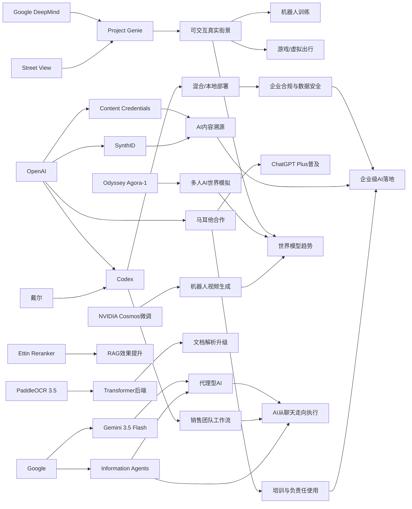

> AI 早报 · 每日早读 · 全网深度聚合

## **今日摘要**

本周AI动态主要集中在三条线：一是产品侧持续升级，Google把Street View接入Genie生成可交互街景世界，OpenAI联合戴尔推进企业私有化Codex部署，PaddleOCR 3.5也引入Transformer后端增强文档理解与部署灵活性。  
二是研究方向明显转向“代理型AI”，Google用Gemini 3.5 Flash强调让模型执行多步任务，DeepSlide则尝试把AI从“做PPT”推进到“辅助完整演讲准备”，同时马耳他与OpenAI合作也体现出AI普及正走向更系统化落地。  
三是行业层面既有人才流动带来的技术路线关注，例如Karpathy加入Anthropic，也有Google这类信息代理开始替用户在后台处理事务，说明AI竞争正从“谁更会聊天”转向“谁更能真正替用户完成工作”。

### 🔵 产品与功能更新

1. **Google Genie可用街景生成可交互世界。**  
Google DeepMind把Street View（街景图像）接入Project Genie（世界模型，可模拟环境变化），让系统不只“看见”街道，还能“走进”街道。用户未来可在模拟环境里查看天气变化、道路细节，甚至测试少见场景。这个方向对机器人训练、游戏制作和虚拟出行都很有想象空间🚀  
[街景世界模型升级简报](https://techcrunch.com/2026/05/19/googles-genie-world-model-can-now-simulate-real-streets-with-street-view/)

2. **OpenAI联手戴尔推进企业版Codex部署。**  
OpenAI与戴尔合作，把Codex（AI编程助手）带到混合部署和本地部署环境。对大型企业来说，这意味着能在更严格的数据安全要求下，把AI编程代理接入内部代码库和工作流。核心价值是“既用上AI，又把数据留在自己可控的环境里”🚀  
[企业私有化Codex简报](https://openai.com/index/dell-codex-enterprise-partnership)

3. **PaddleOCR 3.5接入Transformer后端。**  
PaddleOCR 3.5宣布可用Transformers（神经网络架构，常用于文本与图像理解）后端运行OCR（文字识别）和文档解析任务。它不仅处理图片里的文字，还能进一步理解复杂文档结构。对票据、表单、合同等场景的开发者和企业用户来说，这类升级通常意味着更灵活的部署与更现代的模型支持🚀  
[PaddleOCR升级简报](https://huggingface.co/blog/PaddlePaddle/paddleocr-transformers)

### 🟢 前沿研究

1. **Gemini 3.5 Flash押注“代理型AI”而非聊天机器人。**  
Google发布Gemini 3.5 Flash，并将其定位为更强的编程与代理型模型。所谓代理型AI（Agent），是指不仅能对话，还能自主执行多步任务、调用工具、完成实际工作。Google显然在押注下一波AI竞争不再只是“谁更会聊”，而是谁更能替用户把事情做完🚀  
[Gemini代理化简报](https://techcrunch.com/2026/05/19/with-gemini-3-5-flash-google-bets-its-next-ai-wave-on-agents-not-chatbots/)

2. **DeepSlide想把AI做PPT扩展到“会准备演讲”。**  
DeepSlide是一套human-in-the-loop（人类参与监督）的多代理系统，目标不只生成幻灯片，还覆盖演讲准备全过程。论文指出，很多AI做PPT只优化“成品长得像不像”，却没有优化节奏、叙事和讲述准备。这个研究更贴近真实表达场景，试图让AI从“排版工具”升级为“演讲助手”🚀  
[DeepSlide论文简报](https://arxiv.org/abs/2605.15202)

3. **马耳他与OpenAI合作扩大ChatGPT Plus使用。**  
OpenAI与马耳他合作，为当地公民提供ChatGPT Plus与相关培训。虽然这更像公共服务落地，但其研究意义在于观察全民AI普及后，技能培训和负责任使用能否同步推进。它也反映出，国家层面的AI采用正从试点走向更系统化的推进方式🚀  
[马耳他AI普及简报](https://openai.com/index/malta-chatgpt-plus-partnership)

### 🟡 行业展望与社会影响

1. **Karpathy选择Anthropic，引发前沿人才流向关注。**  
知名AI研究者Andrej Karpathy宣布加入Anthropic，而不是回到老东家OpenAI。报道认为，这不仅是一次个人职业选择，也折射出大模型前沿研发阶段的人才竞争。对行业来说，顶尖研究者流向往往会影响外界对公司技术路线和研究氛围的判断🚀  
[Karpathy去向简报](https://the-decoder.com/prominent-ai-researcher-andrej-karpathy-picks-anthropic-over-former-home-openai-to-get-back-into-frontier-llm-research/)

2. **Google信息代理开始替用户“后台盯消息”。**  
Google推出信息代理（information agents），可以持续监控某个主题，并在出现更新时主动提醒用户。这意味着搜索与信息获取正从“我去查”变成“系统替我盯”。这种变化会影响用户习惯、平台分发逻辑，也可能改变媒体和内容网站的流量来源🚀  
[Google信息代理简报](https://techcrunch.com/2026/05/19/how-to-use-googles-new-information-agents/)

3. **Codex开始进入销售团队日常工作。**  
OpenAI展示了销售团队如何用Codex生成销售管道简报、会前材料、预测复盘、客户计划和停滞项目诊断。它说明AI编程代理的能力正在外溢，不再只服务工程师，也开始进入更偏业务的一线团队。行业层面看，AI工具的价值正从“写代码”扩展到“整理复杂工作输入并生成行动建议”🚀  
[Codex销售应用简报](https://openai.com/academy/codex-for-work/how-sales-teams-use-codex)

### 🟣 开源TOP项目

1. **Ettin推出重排序模型家族。**  
Ettin Reranker Family发布，主打重排序（Reranker，给检索结果再次排序）能力。它常用于搜索、问答和检索增强生成（RAG，把外部知识接入大模型）流程中，帮助系统把更相关的内容排到前面。对开源生态来说，重排序模型虽不如大模型吸睛，却是提升实际效果的关键部件🚀  
[Ettin重排模型简报](https://huggingface.co/blog/ettin-reranker)

2. **Simon Willison总结近半年LLM进展。**  
《The last six months in LLMs in five minutes》是一篇面向行业观察者的快速回顾。它帮助读者在短时间内把握大语言模型近半年的关键变化与趋势。对于追踪开源与模型生态的人来说，这类总结常常是高密度的信息入口🚀  
[半年LLM回顾简报](https://simonwillison.net/2026/May/19/5-minute-llms/#atom-everything)

3. **“心智理论”增强是否真能改善人机互动仍待验证。**  
这篇论文研究Theory of Mind（心智理论，即理解他人意图和心理状态的能力）提升后，是否真的改善Human-AI Interaction（人机互动）。作者指出，许多现有测试只是在做故事题和选择题，未必能代表真实互动表现。结果提醒行业：模型在基准测试上变强，不一定自动转化成更好的真实体验🚀  
[心智理论评测简报](https://arxiv.org/abs/2605.15205)

### 🔴 社媒分享

1. **Agora-1把《黄金眼》做成四人可玩AI模拟。**  
Odyssey发布Agora-1世界模型，可让最多四名玩家同时进入AI生成的游戏世界，并以《GoldenEye 007（黄金眼007）》做演示。系统由两个模型分别负责游戏状态模拟和实时渲染，展示了多人实时交互的潜力。除了游戏，这类能力也可能延展到协作机器人和AI代理训练🚀  
[Agora游戏演示简报](https://the-decoder.com/agora-1-turns-the-n64-classic-goldeneye-into-a-playable-ai-simulation-for-four-players/)

2. **OpenAI推进AI内容溯源与验证。**  
OpenAI介绍了Content Credentials（内容凭证）、SynthID（水印标记技术）和验证工具，用于帮助识别AI生成媒体。随着图像、音频、视频生成越来越逼真，内容“从哪来、是不是合成的”正成为平台与用户都关心的问题。这个方向的社会价值在于提高透明度，降低误导和伪造风险🚀  
[内容溯源方案简报](https://openai.com/index/advancing-content-provenance)

3. **NVIDIA分享机器人视频生成微调方案。**  
NVIDIA介绍如何用LoRA/DoRA（参数高效微调方法）微调Cosmos Predict 2.5，用于机器人视频生成。简单说，就是在不大改原模型的前提下，让模型更适应特定机器人场景。虽然内容偏技术，但在社媒传播上很容易吸引开发者关注“低成本定制生成模型”的思路🚀  
[机器人视频微调简报](https://huggingface.co/blog/nvidia/cosmos-fine-tuning-for-robot-video-generation)

---

📊 行业洞察

1. 事实  
   Google DeepMind将Street View（街景图像）接入Project Genie（世界模型，可模拟环境变化），把静态地图资产升级为可交互、可模拟的真实街道环境；同时，Odyssey的Agora-1展示了四人实时进入AI生成世界的多人交互能力，NVIDIA又给出了面向机器人视频生成的LoRA/DoRA（参数高效微调）方案。  
   【洞察】行业正从“生成内容”迈向“生成环境”。世界模型（World Model）正在成为连接游戏、机器人训练、虚拟出行和多代理协作的新基础设施；谁能同时掌握真实世界数据、环境模拟能力和低成本微调工具，谁就更有机会占据下一代空间智能（Spatial Intelligence）入口。

2. 事实  
   Google发布Gemini 3.5 Flash，明确押注代理型AI（Agent，可自主执行多步任务并调用工具）；Google的信息代理开始替用户持续监控主题并主动提醒；OpenAI则一方面与戴尔合作推进Codex在混合部署/本地部署中的企业落地，另一方面展示Codex已进入销售团队日常工作。  
   【洞察】AI竞争焦点正在从“回答问题”转向“持续执行工作”。代理型AI的核心门槛不再只是模型对话质量，而是任务编排（Task Orchestration）、工具调用（Tool Use）、权限控制与企业系统集成能力。面向企业市场，真正的差异化将越来越体现在“能否安全接入业务流程并稳定交付结果”，而不是单轮基准分数。

3. 事实  
   OpenAI联手戴尔推动企业版Codex私有化部署，回应大型企业对数据安全与合规的要求；OpenAI又推进Content Credentials（内容凭证）、SynthID（水印标记技术）与验证工具；与此同时，马耳他与OpenAI合作扩大ChatGPT Plus使用并配套培训。  
   【洞察】AI正在进入“可治理落地”阶段。行业竞争已不只是模型能力竞赛，还包括部署边界、内容可追溯（Provenance）、用户培训和公共治理框架。未来大规模采用的关键，不是“AI能不能用”，而是“AI能否在合规、可审计、可验证前提下被放心使用”。

4. 事实  
   PaddleOCR 3.5接入Transformer（神经网络架构）后端，增强文档解析灵活性；Ettin推出Reranker（重排序模型）家族，提升检索增强生成（RAG）链路效果；“心智理论”研究则提醒，基准测试提升未必等于真实人机互动改善。  
   【洞察】AI应用层正在回归“系统工程”而非“单模型神话”。企业真正买单的，不一定是最大模型，而是OCR（文字识别）、Reranker、RAG、工作流代理等模块化组件的组合效果。未来应用竞争力将更多取决于端到端体验指标，如准确率、可解释性、延迟与人机协同效率，而非孤立模型榜单排名。

🗺️ 今日关系图

