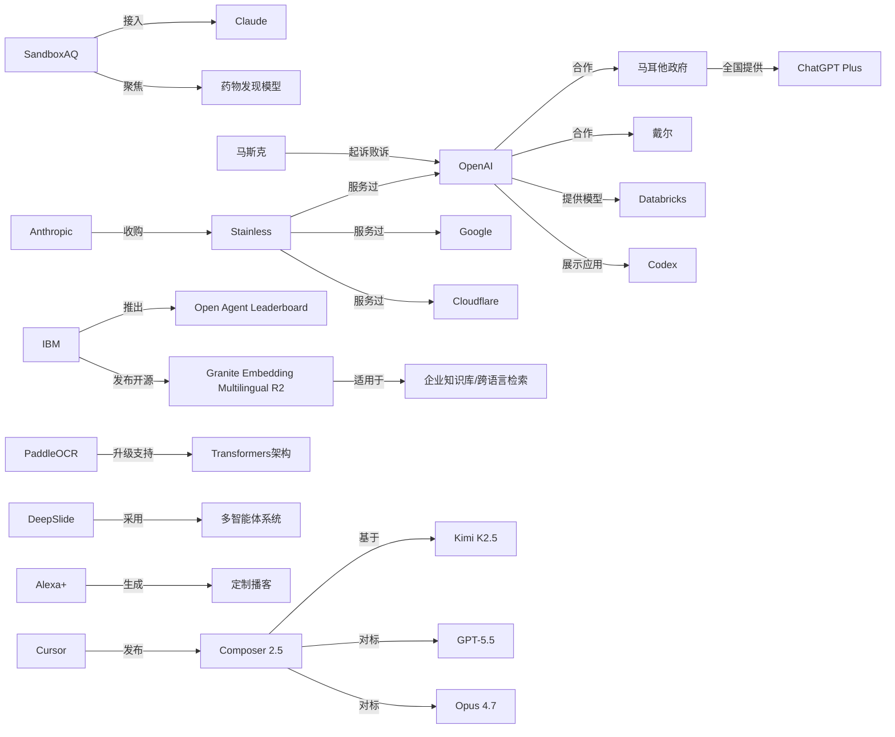

> AI 早报 · 每日早读 · 全网深度聚合

## **今日摘要**

近期AI动态显示，行业重点正从“模型有多强”转向“普通人和企业能否更方便、更低成本地真正用起来”：例如SandboxAQ把药物发现模型接入Claude、OpenAI与马耳他合作推进全民ChatGPT Plus和AI培训、IBM发布轻量开源多语言嵌入模型。  
同时，前沿研究和企业落地都在推进AI从单点能力走向完整工作流，既包括DeepSlide把PPT生成扩展到演讲准备，也包括Databricks将GPT-5.5接入企业智能体流程，以及Anthropic通过收购Stainless补强开发者基础设施。  
整体来看，AI竞争正在从单纯比拼模型能力，转向比拼易用性、集成能力、开发者生态与价格效率，像Cursor Composer 2.5这类“性能接近但成本更低”的产品趋势尤为明显。

### 🔵 产品与功能更新

1. **SandboxAQ把药物发现模型接入Claude。**  
SandboxAQ把原本偏专业的药物发现模型，带到了Claude这一更易用的对话式入口中。文章认为，行业里真正的门槛不一定是模型能力，而是普通研究者能不能方便地用起来。对非计算机背景的科研人员来说，这意味着不必精通复杂编程，也能更直接调用相关能力。🚀  
[药物模型接入助手(briefing)](https://techcrunch.com/2026/05/18/sandboxaq-brings-its-drug-discovery-models-to-claude-no-phd-in-computing-required/)

2. **OpenAI与马耳他合作向全国提供ChatGPT Plus。**  
OpenAI宣布和马耳他合作，向该国公民提供ChatGPT Plus，并配套开展培训。重点不只是发放工具，还包括帮助公众建立实用的AI技能，以及学习负责任地使用AI。对政府推动全民AI普及来说，这是一次比较完整的“产品+教育”落地案例。🚀  
[马耳他全民AI计划(briefing)](https://openai.com/index/malta-chatgpt-plus-partnership)

3. **IBM发布多语言嵌入模型Granite Embedding Multilingual R2。**  
IBM推出开源的多语言嵌入模型（把文本转成可检索向量的模型）Granite Embedding Multilingual R2，采用Apache 2.0许可。摘要强调，它支持32K上下文，并主打在1亿参数以下模型中的检索质量。对做企业知识库、跨语言搜索和问答的团队来说，这是一个更轻量的开源选择。🚀  
[多语言检索新模型(briefing)](https://huggingface.co/blog/ibm-granite/granite-embedding-multilingual-r2)

### 🟢 前沿研究

1. **DeepSlide尝试把AI做PPT扩展到“上台讲好”。**  
DeepSlide是一篇arXiv新论文，关注的不只是生成看起来像样的幻灯片，还包括演讲节奏、叙事结构和展示准备。作者将其描述为“人类参与的多智能体系统”（多个AI模块协同、并保留人工干预）。这说明学术场景里的AI辅助，正在从“做文档”走向“完成整场表达”。🚀  
[DeepSlide研究概览(briefing)](https://arxiv.org/abs/2605.15202)

2. **Databricks把GPT-5.5引入企业智能体工作流。**  
OpenAI介绍，Databricks已在企业智能体工作流中使用GPT-5.5。文章提到，该模型在OfficeQA Pro基准测试中刷新了当前最好成绩。对企业用户而言，这意味着更强的模型正被接入实际业务流程，而不只是停留在演示层面。🚀  
[企业工作流接入GPT(briefing)](https://openai.com/index/databricks)

3. **Anthropic收购开发者工具初创公司Stainless。**  
TechCrunch报道称，Anthropic收购了Stainless，这家公司主要自动化生成和维护SDK（软件开发工具包，帮助开发者调用接口的代码库）。Stainless此前已被OpenAI、Google和Cloudflare等公司使用。此举说明，大模型公司的竞争正在从模型本身延伸到开发者基础设施。🚀  
[Anthropic收购工具商(briefing)](https://techcrunch.com/2026/05/18/anthropic-has-acquired-the-dev-tools-startup-used-by-openai-google-and-cloudflare/)

### 🟡 行业展望与社会影响

1. **Cursor称Composer 2.5以更低成本逼近顶级编码模型。**  
据The Decoder报道，Cursor发布Composer 2.5，称其在基准测试中可匹敌Opus 4.7和GPT-5.5，但成本低得多。该模型建立在Kimi K2.5基础之上，并使用了比前代多25倍的合成任务数据。若数据属实，AI编程市场的竞争将进一步转向“性能接近、价格更低”的路线。🚀  
[低成本编码模型升级(briefing)](https://the-decoder.com/cursors-composer-2-5-matches-opus-4-7-and-gpt-5-5-benchmarks-at-a-fraction-of-the-cost/)

2. **马斯克起诉OpenAI案败诉。**  
TechCrunch报道，马斯克起诉Sam Altman和OpenAI的案件未获支持，陪审团一致认为其诉讼提出得过晚。这个结果意味着围绕OpenAI治理、创始人关系和公司方向的长期争议，至少在这起案件上暂告一段落。对行业而言，这也会影响外界如何看待AI公司治理纠纷的法律边界。🚀  
[马斯克诉OpenAI败诉(briefing)](https://techcrunch.com/2026/05/18/elon-musk-has-lost-his-lawsuit-against-sam-altman-and-openai/)

3. **OpenAI展示业务运营团队如何使用Codex。**  
OpenAI发布案例，介绍业务运营团队如何用Codex生成项目简报、战略更新、管理层决策材料和进度汇报。这里强调的不是写代码本身，而是把真实工作输入整理成结构化输出。对非技术岗位来说，这反映出AI编程/代理工具正在跨出工程部门，进入通用办公流程。🚀  
[运营团队用Codex(briefing)](https://openai.com/academy/codex-for-work/how-business-operations-teams-use-codex)

### 🟣 开源TOP项目

1. **PaddleOCR 3.5支持基于Transformers的OCR与文档解析。**  
PaddleOCR 3.5发布，新增基于Transformers（新一代深度学习架构）的后端能力，用于OCR（光学字符识别）和文档解析。对开发票据识别、表格抽取和文档数字化应用的团队来说，这类升级很实用。它也说明传统文档AI工具正持续吸收大模型时代的新架构。🚀  
[文档识别工具升级(briefing)](https://huggingface.co/blog/PaddlePaddle/paddleocr-transformers)

2. **IBM推出Open Agent Leaderboard。**  
IBM Research在Hugging Face发布Open Agent Leaderboard，聚焦开放智能体（可调用工具、执行多步任务的AI系统）的评测。随着“智能体”成为热门方向，公开榜单有助于让不同方案在统一标准下比较。对开发者社区来说，这类基础设施能推动更透明的能力验证。🚀  
[开放智能体榜单(briefing)](https://huggingface.co/blog/ibm-research/open-agent-leaderboard)

3. **Granite Embedding Multilingual R2以Apache 2.0开源。**  
IBM这次发布的Granite Embedding Multilingual R2不仅强调多语言和长上下文，还明确采用Apache 2.0开源许可。对企业和开发者而言，许可方式会直接影响是否便于商用集成。把“效果、体积、许可”三者结合起来看，它具备成为开源检索组件的潜力。🚀  
[Apache开源嵌入模型(briefing)](https://huggingface.co/blog/ibm-granite/granite-embedding-multilingual-r2)

### 🔴 社媒分享

1. **斯坦福学生反思ChatGPT如何改变校园诚信氛围。**  
The Decoder转述一位斯坦福学生的文章，称ChatGPT让原本就存在的“不太诚实”文化进一步常态化。讨论重点不是单个学生是否作弊，而是AI工具如何改变一整代人的学习与判断边界。这类一线观察在社交平台上很容易引发教育、公平和伦理的持续争论。🚀  
[校园AI诚信争议(briefing)](https://the-decoder.com/a-stanford-student-reflects-on-his-chatgpt-class-and-a-culture-of-just-a-little-bit-of-fraud/)

2. **OpenAI与Dell合作把Codex带入混合与本地部署环境。**  
OpenAI宣布与Dell合作，把Codex带到混合环境和本地部署环境中，帮助企业更安全地在数据与工作流中使用AI编程智能体。这里的关键点是“安全部署”，因为很多大型企业仍然对云端数据流转高度敏感。这个消息也契合近期社交平台对“企业级AI落地”话题的持续关注。🚀  
[Codex联手戴尔落地(briefing)](https://openai.com/index/dell-codex-enterprise-partnership)

3. **Alexa+现在可以按需生成播客节目。**  
TechCrunch报道，亚马逊的新Alexa+功能可以生成定制化AI播客。相比传统语音助手只负责回答问题，这一更新把产品推向了“个性化内容平台”。在社交媒体上，这类功能很容易引出关于内容质量、版权和信息茧房的讨论。🚀  
[Alexa生成播客功能(briefing)](https://techcrunch.com/2026/05/18/amazons-new-alexa-powered-feature-can-generate-podcast-episodes/)

---

📊 行业洞察

1. 事实  
   - SandboxAQ把药物发现模型接入Claude，对非计算机背景科研人员降低使用门槛。  
   - Databricks已在企业智能体工作流中使用GPT-5.5。  
   - OpenAI展示业务运营团队如何使用Codex处理简报、汇报和决策材料。  
   【洞察】AI竞争正从“谁的基础模型更强”转向“谁能把模型嵌入具体工作流”。无论是科研、企业运营还是智能体流程，真正的商业壁垒越来越体现在工作流集成（workflow integration）、可用性设计和场景交付，而不只是模型参数或基准分数。

2. 事实  
   - OpenAI与马耳他合作，向全国提供ChatGPT Plus并配套培训。  
   - OpenAI与Dell合作，把Codex带入混合与本地部署环境。  
   - IBM发布Apache 2.0许可的Granite多语言嵌入模型，并强调企业知识库、跨语言搜索等场景。  
   【洞察】企业级与国家级AI落地正在形成“工具供给+部署安全+使用培训”三件套。也就是说，AI普及不再只是账号发放，而是走向全栈落地（full-stack adoption）：上层有应用，中层有知识检索（embedding，文本向量化检索），底层有本地/混合部署与治理配套。

3. 事实  
   - Anthropic收购Stainless，补强SDK（软件开发工具包）自动生成与维护能力。  
   - IBM推出Open Agent Leaderboard，建立开放智能体统一评测基础设施。  
   - IBM开源Granite Embedding Multilingual R2，突出“效果、体积、许可”平衡。  
   【洞察】大模型厂商的竞争面正在快速外延到开发者基础设施（developer infrastructure）。未来护城河不仅是模型API，还包括SDK生成、评测榜单、开源组件、许可策略等配套能力；谁能降低开发者接入与验证成本，谁就更可能占据生态入口。

4. 事实  
   - Cursor称Composer 2.5以更低成本逼近顶级编码模型表现。  
   - DeepSlide显示多智能体系统已从“生成文档”走向“辅助完整表达与演示”。  
   - Alexa+开始提供按需生成播客。  
   【洞察】AI产品演进出现两个同步趋势：一是成本性能比（price-performance ratio）成为核心竞争轴；二是生成目标从“单次内容产出”升级为“完整内容流程”。编码、演示、播客都说明，用户购买的不再是单点生成能力，而是从创作到交付的整段结果。

🗺️ 今日关系图

