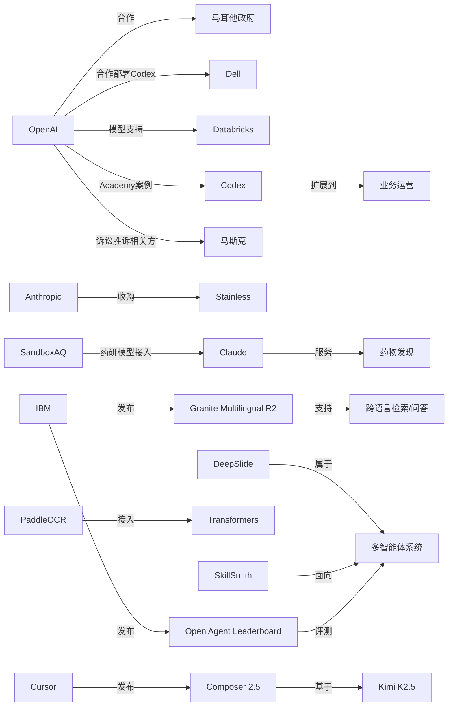

> AI 早报 · 每日早读 · 全网深度聚合

## **今日摘要**

AI 正在从“专家工具”走向“普惠基础设施”：例如 SandboxAQ 将药物发现模型接入 Claude、马耳他向全民提供 ChatGPT Plus、IBM 开源轻量多语言向量模型，都在降低使用门槛并扩大应用范围。  
前沿研究与企业落地同时推进，像 DeepSlide 把 AI 从“生成 PPT”升级为“演讲助手”，而 Databricks 接入 GPT-5.5、Anthropic 收购 Stainless，则说明更强模型和更好的开发者体验正快速进入真实业务流程。  
与此同时，行业竞争也在转向成本与生态层面，Cursor Composer 2.5 强调高性价比，反映出 AI 市场已不只比拼模型能力，也在比拼可用性、开发体验和普及速度。

### 🔵 产品与功能更新
1. **Claude 接入药物发现模型。**  
SandboxAQ 把自家的药物发现模型带到 Claude，让科研或产业用户不需要深厚计算背景，也能用自然语言调用相关能力。文章强调，当前这类模型的门槛不只是效果，还有“可用性”和“上手难度”。这意味着 AI 药研工具正从少数专家使用，走向更广泛的研究团队协作。🚀  
[药研模型接入Claude简报](https://techcrunch.com/2026/05/18/sandboxaq-brings-its-drug-discovery-models-to-claude-no-phd-in-computing-required/)

2. **马耳他向全民提供 ChatGPT Plus。**  
OpenAI 与马耳他合作，计划让全国居民获得 ChatGPT Plus 使用权限，并配套培训资源。重点不只是发放产品，还包括帮助公众建立实际 AI 使用技能，以及理解负责任使用方式。这类国家级合作显示，AI 服务正在从个人订阅走向公共数字能力建设。🚀  
[马耳他全民AI合作](https://openai.com/index/malta-chatgpt-plus-partnership)

3. **IBM 发布多语言向量模型。**  
Granite Embedding Multilingual R2 是 IBM 开源的多语言嵌入模型（把文本转成可检索向量的模型），采用 Apache 2.0 许可。该模型支持 32K 上下文，并主打在 1 亿参数以下模型中的检索质量优势。对企业知识库、跨语言搜索和问答场景来说，这是一个更轻量的开源选项。🚀  
[IBM多语嵌入模型](https://huggingface.co/blog/ibm-granite/granite-embedding-multilingual-r2)

### 🟢 前沿研究
1. **DeepSlide 关注“做演示”而不只“生成幻灯片”。**  
这篇 arXiv 论文提出 DeepSlide，一个人类参与的多智能体系统（多个 AI 模块协作的系统），目标不仅是生成好看的幻灯片，还覆盖节奏、叙事和演讲准备。作者认为，现有 AI 做 PPT 往往过度关注成品外观，而忽略最终呈现效果。这个方向把 AI 从“文档生成器”推进到“演讲助手”。🚀  
[DeepSlide论文速览](https://arxiv.org/abs/2605.15202)

2. **Databricks 将 GPT-5.5 用于企业智能体流程。**  
OpenAI 介绍，Databricks 已把 GPT-5.5 用到企业智能体工作流（由 AI 自动处理部分业务流程）中。文中提到，该模型在 OfficeQA Pro 基准测试上达到新的最好成绩。对企业用户来说，这类合作释放的信号是：更强模型正快速进入真实业务编排而非停留在演示阶段。🚀  
[Databricks接入GPT-5.5](https://openai.com/index/databricks)

3. **Anthropic 收购开发者工具初创公司 Stainless。**  
TechCrunch 报道，Anthropic 收购了 Stainless，这家公司以自动生成和维护 SDK（软件开发工具包）闻名，客户包括 OpenAI、Google 和 Cloudflare。SDK 是开发者调用 API（应用接口）时最常用的桥梁，因此这次收购有助于 Anthropic 强化开发者生态。也说明模型公司竞争已延伸到“开发体验”层面。🚀  
[Anthropic收购Stainless](https://techcrunch.com/2026/05/18/anthropic-has-acquired-the-dev-tools-startup-used-by-openai-google-and-cloudflare/)

### 🟡 行业展望与社会影响
1. **Cursor Composer 2.5 主打更低成本的编程 AI。**  
The Decoder 报道称，Cursor 的 Composer 2.5 在基准测试中可比肩 Opus 4.7 与 GPT-5.5，但价格更低。该模型基于 Kimi K2.5，并在更多合成任务（人工构造训练任务）上训练。对市场而言，这反映出编程模型竞争已从“谁最强”转向“谁更有性价比”。🚀  
[Cursor编程模型观察](https://the-decoder.com/cursors-composer-2-5-matches-opus-4-7-and-gpt-5-5-benchmarks-at-a-fraction-of-the-cost/)

2. **马斯克起诉 OpenAI 案败诉。**  
TechCrunch 报道，马斯克针对 Sam Altman 和 OpenAI 的诉讼败诉，陪审团一致认定其起诉时间过晚。案件聚焦于 OpenAI 的治理与创始人关系，也一直被外界视作 AI 行业权力与利益冲突的缩影。此次结果短期内有助于降低相关法律不确定性，但争议并未真正结束。🚀  
[马斯克诉OpenAI败诉](https://techcrunch.com/2026/05/18/elon-musk-has-lost-his-lawsuit-against-sam-altman-and-openai/)

3. **OpenAI 展示业务运营团队如何使用 Codex。**  
OpenAI Academy 介绍了业务运营团队使用 Codex 的方式，包括生成项目简报、战略更新和管理层决策材料。重点不在写代码，而在把真实工作输入快速整理成结构化输出。它说明“AI 编码助手”正在扩展为更广义的知识工作助手。🚀  
[运营团队用Codex](https://openai.com/academy/codex-for-work/how-business-operations-teams-use-codex)

### 🟣 开源TOP项目
1. **PaddleOCR 3.5 接入 Transformers 后端。**  
PaddleOCR 3.5 发布，支持用 Transformers（主流深度学习模型框架）后端运行 OCR（文字识别）和文档解析任务。对于开发者与企业用户，这意味着文档处理流程更容易与现有大模型工具链衔接。文档 AI 正在从单点识别走向统一处理平台。🚀  
[PaddleOCR更新解读](https://huggingface.co/blog/PaddlePaddle/paddleocr-transformers)

2. **Open Agent Leaderboard 发布。**  
IBM Research 在 Hugging Face 发布了 Open Agent Leaderboard，用于评估开放智能体（能调用工具、执行任务的 AI 系统）表现。排行榜的价值在于让不同智能体方案有更可比较的公开标准。随着“智能体”热度上升，这类评测基础设施会越来越重要。🚀  
[开放智能体排行榜](https://huggingface.co/blog/ibm-research/open-agent-leaderboard)

3. **过去六个月 LLM 变化被浓缩成五分钟。**  
Simon Willison 发布了一篇简短回顾，试图用五分钟概览最近半年大语言模型（LLM）领域的重要变化。虽然不是代码项目发布，但它对理解开源与产品生态演进很有参考价值。对于想快速补课的读者，这是高密度信息入口。🚀  
[五分钟看LLM半年](https://simonwillison.net/2026/May/19/5-minute-llms/#atom-everything)

### 🔴 社媒分享
1. **斯坦福学生反思 ChatGPT 与学术诚信。**  
The Decoder 转述了一篇学生视角文章，讨论 ChatGPT 如何影响一整个毕业班，并放大学术环境中“少量作弊也没关系”的文化。它提供的不是技术评测，而是一线校园观察。对教育行业来说，这类讨论会持续影响 AI 在课堂中的规则制定。🚀  
[校园AI诚信讨论](https://the-decoder.com/a-stanford-student-reflects-on-his-chatgpt-class-and-a-culture-of-just-a-little-bit-of-fraud/)

2. **OpenAI 与戴尔合作推进企业内部署 Codex。**  
OpenAI 与 Dell 合作，把 Codex 带入混合部署和本地部署环境，帮助企业在更安全的前提下使用 AI 编码智能体。这里的重点是满足企业对数据、安全和工作流整合的要求。也说明大型组织采用 AI，越来越取决于部署方式而不只是模型能力。🚀  
[戴尔联手OpenAI部署Codex](https://openai.com/index/dell-codex-enterprise-partnership)

3. **SkillSmith 研究智能体技能运行接口。**  
这篇 arXiv 论文提出 SkillSmith，关注如何把智能体技能（可复用任务能力）编译成运行时接口，从而减少现有技能注入方式带来的问题。作者认为，传统做法通常只是把技能当作上下文提示，可能影响执行稳定性。对关注智能体工程化的人来说，这是偏底层但很关键的话题。🚀  
[SkillSmith论文摘要](https://arxiv.org/abs/2605.15215)

---

📊 行业洞察

1. 事实  
   - SandboxAQ 将药物发现模型接入 Claude，使用户可通过自然语言调用药研能力。  
   - OpenAI 与马耳他合作，向全国居民提供 ChatGPT Plus，并配套培训。  
   - OpenAI Academy 展示业务运营团队如何使用 Codex 处理简报、战略更新和决策材料。  
   【洞察】AI 正从“专家工具”转向“普惠型工作界面”，竞争重点已不只是模型精度，而是“可用性 + 培训 + 场景嵌入”三位一体。无论是药物研发、公共服务还是企业运营，厂商都在把自然语言界面（Natural Language Interface）做成新的人机协作入口，降低高门槛系统的使用成本。

2. 事实  
   - Anthropic 收购 Stainless，以强化 SDK（软件开发工具包）生成与维护能力。  
   - OpenAI 与 Dell 合作推进 Codex 的混合部署和本地部署。  
   - Databricks 将 GPT-5.5 用于企业智能体工作流。  
   - IBM 发布开源多语言嵌入模型，并推出 Open Agent Leaderboard。  
   【洞察】AI 产业竞争正在从“模型军备赛”升级为“企业落地基础设施竞争”。SDK、部署架构、评测体系、检索模型（Embedding Model，嵌入模型）和工作流编排正成为新的护城河。谁能把模型接入企业现有 IT 栈（信息技术系统）、满足安全合规并提供稳定开发体验，谁更有机会拿下大客户。

3. 事实  
   - Cursor Composer 2.5 以更低成本对标 Opus 4.7 与 GPT-5.5。  
   - IBM Granite Embedding Multilingual R2 主打 1 亿参数以下的检索质量优势，并采用 Apache 2.0 开源许可。  
   - PaddleOCR 3.5 接入 Transformers 后端，提升与主流大模型工具链兼容性。  
   【洞察】AI 市场正进入“性能/成本比”主导的新阶段。轻量模型、小参数模型与开源组件的价值持续上升，企业采购逻辑也会从“追逐最强模型”转向“按任务选择最优性价比栈”。这会加速分层市场形成：旗舰模型负责复杂推理，轻量开源模型负责高频、标准化、可控成本任务。

4. 事实  
   - DeepSlide 关注从生成幻灯片扩展到叙事、节奏与演讲准备。  
   - SkillSmith 研究将智能体技能编译成运行时接口，提升执行稳定性。  
   - Open Agent Leaderboard 为开放智能体提供公开评测标准。  
   【洞察】智能体（Agent，能调用工具执行任务的 AI 系统）正在从“会生成内容”走向“可执行、可评估、可复用”的工程化阶段。行业焦点已从单次输出质量，转向任务分解、技能封装、运行稳定性和标准化评测；这意味着 2026 年后智能体竞争的核心，将是系统工程能力而非单模型能力。

🗺️ 今日关系图

