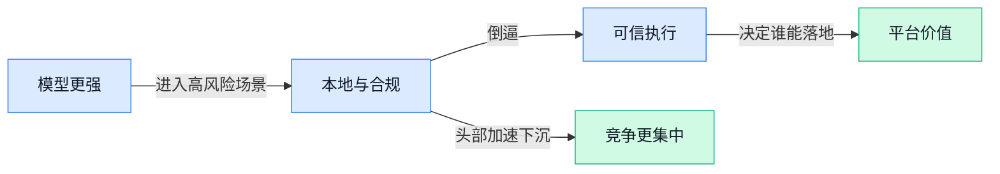

> AI 早报 · 每日早读 · 全网深度聚合

## **今日摘要**

```
Anthropic连环出手：收购Stainless（API开发工具商），Claude for Legal开源，还把Claude Mythos漏洞直通全球金融监管
OpenAI与戴尔联手把Codex送进本地和混合部署，马斯克围绕OpenAI的1340亿美元诉讼遭陪审团火速驳回
AI创业公司年收入冲上800亿美元却被OpenAI、Anthropic大口吃下，Qwen 3.7 Preview预告搅动新一轮模型大战
```

### 🔵 产品与功能更新

1. **Anthropic 将向全球金融监管机构通报 Claude Mythos（Claude 的网络安全研究系统）发现的网络漏洞。**
这条更新的重点不只是“发现了漏洞”，而是 Anthropic 准备把 **Claude Mythos**（用于发现网络安全问题的 AI 系统）找到的结果正式带到**金融监管**场景里，说明 AI 在高风险行业的实际作用又往前走了一步 🛡️。对银行、支付、保险这类机构来说，网络缺陷往往不是单个技术问题，而是会直接影响合规、风控和客户信任。Anthropic 此举也释放出一个信号：AI 不只会写文案、写代码，还开始参与更严肃的**安全审查**和跨机构沟通。[完整报道(briefing)](https://the-decoder.com/anthropic-to-brief-global-financial-regulators-on-cyber-flaws-found-by-claude-mythos/)


2. **教皇利奥启动 AI 委员会，并将在发布教宗通谕前听取 Anthropic 联合创始人意见。**
这不是一次普通的科技站台，而是宗教机构开始更系统地介入 **AI 治理** 讨论 ✍️。报道提到，教皇利奥在发布教宗通谕（天主教教宗发布的重要公开信，通常用来阐明重大社会议题立场）前，先成立了 **AI 委员会**，并引入 Anthropic 联合创始人的观点，说明 AI 已经被放到伦理、社会影响和公共治理层面来审视。对企业来说，这类动作虽然不直接等于产品发布，但会持续影响未来关于 AI 使用边界、责任划分和行业规范的讨论。[完整报道(briefing)](https://news.google.com/rss/articles/CBMiqAFBVV95cUxOMFdCV1Boek9tYmZ1cWpUOFlwNkg1SmUtS2F0OUtqRnlvN18wZ0RZTGQ1QjczcjdHdWtIRkFVZThtWTFBbk1MckUydFpNY3BEZDhPLU85cnR1Wjd5SWlRTEh5OXh4dFBzOGJmdkI1Nm9CeGVDQ1BWOXFDRXVWSlN4Rk5rbW5lTHZLekdtVThZZTFTd2E1NURRTkt2SVV5TVFvdjBXTGc5OEE?oc=5)

3. **OpenAI 与戴尔合作，把 Codex 带进混合部署和本地部署企业环境。**
这次合作瞄准的是很多大公司最在意的一点：既想用 **AI 编码助手**，又不想把核心数据完全放到外部云端 🔐。OpenAI 表示，将通过与戴尔合作，让 Codex 能进入 **混合部署**（一部分系统放云上、一部分放企业自己机房）和 **本地部署**（直接部署在企业内部服务器）的环境，帮助企业在更强调安全与合规的前提下使用 AI 写代码。对金融、医疗、制造等数据敏感行业来说，这意味着 AI 编码工具离真正大规模落地又近了一步。[官方发布页(briefing)](https://openai.com/index/dell-codex-enterprise-partnership)

### 🟢 前沿研究

1. **The Open Agent Leaderboard（开放 Agent 排行榜）想把“谁家 AI 助手真能干活”这件事测清楚。**
这份来自 IBM Research（IBM 的研究团队）的榜单，核心是在比较不同 **Agent** 在真实任务中的完成能力，而不是只看聊天表现 📊。对不懂技术的同事来说，它的意义很直接：以后判断一个 AI 产品靠不靠谱，可能要看它能不能在统一标准下完成多步骤任务，而不只是“会不会说”。这也说明行业正在从“比模型会不会答题”，转向“比 AI 能不能真正执行工作流程” 🚀。可先看 [排行榜介绍文章(briefing)](https://huggingface.co/blog/ibm-research/open-agent-leaderboard)。


2. **Look Before You Leap（“先看再跳”的自主探索方法）研究 LLM Agents（大模型驱动的智能体）如何少走弯路。**
这篇论文关注的是：让 **LLM Agents** 在真正执行任务前，先做 **autonomous exploration（自主探索，先摸清环境再行动）**，避免一上来就乱点乱试 🤖。通俗说，它像是在教 AI 助手先“观察办公室布局”再去办事，而不是拿到任务就直接冲。对企业应用很关键，因为很多工作流程一旦点错、填错、删错，代价并不低；如果 AI 能先探路，稳定性会更高 💡。可查看 [论文页面(briefing)](https://huggingface.co/papers/2605.16143)。


3. **PAGER（一种让 AI 更精准操作图形界面的控制方法）瞄准 GUI Control（图形界面操作）“看得懂却点不准”的老问题。**
这项研究要解决的是 **semantic-execution gap（语义与执行之间的落差，也就是 AI 明白你的意思，却无法在界面上准确点到那个按钮）**。论文强调 **point-precise geometric GUI control（像素级精确界面控制，让 AI 在屏幕上更准地点击和拖拽）**，这对网页自动化、软件操作助手、客服后台代办都很重要 🖱️。如果这类能力成熟，未来 AI 不只是“告诉你怎么做”，而是可能真正替你在系统里完成那一步。详情可见 [PAGER 论文页(briefing)](https://huggingface.co/papers/2605.15963)。

4. **GQLA（分组查询潜注意力，一种为不同硬件优化的大模型解码方案）想让大模型跑得更聪明。**
这篇论文讨论的是 **decoding（解码，也就是模型生成回答时逐字往外写的过程）** 如何更适配不同硬件环境，而不是只追求单一场景下的最快速度 ⚙️。其中的 **latent attention（潜在注意力，一种试图减少计算负担的注意力机制）**，可以理解成“别每次都把全部信息翻一遍，而是更有重点地查”。对业务侧的意义在于：同样一个模型，未来可能能在不同服务器、不同设备上跑得更省钱、更稳、更快。可参考 [GQLA 论文页(briefing)](https://huggingface.co/papers/2605.15250)。

5. **Solvita（一套用 Agentic Evolution〈智能体式进化〉增强大模型编程能力的方法）瞄准竞赛级代码推理。**
论文标题里的 **competitive programming（算法竞赛编程，强调复杂推理和严格正确性）**，比日常写点脚本难得多，所以常被拿来测试模型的深度思考能力 🧠。而 **Agentic Evolution（智能体式进化，让多个 AI 迭代试错、筛选更优解）** 的思路，说明研究者不只是在“喂更多数据”，而是在让 AI 像团队协作一样不断改进答案。对普通公司来说，这类研究未必明天就能直接落地，但它会推动 AI 在复杂规则、严谨流程、自动修正错误等场景里更可靠。可查看 [Solvita 论文页(briefing)](https://huggingface.co/papers/2605.15301)。

6. **Agentic Discovery of Neural Architectures（用智能体自动发现神经网络结构）提出 AIRA-Compose 和 AIRA-Design 两套方案。**
这里的 **neural architectures（神经网络结构，决定 AI 模型“脑子怎么搭”的设计图）**，原本很依赖研究员手工试验；这篇工作则想让 **Agentic Discovery（智能体式发现，让 AI 自己参与设计与筛选）** 承担更多探索任务 🔬。如果说过去是专家一版版画图纸，现在更像是让 AI 帮忙生成、组合、评估大量候选方案。对行业的长远影响在于，未来新模型的诞生速度可能进一步加快，研发门槛也可能被继续压低。详见 [AIRA 论文页(briefing)](https://huggingface.co/papers/2605.15871)。

7. **FFAvatar（一种少样本、前馈式的数字人重建方法）探索更省步骤的 Avatar（虚拟化身）生成。**
标题里的 **few-shot（少样本，只用很少示例就能学会）**，意味着它希望减少对大量素材的依赖；而 **feed-forward（前馈式，一次输入后直接生成结果，少走反复优化步骤）**，通常代表速度更快 ⏱️。对于数字人、虚拟客服、游戏形象、品牌代言人等方向，这类研究的价值在于：未来也许用更少照片、更短时间，就能生成更可用的虚拟形象。可先看 [FFAvatar 论文页(briefing)](https://huggingface.co/papers/2605.15320)。

8. **PhysBrain 1.0（PhysBrain 物理推理模型 1.0）发布技术报告，继续把大模型能力往“懂物理规律”推进。**
从标题看，这是一份 **technical report（技术报告，用来系统说明模型设计、能力与实验结果的正式文档）**，聚焦 **PhysBrain 1.0** 的研究进展 📘。这类工作通常不是做更会聊天的 AI，而是测试模型能否在物理规律、因果关系、过程推演上更扎实地思考。对企业用户来说，短期看它离日常办公有点远，但长期会影响 AI 在制造、教育、工程模拟等高要求场景里的可信度。可参考 [PhysBrain 技术报告(briefing)](https://huggingface.co/papers/2605.15298)。

### 🟡 行业展望与社会影响

1. **教宗良十四世发布首份 AI 通谕（天主教最高层级的重要教义文件），Anthropic 联合创始人受邀参与。**
这件事的象征意义很强：AI 讨论正在从科技公司和监管机构，进一步走向**宗教伦理**与**人类尊严**层面。报道提到，教宗良十四世将发布聚焦**human dignity（人的尊严，强调技术不能把人当成工具或数据对象）**与 AI 的文本，Anthropic 联合创始人也被邀请作为嘉宾发言，说明前沿 AI 公司开始更直接进入公共价值讨论 💡。对普通职场人来说，这释放了一个明确信号：未来评价 AI，不只看效率和成本，还会越来越看它是否尊重人、保护人、服务人。[完整报道(briefing)](https://the-decoder.com/pope-leo-xiv-presents-first-ai-encyclical-anthropic-co-founder-invited-as-guest-speaker/) [卫报相关消息(briefing)](https://news.google.com/rss/articles/CBMilwFBVV95cUxNM0JZa0Q0T09iRHctOEZubUdPbklKNUYtbnA5RU1fMVVlWmNrZW5zRnRFSjB1bXJJU1JZSS1wSGc2M25WX255N29LSy00cVhPdGpMRGVCMWZ0REY1ZFZEQXpLZ25pU0xScHlMQlVtLVdJZGgxc3RHdXg5OWtJLXpmNFA5cFJrYXJ5UDd0ajVCcXc1VExqeHhn?oc=5)


2. **马斯克败诉，围绕 OpenAI 的 1340 亿美元诉讼案被陪审团快速驳回。**
这起案件的看点不只是名人纠纷，更是 AI 行业**控制权**、**创始人关系**和**公司治理**的一次集中曝光。报道显示，加州陪审团仅用约两小时就作出裁决，且认为马斯克的诉讼提出得太晚，未支持其相关主张 ⚖️。对行业来说，这意味着 OpenAI 面临的一项高关注度法律不确定性暂时落地；对企业管理者来说，也再次提醒大家：AI 公司竞争再激烈，最终很多争议仍要回到**法律时效**和**治理结构**这些“基本盘”。[案件报道(briefing)](https://the-decoder.com/elon-musk-loses-his-134-billion-lawsuit-against-openai-after-jury-deliberates-for-just-two-hours/) [TechCrunch 解读(briefing)](https://techcrunch.com/2026/05/18/elon-musk-has-lost-his-lawsuit-against-sam-altman-and-openai/)


3. **AI 创业公司年收入冲到 800 亿美元，但大部分被 OpenAI 和 Anthropic 吃下。**
这条消息直指一个残酷现实：AI 看起来百花齐放，但商业化收入正在高度向头部集中。报道称，AI 创业公司整体收入已达到 **80 billion（800 亿美元）**，但 Anthropic 和 OpenAI 拿走了其中几乎全部增量，说明这个市场并不是“谁都能分一杯羹” 📈。对业务、财务和管理团队来说，这意味着未来采购 AI 服务时，头部平台的话语权可能更强；而对创业公司而言，单靠“接入大模型”已很难建立护城河，必须找到更具体的行业场景和客户价值。[收入格局报道(briefing)](https://the-decoder.com/ai-startup-revenue-hits-80-billion-but-anthropic-and-openai-take-almost-all-of-it/)

4. **Anthropic 收购 Stainless（帮开发者自动生成和维护软件工具包的创业公司），加码开发者生态。**
Stainless 的核心能力是自动创建和维护 **SDK（软件开发工具包，相当于让开发者更方便接入某个服务的“说明书+现成工具箱”）**，而 SDK 又直接关系到 **API（应用程序接口，让不同软件彼此“对接说话”的通道）** 好不好用。TechCrunch 提到，这家公司已被 OpenAI、Google 和 Cloudflare 使用，说明它在开发者工具圈已有相当认可度 🚀。这笔收购的意义在于，Anthropic 不只是在拼模型能力，也在补齐“让企业更容易接入和持续使用”的基础设施；对最终客户来说，未来可能感受到的是接入更顺、维护更省、上线更快。[官方公告(briefing)](https://www.anthropic.com/news/anthropic-acquires-stainless) [收购报道(briefing)](https://techcrunch.com/2026/05/18/anthropic-has-acquired-the-dev-tools-startup-used-by-openai-google-and-cloudflare/)

### 🟣 开源TOP项目

1. **Claude for Legal（Anthropic 面向法律工作流的插件套件）开源，瞄准法务提效场景。**  
这个项目主打**法律工作流**，本质上是一组围绕 Claude 构建的插件，方便把 AI 接入合同审阅、法律资料整理等环节 💼。对企业法务、合规和需要频繁处理文本材料的团队来说，这类插件套件意味着 AI 不只是“会聊天”，而是能更贴近真实业务流程。虽然原始介绍比较简短，但能看出它强调的是**插件化接入**，也就是按模块把能力装进现有流程里，更利于团队落地使用。[GitHub 仓库页(briefing)](https://github.com/anthropics/claude-for-legal)


2. **CloakBrowser（一款可绕过机器人识别的 Chromium 浏览器改造版）主打“更像真人”的自动化。**  
它基于 Chromium（Google 开源的浏览器内核，很多浏览器都建立在它上面），核心卖点是通过**指纹补丁**让自动化操作更难被网站识别成机器人 🤖。项目还提到自己可以作为 Playwright（常见网页自动化测试工具）的“即插即用替代品”，对做网页抓取、自动化测试和批量操作的团队很有吸引力。摘要里给出的“30/30 测试通过”，说明它在**反检测**这件事上把兼容性作为重点来打磨。[项目仓库说明(briefing)](https://github.com/CloakHQ/CloakBrowser)


3. **agentmemory（给 AI 编码 Agent 用的持久记忆系统）想解决“做完就忘”的老问题。**  
所谓**持久记忆**，就是让 AI 编码 Agent（能自动写代码、改代码的智能助手）在多轮任务之间保留上下文，不会每次都像“失忆重来” 🧠。项目摘要强调它基于**真实世界基准测试**，也就是不是只在演示环境里好看，而是试图对准更接近实际使用的任务表现。对需要长期协作、跨文件改代码的团队来说，这类能力很关键，因为 AI 真正好不好用，往往就差在“记不记得之前做过什么”。[GitHub 项目页(briefing)](https://github.com/rohitg00/agentmemory)


4. **RuView（把普通 WiFi 信号变成空间感知工具的项目）探索“无摄像头感知”新路线。**  
这个项目最特别的地方，是不用摄像头画面，只靠普通 WiFi 信号就能做**空间智能**、**在场检测**和**生命体征监测** 📶。你可以把它理解成：通过分析无线信号在空间里的变化，来判断人是不是在、有没有移动，甚至监测一些生理状态；这类思路通常被称为**空间感知**，适合对隐私更敏感的场景。相比视频监控，它强调“没有一帧画面”，因此在隐私友好和部署成本上更容易引起关注。[项目仓库介绍(briefing)](https://github.com/ruvnet/RuView)

5. **DeepSeek-TUI（一款运行在终端里的 DeepSeek 编码 Agent）把命令行变成 AI 编程台。**  
这里的 TUI（终端用户界面，就是在黑底命令行里做出可交互操作的界面）意味着它不是网页应用，而是直接在开发者常用的终端里运行 ⌨️。项目定位很明确：它是给 DeepSeek 模型使用的**编码 Agent**，也就是让模型在写代码、改代码、执行开发任务时更像一个可操作的助手。对技术团队来说，这类工具的价值在于减少来回切网页的打断；而对非技术同事来说，也能看出行业趋势——AI 正越来越深地嵌进专业工作台，而不只是聊天窗口。[GitHub 仓库页(briefing)](https://github.com/Hmbown/DeepSeek-TUI)

6. **openhuman（主打私有化与个人使用的 AI 超级助手）走“个人智能体”路线。**  
从项目摘要看，它强调 **Private**（私有化，数据尽量留在自己掌控范围内）、**Simple**（使用门槛低）和 **powerful**（能力强）这三个关键词 🔐。所谓“个人 AI 超级智能”，可以理解为把多个 AI 能力整合成一个更贴身的助手，而不是只完成单一问答任务。对很多担心数据外泄、又希望拥有专属 AI 助手的用户来说，这种**个人优先、隐私优先**的开源方向很有吸引力。[开源项目仓库(briefing)](https://github.com/tinyhumansai/openhuman)

### 🔴 社媒分享

1. **PaddleOCR 3.5（飞桨推出的文字识别与文档解析工具）接入 Transformers（HuggingFace 主流模型调用框架）后端。**  
这次更新的核心看点，是把 **OCR**（光学字符识别，把图片里的字变成可编辑文字）和**文档解析**能力，放进了更多人熟悉的 Transformers 生态里 💡。对非技术团队来说，这意味着后续做发票、合同、表单、扫描件处理时，相关 AI 工具更容易接入现有流程，落地门槛也更低。文章来自 HuggingFace（全球最大 AI 模型共享社区）官方博客，适合想了解“文档类 AI”怎么更方便部署的人看看。[官方技术博客(briefing)](https://huggingface.co/blog/PaddlePaddle/paddleocr-transformers)


2. **Anthropic 收购 Stainless（一家专做 API 开发工具的创业公司）。**  
这笔收购释放出的信号很直接：Anthropic 正在补强 **API**（让不同软件彼此连接、调用能力的接口）工具链，想让开发者更顺手地把 Claude 接进产品里 🚀。Stainless 的定位偏“开发基础设施”，简单说就是帮企业更规范、更高效地把 AI 能力封装成可用服务。对业务同事而言，这类动作往往预示着未来企业接入大模型会更省事，AI 不只是“能聊”，而是更容易真正嵌入工作系统中。[Anthropic 官方消息(briefing)](https://www.anthropic.com/news/anthropic-acquires-stainless)


3. **马斯克败诉：针对 Sam Altman 和 OpenAI 的诉讼未获支持。**  
这条新闻的重点不在技术，而在 **AI 行业治理**和公司控制权争议仍在持续发酵。对普通职场人来说，可以把它理解为：大模型竞争已经不只是拼产品，也越来越涉及法律、组织结构和商业路线之争 ⚖️。这类案件虽然不会直接改变你今天用 ChatGPT 的方式，但会持续影响头部 AI 公司的合作、融资和市场叙事。[完整报道(briefing)](https://techcrunch.com/2026/05/18/elon-musk-has-lost-his-lawsuit-against-sam-altman-and-openai/)

4. **Qwen 3.7 Preview（Qwen 新一代预览版模型）放出预告。**  
目前公开信息很克制，核心就是阿里 Qwen 官方账号已开始对 **Preview**（预览版，先给外界看的测试阶段版本）进行预热 👀。这通常意味着正式更新临近，外界会重点关注它在回答质量、速度和多场景适配上的变化。对企业用户来说，Qwen 每次迭代都值得留意，因为国产大模型的升级会直接影响后续选型、采购和内部 AI 应用方案。[官方预告贴文(briefing)](https://twitter.com/Alibaba_Qwen/status/2056403591464984753)

5. **英伟达 Cosmos Predict 2.5（一款面向机器人场景的视频生成模型）可用 LoRA/DoRA（两种低成本微调方式）做机器人视频生成微调。**  
这篇文章讨论的是，如何在不从头训练大模型的前提下，用 **fine-tuning**（微调，用特定数据把模型调得更适合某个任务）让模型更懂机器人视频场景 🤖。其中 LoRA（低成本微调技术，像给大模型外挂一小层“补丁”）和 DoRA（LoRA 的一种改进思路）能明显降低算力和成本门槛。对行业的意义在于：机器人训练和仿真内容生成，未来可能更快从“实验室项目”走向更可复用的生产工具。[HuggingFace 技术解读(briefing)](https://huggingface.co/blog/nvidia/cosmos-fine-tuning-for-robot-video-generation)

---



### 📊 行业洞察（今日 4 条）

1. OpenAI联手戴尔做本地部署，Anthropic让Claude Mythos进入金融监管
  【洞察】两件事放一起看，AI下一阶段拼的不是“更会答”，而是“敢不敢进高风险场景”；谁能解决数据边界、责任边界，谁才更容易吃到大单

2. IBM做开放 Agent 排行榜，PAGER研究“看得懂也点得准”，Look Before You Leap研究“先探路再动手”
  【洞察】行业正在把Agent评价标准，从会聊天切到会执行；能不能稳定完成多步骤任务，正在成为比模型名气更重要的分水岭

3. Anthropic收购Stainless（帮企业更顺手接入AI的工具公司），还开源Claude for Legal（面向法务流程的插件套件）
  【洞察】头部公司不再只卖模型，开始抢“接入入口”和“行业工作流”；模型能力会越来越像水电，真正值钱的是离业务更近的那层

4. AI创业公司年收入到800亿美元，但增量大多被OpenAI和Anthropic拿走；马斯克起诉OpenAI又快速败诉
  【洞察】这个行业表面热闹，实际更集中、也更强者恒强；创业公司既难靠通用能力赚钱，也很难靠舆论和资本故事撼动头部格局

### 💭 对我们的启发（今日 3 条）

1. IBM做开放 Agent 排行榜，说明我们不能只展示“哪个Agent便宜或能聊”，得尽早建立任务完成率、出错率、人工接管率这类信任评分体系。

2. OpenAI做本地部署、Anthropic进金融监管，提醒我们平台以后若想碰企业或高风险场景，必须从第一天就设计可追溯、可回看、可中途叫停的机制。

3. Anthropic一边收购Stainless、一边推法务插件，说明平台型机会在“调度+场景封装”而不在裸模型；但坏消息是头部也正往这层下沉，我们窗口期不会太长。


---

> 本周周报：[第21周综合分析](https://zhuxinfei.github.io/ai-daily-site/blog/weekly/2026-w21/)
