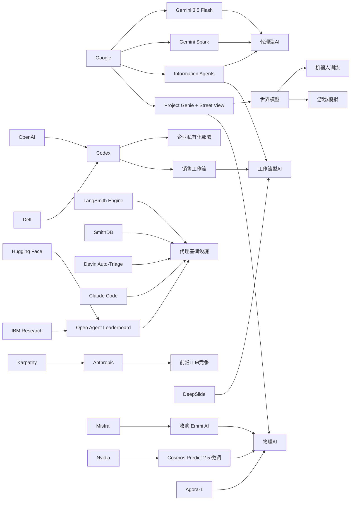

> AI 早报 · 每日早读 · 全网深度聚合

## **今日摘要**

这组动态显示，AI 正从“会回答问题的模型”加速走向“能持续执行任务的代理”：一方面 Google 把 Street View 接入 Genie、推出押注 agents 的 Gemini 3.5 Flash，另一方面 OpenAI 与 Dell 推进企业私有化 Codex、LangSmith/SmithDB 等基础设施也在补齐生产落地能力。  
前沿研究与人才流动同样围绕这一方向展开，Karpathy 加盟 Anthropic 反映头部实验室对大模型关键阶段的争夺，而 DeepSlide 等研究则说明 AI 正更贴近真实工作流程，而不只是生成表面内容。  
整体来看，行业正在同时推进三件事：让模型更接近真实世界、让代理真正进入企业环境、让 AI 从聊天工具升级为可全天候协作的个人与组织助手。

### 🔵 产品与功能更新

1. **Google Genie 可用街景生成可交互街道世界。**  
Google DeepMind 把 Street View（街景）接入 Project Genie（世界模型，可模拟环境的 AI 系统），让系统不只会“看图”，还可以生成可探索的真实街道场景。用户未来能在模拟环境中查看天气变化、道路状态，甚至测试少见场景。这个能力对机器人训练、游戏制作和旅行预览都很有想象空间🚀  
[街景世界模拟升级(briefing)](https://techcrunch.com/2026/05/19/googles-genie-world-model-can-now-simulate-real-streets-with-street-view/)

2. **OpenAI 联合戴尔推进企业版 Codex 部署。**  
OpenAI 与 Dell 合作，把 Codex（AI 编程助手）带到混合云和本地部署环境，方便大企业在自有数据和内部流程中使用。重点在于“安全可控”，尤其适合对数据合规要求高的公司。对于希望把 AI 编程能力接入研发体系的企业，这是更现实的落地路径🚀  
[企业私有化部署Codex(briefing)](https://openai.com/index/dell-codex-enterprise-partnership)

3. **LangSmith Engine、SmithDB 等代理基础设施持续完善。**  
当天虽无单一爆款发布，但代理基础设施（Agent infrastructure，支撑 AI 代理运行的底层工具）更新密集。LangSmith Engine 强调给代理加入 CI/CD（持续集成与持续部署）闭环，SmithDB 则主打低延迟可观测性查询，帮助团队更快排查问题。加上 Devin Auto-Triage、Claude Code 等能力增强，说明行业正在补齐“让代理真正进企业生产”的基础设施🚀  
[代理基础设施进展(briefing)](https://news.smol.ai/issues/26-05-18-not-much/)

### 🟢 前沿研究

1. **Karpathy 加盟 Anthropic，重返前沿大模型研究。**  
知名 AI 研究者 Andrej Karpathy 选择加入 Anthropic，而不是回到老东家 OpenAI。Karpathy 认为未来几年会是大语言模型（LLM）最关键的塑形阶段，因此希望重新专注研究与开发。这一人事动向也反映出头部实验室在前沿人才上的竞争正持续升温🚀  
[Karpathy转投Anthropic(briefing)](https://the-decoder.com/prominent-ai-researcher-andrej-karpathy-picks-anthropic-over-former-home-openai-to-get-back-into-frontier-llm-research/)

2. **Gemini 3.5 Flash 押注“代理型 AI”而非聊天机器人。**  
Google 推出 Gemini 3.5 Flash，并明确把下一阶段重点放在 agents（代理型 AI，可自主执行任务的系统）上。与传统聊天机器人相比，这类模型更强调连续行动、自动完成复杂任务，甚至从零构建软件。方向上看，AI 正从“回答问题”走向“代你做事”🚀  
[Gemini押注代理路线(briefing)](https://techcrunch.com/2026/05/19/with-gemini-3-5-flash-google-bets-its-next-ai-wave-on-agents-not-chatbots/)

3. **DeepSlide 关注“做演示”而不只是“生成幻灯片”。**  
DeepSlide 是一项人机协同多代理系统研究，目标不只是产出一套看起来不错的幻灯片，而是辅助完整的演讲准备过程。它会考虑叙事结构、节奏控制和演示准备这些以往常被忽视的环节。相比只会“排版出图”的工具，这类研究更接近真实工作场景🚀  
[DeepSlide研究速览(briefing)](https://arxiv.org/abs/2605.15202)

### 🟡 行业展望与社会影响

1. **Google I/O 显示 AI 正走向“全天候个人代理”。**  
Google 在 I/O 大会上集中发布新模型、新版 Gemini 应用，以及可在云端持续运行的个人代理 Gemini Spark。相比过去“点一下才回应”的助手，这类产品更像会在后台持续跟进任务的数字助理。它预示着 AI 产品形态正从工具栏升级为长期在线的服务入口🚀  
[Google I/O AI总览(briefing)](https://the-decoder.com/googles-i-o-announcements-new-models-a-cloud-agent-that-never-sleeps-and-a-redesigned-gemini-app/)

2. **Google 信息代理开始进入普通用户日常。**  
Google 推出的 information agents（信息代理）可以在后台持续监控某个主题，并在出现变化时主动提醒用户。对普通人来说，这意味着搜索不再只是“我去找信息”，而是“信息自己来找我”。这会改变人们获取新闻、追踪行业动态和管理个人关注点的方式🚀  
[谷歌信息代理上手(briefing)](https://techcrunch.com/2026/05/19/how-to-use-googles-new-information-agents/)

3. **Codex 被用进销售团队，AI 开始影响非技术岗位。**  
OpenAI 展示了销售团队如何使用 Codex 生成商机简报、会议准备材料、预测复盘和客户计划。过去 AI 编程助手主要面向开发者，如今其能力正被包装成适合业务岗位的工作流工具。这说明 AI 的扩散路径，已经从技术部门开始向销售等一线职能延展🚀  
[销售团队使用Codex(briefing)](https://openai.com/academy/codex-for-work/how-sales-teams-use-codex)

### 🟣 开源TOP项目

1. **Agora-1 把《黄金眼 007》做成可多人参与的 AI 模拟世界。**  
Odyssey 发布的 Agora-1 是一种世界模型（可实时模拟环境变化的 AI 系统），最多支持四名玩家同时进入 AI 生成的游戏世界。团队用 N64 经典游戏《GoldenEye》做了展示，由两个模型分别负责状态模拟和实时渲染。除了游戏，它也被认为可用于协作机器人和 AI 代理训练🚀  
[Agora-1项目亮点(briefing)](https://the-decoder.com/agora-1-turns-the-n64-classic-goldeneye-into-a-playable-ai-simulation-for-four-players/)

2. **NVIDIA 分享 Cosmos Predict 2.5 机器人视频微调方法。**  
这篇 Hugging Face 博文介绍如何用 LoRA/DoRA（低成本微调方法）对 NVIDIA Cosmos Predict 2.5 进行微调，用于机器人视频生成。核心价值在于降低训练成本，让开发者更容易针对特定机器人场景定制模型。对开源社区来说，这类“可复现、可上手”的教程往往比单纯模型发布更有推动力🚀  
[机器人视频微调指南(briefing)](https://huggingface.co/blog/nvidia/cosmos-fine-tuning-for-robot-video-generation)

3. **Open Agent Leaderboard 试图给开放代理建立统一评分。**  
Hugging Face 与 IBM Research 推出的 Open Agent Leaderboard，是面向开放代理系统的排行榜。它有助于开发者比较不同代理在任务执行上的能力，而不只是比参数规模或聊天表现。随着代理型 AI 变多，这类评测基础设施会越来越重要🚀  
[开放代理榜单发布(briefing)](https://huggingface.co/blog/ibm-research/open-agent-leaderboard)

### 🔴 社媒分享

1. **Mistral AI 收购物理 AI 初创公司 Emmi AI。**  
法国 AI 公司 Mistral AI 收购物理 AI（面向工业与现实设备的 AI）初创公司 Emmi AI，意在强化其欧洲工业客户布局。相比只做通用模型，这类并购意味着 AI 公司正在向更具体的行业方案延伸。对欧洲市场来说，这也是本土 AI 生态整合的一个信号🚀  
[Mistral收购EmmiAI(briefing)](https://the-decoder.com/mistral-ai-acquires-viennese-physical-ai-startup-emmi-ai/)

2. **OpenAI 推进 AI 内容溯源与验证工具。**  
OpenAI 介绍了内容溯源（content provenance，追踪内容来源与生成过程）相关进展，包括 Content Credentials、SynthID 和验证工具。目标是帮助用户辨别 AI 生成媒体，提升透明度和信任度。随着合成图片、视频越来越逼真，这类基础能力会直接影响公众对 AI 内容的判断🚀  
[AI内容溯源进展(briefing)](https://openai.com/index/advancing-content-provenance)

3. **PaddleOCR 3.5 接入 Transformers 后端。**  
PaddleOCR 3.5 发布，支持用 Transformers（主流深度学习模型架构）后端运行 OCR（文字识别）和文档解析任务。对开发者和内容处理团队来说，这意味着更容易把文档理解能力接入现有 AI 工具链。文档数字化、表单识别、票据处理等场景因此会更方便落地🚀  
[PaddleOCR更新解读(briefing)](https://huggingface.co/blog/PaddlePaddle/paddleocr-transformers)

---

📊 行业洞察

1. 事实  
   Google 一天内同时推进了 Gemini 3.5 Flash 的代理路线、Google I/O 的“全天候个人代理”Gemini Spark，以及面向普通用户的信息代理；与此同时，Google DeepMind 还把 Street View 接入 Project Genie，让世界模型能够生成可交互真实街道场景。  
   【洞察】Google 正在把 AI 从“问答入口”升级为“持续在线的代理操作系统”：上层是个人信息代理与任务代理，中层是 Gemini 这类代理型模型（Agentic model，以执行任务为核心的模型），底层则是 Genie 这类世界模型（World Model，可模拟环境与状态变化的系统）。这意味着 Google 的竞争重点已不只是模型性能，而是构建“数字世界 + 代理执行 + 用户入口”的完整闭环。

2. 事实  
   OpenAI 与 Dell 合作推动 Codex 进入混合云和本地部署环境；LangSmith Engine、SmithDB、Devin Auto-Triage、Claude Code 等代理基础设施持续增强；Hugging Face 与 IBM 还推出了 Open Agent Leaderboard，为开放代理提供统一评测。  
   【洞察】2026 年代理型 AI 的竞争，正在从“谁会做 Demo”转向“谁能进生产环境”。企业真正关心的已经不是单点智能，而是可部署性（Deployment readiness）、可观测性（Observability，系统运行状态追踪能力）、CI/CD 闭环（持续集成/持续部署流程）和标准化评测。这说明 Agent 正在经历从实验品到企业软件基础设施的拐点。

3. 事实  
   OpenAI 展示 Codex 被销售团队用于商机简报、会议准备和客户计划；DeepSlide 的研究目标也从“生成幻灯片”延伸到完整演讲准备；Google 信息代理则开始主动替用户跟踪主题变化。  
   【洞察】AI 的落地重心正在从“生成内容”转向“承接工作流”。无论是销售、演示准备还是信息跟踪，产品设计都不再满足于给用户一个文本/幻灯片结果，而是试图覆盖任务拆解、过程跟进和结果交付。这预示下一阶段高价值 AI 产品会更像“岗位助手”而非“内容工具”。

4. 事实  
   Mistral AI 收购物理 AI 初创公司 Emmi AI，强化工业客户布局；NVIDIA 提供 Cosmos Predict 2.5 的机器人视频低成本微调方法；Agora-1 和 Google Genie 都在强化可交互世界模拟能力。  
   【洞察】“物理 AI”（Physical AI，面向机器人、工业设备和现实环境的 AI）正在从概念走向产业化。一端是世界模型与仿真环境快速进步，另一端是机器人视频微调、工业并购和场景落地同步推进，说明行业正在形成“仿真训练—模型适配—真实部署”的新链条。未来机器人、工业自动化与数字孪生（Digital Twin，现实系统的数字映射）可能成为大模型之外的重要增量市场。

🗺️ 今日关系图

