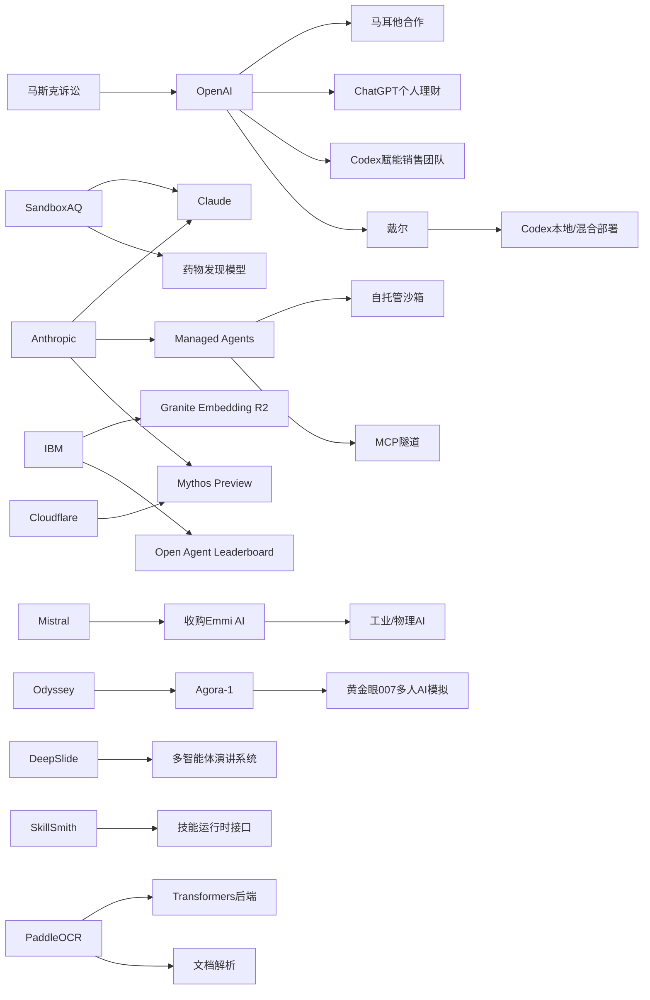

> AI 早报 · 每日早读 · 全网深度聚合

## **今日摘要**

OpenAI、SandboxAQ、IBM等公司近期围绕AI普及和落地持续推进：从马耳他全国推广ChatGPT Plus，到把药物发现能力接入Claude，再到发布低成本多语言开源向量模型，显示AI正加速从工具走向公共服务和企业应用。  
前沿研究方面，Agora-1把《黄金眼007》做成多人可互动的AI模拟世界，DeepSlide将AI从“生成PPT”推进到“辅助完整演讲交付”，而ChatGPT也开始测试结合个人账户信息的理财建议，说明AI正在变得更具情境感知和执行能力。  
行业层面上，Mistral收购Emmi AI体现生成式AI竞争正转向工业等垂直场景，同时马斯克起诉OpenAI案败诉也再次凸显了围绕OpenAI治理、控制权与发展路径的持续关注。

### 🔵 产品与功能更新

1. **OpenAI与马耳他合作普及ChatGPT Plus。**  
OpenAI宣布与马耳他合作，向当地居民提供ChatGPT Plus，并配套培训资源，帮助公众学习实用的AI使用方法。这个合作重点不只是“送会员”，还强调负责任地使用人工智能。对普通用户来说，这类国家级合作说明AI正从个人工具走向公共服务能力。🚀  
[马耳他合作计划简报](https://openai.com/index/malta-chatgpt-plus-partnership)

2. **SandboxAQ把药物发现模型带到Claude。**  
SandboxAQ把自家的药物发现模型接入Claude，让研究人员不需要深厚的计算背景，也能调用相关能力。公司判断，当前药物AI的关键障碍不只是模型效果，还有使用门槛。对医药和科研团队来说，这意味着更自然的对话式入口正在替代复杂的专业软件流程。🚀  
[药物模型接入简报](https://techcrunch.com/2026/05/18/sandboxaq-brings-its-drug-discovery-models-to-claude-no-phd-in-computing-required/)

3. **IBM发布多语言开源向量模型Granite Embedding R2。**  
IBM推出Granite Embedding Multilingual R2，这是一款多语言嵌入模型（把文本转成便于检索的数字表示），采用Apache 2.0开源协议。它支持32K上下文（一次可处理更长文本），主打在较小参数规模下提供较强检索质量。对企业知识库、跨语言搜索和问答系统来说，这类模型更容易低成本落地。🚀  
[Granite模型发布简报](https://huggingface.co/blog/ibm-granite/granite-embedding-multilingual-r2)

### 🟢 前沿研究

1. **Agora-1把《黄金眼007》变成可多人互动的AI模拟世界。**  
Odyssey发布世界模型（可模拟环境变化的AI）Agora-1，并用任天堂64经典游戏《黄金眼007》做演示，支持最多四名玩家同时互动。系统用两个独立模型分别处理游戏状态模拟和实时画面生成。团队认为，这类技术未来可用于协作机器人训练和智能体训练。🚀  
[Agora世界模型简报](https://the-decoder.com/agora-1-turns-the-n64-classic-goldeneye-into-a-playable-ai-simulation-for-four-players/)

2. **DeepSlide关注的不只是PPT生成，而是完整演讲交付。**  
DeepSlide是一项新研究，提出一个“人在回路中”（人持续参与修正）的多智能体系统，用于支持从材料整理到正式演讲准备的全过程。它不只生成视觉上像样的幻灯片，还关注节奏、叙事结构和演讲准备。对于教育、科研和商务表达场景，这说明AI开始从“做文档”转向“帮你把内容讲好”。🚀  
[DeepSlide论文简报](https://arxiv.org/abs/2605.15202)

3. **ChatGPT测试个人理财新体验。**  
OpenAI面向美国Pro用户预览个人理财功能，用户可安全连接金融账户，并获得基于自身财务背景、目标和优先级的AI建议。与泛泛而谈的理财问答不同，这一功能强调结合个人上下文给出洞察。若后续推广顺利，AI助手可能更深地进入日常财务管理场景。🚀  
[理财功能预览简报](https://openai.com/index/personal-finance-chatgpt)

### 🟡 行业展望与社会影响

1. **Mistral AI收购工业方向创业公司Emmi AI。**  
法国AI公司Mistral AI收购了维也纳的物理AI（面向现实世界设备与工业流程的AI）初创公司Emmi AI。此次收购被视为Mistral强化欧洲工业客户布局的一步。它也反映出生成式AI公司正从通用模型竞争，转向更具体的产业应用落地。🚀  
[收购Emmi AI简报](https://the-decoder.com/mistral-ai-acquires-viennese-physical-ai-startup-emmi-ai/)

2. **马斯克起诉OpenAI案败诉。**  
陪审团一致认定，马斯克针对Sam Altman和OpenAI提出的诉讼提交过晚，因此相关主张未获支持。这场案件长期受到科技行业关注，因为它涉及OpenAI创始阶段承诺、控制权和发展方向等争议。结果也意味着围绕AI公司治理的讨论，仍会继续留在公众视野中。🚀  
[OpenAI诉讼结果简报](https://techcrunch.com/2026/05/18/elon-musk-has-lost-his-lawsuit-against-sam-altman-and-openai/)

3. **OpenAI展示销售团队如何使用Codex。**  
OpenAI分享了销售团队使用Codex的多个案例，包括商机简报、会前准备、销售预测复盘、客户计划和停滞项目诊断。Codex本质上是面向工作流的AI编程与自动化助手，这次内容说明它不只服务工程师。对企业来说，AI工具正在从技术部门逐步扩展到营收、运营等核心团队。🚀  
[销售团队应用简报](https://openai.com/academy/codex-for-work/how-sales-teams-use-codex)

### 🟣 开源TOP项目

1. **PaddleOCR 3.5接入Transformers后端。**  
PaddleOCR 3.5发布，支持在Transformers后端上运行OCR（光学字符识别）和文档解析任务。这个更新有助于把传统文档识别流程更顺畅地接入当前主流大模型生态。对发票、表单、合同等文档处理场景来说，集成门槛有望进一步降低。🚀  
[PaddleOCR更新简报](https://huggingface.co/blog/PaddlePaddle/paddleocr-transformers)

2. **Open Agent Leaderboard发布开放智能体排行榜。**  
IBM Research推出Open Agent Leaderboard，用于评估开放智能体（能调用工具完成任务的AI系统）的表现。排行榜有助于行业更直观比较不同智能体方案的能力差异。对开发者和企业采购方来说，这类公共基准能提升选型透明度。🚀  
[开放智能体榜单简报](https://huggingface.co/blog/ibm-research/open-agent-leaderboard)

3. **Anthropic的Mythos Preview被Cloudflare用于安全测试。**  
Cloudflare表示，Anthropic面向安全场景的AI模型Mythos Preview，在50多个自家代码仓库测试中发现了一些早期前沿模型没识别出的攻击链。攻击链可以理解为黑客连续利用多个漏洞完成入侵的路径。这个案例说明，面向安全分析的专用模型正在成为开源与企业代码审查的新方向。🚀  
[Mythos安全测试简报](https://the-decoder.com/cloudflare-says-anthropics-mythos-preview-finds-exploit-chains-that-earlier-frontier-models-missed/)

### 🔴 社媒分享

1. **Anthropic为Claude Managed Agents加入自托管沙箱。**  
Anthropic扩展了Claude Managed Agents，新增自托管沙箱和MCP隧道，让企业可把AI智能体的工具执行放到自己的基础设施里。这里的沙箱可以理解为隔离运行环境，用于更安全地执行任务。虽然企业获得了更多执行层控制权，但智能体本身仍由Anthropic管理。🚀  
[托管智能体更新简报](https://the-decoder.com/anthropic-adds-self-hosted-sandboxes-and-mcp-tunnels-to-claude-managed-agents/)

2. **OpenAI与戴尔合作推进企业本地部署Codex。**  
OpenAI和戴尔合作，把Codex带到混合部署和本地部署环境，帮助企业在更安全的内部数据与工作流中使用AI编程智能体。混合部署指部分能力在云端、部分在本地运行。对重视合规和数据安全的大型企业来说，这是AI开发工具进入核心系统的重要一步。🚀  
[戴尔Codex合作简报](https://openai.com/index/dell-codex-enterprise-partnership)

3. **SkillSmith研究智能体技能的运行时接口。**  
SkillSmith是一篇新论文，研究如何把智能体技能编译成“边界引导”的运行时接口，让技能在任务执行时更稳定地被调用。简单说，就是让AI在使用专长能力时少走偏路、少越界。对于多智能体系统和复杂自动化流程，这类研究有助于提升可靠性。🚀  
[SkillSmith论文简报](https://arxiv.org/abs/2605.15215)

---

📊 行业洞察

1. 事实  
  - OpenAI与马耳他合作，向居民提供ChatGPT Plus和配套培训资源。  
  - ChatGPT开始测试个人理财功能，可连接金融账户并基于个人上下文提供建议。  
  - OpenAI展示销售团队使用Codex完成商机简报、预测复盘、客户计划等工作。  
  【洞察】AI正在从“通用聊天工具”升级为“公共服务+行业工作台+个人决策助手”的三位一体入口。OpenAI的动作表明，大模型竞争正从模型能力比拼转向“场景占位”（抢占高频使用场景）与“用户关系深度”（掌握更多持续交互和上下文数据）。谁能先进入政府、金融、销售等高价值流程，谁就更可能建立长期分发优势。

2. 事实  
  - Anthropic为Claude Managed Agents加入自托管沙箱（隔离运行环境）和MCP隧道（模型上下文协议连接通道）。  
  - OpenAI与戴尔合作推进Codex的混合部署和本地部署。  
  - Cloudflare在安全测试中使用Anthropic的Mythos Preview，发现部分前沿模型未识别出的攻击链。  
  【洞察】企业级AI采购的关键门槛，正从“模型够不够强”转向“能否安全接入核心系统”。自托管、本地部署、专用安全模型三条线索共同说明，未来企业AI基础设施会呈现“控制面由模型厂商提供、执行面由企业自持”的架构趋势。这本质上是“可信执行环境”（可控、安全、可审计的运行方式）成为大模型落地的标准配置。

3. 事实  
  - SandboxAQ将药物发现模型接入Claude，降低科研人员使用门槛。  
  - Mistral AI收购工业方向的Emmi AI，强化欧洲工业客户布局。  
  - PaddleOCR 3.5接入Transformers后端，降低文档AI流程接入主流大模型生态的成本。  
  【洞察】AI产业正在从“通用模型平台化”进入“垂直能力组件化”阶段。药物发现、工业物理AI（面向现实设备与流程的AI）、文档解析等能力，正被封装成可嵌入主流模型或工作流的模块。未来行业竞争不只是训练更大的基础模型（Foundation Model，通用底座模型），而是谁能把专业能力做成低门槛、可组合、可审计的标准化组件。

4. 事实  
  - IBM发布开源多语言嵌入模型Granite Embedding R2，支持32K上下文并采用Apache 2.0协议。  
  - IBM Research推出Open Agent Leaderboard评估开放智能体。  
  - SkillSmith研究智能体技能的运行时接口，以提升任务执行稳定性。  
  - DeepSlide采用“人在回路中”（Human-in-the-loop，人工持续参与）的多智能体系统完成演讲准备。  
  【洞察】行业正在补齐“后训练时代”的关键短板：评测、检索、技能调用和人机协作。与其单纯追求更大参数，越来越多厂商和研究团队开始建设“可衡量、可调用、可纠偏”的智能体工程体系。这说明AI正从“生成内容”走向“可靠完成任务”，而可靠性工程会成为下一阶段的重要护城河。

🗺️ 今日关系图

