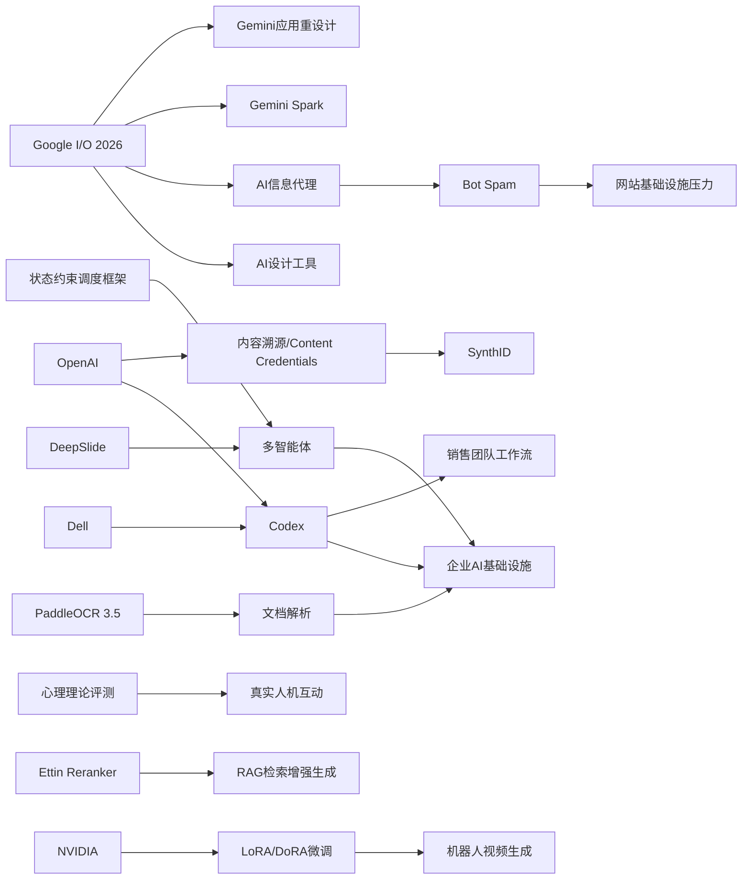

> AI 早报 · 每日早读 · 全网深度聚合

## **今日摘要**

AI 产品正在同时向两端扩张：一方面 Google 推动“人人可用”的轻量化设计工具，OpenAI 与 Dell 让企业能在更安全合规的环境中部署 Codex，PaddleOCR 3.5 也增强了文档解析能力，说明 AI 正更深地进入创作、开发和办公流程。  
研究层面，多智能体系统开始从“能生成内容”走向“懂流程、会协作、能辅助表达”，例如 DeepSlide 强调演示内容与讲述方式结合，SDOF 强化业务规则约束，而关于心理理论的研究则提醒我们，大模型能力提升不一定直接转化为更好的真实互动。  
行业影响上，AI 不仅改变用户工具和交互方式，也在重塑互联网基础设施与搜索范式：机器人流量正加剧网站压力，而 Google 的 AI 信息代理则让搜索从一次性提问升级为持续跟踪任务的“情报助理”。

### 🔵 产品与功能更新

1. **Google加码AI设计工具。**  
Google 在 I/O 2026 上明确把 AI 设计工具当作新战场，目标用户不仅是设计师，也包括教师和中小企业主。这个方向说明 AI 设计正从专业软件走向“人人可用”的轻量化创作工具。对普通用户来说，未来做海报、演示页或品牌素材的门槛会继续降低。🚀  
[Google设计新布局](https://techcrunch.com/2026/05/19/ai-design-tools-are-the-next-big-battleground-and-google-is-going-all-in-at-io-2026/)

2. **OpenAI与戴尔推进企业版Codex落地。**  
OpenAI 与 Dell 合作，把 Codex（AI 编程助手）带到混合部署和本地部署环境。对企业而言，这意味着可以在更严格的数据安全和合规要求下使用 AI 写代码、查流程和连接内部工作流。它瞄准的是“大公司想用 AI，但又不能把核心数据直接放到公网”的现实需求。🚀  
[企业部署Codex方案](https://openai.com/index/dell-codex-enterprise-partnership)

3. **PaddleOCR 3.5强化文档解析能力。**  
PaddleOCR 3.5 宣布可基于 Transformers（新一代深度学习架构）运行光学字符识别和文档解析任务。简单说，就是让图片、扫描件、表格和复杂文档的识别更智能，也更适合接入现代 AI 工作流。对企业文档数字化、票据处理和知识整理场景会更有吸引力。🚀  
[PaddleOCR更新解读](https://huggingface.co/blog/PaddlePaddle/paddleocr-transformers)

### 🟢 前沿研究

1. **DeepSlide想把AI做PPT推进到“会讲”。**  
DeepSlide 是一个人机协作的多智能体系统（多个 AI 分工合作），目标不只是生成看起来像样的幻灯片，还要帮助准备讲稿、节奏和叙事结构。研究者指出，很多 AI 做演示文稿只重“成品”，却忽略“怎么讲”这件事。这个方向更贴近真实汇报场景，也更可能提升演讲准备效率。🚀  
[DeepSlide论文速览](https://arxiv.org/abs/2605.15202)

2. **多智能体流程控制开始补“业务规则”短板。**  
SDOF 提出一种状态约束调度框架，把多智能体执行过程当作“受限制的状态机”来管理。通俗理解，就是让多个 AI 在协作时不能随意跳步骤，而要遵守真实业务中的阶段规则。它试图降低多智能体编排中的“对齐税”（为了安全和一致性付出的额外成本）。🚀  
[SDOF研究摘要](https://arxiv.org/abs/2605.15204)

3. **“读心能力”提升未必自动改善人机互动。**  
这篇研究关注 Theory of Mind（心理理论，即推测他人想法与意图的能力）在大模型中的提升，是否真的能改善人与 AI 的互动体验。作者认为，过去很多评测更像做阅读理解题，而不是看 AI 在真实对话中表现如何。研究把重点拉回互动场景，对未来社交型 AI 的评估方法有启发。🚀  
[人机互动评测研究](https://arxiv.org/abs/2605.15205)

### 🟡 行业展望与社会影响

1. **机器人流量正在挤压网站基础设施。**  
The Decoder 表示，近期站点访问异常的重要原因之一是 bot spam（机器人垃圾流量）给服务器造成巨大压力。这个现象说明，AI 时代不只是内容生产被改变，互联网基础设施也在承受新的负担。对于媒体网站和中小平台来说，如何防御自动化抓取与滥用会变得越来越关键。🚀  
[机器人流量冲击网站](https://the-decoder.com/sorry-for-the-outages-bot-spam-is-pushing-our-servers-to-the-limit/)

2. **Google让搜索从“提问”走向“持续盯梢”。**  
Google 正推出 AI 信息代理（可在后台持续关注任务的 AI 助手），不再只是等用户主动搜索，而是能持续监控某个主题并提醒变化。对用户来说，这意味着搜索服务开始更像“情报助理”，会主动跟进新闻、价格或事件更新。它也预示着搜索产品正从一次性查询转向长期任务管理。🚀  
[Google信息代理指南](https://techcrunch.com/2026/05/19/how-to-use-googles-new-ai-agents-to-go-beyond-your-standard-searches/)

3. **Codex开始进入销售团队日常流程。**  
OpenAI 展示了销售团队如何使用 Codex 生成商机简报、会前准备材料、销售预测复盘和客户计划。这个案例说明，AI 编程助手的边界正在外扩，不再局限于工程团队，而是开始处理半结构化办公任务。对企业组织来说，AI 工具正逐步从“专业岗位专用”变成跨部门协作平台。🚀  
[Codex销售应用案例](https://openai.com/academy/codex-for-work/how-sales-teams-use-codex)

### 🟣 开源TOP项目

1. **Ettin Reranker发布新重排模型家族。**  
Ettin Reranker 是一组用于信息重排的模型，也就是先初步检索，再由模型判断哪些结果更相关。它适合搜索、问答和检索增强生成（RAG，先查资料再生成答案）等场景。对开发者来说，更好的重排模型通常能显著提升最终回答质量。🚀  
[Ettin模型发布说明](https://huggingface.co/blog/ettin-reranker)

2. **过去六个月LLM变化被压缩进五分钟。**  
Simon Willison 汇总了过去半年大语言模型（LLM）领域的关键变化，用极短时间帮助读者建立整体视角。这类材料的价值不在“新发布”，而在帮助从业者快速校准行业节奏与重要趋势。对于想补课的人，这是很高效的入口。🚀  
[五分钟看LLM进展](https://simonwillison.net/2026/May/19/5-minute-llms/#atom-everything)

3. **OpenClaw完成名称调整。**  
“Warelay -> OpenClaw” 记录了一个项目名称变更。虽然看似只是改名，但在开源世界里，名称通常关系到社区识别、定位表达和后续传播。对关注项目生态的人来说，这类调整往往是项目重新定义方向的一部分。🚀  
[OpenClaw更名记录](https://simonwillison.net/2026/May/16/openclaw-names/#atom-everything)

### 🔴 社媒分享

1. **Google I/O集中发布新模型与云端代理。**  
Google 在 I/O 上一口气公布 Gemini 3.5 Flash、Gemini Omni，以及可在云端持续运行的个人代理 Gemini Spark。与此同时，Gemini 应用也迎来重新设计，进一步强调“全天候助手”的使用体验。这组发布很适合在社交媒体传播，因为信息密度高、产品线清晰。🚀  
[Google发布重点汇总](https://the-decoder.com/googles-i-o-announcements-new-models-a-cloud-agent-that-never-sleeps-and-a-redesigned-gemini-app/)

2. **OpenAI推进AI内容溯源。**  
OpenAI 介绍了 Content Credentials（内容凭证）、SynthID 和验证工具，用于帮助识别 AI 生成媒体。简单理解，就是给图片、视频等内容补上“来源说明”，让用户更容易判断是否由 AI 生成。随着深度伪造（高度逼真的伪造内容）扩散，内容可信度会成为公众讨论重点。🚀  
[内容溯源方案说明](https://openai.com/index/advancing-content-provenance)

3. **NVIDIA展示机器人视频生成微调方案。**  
NVIDIA 分享了如何用 LoRA/DoRA（低成本微调方法）对 Cosmos Predict 2.5 进行微调，用于机器人视频生成。它的意义在于，开发者可以用更低资源成本训练更贴近特定任务的视频模型。对于机器人训练、仿真和视觉数据生成等方向，这类方法很有传播价值。🚀  
[机器人视频微调实践](https://huggingface.co/blog/nvidia/cosmos-fine-tuning-for-robot-video-generation)

---

📊 行业洞察

1. 事实  
   - Google 在 I/O 2026 同时推进 AI 设计工具、AI 信息代理，以及云端持续运行的 Gemini Spark，目标用户从设计师扩展到教师、中小企业主和普通消费者。  
   - DeepSlide 研究把 AI 做 PPT 从“生成页面”推进到“辅助讲述、节奏与叙事结构”。  
   【洞察】AI 产品形态正从“单次生成工具”转向“持续陪伴式工作代理”。这不只是功能叠加，而是交互范式变化：一类产品在降低创作门槛，另一类产品在接管任务链路。未来竞争点会从模型能力本身，转向任务留存、长期上下文管理和工作流闭环能力。

2. 事实  
   - OpenAI 与 Dell 合作推动 Codex 在混合部署和本地部署环境落地，满足企业数据安全与合规要求。  
   - Codex 已开始进入销售团队，用于商机简报、会前准备、销售预测复盘和客户计划。  
   - PaddleOCR 3.5 强化文档解析，适合票据、表格、扫描件等企业知识流转场景。  
   【洞察】企业级 AI 正进入“系统集成期”，重点不再是单点提效，而是打通非结构化数据、内部流程与跨部门协作。Codex 向销售场景外扩，叠加 OCR（光学字符识别）与文档解析能力，说明企业采购逻辑正在从“买一个助手”升级为“部署一层 AI 工作流基础设施”。能否进入内网、接企业数据、满足治理要求，将比公开基准分数更影响成交。

3. 事实  
   - SDOF 用状态约束调度框架管理多智能体流程，把执行过程限制在业务规则允许的状态机（State Machine，按状态和转移规则运行的系统）内。  
   - Theory of Mind（心理理论，推测他人意图的能力）相关研究指出，模型“理解人”的评测不能只看静态答题，还要回到真实互动。  
   - DeepSlide 也采用多智能体协作来覆盖内容生成、叙事和表达准备。  
   【洞察】多智能体正在从“能协作”走向“可控协作、可评估协作”。行业短期瓶颈不是再堆几个代理，而是如何让代理遵守业务顺序、理解互动目标、并在真实场景稳定交付。下一阶段的技术壁垒会更多体现在编排框架、过程监督和交互评测，而非单个模型的通用能力。

4. 事实  
   - The Decoder 指出 bot spam（机器人垃圾流量）正给网站服务器带来显著压力。  
   - Google 推出可持续监控任务的 AI 信息代理，搜索从一次性查询转向长期跟踪。  
   - OpenAI 推进 Content Credentials（内容凭证）、SynthID 等内容溯源机制，应对 AI 生成媒体识别问题。  
   【洞察】AI 正在同时重塑“信息生产、信息分发、信息验证”三层基础设施：前端是代理替用户持续抓取和跟踪，后端是网站承受更高自动化访问压力，中间则需要内容溯源来维持可信度。结果是，未来互联网竞争不只是模型和应用之争，也会变成抓取权限、来源认证与流量治理之争。

🗺️ 今日关系图

