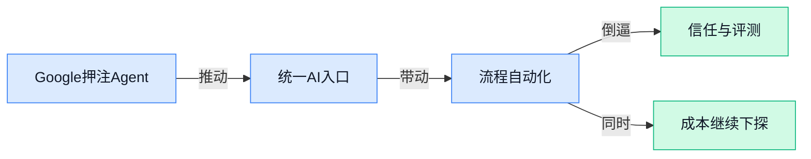

> AI 早报 · 每日早读 · 全网深度聚合

## **今日摘要**

```
Google 连发 Gemini 3.5 Flash、Gemini Omni、Android CLI，AI 重心从聊天彻底转向 Agent 与开发
OpenAI 接入 Google SynthID 给 AI 图片加可验证身份证，马斯克起诉 OpenAI 受挫对比拉满
Anthropic 开源 Claude for Legal（法律插件套件），Claude Code 再冲学术研究流水线，直插专业场景
```

### 🔵 产品与功能更新

1. **Google 推出 Gemini 3.5 Flash（Gemini 新一代轻量模型），把下一波 AI 重点押注在 Agent 上。**
Google 在年度开发者大会上发布了 **Gemini 3.5 Flash**，并明确把重点从“陪你聊天的聊天机器人”转向 **Agent**（能自己分步骤执行任务的 AI 助手）🚀。按原文说法，这是 Google 目前最强的**编程**和 **Agent 式**模型，已经能自主完成复杂任务，甚至从零开始搭建软件。对企业和团队来说，这意味着 AI 的角色正在从“回答问题”升级成“直接干活”，未来在写代码、处理流程、跨工具协作上的价值会更直接。[TechCrunch 完整报道(briefing)](https://techcrunch.com/2026/05/19/with-gemini-3-5-flash-google-bets-its-next-ai-wave-on-agents-not-chatbots/)


2. **Google 更新 Gemini 应用，想把它做成对标 ChatGPT 和 Claude 的全能 AI 中枢。**
这次更新传递出的信号很明确：Google 不再只把 Gemini 当成一个独立聊天工具，而是想把它做成“**通用 AI 入口**”💡。所谓 AI 中枢，可以理解为把不同能力集中到一个地方，让用户不只是对话，还能围绕任务统一调用 AI 服务。对普通办公场景来说，这类变化通常意味着 AI 会更像一个长期协作助手，而不是一次性问答窗口。[Gemini 应用更新报道(briefing)](https://techcrunch.com/2026/05/19/google-updates-its-gemini-app-to-take-on-chatgpt-and-claude-at-io-2026/)


3. **Google 发布 Android CLI（Android 命令行开发工具），让 AI 编码助手更快生成应用。**
Google 推出的 **Android CLI**，是面向 Android 开发的 **命令行工具**（不用图形界面、直接输入指令完成开发操作的工具），目标是配合 **AI 编码 Agent**（能帮开发者自动写代码、执行开发步骤的 AI 助手）一起工作 ⚙️。原文提到，它可以和 Claude Code、Codex 这类工具配合，让开发者或他们的 AI 助手直接在命令行里更快搭建 Android 应用。对行业来说，这说明 Google 正在主动适配“AI 代写代码”的新工作流，开发速度和自动化程度都有望继续提升。[Android CLI 发布报道(briefing)](https://techcrunch.com/2026/05/19/agentic-app-coding-gets-an-upgrade-with-googles-release-of-android-cli/)


### 🟢 前沿研究

1. **Co-Scientist（Google DeepMind 推出的多智能体科研助手）想当研究人员的 AI 搭档。**  
这项工作主打“多智能体协作”——也就是让多个 AI 角色分工配合，一起提出假设、查找线索、互相评审，从而加快科研推进节奏 🧪。对非技术同事来说，最值得关注的是：AI 不只是“回答问题”，而是在朝“参与研究流程”迈进，像一个能协助头脑风暴和资料整理的数字研究伙伴。它背后的思路也说明，未来医药、材料、教育等需要大量知识整理的行业，可能会更早用上这类工具。[Google DeepMind 相关报道(briefing)](https://news.google.com/rss/articles/CBMilAFBVV95cUxOTElhcjFZQ01fYUNkb3JieU52ZVU3dWJ0ZUlQMGZuOFo1WlA2ZGdhYmtJZy1CaERYX01ZOERWZnlfZkszam9lVDdocFdZb3JqTHpwS042YjJCRW1yeXF2b2tJQWJRNGRXUE9PT2RNREVGSnJ2Uk1vaU5lay1IaS1NcTlxNVpaM3VZOGhleGc2bTB2Q0dh?oc=5)


2. **SNLP（一种让大模型分层并行推理的方法）探索给 AI 提速的新路线。**  
这篇论文关注 **inference（模型推理，让训练好的模型真正回答问题的过程）** 提速，核心想法是把原本一层接一层执行的大模型，改造成更多层可以并行处理 ⚙️。其中用到的 Structured Newton Corrections（结构化牛顿修正，一种帮助并行计算后再把结果“拉回正确轨道”的校正思路），目的是在不明显损失效果的前提下压缩等待时间。对行业来说，这类研究如果跑通，意味着未来大模型服务可能更快、更省算力，企业部署成本也有机会继续下降。[论文页面(briefing)](https://huggingface.co/papers/2605.17842)

3. **Post-Trained MoE（后训练混合专家模型）可通过 Self-Distillation（自蒸馏，让模型自己教自己）跳过一半专家。**  
MoE（混合专家模型，多个“小模型”分工协作，只在需要时调用部分模块）一直被视为兼顾效果和成本的重要路线，但它的调用效率并不总是理想 💡。这项研究提出，模型在 **post-training（后训练，主训练完成后的进一步优化阶段）** 后，可以借助 **self-distillation（自蒸馏，用模型自己的高质量输出反过来训练自己）**，减少需要激活的专家数量，甚至跳过一半专家。对企业使用者来说，这意味着同类模型未来有机会在不大幅牺牲能力的情况下，把响应速度和推理成本进一步压低。[论文详情(briefing)](https://huggingface.co/papers/2605.18643)

4. **AstraFlow（面向 Agent 大模型的数据流强化学习框架）尝试把 AI 协作流程训得更顺。**  
这篇工作把 Dataflow（数据流，把复杂任务拆成一连串可传递的处理节点）和 Reinforcement Learning（强化学习，让模型通过“做对有奖励”不断试错优化）结合起来，用于 Agentic LLMs（具备行动与调用工具能力的大模型）🧠。简单说，它不是只训练 AI“会回答”，而是训练 AI 在多步骤任务里更好地安排顺序、传递信息、调用工具。对实际业务场景很关键，因为客服编排、数据分析、流程审批这类任务，真正难的往往不是一句话回答，而是整条流程能不能稳定跑通。[论文页面(briefing)](https://huggingface.co/papers/2605.15565)

5. **Agent Bazaar（多智能体市场机制研究）想解决 AI 之间“怎么公平协作赚钱”问题。**  
这项研究讨论的是 multi-agent marketplaces（多智能体市场，也就是许多个 AI 代理像接单者一样分工合作、竞争与交易的环境）🏪。论文聚焦 economic alignment（经济对齐，让 AI 在逐利或分工时，行为仍符合平台和人类设定的目标），这对未来 AI 自动外包、自动采购、自动协同尤其关键。换句话说，如果以后一个任务会被拆给多个 AI 去完成，怎么定价、怎么分工、怎么避免“只顾自己不顾整体”，会成为真实的产品问题。[论文介绍(briefing)](https://huggingface.co/papers/2605.17698)

6. **A2RBench（自动生成可形式化验证推理题的基准）瞄准更靠谱的抽象推理测试。**  
Benchmark（基准测试，用来衡量模型能力的标准题集）看起来只是“考试卷”，但它会直接影响大家怎么判断一个模型到底强不强 📏。这篇论文提出自动生成 abstract reasoning（抽象推理）题目，并强调 formally verifiable（可形式化验证，也就是答案对不对能被严格检验，而不是靠人工主观判断）。对行业的意义在于，未来评估 AI 推理能力可能会更标准、更可复现，减少“模型看起来很聪明，但测法不严谨”的情况。[论文页面(briefing)](https://huggingface.co/papers/2605.17278)

7. **AgentKernelArena（评测 GPU 内核优化 Agent 泛化能力的基准）补上“会不会举一反三”的测试空白。**  
GPU Kernel（显卡底层计算内核，可以理解为驱动大规模并行计算的“微型工序”）优化，一直是提升模型训练和推理效率的关键环节，而 Agent 现在也开始参与这类高难度工程任务 🚀。这篇工作提出一个更强调 generalization（泛化能力，也就是 AI 遇到没见过的新任务时还能不能做对）的评测基准，不只看它在熟悉题目上表现多好。对企业和开发团队来说，这类研究很重要，因为真正有价值的 AI 工具，不是只会刷题，而是能在陌生环境里继续稳定交付。[论文详情(briefing)](https://huggingface.co/papers/2605.16819)

8. **Symmetry-Compatible Principle（面向优化器设计的对称性原则）试图让大模型训练更讲“结构规律”。**  
这篇论文讨论 Optimizer（优化器，决定模型训练时参数如何更新的核心机制）设计，并把目光放在 embeddings（把文字或对象转成向量，方便模型理解和比较）、LM Heads（语言模型最后负责输出文字结果的部分）、SwiGLU MLPs（一种常见神经网络结构，用来提升模型表达能力）和 MoE Routers（混合专家模型里的“分流器”，决定该调用哪个专家）这些关键模块上。所谓 symmetry-compatible（对称性兼容），可以理解为：训练规则最好尊重模型内部原本的结构规律，而不是“一把尺子量到底” 🔍。这类研究虽然偏底层，但会影响未来大模型训练是否更稳定、更高效，也关系到同样算力下能不能训出更好的模型。[论文页面(briefing)](https://huggingface.co/papers/2605.18106)

### 🟡 行业展望与社会影响

1. **Google 在 I/O 2026 重新梳理 AI 订阅，推出三档套餐。**  
Google 在 I/O 2026 上调整了自己的 **AI 订阅** 结构，变成从每月 **10 美元** 起的三档方案。对普通用户来说，这通常意味着后续会有更清晰的功能分层：便宜档先满足基础使用，价格更高的档位再覆盖更进阶的能力。对企业和运营同事来说，这类变化往往会影响团队采购、预算预估，以及员工能接触到的 AI 功能范围。[完整报道(briefing)](https://the-decoder.com/google-overhauls-its-ai-subscriptions-at-i-o-2026-with-three-tier-starting-at-10-a-month/)


### 🟣 开源TOP项目

1. **Anthropic 的 Claude for Legal（面向法律工作的 Claude 插件套件）开源。**
   这是一个给**法律流程**用的插件集合，重点是把 Claude 接进合同、审阅、检索这类日常法务工作里。对律师、法务同事来说，价值在于把重复性文书和流程做得更顺一点，减少来回切换工具的麻烦。[GitHub 仓库(briefing)](https://github.com/anthropics/claude-for-legal)


2. **AgentMemory（AI 编程助手的持久记忆工具）主打长期记住上下文。**
   它强调给 **AI coding agents（AI 编程代理，能自动写代码和执行任务的助手）** 提供**持久记忆**，并且是基于真实世界的基准测试来做的。简单说，就是让助手不只是“当场聪明”，还尽量记得前面做过什么，减少反复解释同一件事的成本。对需要频繁协作写代码的团队，这类能力会直接影响效率。[GitHub 仓库(briefing)](https://github.com/rohitg00/agentmemory)


3. **Academic Research Skills（学术研究技能）把 Claude Code 变成研究写作流水线。**
   这个项目把流程拆成 **research（检索资料）→ write（写作）→ review（审阅）→ revise（修改）→ finalize（定稿）**，更像一个可复用的研究工作法。它适合需要做资料整理、报告写作、论文辅助的人，核心是把“从查到写到改”串成固定步骤。对非技术岗位也有意义，因为它体现的是一种更稳定的内容生产流程。[GitHub 仓库(briefing)](https://github.com/Imbad0202/academic-research-skills)


4. **OpenHuman（个人 AI 超级智能）强调私密、简单、强力。**
   这个项目把自己定位成你的**个人 AI super intelligence（个人超级智能）**，重点卖点是 **Private（私密）**、**Simple（简单）**、**extremely powerful（非常强大）**。从描述看，它想做的是一个偏个人助理型的 AI 系统，而不是单点功能工具。对想把 AI 用在个人知识管理、日常协作上的人来说，这类项目通常会比较有吸引力。[GitHub 仓库(briefing)](https://github.com/tinyhumansai/openhuman)

5. **CloakBrowser（隐身 Chromium 浏览器）主打绕过机器人检测。**
   它是一个 **Stealth Chromium（隐身版 Chromium 浏览器，Chromium 是浏览器内核基础）**，号称能通过各种 **bot detection（机器人检测）** 测试，并且可以直接替代 **Playwright（自动化浏览器测试工具）**。摘要里还提到它做了**source-level fingerprint patches（源码级指纹修补，修改浏览器特征以减少被识别）**，30/30 测试通过。对做自动化测试、网页采集或反爬对抗的人，这种工具很实用，但也要注意合规边界。[GitHub 仓库(briefing)](https://github.com/CloakHQ/CloakBrowser)

6. **RuView（把 WiFi 信号变成空间感知系统）把普通路由器用出了新花样。**
   它声称能把**commodity WiFi signals（普通 WiFi 信号）** 转成**real-time spatial intelligence（实时空间感知）**、**vital sign monitoring（生命体征监测）** 和 **presence detection（有人/无人检测）**，而且不需要摄像头画面。这个方向对安防、医疗看护、空间感知类场景很有想象力，因为它绕开了“拍视频”这条路。对外部团队来说，能直观理解成：它想让 WiFi 变成一种“看不见的传感器”。[GitHub 仓库(briefing)](https://github.com/ruvnet/RuView)

### 🔴 社媒分享

1. **OlmoEarth v1.1（AllenAI 推出的地球科学 AI 模型家族）主打更高效率。**
AllenAI 在 HuggingFace（全球最大 AI 模型共享社区）介绍了新版 **OlmoEarth v1.1**，核心卖点是同一家族模型在效率上进一步优化 🌍。这类模型主要面向**地球科学**场景，适合处理气候、环境、遥感等需要大量数据分析的任务，对科研和行业应用都很关键。对普通业务同事来说，这类进展的意义在于：AI 不只是会聊天，也正在进入更专业的行业分析环节，未来可能影响能源、保险、农业等依赖环境判断的工作流。[官方介绍页(briefing)](https://huggingface.co/blog/allenai/olmoearth-v1-1)


2. **OpenAI 采用 Google SynthID（水印标记系统，用来识别 AI 生成内容）为 AI 图片加“可验证身份证”。**
OpenAI 宣布在 AI 图片中采用 Google 的 **SynthID**，并配套推出**验证工具**，重点是帮助外界判断一张图片是否由 AI 生成 🖼️。这里的“水印”不是肉眼能直接看到的角标，而是嵌入到内容中的识别标记，方便平台和机构做来源核验。对媒体、品牌、公关和法务团队来说，这一步很重要，因为它直接关系到**内容溯源**（追查内容从哪里来）和真假辨别，能降低“看起来像真的”AI 图片带来的误判风险。[OpenAI 官方说明(briefing)](https://openai.com/index/advancing-content-provenance/)

3. **Gemini Omni（Google DeepMind 推出的统一多模态模型）亮相。**
Google DeepMind 发布了 **Gemini Omni**，从名字就能看出它强调 **Omni**（全能、多模态统一处理），也就是让模型同时理解和处理多种类型的信息 🤖。所谓“多模态”，可以理解为 AI 不只看文字，还能一起处理图像、音频等不同输入，这会让产品体验更接近人与人自然交流。对企业场景来说，这类能力特别适合客服、教育、办公助手等需要“看得懂 + 听得懂 + 回得快”的应用方向。[模型介绍页(briefing)](https://deepmind.google/models/gemini-omni/)

4. **Elon Musk 起诉 OpenAI 一案受挫，法官对上诉前景也不乐观。**
根据 Platformer 报道，这起围绕 OpenAI 的诉讼出现新进展：**Musk 败诉后表示将继续上诉**，但法官对案件后续态度依然强硬 ⚖️。这类法律拉锯表面看像公司纷争，实质上会影响外界如何理解 AI 公司治理、商业化路线和创始人之间的权责关系。对行业观察者来说，值得关注的不只是输赢本身，更是这类案件会不会持续影响 OpenAI 的对外节奏与公众形象。[完整报道(briefing)](https://www.platformer.news/elon-musk-loses-openai-trial/)

---



### 📊 行业洞察（今日 4 条）

1. Google 同天发布 Gemini 3.5 Flash、Gemini Spark（个人 Agent 助手）和 Gemini 应用更新，还重做了三档 AI 订阅
  【洞察】Google 不再卖单点模型，而是在卖“统一入口+持续代办+按使用量收费”的 AI 操作系统

2. Google 推 Android CLI（Android 命令行开发工具），研究侧又有 AstraFlow（训练 Agent 跑完整流程）和 Co-Scientist（多 Agent 科研助手）
  【洞察】行业竞争点正从“回答得像不像人”转向“流程能不能稳定跑完”，Agent 开始真正进入生产环节

3. SNLP（让模型并行回答以提速）和 Post-Trained MoE（让模型少调用一半模块）都在压低响应成本，Reuters 也提到 Google 主打更便宜企业模型
  【洞察】模型价格和速度还会继续下探，未来越来越不值钱的是“调用模型”，越来越值钱的是“调对流程”

4. OpenAI 给图片接入 Google SynthID（水印标记系统）做溯源，A2RBench 和 AgentKernelArena 都在补“怎么更严谨评测 AI”
  【洞察】行业开始补信任基础设施：不只比谁更强，还要比谁更可验证、可追责、可复现

### 💭 对我们的启发（今日 3 条）

1. Google 把 Gemini 做成统一入口，还配 Gemini Spark 这类持续助手，说明上层入口会被大厂强占；我们不能只做“AI 入口”，得强化跨 Agent 选择、组合和结果对比。

2. AstraFlow、Co-Scientist、Academic Research Skills（把研究写作拆成固定流水线的开源项目）都在证明：用户真正需要的是“任务流程模板”。我们产品要优先做可复用流程，而不是只堆 Agent 数量。

3. OpenAI 的图片溯源和两篇评测研究提醒我们：平台若想建立信任，必须默认保留 Agent 执行记录、结果评分和人工接管节点；否则一旦出错，很难让用户信服。


---

> 本周周报：[第21周综合分析](https://zhuxinfei.github.io/ai-daily-site/blog/weekly/2026-w21/)
