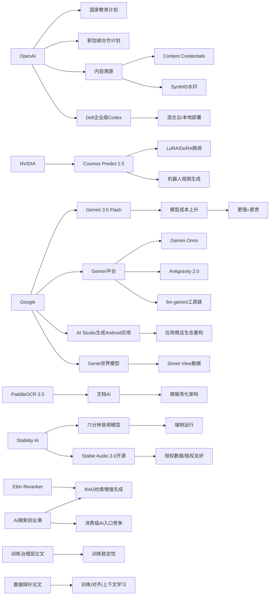

> AI 早报 · 每日早读 · 全网深度聚合

## **今日摘要**

本周AI动态显示出一个明显趋势：模型和平台能力持续增强，但成本也同步上升，例如 Gemini 3.5 Flash 更强却显著更贵，训练领域也开始强调“自动治理”和稳定性而不只是堆参数。  
与此同时，AI正加速从单点工具走向系统化落地，OpenAI推进国家级教育与新加坡合作计划，Google则在 I/O 2026 上把 Gemini 打造成面向消费者、开发者和智能体的完整平台。  
在应用层，AI搜索、OCR、机器人视频生成和“提示词生成App”等方向快速升温，说明行业竞争正从模型本身扩展到本地生态、垂直场景和应用分发方式。

### 🔵 产品与功能更新
1. **Gemini 3.5 Flash 变贵但更强。**  
   这版模型性能提升明显，但运行成本也大幅上涨。测试里，它的总成本比上一代高出不少，做智能体（agent，能自动执行多步任务的AI）任务时甚至更贵。行业里“更强=更贵”正在成为新常态。  
   [了解Gemini成本变化](https://the-decoder.com/googles-gemini-3-5-flash-follows-anthropic-and-openai-in-making-newer-ai-models-significantly-pricier/)

2. **OpenAI 推进“面向国家的教育”计划。**  
   这项计划继续扩展到更多国家和地区，重点是学校落地、教师培训和配套工具。目标是让AI更直接地改善教学体验和学习结果。对教育行业来说，这意味着AI应用正从试点走向体系化。  
   [查看教育合作进展](https://openai.com/index/the-next-phase-of-education-for-countries)

3. **NVIDIA Cosmos Predict 2.5 支持 LoRA/DoRA 微调。**  
   这篇内容聚焦机器人视频生成（让模型生成更像机器人视角的视频），并展示如何做参数高效微调。LoRA/DoRA（低成本调优方法）能让模型适配新任务时更省算力。对想做机器人和仿真数据的人很实用。  
   [看微调实操方案](https://huggingface.co/blog/nvidia/cosmos-fine-tuning-for-robot-video-generation)

4. **训练控制也开始“自动治理”。**  
   论文提出一种训练治理层，用来在高压力训练条件下保持稳定、减少浪费。它不是替代优化器（如AdamW），而是在上层做边界控制。说明大模型训练正从“拼参数”走向“拼稳定性”。  
   [读训练治理研究](https://arxiv.org/abs/2605.19008)

### 🟢 前沿研究
1. **Google I/O 2026 把 Gemini 定位成平台。**  
   这次发布不只是单个模型，而是面向消费者和开发者/智能体的完整栈。包括 Gemini 3.5 Flash、Gemini Omni（多模态生成与编辑）和 Antigravity 2.0（智能体工具链）。Google 还公布了超高的 token（模型处理文本单位）规模，显示其基础设施投入非常激进。  
   [看Google最新布局](https://news.smol.ai/issues/26-05-19-not-much/)

2. **AI 搜索初创正在爆发。**  
   消费级AI里，搜索成了新热点。用户不只想要聊天，还想要更直接、更可控的信息获取方式。这个方向可能会继续吸引大量创业公司和资本。  
   [了解AI搜索热潮](https://techcrunch.com/2026/05/20/ai-search-startups-are-blowing-up/)

3. **OpenAI 推出新加坡合作计划。**  
   这是一个多年的区域合作项目，覆盖部署、人才建设和企业/公共服务应用。说明AI国际化落地正在从“卖产品”转向“本地生态共建”。  
   [查看新加坡合作](https://openai.com/index/introducing-openai-for-singapore)

4. **PaddleOCR 3.5 引入 Transformers 后端。**  
   OCR（光学字符识别）和文档解析任务有了新的实现方式。引入 Transformers（常用深度学习框架架构）后，工具链会更容易适配更复杂的文档场景。对办公文档、票据和表格识别都很关键。  
   [看OCR新版本](https://huggingface.co/blog/PaddlePaddle/paddleocr-transformers)

### 🟡 行业展望与社会影响
1. **Google 正在测试“App 版 SaaSpocalypse”。**  
   Google AI Studio 现在能直接从提示词生成原生 Android 应用。对简单工具类应用来说，传统应用商店的重要性可能下降。苹果则采取更保守的限制策略，移动应用生态可能出现分化。  
   [看应用生成趋势](https://the-decoder.com/google-tests-the-app-version-of-the-saaspocalypse/)

2. **Stability AI 推出可生成六分钟歌曲的音频模型。**  
   新模型还能在设备端运行，意味着生成音乐不一定非要依赖云端。更长时长的生成能力，也让AI音乐更接近可直接使用的内容形态。  
   [了解新音频模型](https://techcrunch.com/2026/05/20/stability-ai-release-a-new-audio-model-that-can-create-six-minute-songs/)

3. **OpenAI 强调内容溯源。**  
   他们推动 Content Credentials（内容凭证）、SynthID（水印技术）和验证工具，目的是让人更容易识别AI生成内容。随着假图、假视频和合成内容增多，可信来源会越来越重要。  
   [看内容溯源方案](https://openai.com/index/advancing-content-provenance)

4. **论文关注“数据探针”如何理解数据影响。**  
   研究想回答：什么数据对训练、对齐和上下文学习真正有帮助。这个问题很基础，但也很关键，因为现在很多优化还主要靠大规模试验。  
   [读数据影响研究](https://arxiv.org/abs/2605.18801)

### 🟣 开源TOP项目
1. **Stable Audio 3.0 开源权重发布。**  
   Stability AI 这次放出了多个开放权重模型，最长可生成六分钟音乐。并且官方称训练数据都来自授权内容，降低了版权争议风险。对开源音频生成来说，这是一次很强的升级。  
   [看开源音频模型](https://the-decoder.com/stability-ai-launches-stable-audio-3-0-with-up-to-six-minute-tracks-and-open-weights/)

2. **OpenAI 联合 Dell 推出企业版 Codex。**  
   重点是混合云和本地部署（on-premise，企业自有机房）环境。这样企业可以更安全地把AI编程代理接入内部代码和工作流。对重视合规和数据隔离的公司很友好。  
   [看企业部署方案](https://openai.com/index/dell-codex-enterprise-partnership)

3. **OlmoEarth v1.1 更高效。**  
   这是面向地球观测（遥感）的一组模型，强调效率提升。遥感模型常用于环境监测、土地分析和灾害评估，效率高意味着更容易规模化应用。  
   [了解地球观测模型](https://huggingface.co/blog/allenai/olmoearth-v1-1)

4. **文档AI开始走微服务化。**  
   这篇研究把分类、OCR 和大模型流水线拆成可部署的服务架构。核心价值是把“模型能跑”推进到“生产能用”。对企业文档处理场景很实用。  
   [看生产化架构](https://arxiv.org/abs/2605.18818)

### 🔴 社媒分享
1. **Google 把 Genie 世界模型接入 Street View。**  
   用户在地图上选点，就能生成一个可探索的AI世界。Street View（街景数据）成了重要训练资源，也让AI生成内容更贴近真实地点。这个方向对游戏、仿真和机器人都很有想象力。  
   [看真实世界生成](https://the-decoder.com/google-pairs-its-genie-world-model-with-street-view-to-create-explorable-ai-worlds-based-on-real-places/)

2. **NanoClaw 创始人拒绝 2000 万美元收购。**  
   团队在产品走红后选择继续独立发展，并拿到了新的种子轮融资。这个故事很典型：开源/替代型工具一旦出圈，就可能迅速进入资本关注区。  
   [看创业融资故事](https://techcrunch.com/2026/05/20/nanoclaw-creator-turns-down-20m-buyout-offer-raises-12m-seed-instead/)

3. **llm-gemini 版本更新引发关注。**  
   这是社区工具链的持续迭代，说明开发者正在围绕 Gemini 生态快速补齐调用能力。虽然体量不大，但这类更新往往能加速实际应用落地。  
   [看工具链更新](https://simonwillison.net/2026/May/19/llm-gemini-2/#atom-everything)

4. **Ettin Reranker 家族发布。**  
   Reranker（重排序模型）常用于搜索和检索增强生成（RAG，先检索再回答）流程里。它能帮系统更准确地挑出最相关的结果，提升答案质量。  
   [看重排序模型](https://huggingface.co/blog/ettin-reranker)

---

📊 行业洞察

1. 事实  
   - Gemini 3.5 Flash 性能提升明显，但成本大幅上涨，尤其在智能体（Agent，可自动执行多步任务的AI）场景下更贵。  
   - Google I/O 2026 将 Gemini 从单模型升级为平台，覆盖 Gemini 3.5 Flash、Gemini Omni（多模态生成与编辑）和 Antigravity 2.0（智能体工具链）。  
   - 社区工具 llm-gemini 持续更新，开发者生态开始快速补齐。  
   【洞察】头部模型竞争已从“参数/榜单竞争”转向“平台化溢价竞争”。Google 正在用更强模型+更完整工具链+开发者生态，推动 Gemini 从 API（应用接口）商品变成平台型基础设施；这也意味着未来企业采购AI时，不会只比较单次调用价格，而会综合评估生态完整度、Agent支持能力和多模态协同效率。

2. 事实  
   - OpenAI 推进“面向国家的教育”计划，覆盖学校落地、教师培训和工具配套。  
   - OpenAI 推出新加坡多年合作计划，涉及部署、人才建设以及企业/公共服务应用。  
   - OpenAI 联合 Dell 推出企业版 Codex，强调混合云（Hybrid Cloud）和本地部署（On-premise）。  
   【洞察】OpenAI 的全球化路线正在从“模型输出”升级为“国家级/行业级基础设施共建”。教育、公共服务、企业私有部署三条线共同表明，AI厂商的核心竞争力正从模型能力扩展到本地合规、人才培训和生态绑定能力；未来大客户订单更可能以“区域合作包”而非单点API采购的形式出现。

3. 事实  
   - NVIDIA Cosmos Predict 2.5 支持 LoRA/DoRA（参数高效微调）用于机器人视频生成。  
   - Google 将 Genie 世界模型接入 Street View（街景数据），可生成可探索的真实地点AI世界。  
   - 文档AI研究强调微服务化，训练治理论文提出在高压力训练中加入治理层提升稳定性。  
   【洞察】AI产业正在从“能生成”迈向“可工程化部署”。无论是机器人仿真、世界模型，还是文档AI生产流水线，行业关注点都转向微调效率、系统稳定性和服务化架构。下一阶段胜负手不只是模型是否先进，而是谁能把生成模型封装进可复用、可维护、可规模化的生产系统。

4. 事实  
   - AI 搜索初创爆发，搜索成为消费级AI热点。  
   - Ettin Reranker 发布，重排序模型（Reranker，用于提升检索结果相关性）继续增强 RAG（检索增强生成）效果。  
   - PaddleOCR 3.5 引入 Transformers（深度学习主流架构）后端，文档解析能力增强。  
   - Google AI Studio 可直接从提示词生成原生 Android 应用。  
   【洞察】“入口型AI”正在从聊天统一界面分裂为搜索、文档、应用生成等垂直工作流入口。其共同底层不是单一大模型，而是“检索+重排序+结构化解析+生成”的组合栈。谁能控制这些高频任务入口，谁就更可能拥有下一代用户分发权，传统App商店和通用搜索框都将面临重构压力。

🗺️ 今日关系图

