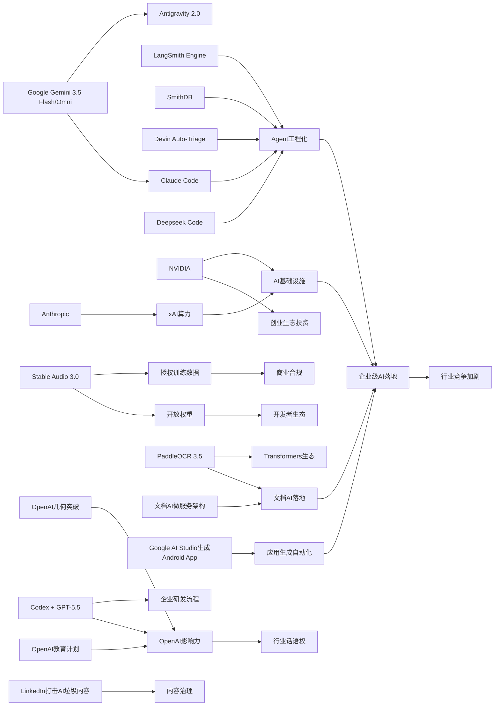

> AI 早报 · 每日早读 · 全网深度聚合

## **今日摘要**

Stable Audio 3.0、Gemini 3.5 Flash/Omni、PaddleOCR 3.5等更新显示，AI产品正同时向更强生成能力、更好多模态支持和更易集成的开发生态快速演进。  
与此同时，智能体基础设施、企业代码审查流程和编程助手赛道持续升温，说明行业竞争重点正从单一模型性能转向“模型+工具链+工作流”的完整落地能力。  
更值得关注的是，OpenAI模型推翻80年几何猜想这一成果表明，AI正在从辅助工具进一步走向科研发现者，其在科学研究和产业应用中的影响力都在显著上升。

### 🔵 产品与功能更新

1. **Stability AI发布Stable Audio 3.0。**  
新一代音频模型支持生成最长6分钟的音乐片段，明显比以往更接近完整作品。此次一共推出多款模型，其中3款提供开放权重（可下载并自行部署的模型参数），方便开发者二次使用。官方还强调训练数据全部来自授权素材，这对音乐生成产品的商用落地很关键🚀  
[Stable Audio更新解读(briefing)](https://the-decoder.com/stability-ai-launches-stable-audio-3-0-with-up-to-six-minute-tracks-and-open-weights/)

2. **智能体基础设施继续升级。**  
当天虽无单一超级重磅发布，但智能体（Agent，能自主调用工具完成任务的AI）底层工具进展很快。LangSmith Engine开始提供面向智能体的CI/CD循环（持续集成/持续交付，用来自动测试和上线），SmithDB则主打低延迟可观测性查询，帮助团队更快排查问题。与此同时，Cognition的Devin Auto-Triage把缺陷分流自动化做成持续运行模式，Anthropic也在改进Claude Code对大型代码库的支持🚀  
[智能体工具进展综述(briefing)](https://news.smol.ai/issues/26-05-18-not-much/)

3. **OpenAI模型推翻80年几何猜想。**  
OpenAI表示，其模型在离散几何（研究点、线、距离等离散结构的数学分支）中解决了“单位距离问题”，并推翻了一项存在80年的核心猜想。这不仅是数学研究上的里程碑，也说明AI正在从“辅助证明”走向“提出并验证新结果”。对外界来说，这类成果会进一步提升AI在科研领域的可信度与关注度🚀  
[几何突破官方说明(briefing)](https://openai.com/index/model-disproves-discrete-geometry-conjecture)

### 🟢 前沿研究

1. **Google I/O 2026公布Gemini 3.5 Flash与Omni。**  
谷歌在I/O大会上进一步把Gemini定位成同时面向消费者和开发者的平台。Gemini 3.5 Flash主打更快的智能体任务和编程场景，Gemini Omni则强调多模态（文字、图片、视频等多种输入输出）生成与编辑能力。配合扩展后的Antigravity 2.0智能体技术栈，谷歌显然在押注“模型+工具链+平台”一体化路线🚀  
[Google I/O核心速览(briefing)](https://news.smol.ai/issues/26-05-19-not-much/)

2. **PaddleOCR 3.5接入Transformers后端。**  
这次更新聚焦OCR（光学字符识别）和文档解析任务，强调可在Transformers生态中运行。对研究者和开发者来说，这意味着文档AI流程更容易与主流模型框架对接，也更方便复用现有工具。文档理解一直是企业AI落地的重要入口，因此这类兼容性升级很有现实价值🚀  
[PaddleOCR新版介绍(briefing)](https://huggingface.co/blog/PaddlePaddle/paddleocr-transformers)

3. **Codex开始改变企业代码审查流程。**  
OpenAI分享了Ramp工程团队如何用Codex配合GPT-5.5进行代码审查。原本需要数小时等待的人类反馈，现在可以在几分钟内获得较有实质内容的建议。虽然这更像工程实践案例，但它揭示了前沿模型在软件研发流程中的真实研究与应用边界🚀  
[企业代码审查案例(briefing)](https://openai.com/index/ramp)

### 🟡 行业展望与社会影响

1. **Deepseek筹备“Deepseek Code”挑战Codex与Claude Code。**  
Deepseek正在北京组建新团队，开发代号为“Deepseek Code”的AI编程智能体。招聘要求直接点名Agent loop（智能体循环）、MCP（模型上下文协议）和上下文工程，说明行业竞争正在从“模型能力”转向“完整工作流能力”。如果项目推进顺利，AI编程助手赛道可能会更快进入白热化阶段🚀  
[Deepseek编程布局(briefing)](https://the-decoder.com/deepseek-wants-to-take-on-claude-code-and-openais-codex-with-deepseek-code/)

2. **英伟达再创营收新高并披露创投持仓。**  
英伟达公布又一个创纪录季度，同时透露持有约430亿美元初创公司股权。虽然公司也预告下一季度营收增速可能放缓，但这份成绩单依然显示其在AI产业链中的中心位置。除了卖芯片，英伟达对创业公司的深度绑定也在放大它对行业方向的影响力🚀  
[英伟达财报看点(briefing)](https://techcrunch.com/2026/05/20/nvidia-posts-another-record-quarter-reveals-43-billion-of-holdings-in-startups/)

3. **OpenAI推进“面向国家的教育计划”。**  
OpenAI宣布扩展Education for Countries项目，重点包括学校合作、教师培训和教育工具推广。官方叙事强调用AI改善全球学习成果，说明教育正在成为大模型公司争取长期社会影响力的重要场景。对公共部门而言，这类合作也意味着AI治理与教育公平问题会更早进入讨论中心🚀  
[教育计划阶段更新(briefing)](https://openai.com/index/the-next-phase-of-education-for-countries)

### 🟣 开源TOP项目

1. **OlmoEarth v1.1发布更高效地球观测模型。**  
AllenAI介绍了OlmoEarth v1.1，这是一组更高效的地球观测模型，面向遥感（通过卫星或航空设备获取地表信息）等任务。效率提升意味着在更多研究和行业场景中可更低成本地使用相关模型。对开源社区来说，地球观测模型的持续迭代有助于推动环境、农业与灾害监测应用🚀  
[地球观测模型更新(briefing)](https://huggingface.co/blog/allenai/olmoearth-v1-1)

2. **文档AI生产架构论文聚焦微服务落地。**  
这篇论文讨论如何用微服务架构把OCR、分类和大语言模型流水线部署到生产环境。它试图弥合“论文里模型很好”与“企业里真正可运行”之间的落差，重点不在新模型，而在系统工程。对于需要处理大量票据、合同或表单的团队，这类实践框架很有参考意义🚀  
[文档AI架构论文(briefing)](https://arxiv.org/abs/2605.18818)

3. **新研究探索个人健康档案对健康AI的价值。**  
论文评估了个人健康记录（PHR，患者自行管理的健康档案）在个性化健康AI中的作用，并测试大模型回答健康问题时的帮助程度。它提醒我们，医疗AI的效果不仅取决于模型强弱，也高度依赖输入数据是否完整、易理解。对大众而言，这类研究关系到未来健康助手是否真的“懂你”🚀  
[健康AI研究摘要(briefing)](https://arxiv.org/abs/2605.18937)

### 🔴 社媒分享

1. **Google正在测试“提示词生成安卓App”。**  
Google AI Studio现在可根据提示词直接生成原生Android应用，使用Kotlin和Jetpack Compose构建，还能在浏览器模拟器中测试。对于清单、追踪器等简单工具类应用，未来用户可能不必再去应用商店搜索下载。这个方向也让“人人做App”离现实更近一步🚀  
[谷歌生成App观察(briefing)](https://the-decoder.com/google-tests-the-app-version-of-the-saaspocalypse/)

2. **Anthropic将向xAI支付巨额算力费用。**  
TechCrunch披露，Anthropic将为算力（运行和训练AI所需计算资源）向xAI支付每月12.5亿美元。这个数字之大，说明顶尖模型公司之间的竞争已不只是算法能力，更是能源、数据中心和基础设施的竞赛。社交平台上，这类消息也进一步强化了“AI进入重资产时代”的讨论🚀  
[xAI算力大单速看(briefing)](https://techcrunch.com/2026/05/20/anthropic-will-pay-xai-1-25-billion-per-month-for-compute/)

3. **LinkedIn开始打击“AI垃圾内容”。**  
LinkedIn正在整治所谓“AI slop”，也就是批量生成、内容空泛的AI帖子。平台称在早期测试中，对这类泛化内容的识别准确率达到94%。这一动作本身也反映出主流平台正在重新平衡“鼓励AI创作”与“维护信息质量”之间的关系🚀  
[LinkedIn整治解读(briefing)](https://the-decoder.com/linkedins-war-on-ai-slop-is-not-just-a-policy-update-it-is-an-admission-that-the-platform-lost-control-of-its-feed/)

---

📊 行业洞察

1. 事实  
   Google I/O 2026发布Gemini 3.5 Flash、Gemini Omni，并配套扩展Antigravity 2.0智能体技术栈；同日，LangSmith Engine提供面向智能体的CI/CD（持续集成/持续交付）循环、SmithDB强化低延迟可观测性（observability，系统运行状态追踪），Cognition推出Devin Auto-Triage持续化缺陷分流，Anthropic也在增强Claude Code对大型代码库支持。  
   【洞察】AI竞争焦点正从“单点模型参数能力”转向“智能体工程体系”竞争。赢家不只是模型更强的公司，而是能把模型、工具调用、评测、部署、监控、迭代闭环做成平台的一方。2026年的Agent（智能体）赛道，正在快速复制云计算时代DevOps（开发运维一体化）的平台化路径。

2. 事实  
   OpenAI披露模型在离散几何中推翻80年猜想；同时，Ramp工程团队已用Codex配合GPT-5.5将代码审查反馈从数小时缩短至数分钟；OpenAI还推进“Education for Countries”教育合作计划。  
   【洞察】头部大模型公司正在形成“科研突破—企业落地—公共叙事”三层联动：上层用数学成果建立技术权威，中层用编程与审查场景证明ROI（投资回报），下层通过教育计划扩展制度影响力。这意味着AI公司未来竞争不只发生在产品市场，也发生在科研话语权和公共基础设施入口的争夺上。

3. 事实  
   英伟达再创营收新高，并披露持有约430亿美元初创公司股权；Anthropic将向xAI支付每月12.5亿美元算力费用；同时，Stability AI发布Stable Audio 3.0并强调授权训练数据与开放权重（可下载部署的模型参数）。  
   【洞察】AI产业正在同时走向“两极化基础设施结构”：一端是以英伟达、xAI这类算力与资本节点为核心的重资产集中化；另一端是以开放权重、可私有部署、合规数据为特点的应用层分散化。未来行业门槛不会简单下降，而是从“能不能做模型”转为“是否拿得到算力、数据授权与分发渠道”的复合门槛。

4. 事实  
   PaddleOCR 3.5接入Transformers后端，提升与主流模型生态兼容性；文档AI生产架构论文强调以微服务（microservices，将系统拆成独立服务模块）方式部署OCR、分类与大模型流水线；Google AI Studio测试根据提示词生成原生Android App。  
   【洞察】企业级AI的真实落地正在从“聊天入口”转向“文档流与业务流重构”。OCR、文档解析、代码生成、应用生成等能力开始被拼装为标准化工作流，意味着下一阶段最先兑现商业价值的，不一定是最炫的通用助手，而是能嵌入票据、合同、审批、表单、轻应用生成等高频流程的垂直系统。

🗺️ 今日关系图

