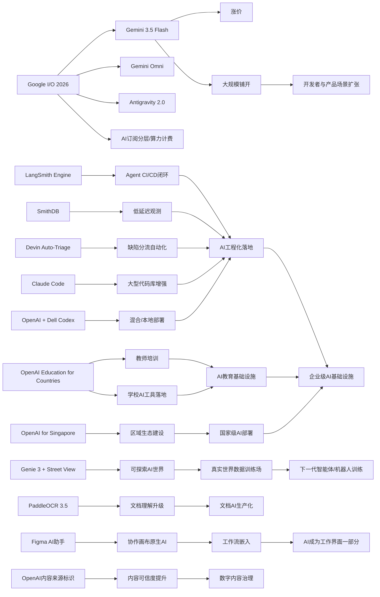

> AI 早报 · 每日早读 · 全网深度聚合

## **今日摘要**

1. 本周 AI 发展重点集中在“工程化落地”与“平台化扩张”：LangSmith、Devin、Claude Code 等产品持续强化智能体开发、自动化运维和大型代码库支持，Google 则在 I/O 2026 上全面推进 Gemini 与智能体平台。  
2. 同时，OpenAI 正把 AI 从工具层推向基础设施层，通过面向各国教育体系和新加坡的多年合作，推动教师培训、学校应用、人才培养和公共服务部署。  
3. 在研究与行业层面，更强模型和多模态/世界模型能力不断普及，但也带来成本上升与资源集中趋势，例如 Gemini 3.5 Flash 涨价、PaddleOCR 向文档理解升级，以及 Google 用 Street View 数据构建可探索 AI 世界。

### 🔵 产品与功能更新

1. **Agent基础设施与编程助手持续升级。**
LangSmith Engine 开始补上智能体（Agent）开发中的 CI/CD（持续集成/持续交付）闭环，SmithDB 则主打低延迟观测查询，方便团队追踪运行状态。Cognition 推出 Devin Auto-Triage，把缺陷分流做成可持续运行的自动化流程，还带有记忆和子智能体结构。Anthropic 也继续增强 Claude Code，面向大型代码库加入提示词缓存诊断和更快模式，说明“AI写代码”正走向工程化落地。🚀
[查看产品更新汇总(briefing)](https://news.smol.ai/issues/26-05-18-not-much/)

2. **OpenAI推进“面向国家的教育计划”。**
OpenAI 宣布扩展 Education for Countries，继续与各国教育体系建立合作。重点包括教师培训、学校中的 AI 工具落地，以及通过新伙伴关系提升学习成效。对普通用户来说，这意味着 AI 正从“个人工具”进一步走向“教育基础设施”。🚀
[了解教育计划进展(briefing)](https://openai.com/index/the-next-phase-of-education-for-countries)

3. **Gemini 3.5 Flash 涨价，但Google准备大规模铺开。**
Gemini 3.5 Flash 被定位为更通用的主力模型，虽然价格更高，但 Google 似乎希望把它用于更广泛的产品和开发场景。这个变化反映出一个趋势：更强、更快的模型，正在成为默认选择，但成本门槛也随之上升。对开发者和企业来说，性能与预算的平衡会越来越重要。🚀
[查看模型价格变化(briefing)](https://simonwillison.net/2026/May/19/gemini-35-flash/#atom-everything)

### 🟢 前沿研究

1. **Google I/O 2026集中展示Gemini与智能体平台。**
Google 在 I/O 上把 Gemini 明确定位为消费级 AI 与开发者/智能体平台的核心。新发布包括面向快速任务和编程的 Gemini 3.5 Flash、支持多模态（文字/图像/音频/视频）生成编辑的 Gemini Omni，以及扩展后的 Antigravity 2.0 智能体技术栈。Google 还披露其每月处理的 token（文本处理单位）规模已超过 3.2 千万亿，显示其平台化能力正在快速增强。🚀
[回顾I/O核心发布(briefing)](https://news.smol.ai/issues/26-05-19-not-much/)

2. **PaddleOCR 3.5接入Transformer后端。**
PaddleOCR 3.5 介绍了用 Transformers（常见大模型架构）后端来完成 OCR（光学字符识别）和文档解析任务的方案。对非技术用户来说，这类升级意味着扫描件、表格、票据等文档，未来会被更准确地识别与理解。它也反映出“文档 AI”正在从单点识别走向更完整的信息提取流程。🚀
[了解OCR新方案(briefing)](https://huggingface.co/blog/PaddlePaddle/paddleocr-transformers)

3. **OpenAI启动面向新加坡的多年合作。**
OpenAI 宣布推出 OpenAI for Singapore，计划通过多年合作扩大 AI 部署、培养本地人才，并支持企业和公共服务使用 AI。相比单一产品发布，这更像是区域级生态建设。它说明各国对 AI 的关注正从“是否采用”转向“如何系统化部署”。🚀
[查看新加坡合作计划(briefing)](https://openai.com/index/introducing-openai-for-singapore)

### 🟡 行业展望与社会影响

1. **Google把Street View与世界模型结合，生成可探索AI世界。**
Google DeepMind 将 Genie 3 世界模型（可生成可交互环境的模型）与 Street View 街景数据结合，用户在地图上放一个点，就能得到一个可“走进去”的 AI 世界。表面上看这是创意演示，背后更重要的是把多年积累的真实世界数据转化为训练资源。对于机器人和智能体来说，这类“可探索世界”可能成为重要训练场。🚀
[了解AI世界演示(briefing)](https://the-decoder.com/google-pairs-its-genie-world-model-with-street-view-to-create-explorable-ai-worlds-based-on-real-places/)

2. **Figma在协作画布中加入AI助手。**
Figma 开始把 AI 助手带入其协作画布，首批会先在 Figma Design 中提供。这个变化说明 AI 不再只是聊天窗口里的功能，而是会直接嵌入团队日常创作流程。对于设计、产品和协作团队来说，AI 正逐步成为“工作界面的一部分”。🚀
[查看Figma新助手(briefing)](https://techcrunch.com/2026/05/20/figma-adds-an-ai-assistant-to-its-collaborative-canvas/)

3. **OpenAI推动AI内容来源标识。**
OpenAI 发布内容来源（content provenance）相关进展，结合 Content Credentials（内容凭证）、SynthID 和验证工具，帮助用户识别 AI 生成媒体。随着生成式 AI 内容越来越多，“内容是谁做的、是否被修改过”变得更加关键。对普通用户而言，这类标识机制有助于提升对数字内容的信任。🚀
[查看来源标识方案(briefing)](https://openai.com/index/advancing-content-provenance)

### 🟣 开源TOP项目

1. **OlmoEarth v1.1发布，更强调模型效率。**
AllenAI 介绍了 OlmoEarth v1.1，这是一组更高效的模型家族。虽然摘要信息有限，但“更高效”通常意味着在算力、速度或资源消耗上更友好。对于开源社区来说，这类更新有助于把模型能力带到更多预算有限的场景。🚀
[了解OlmoEarth更新(briefing)](https://huggingface.co/blog/allenai/olmoearth-v1-1)

2. **文档AI生产化开始重视微服务架构。**
这篇论文提出一种面向生产环境的微服务架构，用来承载 OCR（光学字符识别）与 LLM（大语言模型）文档流水线。它试图弥补学术界“只谈模型、不谈落地”的空白，把分类、识别和理解模块拆开部署。对企业而言，这类方法更接近真正可维护、可扩展的文档处理系统。🚀
[查看文档AI架构(briefing)](https://arxiv.org/abs/2605.18818)

3. **OpenAI与Dell合作，把Codex带到混合与本地环境。**
OpenAI 与 Dell 合作，希望让 Codex 编程智能体进入混合部署和本地部署环境。企业可以在更重视数据安全和流程控制的环境中使用 AI 编程能力，而不必完全依赖公有云。对于大型组织来说，这是 AI 编程助手走向正式 IT 基础设施的重要一步。🚀
[了解企业部署合作(briefing)](https://openai.com/index/dell-codex-enterprise-partnership)

### 🔴 社媒分享

1. **Google重做AI订阅体系，月费分三档。**
Google 在 I/O 2026 上重新整理 AI 订阅方案，价格从 7.99 美元到 99.99 美元不等，并引入基于算力消耗的使用方式。相比过去常见的“每天多少次提问”，这种模式更接近云计算计费。它也说明 AI 服务商业化正变得更细致、更平台化。🚀
[查看订阅调整详情(briefing)](https://the-decoder.com/google-overhauls-its-ai-subscriptions-at-i-o-2026-with-three-tiers-starting-at-10-a-month/)

2. **Gmail开始支持“对话式找邮件”。**
Google 在 Gmail 中扩展了 AI Inbox，让用户可以通过语音或对话方式让 Gemini 帮忙查找埋在收件箱里的信息。对普通用户来说，这比传统搜索更自然，尤其适合回忆模糊信息时使用。邮件正在从“检索工具”变成“可对话的信息助手”。🚀
[体验Gmail新搜索(briefing)](https://techcrunch.com/2026/05/19/you-can-now-talk-to-your-gmail-inbox-as-seen-at-google-io-2026/)

3. **Ettin Reranker系列发布，瞄准检索排序。**
Hugging Face 介绍了 Ettin Reranker 系列模型，主要用于 reranker（重排序模型）场景，即在初步检索结果中重新判断哪些内容更相关。虽然这类模型不如聊天助手显眼，但它们直接影响搜索、问答和知识库效果。对用户体验来说，“找得准”往往和“答得好”一样重要。🚀
[了解重排序模型(briefing)](https://huggingface.co/blog/ettin-reranker)

---

📊 行业洞察

1. 事实  
   Google I/O 2026 集中发布 Gemini 3.5 Flash、Gemini Omni 与 Antigravity 2.0，并披露月度 token（文本处理单位）处理量已超 3.2 千万亿；同时 Google 重做 AI 订阅体系，采用更细颗粒度的分层与近似云计费模式；Gemini 3.5 Flash 还出现涨价，但被准备大规模铺开。  
   【洞察】头部厂商正把大模型从“单一产品”推进为“平台型公用基础设施”，其商业模式也从“功能收费”转向“算力+场景分层收费”。这意味着未来竞争焦点不只是模型能力，而是平台吞吐、开发者生态、计费设计与多场景分发能力。

2. 事实  
   LangSmith Engine 补齐 Agent（智能体）开发中的 CI/CD（持续集成/持续交付）闭环，SmithDB 强调低延迟观测；Cognition 推出 Devin Auto-Triage，实现缺陷分流自动化；Anthropic 增强 Claude Code，支持大型代码库提示词缓存诊断和更快模式；OpenAI 又与 Dell 合作，把 Codex 带入混合部署与本地环境。  
   【洞察】AI 编程与智能体赛道正在从“演示可用”进入“工程可管、企业可部署”阶段。下一轮胜负手不再只是代码生成准确率，而是观测性（Observability，系统运行可监控能力）、流程自动化、企业安全边界与本地/混合部署兼容性。

3. 事实  
   OpenAI 扩展 Education for Countries，推进教师培训、学校工具落地；同时启动 OpenAI for Singapore，开展多年期区域合作，支持企业、人才与公共服务部署 AI。  
   【洞察】AI 产业正在从 ToC（面向个人消费者）工具渗透，升级为“国家级能力建设”项目。教育、人才培养与公共服务将成为大模型厂商拓展国际市场的关键入口，区域合作能力可能比单点模型性能更决定长期市场份额。

4. 事实  
   Google DeepMind 将 Genie 3 世界模型（可生成可交互环境的模型）与 Street View 结合，生成可探索 AI 世界；PaddleOCR 3.5 接入 Transformer（大模型常见架构）后端；Figma 把 AI 助手嵌入协作画布；OpenAI 推进 Content Credentials（内容凭证）、SynthID 和验证工具。  
   【洞察】AI 正从“聊天生成”扩展到“工作流原生嵌入+真实世界数据闭环”阶段：一端是文档、设计、邮件等高频界面被 AI 重构，另一端是真实世界数据、内容溯源与交互环境成为新基础层。未来更有价值的不是孤立模型，而是嵌入业务流程并连接数据真实性的系统能力。

🗺️ 今日关系图

