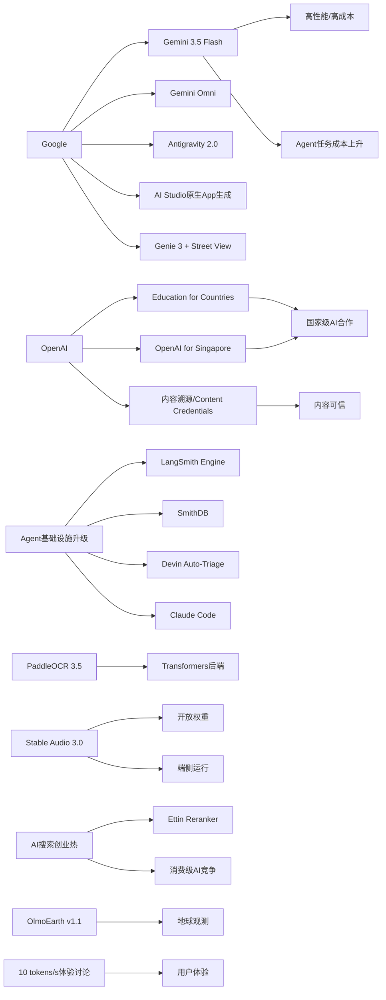

> AI 早报 · 每日早读 · 全网深度聚合

## **今日摘要**

AI 工具链正在快速走向生产化：Agent 基础设施、代码助手和文档处理能力持续升级，同时 Google 在 Gemini 平台和智能体开发栈上加速布局。  
另一方面，更强的模型也带来了更高成本，例如 Gemini 3.5 Flash 虽性能提升明显，但价格大涨，反映出先进 AI 的使用门槛正在提高。  
此外，OpenAI 与各国及教育体系的合作、新加坡国家级项目，以及 Google 测试 AI 直接生成原生应用，都说明 AI 正从开发者圈层进一步渗透到教育、公共服务和消费级应用生态。

### 🔵 产品与功能更新

1. **Agent基础设施持续升级。**  
LangSmith Engine 开始提供面向智能体（Agent）的 CI/CD（持续集成/持续交付）循环，方便团队更系统地测试和上线自动化流程。SmithDB 则主打低延迟查询，帮助开发者做可观测性（观察系统运行状态）分析。与此同时，Cognition 推出 Devin Auto-Triage，可长期自动处理缺陷分流；Anthropic 也强化了 Claude Code 在大型代码库中的使用体验。整体来看，AI 工具链正从“能用”走向“更适合生产环境”🚀  
[查看基础设施速览(brfing)](https://news.smol.ai/issues/26-05-18-not-much/)

2. **Gemini 3.5 Flash 性能更强，但价格明显上涨。**  
报道指出，Google 新版 Gemini 3.5 Flash 相比上一代能力提升明显，但运行成本约高出 5.5 倍。在智能体任务中，它因为需要更多交互步骤，整体成本甚至比 Gemini 3.1 Pro 还高出 75%。这也反映出一个趋势：更强的新模型，往往也伴随着更高的使用门槛🚀  
[查看价格变化解读(brfing)](https://the-decoder.com/googles-gemini-3-5-flash-follows-anthropic-and-openai-in-making-newer-ai-models-significantly-pricier/)

3. **OpenAI 推进“面向国家的教育计划”。**  
OpenAI 宣布继续扩展 Education for Countries 项目，重点放在学校场景中的 AI 普及。新阶段包括与更多伙伴合作、为教师提供培训，以及推出支持教学和学习效果改进的工具。对普通用户来说，这意味着 AI 正更快进入教育体系，而不只是停留在企业和开发者市场🚀  
[查看教育计划进展(brfing)](https://openai.com/index/the-next-phase-of-education-for-countries)

### 🟢 前沿研究

1. **Google I/O 2026 展示 Gemini 新阶段。**  
Google 在 I/O 上把 Gemini 进一步定位为面向消费者和开发者的平台，并发布了 Gemini 3.5 Flash、Gemini Omni 和 Antigravity 2.0 智能体栈。Gemini Omni 强调多模态（可同时处理文字、图片、视频等）生成与编辑，Antigravity 2.0 则面向更复杂的智能体开发。Google 还披露其月度处理量已超过 3.2 千万亿 token（模型处理的文本单位），显示大规模应用正在加速🚀  
[查看I/O发布总览(brfing)](https://news.smol.ai/issues/26-05-19-not-much/)

2. **OpenAI 与新加坡启动多年期合作。**  
OpenAI 发布 “OpenAI for Singapore”，宣布在当地展开多年的 AI 合作计划。重点包括扩大 AI 部署、培养本地人才，并支持企业与公共服务场景落地。对行业来说，这代表国家级合作正在成为 AI 公司全球扩张的重要路径🚀  
[查看新加坡合作细节(brfing)](https://openai.com/index/introducing-openai-for-singapore)

3. **PaddleOCR 3.5 接入 Transformers 后端。**  
PaddleOCR 3.5 宣布可在 Transformers（主流模型框架）后端上运行 OCR（文字识别）与文档解析任务。这样的整合有助于开发者更方便地把文档处理能力接入现有 AI 工作流。对企业应用而言，票据、合同、表单等场景的自动化处理门槛有望继续降低🚀  
[查看文档识别更新(brfing)](https://huggingface.co/blog/PaddlePaddle/paddleocr-transformers)

### 🟡 行业展望与社会影响

1. **Google 正测试“AI 生成原生应用”的新路径。**  
Google AI Studio 现在可以根据提示词直接生成原生 Android 应用，使用 Kotlin 与 Jetpack Compose，并可在浏览器模拟器中测试。对于清单、追踪器等简单工具类应用，这可能削弱传统应用商店的入口价值。文章认为，这像是 SaaS（软件订阅服务）冲击进一步蔓延到应用市场🚀  
[查看应用市场新变化(brfing)](https://the-decoder.com/google-tests-the-app-version-of-the-saaspocalypse/)

2. **AI 搜索创业公司热度快速上升。**  
TechCrunch 指出，AI 搜索已悄然成为消费级 AI 里最有吸引力的赛道之一。随着用户逐渐接受“对话式找答案”，搜索体验正从链接列表转向直接生成结果。资本与创业者持续涌入，也意味着这一领域的竞争会更快白热化🚀  
[查看AI搜索趋势(brfing)](https://techcrunch.com/2026/05/20/ai-search-startups-are-blowing-up/)

3. **OpenAI 推进 AI 内容溯源。**  
OpenAI 宣布推进内容来源标记方案，包括 Content Credentials（内容凭证）、SynthID 以及验证工具，帮助用户识别 AI 生成媒体。随着图片、音频和视频越来越逼真，内容是否可信正成为公共议题。此类工具的价值不在“完全阻止造假”，而在于提升透明度和核验效率🚀  
[查看内容溯源方案(brfing)](https://openai.com/index/advancing-content-provenance)

### 🟣 开源TOP项目

1. **Stable Audio 3.0 发布，支持最长六分钟音轨。**  
Stability AI 推出 Stable Audio 3.0，新一代音频模型中有三个版本提供开放权重（可下载模型参数）。官方称这些模型基于授权数据训练，可生成最长六分钟的音乐片段。对于创作者和开源社区来说，这意味着更长篇幅的 AI 音乐生成正在变得更可用🚀  
[查看音频模型发布(brfing)](https://the-decoder.com/stability-ai-launches-stable-audio-3-0-with-up-to-six-minute-tracks-and-open-weights/)

2. **Stable Audio 3.0 还带来可端侧运行的小模型。**  
另一篇报道补充称，Stable Audio 3.0 的小型版本可以在设备本地运行，并生成最长两分钟音轨。本地运行意味着更低的云端依赖，也更适合对隐私和延迟敏感的场景。AI 音乐工具因此有机会进入更多轻量化产品形态🚀  
[查看端侧音频能力(brfing)](https://techcrunch.com/2026/05/20/stability-ai-release-a-new-audio-model-that-can-create-six-minute-songs/)

3. **OlmoEarth v1.1 提升地球观测模型效率。**  
AllenAI 发布 OlmoEarth v1.1，主打更高效率的地球观测模型家族。此类模型通常用于分析卫星或遥感图像，服务环境、农业和灾害等场景。更高效率意味着研究人员和机构可以更低成本地处理更大规模的地表数据🚀  
[查看地球观测模型(brfing)](https://huggingface.co/blog/allenai/olmoearth-v1-1)

### 🔴 社媒分享

1. **Google 把 Genie 世界模型与 Street View 结合。**  
Google DeepMind 将 Genie 3 世界模型接入 Street View（街景）图像，用户在地图上选定地点后，就能生成一个可探索的 AI 世界。这个演示既有趣，也显示真实世界数据正在成为训练创意工具、智能体和机器人系统的重要资产。对外界而言，它把“地图数据”变成了更直观的 AI 交互体验🚀  
[查看街景生成演示(brfing)](https://the-decoder.com/google-pairs-its-genie-world-model-with-street-view-to-create-explorable-ai-worlds-based-on-real-places/)

2. **“每秒 10 个 token”到底有多快？**  
Simon Willison 讨论了模型输出速度“10 tokens per second（每秒 10 个文本单位）”在真实使用中的体感差异。这个话题看似技术化，但直接关系到聊天机器人是否“顺畅”、是否让人愿意持续使用。社媒传播点在于，它把抽象性能指标翻译成了普通人能感知的体验问题🚀  
[查看速度体感讨论(brfing)](https://simonwillison.net/2026/May/20/tokens-per-second/#atom-everything)

3. **Ettin Reranker 系列亮相。**  
Hugging Face 介绍了 Ettin Reranker 系列模型，用于重排序（把初步检索结果重新按相关性排序）。这类模型常用于搜索、问答和检索增强生成（先找资料再回答）场景。虽然名字偏技术，但它的意义很直接：帮助 AI 更稳定地把“最相关的信息”放到前面🚀  
[查看重排序模型介绍(brfing)](https://huggingface.co/blog/ettin-reranker)

---

📊 行业洞察

1. 事实  
   Google 在 I/O 上发布 Gemini 3.5 Flash、Gemini Omni（多模态模型，可处理文本/图像/视频）和 Antigravity 2.0 智能体栈（Agent Stack，智能体开发框架），并披露月度处理量已超 3.2 千万亿 token；同时，Google AI Studio 已可根据提示词直接生成原生 Android 应用。  
   【洞察】Google 正把模型能力、开发框架和应用生成入口打包成一体化平台，竞争重点已从“单模型领先”转向“平台级分发与生态控制”。这意味着未来胜负不只看基准测试，还看谁能同时占据开发者工作流、终端入口和用户使用场景。

2. 事实  
   LangSmith Engine 提供面向 Agent 的 CI/CD（持续集成/持续交付）循环，SmithDB 强化低延迟可观测性（Observability，系统运行状态监控），Cognition 推出 Devin Auto-Triage 自动缺陷分流，Anthropic 也提升 Claude Code 在大型代码库中的体验；与此同时，PaddleOCR 3.5 接入 Transformers 后端，方便文档处理能力嵌入现有 AI 工作流。  
   【洞察】AI 正快速进入“工程化落地”阶段，行业关注点已从模型演示转向生产级可靠性、监控、集成与维护。未来企业采购决策中，“是否容易接入现有系统、是否可观测、是否可持续迭代”会比单点模型能力更重要，AI 基础设施层的价值正在上升。

3. 事实  
   Gemini 3.5 Flash 性能提升明显，但成本约为上一代的 5.5 倍，在智能体任务中整体成本甚至比 Gemini 3.1 Pro 高出 75%；另一方面，Simon Willison 对“每秒 10 tokens”的体感讨论说明，用户对速度和交互流畅性非常敏感。  
   【洞察】模型竞争正在进入“性能—成本—时延”三角博弈：更强模型未必自动带来更优产品体验，尤其在 Agent 场景下，推理步数增加会放大总成本与等待时间。接下来更有优势的厂商，不一定是最强模型提供者，而是最擅长做模型分层、路由调度（Routing，按任务分配模型）和成本优化的服务商。

4. 事实  
   OpenAI 扩展 Education for Countries，并与新加坡启动多年期合作，涵盖 AI 部署、人才培养和公共服务落地；同时，OpenAI 推进 Content Credentials（内容凭证）、SynthID 和验证工具，强化 AI 内容溯源。  
   【洞察】头部 AI 公司正在从“卖模型/卖工具”升级为“国家级数字基础设施合作方”。教育、公共服务和内容可信机制正成为政府合作的三大抓手，说明全球 AI 竞争已不只是企业市场竞争，也是在争夺制度嵌入、人才标准与信任框架的话语权。

🗺️ 今日关系图

