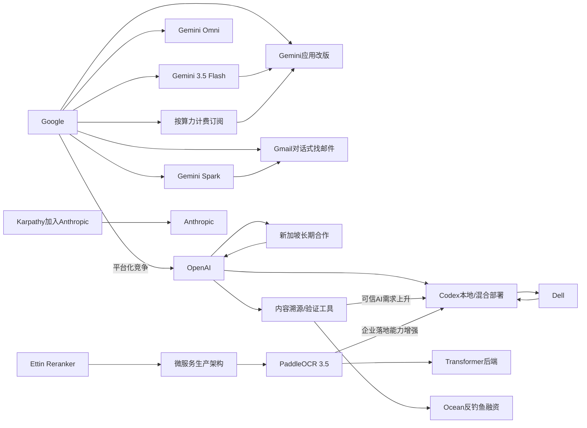

> AI 早报 · 每日早读 · 全网深度聚合

## **今日摘要**

Google 在 I/O 上发布了 Gemini 3.5 Flash、Gemini Omni 和可持续执行任务的云端代理 Gemini Spark，并重构 Gemini 应用与订阅体系，显示其正把 AI 从聊天工具升级为面向用户和开发者的平台。  
与此同时，OpenAI 一方面推进新加坡长期合作以加速本地化落地，另一方面加强 AI 内容溯源与真伪验证，反映其在全球扩张之外也开始重视可信基础设施建设。  
整体来看，行业正在同时朝三个方向演进：模型能力与代理化增强、文档等垂直场景理解升级，以及商业模式和内容可信机制逐步成熟。

### 🔵 产品与功能更新

1. **Google 在 I/O 发布新模型与常驻云端助手。**
Google 在 I/O 大会上集中展示了新一轮 AI 产品更新，包括 Gemini 3.5 Flash、Gemini Omni，以及可在云端持续运行的个人代理（可代替用户持续执行任务）Gemini Spark。新版 Gemini 应用也同步改版，说明 Google 正把 Gemini 从单一聊天工具扩展成完整平台。对普通用户来说，这意味着 AI 不只是“问一次答一次”，而是开始具备持续跟进任务的能力🚀  
[查看谷歌新品速览](https://the-decoder.com/googles-i-o-announcements-new-models-a-cloud-agent-that-never-sleeps-and-a-redesigned-gemini-app/)

2. **OpenAI 推出“新加坡版”长期合作计划。**
OpenAI 宣布面向新加坡启动多年期合作，将重点放在 AI 部署、本地人才培养，以及支持企业与公共服务落地。相比单次产品发布，这更像是区域级生态建设，目标是把 AI 能力更系统地引入政府和商业场景。对外界而言，这也显示 OpenAI 正加快推进国际化本地合作🚀  
[了解新加坡合作](https://openai.com/index/introducing-openai-for-singapore)

3. **Gemini 3.5 Flash 定位升级但价格更高。**
Simon Willison 的观察指出，Gemini 3.5 Flash 虽然价格上调，但 Google 计划将其广泛用于更多核心场景。也就是说，这款模型不再只是“便宜快速”的补充选项，而可能成为 Google AI 产品线里的基础通用模型。价格与定位同步提升，反映出 Google 对其能力和规模化应用的信心🚀  
[查看模型定位解读](https://simonwillison.net/2026/May/19/gemini-35-flash/#atom-everything)

### 🟢 前沿研究

1. **Google 把 Gemini 推向消费者与代理平台双路线。**
在这篇汇总中，Google I/O 2026 的重点被概括为三项：面向快速任务与编程的 Gemini 3.5 Flash、支持多模态（可同时处理文字图像音视频）的 Gemini Omni，以及扩展后的代理工具栈（用于构建自动执行任务的系统）。Google 还披露其每月处理的 token（模型处理的文本单位）规模大幅增长。整体来看，Google 正试图同时占据“用户入口”和“开发者基础设施”两端🚀  
[阅读 I/O 研究综述](https://news.smol.ai/issues/26-05-19-not-much/)

2. **OpenAI 推进 AI 内容溯源与真伪验证。**
OpenAI 介绍了内容来源标记方案，包括 Content Credentials（内容凭证）、SynthID 以及验证工具，用于帮助人们识别 AI 生成媒体。随着图片、音频和视频生成越来越逼真，内容“是不是 AI 做的”会成为关键问题。此举体现出行业正在把“生成能力”之外的可信度建设提到更高优先级🚀  
[查看内容溯源方案](https://openai.com/index/advancing-content-provenance)

3. **PaddleOCR 3.5 将 OCR 与文档解析接入 Transformer 后端。**
PaddleOCR 3.5 介绍了如何在 Transformer（擅长理解上下文的神经网络架构）后端上运行 OCR（光学字符识别）和文档解析任务。对非技术用户来说，这类升级意味着扫描件、表格、复杂版式文档的读取与理解能力可能进一步提升。文档 AI 正从“识别文字”走向“理解整份文档”🚀  
[了解文档识别升级](https://huggingface.co/blog/PaddlePaddle/paddleocr-transformers)

### 🟡 行业展望与社会影响

1. **Google 重做 AI 订阅体系，按算力消费计费。**
Google 在 I/O 2026 上调整 AI 订阅服务，推出三个价格层级，并从“每日提示次数限制”转向“按计算消耗计费”。这说明 AI 商业模式正在从粗放的次数套餐，转向更贴近真实成本的用量模式。对用户而言，未来购买 AI 服务可能会更像购买云服务或流量套餐🚀  
[查看订阅模式变化](https://the-decoder.com/google-overhauls-its-ai-subscriptions-at-i-o-2026-with-three-tiers-starting-at-10-a-month/)

2. **Gmail 开始支持“对话式找邮件”。**
Google 展示了 Gmail 的 AI Inbox 新能力，用户可以直接用语音向 Gemini 提问，让它帮助找出埋在收件箱里的关键信息。相比传统关键词搜索，这种方式更接近日常交流，也更适合记不清具体发件人或时间的场景。AI 正在把“搜索邮箱”变成“和邮箱对话”🚀  
[了解 Gmail 新玩法](https://techcrunch.com/2026/05/19/you-can-now-talk-to-your-gmail-inbox-as-seen-at-google-io-2026/)

3. **OpenAI 与戴尔合作推进企业本地部署 Codex。**
OpenAI 与 Dell 合作，把 Codex 带入混合式与本地部署环境，帮助企业在更可控的安全边界内使用 AI 编程代理。对很多大型组织来说，数据不能完全放到公有云，因此“本地可用”往往决定了产品能否真正落地。这项合作说明企业级 AI 正越来越强调安全、合规与系统整合🚀  
[查看企业部署合作](https://openai.com/index/dell-codex-enterprise-partnership)

### 🟣 开源TOP项目

1. **OlmoEarth v1.1 发布更高效模型家族。**
AllenAI 发布 OlmoEarth v1.1，主打更高效率的模型家族更新。虽然摘要信息有限，但从定位看，这类项目通常关注以更低成本实现稳定性能，对研究者和开发者都很有吸引力。开源模型的竞争，正在从单纯比参数规模转向比效率和可用性🚀  
[查看模型家族更新](https://huggingface.co/blog/allenai/olmoearth-v1-1)

2. **文档 AI 生产化方案聚焦微服务架构。**
这篇论文提出一种微服务架构（把系统拆成多个独立服务协同运行），用于在生产环境中部署 OCR、分类和大语言模型流水线。它试图弥合“实验室模型”与“企业上线系统”之间的差距。对行业来说，真正难的往往不是模型本身，而是如何稳定、可维护地跑起来🚀  
[阅读生产架构论文](https://arxiv.org/abs/2605.18818)

3. **Google 新信息代理主打持续监控与主动提醒。**
TechCrunch 介绍了 Google 新 AI 代理的使用方式：它们可以在后台持续关注某个主题，并在有变化时主动通知用户。相比传统搜索“我来找信息”，这种方式更像“信息自己来找我”。这也是开源与产品社区近来热议的代理方向之一🚀  
[学习信息代理用法](https://techcrunch.com/2026/05/19/how-to-use-googles-new-ai-agents-to-go-beyond-your-standard-searches/)

### 🔴 社媒分享

1. **Karpathy 选择加入 Anthropic 引发热议。**
知名 AI 研究者 Andrej Karpathy 选择加入 Anthropic，而不是回归老东家 OpenAI，这在社交媒体上迅速成为焦点。他表示希望重新回到前沿大模型研发，并认为未来几年将非常关键。对行业观察者来说，这不仅是一次个人职业选择，也反映出头部实验室之间的人才竞争仍在升温🚀  
[查看人事动态解读](https://the-decoder.com/prominent-ai-researcher-andrej-karpathy-picks-anthropic-over-former-home-openai-to-get-back-into-frontier-llm-research/)

2. **AI 反钓鱼创业公司获 2800 万美元融资。**
一家主打邮件安全的创业公司 Ocean 获得 2800 万美元融资，其核心卖点是用 AI 分析每封来信的上下文，识别欺诈与冒充行为。随着生成式 AI 降低诈骗邮件制作门槛，防御侧也在迅速升级。社交媒体对此类“AI 对抗 AI”的安全赛道关注度明显提高🚀  
[了解融资与赛道](https://techcrunch.com/2026/05/19/from-teen-hacker-to-iron-dome-researcher-this-founder-raised-28m-to-fight-ai-phishing/)

3. **Ettin Reranker 家族面向结果重排场景。**
Hugging Face 介绍了 Ettin Reranker 家族，聚焦 reranker（重排模型，即对初步检索结果再次排序）能力。虽然它不像聊天机器人那样直观，但在搜索、问答和检索增强生成（先查资料再回答）中非常关键。对开发者社区来说，这类“幕后模型”往往直接决定最终回答质量🚀  
[查看重排模型介绍](https://huggingface.co/blog/ettin-reranker)

---

📊 行业洞察

1. 事实  
   Google 在 I/O 同时发布 Gemini 3.5 Flash、Gemini Omni、常驻云端代理 Gemini Spark，重做 Gemini 应用，并在 Gmail 中上线“对话式找邮件”；同时其订阅体系从“提示次数”转向“按算力消费计费”。  
   【洞察】Google 正把 AI 从“单点模型/聊天入口”升级为“代理平台+应用操作系统+云计费体系”的一体化商业架构。产品形态上，核心不再是一次性问答，而是持续运行的代理（Agent，能自主执行多步任务的软件体）；商业模式上，按算力计费说明 AI 服务正向“云服务化”演进。谁能同时掌握用户入口、任务执行链路和计费标准，谁就更可能定义下一阶段平台规则。

2. 事实  
   Google 一方面将 Gemini 3.5 Flash 提价并提升为更核心的基础通用模型，另一方面披露 Gemini 正同时覆盖消费者入口与开发者代理工具栈；与此同时，OpenAI 推出面向新加坡的长期合作计划，并与 Dell 合作推进 Codex 的本地与混合部署。  
   【洞察】头部厂商竞争已经从“模型参数和榜单成绩”转向“区域落地+企业部署+平台渗透”的复合战。Google 的策略偏向以自有产品矩阵扩大使用频次，OpenAI 则在加速通过本地化合作和混合架构切入政府与大型企业。行业正在进入“基础模型（Foundation Model，通用底座模型）全球扩张”的第二阶段：比拼的不只是能力上限，更是进入组织流程和本地生态的能力。

3. 事实  
   OpenAI 推出 Content Credentials（内容凭证）、SynthID 和验证工具，推动 AI 内容溯源；同时 Ocean 获得 2800 万美元融资，主打用 AI 识别钓鱼和冒充邮件；此外 OpenAI 与 Dell 的合作也强调企业本地部署下的安全与合规。  
   【洞察】AI 产业的价值重心正在从“生成更多内容”转向“验证内容真假、控制风险边界、建立可信基础设施”。随着生成式 AI 降低欺诈、伪造和冒充门槛，安全能力正在从附属功能变成采购决策核心。未来企业级 AI 竞赛中，可信溯源（Provenance，内容来源可验证机制）、安全防护与合规部署，可能比单纯模型效果更决定商业化速度。

4. 事实  
   PaddleOCR 3.5 将 OCR 与文档解析接入 Transformer 后端；开源论文进一步强调以微服务架构（Microservices，把系统拆成独立服务）生产化部署 OCR、分类与大语言模型流水线；同时 Ettin Reranker 聚焦重排模型，强化检索结果质量。  
   【洞察】行业正在从“通用大模型万能论”转向“专用能力组件化落地”。文档解析、重排模型、OCR 流水线等“幕后能力”虽然不如聊天助手吸睛，却直接决定企业场景中的精度、稳定性和可维护性。AI 应用的竞争壁垒，越来越来自系统工程整合，而不是单一模型本身。

🗺️ 今日关系图

