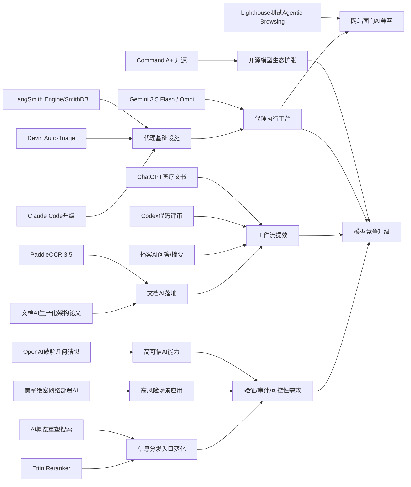

> AI 早报 · 每日早读 · 全网深度聚合

## **今日摘要**

本期动态显示，AI正从“能聊天的模型”快速走向“可落地的执行平台”：一方面，Cohere开源最强模型Command A+、Google发布Gemini 3.5 Flash与Omni，推动模型能力与生态进一步开放和增强。  
另一方面，AI在医疗、软件开发和文档处理中的实用价值持续显现，例如AdventHealth用ChatGPT减轻医疗文书负担、Ramp用Codex加速代码评审、PaddleOCR 3.5增强企业文档解析能力。  
同时，围绕AI代理的基础设施和社会配套也在升级，包括LangSmith、Devin、Claude Code等工具演进，以及Google测试网站对AI代理兼容性、OpenAI推进教育计划，说明行业正在为AI更广泛融入工作与社会做准备。

### 🔵 产品与功能更新

1. **Cohere开源最强模型Command A+。**  
Cohere发布了目前最强的语言模型（擅长理解和生成文本的AI模型）Command A+，并采用Apache 2.0许可证开源。对企业和开发者来说，这意味着可以更自由地部署、修改和商用。开源也有助于社区更快验证其真实能力与适用场景。🚀  
[开源模型发布解读(briefing)](https://the-decoder.com/cohere-open-sources-its-strongest-model-yet/)

2. **AdventHealth用ChatGPT减轻医疗文书负担。**  
AdventHealth正在使用面向医疗场景的ChatGPT，帮助简化工作流程并减少行政事务压力。核心目标不是替代医生，而是把更多时间还给患者照护。对于医院管理者和医护人员来说，这类工具的价值主要体现在提效和减负。🚀  
[医疗应用案例简报(briefing)](https://openai.com/index/adventhealth)

3. **LangSmith与Devin推动AI代理基础设施升级。**  
今日动态虽不算密集，但AI代理（可自主执行多步任务的系统）底层工具明显在进化。LangSmith Engine强化了代理的CI/CD（持续集成与持续交付）闭环，SmithDB则提升了监测与查询速度；Cognition的Devin Auto-Triage则把缺陷分流自动化做得更持续。Anthropic也更新了Claude Code，让其更适合超大代码库。🚀  
[代理工具更新速览(briefing)](https://news.smol.ai/issues/26-05-18-not-much/)

### 🟢 前沿研究

1. **Google I/O发布Gemini 3.5 Flash与Omni。**  
Google在I/O 2026上进一步把Gemini定位为同时服务消费者和开发者的平台。Gemini 3.5 Flash主打更快的代理式任务与编程能力，Gemini Omni则强调多模态（可同时处理文字、图片、视频等）生成与编辑。配合扩展后的代理工具栈，Google正在加速把AI从聊天工具推进为执行平台。🚀  
[谷歌新品要点速读(briefing)](https://news.smol.ai/issues/26-05-19-not-much/)

2. **Ramp用Codex把代码评审缩短到几分钟。**  
OpenAI介绍了Ramp工程团队如何用Codex配合GPT-5.5完成代码评审。原本需要数小时等待的人类反馈，现在可以先在几分钟内拿到较有深度的建议。对软件团队来说，这说明AI正逐步成为开发流程中的“第一轮审稿人”。🚀  
[代码评审案例解析(briefing)](https://openai.com/index/ramp)

3. **PaddleOCR 3.5接入Transformers后端。**  
PaddleOCR 3.5开始支持基于Transformers（擅长处理序列与上下文关系的模型架构）后端运行文字识别与文档解析任务。这意味着相关系统更容易与当下主流AI生态衔接。对于企业文档处理、票据识别和资料数字化场景，这类升级很实用。🚀  
[文档识别升级说明(briefing)](https://huggingface.co/blog/PaddlePaddle/paddleocr-transformers)

### 🟡 行业展望与社会影响

1. **Google测试网站对AI代理的兼容性。**  
Google正在Lighthouse分析工具中测试“Agentic Browsing（代理式浏览）”新类别，用来检查网站是否适配AI代理访问。它还会关注llms.txt这类面向大模型的站点说明文件。随着AI开始替用户“逛网页”，网站未来可能不仅要对人类友好，也要对AI友好。🚀  
[网站兼容新趋势(briefing)](https://the-decoder.com/google-tests-websites-for-llms-txt-and-agent-compatibility/)

2. **OpenAI推进“国家教育计划”下一阶段。**  
OpenAI宣布扩大Education for Countries项目，继续推动学校中的AI采用。新阶段包括合作伙伴拓展、教师培训和教育工具落地，重点是改善全球学习效果。对教育行业而言，AI正在从试点工具走向制度化应用。🚀  
[教育计划阶段更新(briefing)](https://openai.com/index/the-next-phase-of-education-for-countries)

3. **搜索引擎格局因AI概览而发生变化。**  
TechCrunch指出，随着Google搜索结果越来越被AI概览重塑，用户可能会重新评估搜索体验。文章盘点了六个值得尝试的替代搜索引擎，反映出用户对“传统搜索是否还存在”的担忧。AI不仅在改进搜索，也在改变人们寻找信息的习惯。🚀  
[搜索变局观察简报(briefing)](https://techcrunch.com/2026/05/21/six-search-engines-worth-trying-now-that-google-isnt-really-google-anymore/)

### 🟣 开源TOP项目

1. **OlmoEarth v1.1发布更高效遥感模型家族。**  
AllenAI发布OlmoEarth v1.1，这是一组面向地球观测的模型（用于分析卫星和遥感数据）。新版重点是效率提升，意味着在资源有限的情况下也能处理更多环境与地理信息任务。对气候、农业和灾害监测等领域都有实际意义。🚀  
[遥感模型更新速览(briefing)](https://huggingface.co/blog/allenai/olmoearth-v1-1)

2. **文档AI生产化架构论文聚焦落地难题。**  
这篇论文讨论如何用微服务架构（把系统拆成多个小服务协同运行）把OCR（文字识别）与大模型流水线真正部署到生产环境。作者关注的不只是模型效果，而是分类、识别、理解等多个模块怎样稳定协同。对企业来说，这正是“实验室模型”走向“可运营系统”的关键一步。🚀  
[文档AI架构解读(briefing)](https://arxiv.org/abs/2605.18818)

3. **OpenAI模型攻破80年离散几何猜想。**  
OpenAI宣布，其推理模型解决了离散几何中的单位距离问题，并推翻了一个存在80年的重要猜想。这被视为AI数学能力的重要里程碑，因为模型不仅得出答案，还使用了专家意料之外的数学工具。它让外界重新思考：AI是否正从“会算题”走向“能做研究”。🚀  
[数学突破官方说明(briefing)](https://openai.com/index/model-disproves-discrete-geometry-conjecture)

### 🔴 社媒分享

1. **美军网络司令部加速在绝密网络部署AI。**  
美国网络司令部已成立专项团队，计划在五角大楼和美国国家安全局的最高机密网络上运行OpenAI、Google等公司的模型。背景是先进AI在发现安全漏洞上的速度，已被认为逼近顶尖人类黑客。若这一趋势持续，AI将在网络攻防中扮演越来越核心的角色。🚀  
[绝密网络AI动向(briefing)](https://the-decoder.com/us-cyber-command-races-to-deploy-ai-on-top-secret-networks/)

2. **Spotify为播客加入AI问答与摘要功能。**  
Spotify正在给播客加入AI驱动的问答和简报生成功能，用户可以按自己的提示词获得每日或每周内容摘要。对听众来说，这会降低信息获取门槛；对平台来说，则能提升内容再消费效率。音频内容正被AI重新包装成更易吸收的信息流。🚀  
[播客功能更新简报(briefing)](https://techcrunch.com/2026/05/21/spotify-adds-ai-powered-qa-and-briefing-generation-features-to-podcasts/)

3. **Ettin Reranker发布重排序模型家族。**  
Hugging Face介绍了Ettin Reranker系列，这类模型主要用于“重排序”搜索结果或候选答案。简单说，它能在已有候选内容中再做一轮更细的判断，把更相关的内容排到前面。这对于搜索、问答和推荐系统都很关键。🚀  
[重排序模型上新(briefing)](https://huggingface.co/blog/ettin-reranker)

---

📊 行业洞察

1. 事实  
   Cohere开源最强模型Command A+，采用Apache 2.0许可证；Google I/O发布Gemini 3.5 Flash与Gemini Omni，继续强化消费者+开发者双平台；OpenAI则通过Codex、教育计划、数学研究突破持续扩大影响力。  
   【洞察】基础模型竞争正在从“单次发布强弱”转向“开放性 + 平台化 + 场景渗透”的三线并进。开源许可证（Apache 2.0，允许商用和修改）降低了企业采用门槛，Google则用多模态（可同时处理文本、图像、视频等）与代理工具栈抢占平台入口，OpenAI则通过开发、教育、科研多点落地巩固生态粘性。未来头部厂商的护城河，不只是谁模型分数更高，而是谁能更快形成“模型—工具—分发—行业方案”的完整闭环。

2. 事实  
   LangSmith Engine、SmithDB、Devin Auto-Triage、Claude Code都在升级AI代理基础设施；Google开始在Lighthouse测试Agentic Browsing（代理式浏览）兼容性与llms.txt；Gemini 3.5 Flash也主打更快的代理式任务。  
   【洞察】AI代理正在从“能演示”进入“可运维、可接入、可被网站接待”的工程化阶段。过去代理的瓶颈主要在推理能力，现在瓶颈正转向CI/CD（持续集成与持续交付）、可观测性（监控系统运行状态的能力）、缺陷分流和网页兼容标准。Google测试网站对代理友好度，意味着未来互联网可能新增一层“面向AI访问的基础设施”，类似移动互联网时代的网站响应式改造。谁先适配代理访问，谁就可能先获得机器流量入口。

3. 事实  
   AdventHealth用ChatGPT减轻医疗文书负担；Ramp用Codex把代码评审压缩到几分钟；Spotify为播客加入AI问答与摘要；PaddleOCR 3.5与文档AI生产化架构论文则推动文档处理系统更易落地。  
   【洞察】AI商业化重心正从“替代岗位”转向“压缩流程摩擦”。无论是医疗文书、代码评审、播客消费，还是票据与资料数字化，用户真正愿意付费的不是一个“更聪明的聊天机器人”，而是一个能嵌入现有流程、减少等待和重复劳动的系统。这说明企业采购逻辑正逐步从模型能力采购，转向工作流ROI（投资回报率）采购，文档流、内容流、开发流会成为最先规模化兑现收入的赛道。

4. 事实  
   OpenAI模型攻破80年离散几何猜想；美国网络司令部加速在绝密网络部署OpenAI、Google等模型；搜索引擎格局因AI概览重塑，Ettin Reranker等重排序模型也在强化信息筛选能力。  
   【洞察】AI能力上限正在同时向“科研发现”与“高风险决策场景”延伸，行业关注点将从“能不能用”转向“是否可信、可控、可验证”。数学研究突破说明推理模型已开始触及原创性发现；军方部署则意味着AI被视为战略能力；搜索和重排序变化则反映信息中介权正在被重构。下一阶段竞争焦点将是验证体系、权限控制、审计机制和高可信输出，而不仅是更高的生成质量。

🗺️ 今日关系图

