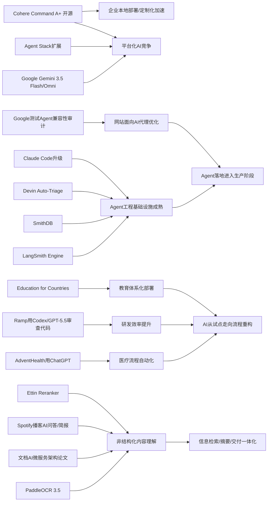

> AI 早报 · 每日早读 · 全网深度聚合

## **今日摘要**

这组动态显示，AI正同时在三条线上加速推进：一是更强模型与代理基础设施持续开放和升级，如Cohere开源Command A+、Google扩展Gemini平台、LangSmith等完善Agent开发运维能力。  
二是AI开始更深地进入真实业务场景，从医院流程优化、文档识别到代码审查，角色正从“实验性工具”转向“可落地的生产力助手”。  
三是行业影响也在外溢到网站标准和教育体系，意味着未来不仅企业系统要适配AI，社会基础设施和使用规则也会随之重塑。

### 🔵 产品与功能更新

1. **Cohere开源最强模型Command A+。**
Cohere发布了目前最强的语言模型Command A+，并采用Apache 2.0许可证开源，意味着企业和开发者可以更自由地使用与改造。对非技术用户来说，这类“大语言模型”就是驱动聊天、写作和问答能力的核心引擎。开源通常会加快落地速度，也方便更多团队做本地部署与定制。🚀
[开源模型发布解读(briefing)](https://the-decoder.com/cohere-open-sources-its-strongest-model-yet/)

2. **AdventHealth将ChatGPT用于医疗流程。**
AdventHealth正在使用面向医疗场景的ChatGPT，目标是简化工作流、减少行政负担，并把更多时间还给患者护理。简单说，这类工具不是替代医生，而是帮助处理文书、信息整理和流程协同。对医院来说，AI开始从“试验工具”走向“日常运营助手”。🚀
[医疗落地案例速览(briefing)](https://openai.com/index/adventhealth)

3. **LangSmith Engine等推动Agent基础设施升级。**
当天产品更新虽不算密集，但“Agent（智能代理）基础设施”在明显推进。LangSmith Engine提供面向代理的CI/CD闭环（持续集成/持续交付，指自动测试、更新与上线流程），SmithDB则加强低延迟观测查询；Cognition的Devin Auto-Triage可持续处理缺陷分流。Anthropic也改进了Claude Code，让它更适合大型代码库。🚀
[代理工具更新汇总(briefing)](https://news.smol.ai/issues/26-05-18-not-much/)

### 🟢 前沿研究

1. **Google在I/O 2026发布Gemini 3.5 Flash与Omni。**
Google在I/O上把Gemini进一步定位为消费者AI和开发者/代理平台，并推出Gemini 3.5 Flash、Gemini Omni以及扩展后的Agent Stack（代理技术栈）。其中Flash主打更快的代理式任务与编程，Omni强调多模态生成与编辑（可同时处理文本、图像、视频等）。这表明大厂正把AI能力从“单点模型”升级为“整套平台”。🚀
[谷歌AI发布速览(briefing)](https://news.smol.ai/issues/26-05-19-not-much/)

2. **PaddleOCR 3.5接入Transformers后端。**
PaddleOCR 3.5展示了如何用Transformers后端运行OCR（光学字符识别）和文档解析任务。对普通用户来说，这意味着扫描件、表格、票据、合同等文档有望被更稳定地读懂和结构化处理。文档AI正在从“识字”走向“理解整份材料”。🚀
[文档识别能力更新(briefing)](https://huggingface.co/blog/PaddlePaddle/paddleocr-transformers)

3. **Ramp工程团队用Codex加速代码审查。**
Ramp介绍了工程师如何结合Codex与GPT-5.5完成代码审查，并把等待反馈的时间从数小时缩短到几分钟。代码审查本来是软件团队中较耗时的一环，而AI现在更像“第一轮审稿人”，先给出结构化建议。对企业研发而言，这类效率提升很容易快速转化成实际生产力。🚀
[AI代码审查实践(briefing)](https://openai.com/index/ramp)

### 🟡 行业展望与社会影响

1. **Google测试网站的Agent兼容性审计。**
Google正在Lighthouse分析工具中测试“Agentic Browsing（代理式浏览）”新类别，用来检查网站是否适合AI代理访问，也会关注llms.txt这类面向模型的说明文件。对网站运营者来说，未来不仅要优化给人看，也要优化给AI“读”和“操作”。这可能成为继移动端适配、SEO之后的新一轮网站适配趋势。🚀
[网站适配新趋势(briefing)](https://the-decoder.com/google-tests-websites-for-llms-txt-and-agent-compatibility/)

2. **OpenAI推进Education for Countries计划。**
OpenAI宣布推进“Education for Countries”下一阶段，扩大AI在学校场景中的使用，包括新合作、教师培训和教学工具。其核心不只是把工具送进课堂，更是建立配套的教学方法和应用能力。对教育行业来说，AI正在从零散试点走向体系化部署。🚀
[教育计划阶段更新(briefing)](https://openai.com/index/the-next-phase-of-education-for-countries)

3. **搜索引擎格局因AI概览持续变化。**
TechCrunch梳理了在Google越来越“不像传统Google”的背景下，值得尝试的六个搜索引擎。背后反映的是，AI概览（即搜索结果顶部的AI总结）正在改变用户找信息的方式，也带来新的使用分化。对于不喜欢被AI先“代答”的用户，搜索替代品正在获得更多关注。🚀
[搜索格局变化观察(briefing)](https://techcrunch.com/2026/05/21/six-search-engines-worth-trying-now-that-google-isnt-really-google-anymore/)

### 🟣 开源TOP项目

1. **OlmoEarth v1.1发布更高效地球观测模型。**
AllenAI发布OlmoEarth v1.1，这是一个更高效的地球观测模型家族。地球观测模型通常用于卫星图像分析、环境监测和灾害评估等场景。效率提升意味着这类能力更可能被更多机构以更低成本部署。🚀
[地球观测模型更新(briefing)](https://huggingface.co/blog/allenai/olmoearth-v1-1)

2. **文档AI生产化架构论文聚焦微服务方案。**
这篇论文讨论如何把OCR（光学字符识别）、分类模型和大语言模型组合成可在生产环境运行的微服务架构。它关注的不是单一模型精度，而是“怎么真正上线并稳定跑起来”。对于企业来说，这类工程方法往往比单点模型突破更接近商业价值。🚀
[文档AI工程方案(briefing)](https://arxiv.org/abs/2605.18818)

3. **OpenAI模型攻破80年离散几何猜想。**
OpenAI表示，其推理模型解决了一个80年的单位距离问题，推翻了离散几何中的一个重要猜想。简单理解，这是AI在数学研究中不只是“做题”，而是开始参与提出并验证新结论。它也让外界重新评估AI在高阶科研中的潜力。🚀
[数学突破官方说明(briefing)](https://openai.com/index/model-disproves-discrete-geometry-conjecture)

### 🔴 社媒分享

1. **美军网络司令部加速在绝密网络部署AI。**
美国网络司令部已成立专项团队，计划在五角大楼和美国国家安全局的最高机密网络中运行OpenAI、Google等公司的模型。推动因素之一是，先进AI系统在发现安全漏洞方面已经接近甚至超过顶尖人工黑客。此事显示，AI能力正快速进入国家安全核心场景。🚀
[绝密网络部署动态(briefing)](https://the-decoder.com/us-cyber-command-races-to-deploy-ai-on-top-secret-networks/)

2. **Spotify为播客加入AI问答与简报生成功能。**
Spotify正在为播客加入AI驱动的问答和简报生成能力，用户可根据提示词生成每日或每周内容摘要。对普通听众来说，这会让播客从“被动收听”变成“可交互获取重点”。音频平台也在借AI强化内容整理和个性化消费。🚀
[播客AI功能更新(briefing)](https://techcrunch.com/2026/05/21/spotify-adds-ai-powered-qa-and-briefing-generation-features-to-podcasts/)

3. **Ettin Reranker家族发布。**
Hugging Face介绍了Ettin Reranker家族。Reranker（重排序模型）可以理解为给搜索结果或候选答案“二次打分”的模型，用来把更相关的内容排到前面。虽然它不像聊天机器人那样显眼，但对搜索、问答和检索体验很关键。🚀
[重排序模型介绍(briefing)](https://huggingface.co/blog/ettin-reranker)

---

📊 行业洞察

1. 事实  
   Cohere开源最强模型Command A+，采用Apache 2.0许可证；Google在I/O 2026发布Gemini 3.5 Flash、Gemini Omni和扩展后的Agent Stack（代理技术栈）。  
   【洞察】基础模型竞争正从“单模型能力”转向“开源生态 + 平台化能力”的双线竞争。Cohere用开源降低企业采用门槛，Google则用平台栈强化开发者绑定，这意味着未来赢家未必只是参数更强的模型，而是能同时提供可商用许可、工具链集成和多模态（同时处理文本、图像、视频等）能力的厂商。

2. 事实  
   LangSmith Engine、SmithDB、Devin Auto-Triage、Claude Code等产品集中升级Agent基础设施；Google开始在Lighthouse测试Agentic Browsing（代理式浏览）兼容性审计。  
   【洞察】Agent（智能代理）正在从“能不能做”进入“能不能稳定上线并接入真实互联网”的阶段。前者解决CI/CD（持续集成/持续交付）、观测、缺陷分流等工程问题，后者推动网站为AI代理提供可访问、可执行、可理解的接口标准。二者叠加表明，2026年的关键变量不是再造一个Agent Demo，而是建立“代理可开发、可部署、可访问”的完整基础设施层。

3. 事实  
   AdventHealth将ChatGPT用于医疗流程；Ramp用Codex与GPT-5.5将代码审查等待时间从数小时缩短到几分钟；OpenAI推进Education for Countries计划。  
   【洞察】企业与公共部门的AI采用已从“试点验证”转入“流程重构”。医疗、研发、教育三个场景的共性不是追求炫技，而是优先切入文书处理、审查反馈、教学辅助等高频刚需环节。说明当前AI商业化最先兑现价值的路径，仍是“嵌入已有工作流的人机协同”，而非完全替代专业人员。

4. 事实  
   PaddleOCR 3.5接入Transformers后端，推动文档解析升级；文档AI生产化架构论文聚焦OCR、分类模型和大语言模型的微服务（microservices，微服务化部署）组合；Spotify为播客加入AI问答与简报功能；Ettin Reranker家族发布。  
   【洞察】AI应用层正在从“生成内容”走向“理解内容并重组交付”。无论是文档、播客还是搜索结果，核心都不是单次生成，而是通过OCR、Reranker（重排序模型）、摘要和问答把非结构化内容转成可检索、可消费、可行动的信息流。这意味着下一阶段竞争重点会从模型本身转向“内容理解管线”的工程能力。

🗺️ 今日关系图

