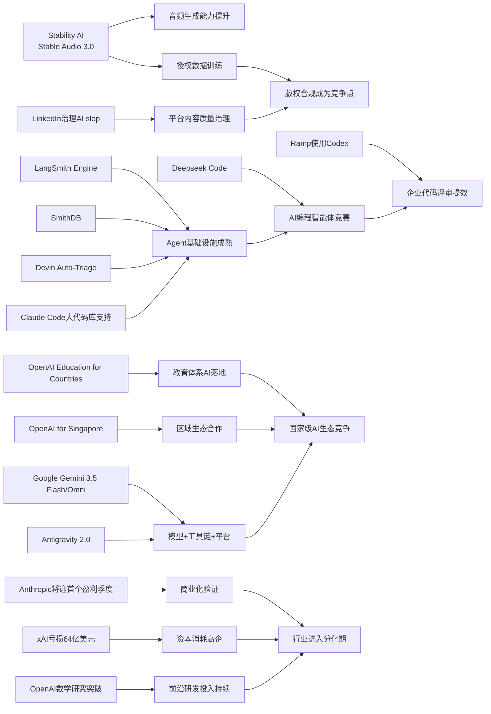

> AI 早报 · 每日早读 · 全网深度聚合

## **今日摘要**

本周AI进展显示，产品正从“能演示”走向“能落地”：Stable Audio 3.0把AI作曲延长到6分钟并开放部分权重，OpenAI推进教育场景部署，LangSmith等工具则补强了智能体的测试、观测与工程化基础设施。  
前沿研究方面，OpenAI称其模型推翻了离散几何中的重要猜想，Google I/O集中展示Gemini 3.5 Flash、Omni及相关智能体工具链，PaddleOCR 3.5也通过Transformer后端推动文档AI从识别走向理解。  
行业层面，Deepseek正筹备面向编程场景的“Deepseek Code”，对标Codex与Claude Code，进一步说明AI编程与智能体赛道的竞争正在快速升温。

### 🔵 产品与功能更新

1. **Stability AI发布Stable Audio 3.0。**
新一代音频模型可生成最长6分钟的音乐片段，明显提升了可用时长。此次共推出多个模型，其中三款开放权重（可供开发者自行部署和微调）。官方还强调模型全部基于授权数据训练，这对音乐版权场景尤其关键。对普通用户来说，这意味着AI作曲工具正从“短片段试玩”走向更完整的创作流程🚀  
[音频生成新升级(briefing)](https://the-decoder.com/stability-ai-launches-stable-audio-3-0-with-up-to-six-minute-tracks-and-open-weights/)

2. **OpenAI推进“Education for Countries”计划。**
OpenAI宣布该教育项目进入下一阶段，重点是推动AI在学校体系中的实际落地。新动作包括与更多国家和机构合作、开展教师培训，并提供支持学习效果提升的工具。对非技术读者来说，这类计划的核心不是“炫技”，而是把生成式AI真正嵌入教学、备课和教育管理中🚀  
[教育合作再扩围(briefing)](https://openai.com/index/the-next-phase-of-education-for-countries)

3. **LangSmith Engine与SmithDB补强智能体基础设施。**
smol.ai汇总显示，面向Agent（智能体）的基础设施正在快速成熟，其中LangSmith Engine主打CI/CD循环（持续集成/持续交付），帮助团队持续测试和迭代智能体。SmithDB则聚焦可观测性（运行状态追踪）的低延迟查询，让开发者更容易看清智能体到底做了什么。与此同时，Cognition的Devin Auto-Triage和Anthropic对Claude Code的大代码库支持，也说明“AI代理从演示走向工程化”正在加速🚀  
[智能体工具加速成熟(briefing)](https://news.smol.ai/issues/26-05-18-not-much/)

### 🟢 前沿研究

1. **OpenAI模型推翻离散几何核心猜想。**
OpenAI表示，其模型解决了有80年历史的单位距离问题，并据此推翻了离散几何中的一个重要猜想。离散几何可以理解为研究点、线、距离等“有限结构”的数学分支，这次成果意味着AI开始参与非常前沿且高度抽象的数学研究。这不仅是单个题目的突破，也被视为“AI驱动数学发现”的标志性进展🚀  
[AI攻克数学难题(briefing)](https://openai.com/index/model-disproves-discrete-geometry-conjecture)

2. **Google I/O 2026集中发布Gemini 3.5 Flash与Omni。**
Google在I/O大会上把Gemini进一步定位为面向消费者和开发者的平台型AI产品。Gemini 3.5 Flash主打更快的智能体与编程任务，Gemini Omni则强调多模态（可同时处理文字、图片、视频等）生成与编辑能力。再加上Antigravity 2.0智能体技术栈，Google展示的是一整套“模型+工具链+平台”的研究与产品联动路线🚀  
[谷歌Gemini再进化(briefing)](https://news.smol.ai/issues/26-05-19-not-much/)

3. **PaddleOCR 3.5转向Transformers后端。**
PaddleOCR 3.5开始支持基于Transformers（深度学习模型架构）的后端，用于OCR（光学字符识别）和文档解析任务。对普通用户而言，这意味着票据、合同、表格等复杂文档的识别与理解能力有望更统一、更强。它也反映出文档AI正在从“识别文字”升级到“理解文档结构”🚀  
[文档识别架构升级(briefing)](https://huggingface.co/blog/PaddlePaddle/paddleocr-transformers)

### 🟡 行业展望与社会影响

1. **Deepseek筹备“Deepseek Code”挑战Codex与Claude Code。**
Deepseek正在北京组建新团队，研发暂名为“Deepseek Code”的AI编程智能体。招聘信息显示，团队重点关注agent loops（智能体循环执行）、MCP（模型上下文协议）和context engineering（上下文工程）等方向，直接对标Claude Code、Codex和Cursor。这说明AI编程助手的竞争正从“聊天补全”走向“可执行代理”阶段🚀  
[编程智能体竞赛升温(briefing)](https://the-decoder.com/deepseek-wants-to-take-on-claude-code-and-openais-codex-with-deepseek-code/)

2. **Anthropic称即将迎来首个盈利季度。**
据TechCrunch报道，Anthropic向投资人表示，公司有望迎来首个盈利季度，且季度营收预计将增长到约109亿美元。对整个AI行业来说，这是一项重要信号：头部模型公司不再只是“高投入讲故事”，而开始证明商业化能力。市场也会更关注，哪些AI公司能真正把高昂算力成本转化为稳定利润🚀  
[头部模型公司逼近盈利(briefing)](https://techcrunch.com/2026/05/20/anthropic-says-its-about-to-have-its-first-profitable-quarter/)

3. **Ramp工程团队用Codex加速代码评审。**
OpenAI介绍，Ramp工程师借助Codex和GPT-5.5，把原本需要数小时的代码评审缩短到几分钟内获得实质性反馈。代码评审可以理解为开发团队对代码质量、安全性和可维护性的把关环节，通常既重要又耗时。这个案例表明，AI在企业内部的价值正越来越多体现在“提升具体工作流效率”而非单纯聊天问答🚀  
[企业代码评审提速(briefing)](https://openai.com/index/ramp)

### 🟣 开源TOP项目

1. **OlmoEarth v1.1发布更高效的地球观测模型家族。**
AllenAI在Hugging Face介绍了OlmoEarth v1.1，这是一组更高效的地球观测模型。地球观测模型主要用于分析卫星或遥感数据，可服务于农业、气候、灾害监测等场景。它的意义在于，把开源AI能力进一步带入“现实世界数据”处理，而不只是文本和图像🚀  
[地球观测模型开源(briefing)](https://huggingface.co/blog/allenai/olmoearth-v1-1)

2. **文档AI生产化架构论文提出微服务方案。**
这篇arXiv论文讨论如何把OCR、分类和大语言模型流水线真正部署到生产环境中，并提出微服务架构（将系统拆成多个小服务协同运行）的实现方式。相比只关注模型精度，这项工作更关注系统稳定性、扩展性和运维成本。对企业团队来说，这类“怎么真正跑起来”的开源实践往往比单一模型更新更有参考价值🚀  
[文档AI落地架构(briefing)](https://arxiv.org/abs/2605.18818)

3. **OpenAI for Singapore启动多年合作。**
OpenAI宣布面向新加坡启动多年期合作，目标包括扩大AI部署、培养本地人才，并支持企业与公共服务应用。虽然这不是传统意义上的代码开源项目，但它体现了AI生态建设越来越强调“本地化落地能力”。从开发者视角看，这类区域合作往往也会带动更多工具、资源与项目机会释放🚀  
[新加坡AI合作启动(briefing)](https://openai.com/index/introducing-openai-for-singapore)

### 🔴 社媒分享

1. **Google测试“提示词生成安卓应用”。**
The Decoder报道称，Google AI Studio现在可以根据提示词直接生成原生Android应用，使用Kotlin和Jetpack Compose，并可在浏览器模拟器中测试。对于简单工具类应用，这意味着“不会写代码也能做App”的门槛进一步下降。文章甚至提出，应用商店未来可能会受到这种即时生成模式的冲击🚀  
[谷歌试水生成式App(briefing)](https://the-decoder.com/google-tests-the-app-version-of-the-saaspocalypse/)

2. **xAI去年烧掉64亿美元，扩张仍远未结束。**
TechCrunch援引SpaceX IPO文件称，xAI在2025年亏损64亿美元，同时仍在推进大规模Grok扩张计划。这是外界首次较完整看到马斯克AI业务的财务轮廓，也再次说明前沿模型竞争的资金消耗极其惊人。对行业观察者来说，这条消息强化了一个现实：大模型竞赛不仅比技术，也比资本耐力🚀  
[xAI烧钱规模曝光(briefing)](https://techcrunch.com/2026/05/20/xai-burned-6-4b-last-year-spacexs-ipo-filing-shows-why-the-spending-is-far-from-over/)

3. **LinkedIn开始打击“AI垃圾内容”。**
LinkedIn正在加强对“AI slop”（可理解为低质量、套路化的AI生成内容）的治理，测试中称可正确标记94%的泛化帖文。这个动作某种程度上说明，平台已经感受到AI内容泛滥对信息质量的冲击。对普通用户来说，未来社交平台的竞争可能不只是“谁有更多AI功能”，还包括“谁能控制AI滥用”🚀  
[平台整治AI灌水帖(briefing)](https://the-decoder.com/linkedins-war-on-ai-slop-is-not-just-a-policy-update-it-is-an-admission-that-the-platform-lost-control-of-its-feed/)

---

📊 行业洞察

1. 事实  
   Stability AI发布Stable Audio 3.0，支持最长6分钟音乐生成，且三款模型开放权重（开放模型参数，可自行部署/微调）；同时强调基于授权数据训练。LinkedIn也开始集中治理“AI slop”（低质量AI内容），反映平台对生成内容质量与版权/可信度风险的重视。  
   【洞察】生成式AI正从“能力竞赛”转向“可用性+合规性”双竞争。对音频、内容平台和企业客户而言，下一阶段胜负不只取决于模型效果，还取决于训练数据授权、输出质量控制和生态治理能力。  

2. 事实  
   LangSmith Engine与SmithDB强化Agent（智能体）基础设施，覆盖CI/CD（持续集成/持续交付）与可观测性（运行状态追踪）；Cognition推出Devin Auto-Triage，Anthropic增强Claude Code对大代码库支持；Deepseek也在筹备Deepseek Code，对标Codex、Claude Code与Cursor；Ramp则已用Codex把代码评审从数小时压缩到分钟级。  
   【洞察】AI编程正从“代码补全助手”升级为“可执行软件工程代理”。行业竞争焦点已从单点模型能力，转向智能体循环（agent loops）、上下文工程（context engineering）、工程可观测性和企业工作流集成，意味着真正的护城河将越来越体现在基础设施与组织落地深度，而非单次Demo效果。  

3. 事实  
   OpenAI推进“Education for Countries”并启动OpenAI for Singapore多年合作，强调教师培训、国家级部署与本地人才培养；Google I/O则发布Gemini 3.5 Flash、Gemini Omni和Antigravity 2.0，展示“模型+工具链+平台”一体化路线。  
   【洞察】全球AI竞争正在从模型发布节奏，升级为“国家/区域生态运营能力”竞争。头部厂商不再只卖API（应用程序编程接口），而是在争夺教育体系、开发者生态、公共服务和本地产业协同入口，未来市场份额将更多由区域合作深度与平台黏性决定。  

4. 事实  
   Anthropic称即将迎来首个盈利季度，而xAI去年亏损64亿美元、仍将持续扩张；与此同时，OpenAI模型在离散几何取得前沿研究突破，显示顶尖模型研发仍需高强度投入。  
   【洞察】大模型行业正在进入“科研突破与财务纪律并存”的分化期。一部分公司开始证明高算力投入可以转化为商业回报，另一部分则继续押注资本驱动的规模扩张；这意味着未来资本市场会更严格地区分“有收入增长的技术领先”与“单纯高烧钱的技术叙事”。  

🗺️ 今日关系图

