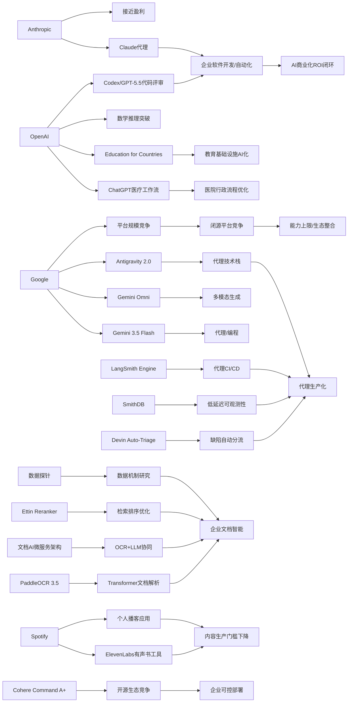

> AI 早报 · 每日早读 · 全网深度聚合

## **今日摘要**

Anthropic据报道接近实现首个盈利季度，OpenAI则把ChatGPT进一步嵌入医疗与教育流程，显示AI商业化正率先在企业软件、医院运营和公共服务中落地。  
与此同时，Google、Anthropic、Cognition、LangSmith等集中升级模型与代理基础设施，行业重点正从“模型更强”转向“代理能否稳定部署、运维和服务复杂工作流”。  
在研究与社会影响层面，OpenAI数学推理突破、PaddleOCR与Transformer融合等进展说明，AI不仅在提升应用效率，也在加速改变科研、文档处理和知识生产方式。

### 🔵 产品与功能更新

1. **Anthropic接近成为首家盈利的AI实验室。**  
Anthropic据报道正逼近首个盈利季度，预计单季营收达109亿美元，营业利润约5.59亿美元🚀  
增长主要来自编程工具和“代理式”Claude（可自主执行多步任务的AI助手）使用需求。  
这也说明，面向企业的软件开发与自动化场景，正在成为AI公司最先跑通商业化的方向之一。  
[盈利拐点观察(briefing)](https://the-decoder.com/anthropic-is-about-to-become-the-first-profitable-ai-lab/)

2. **OpenAI推动ChatGPT进入医疗工作流。**  
AdventHealth正在使用面向医疗场景的ChatGPT，目标是简化流程、减少行政负担，并把更多时间还给患者照护🚀  
这类部署通常聚焦在文书、沟通和流程辅助，而不是直接替代医生判断。  
对普通用户而言，这意味着生成式AI（能生成文本内容的人工智能）正更深入地进入医院日常运营。  
[医疗落地进展(briefing)](https://openai.com/index/adventhealth)

3. **AI代理基础设施继续升级。**  
一则行业汇总显示，LangSmith Engine提供了面向AI代理的CI/CD闭环（持续集成/持续交付流程），SmithDB则强调低延迟可观测性查询🚀  
同时，Cognition推出Devin Auto-Triage，用于带记忆能力的自动化缺陷分流；Anthropic也继续增强Claude Code对大型代码库的支持。  
这些更新集中说明，AI行业正从“模型更强”转向“让代理更稳定地上线和运维”。  
[代理工具更新(briefing)](https://news.smol.ai/issues/26-05-18-not-much/)

### 🟢 前沿研究

1. **Google在I/O 2026集中展示Gemini与代理技术栈。**  
Google发布了Gemini 3.5 Flash、Gemini Omni以及扩展后的Antigravity 2.0代理技术栈🚀  
其中，Flash主打更快的代理与编程任务，Omni强调多模态（同时处理文本、图像、视频等）生成与编辑。  
Google还表示其月度处理token（模型处理的文本片段）规模已超过3.2千万亿，显示出大模型平台化竞争正在加速。  
[谷歌I/O速览(briefing)](https://news.smol.ai/issues/26-05-19-not-much/)

2. **OpenAI继续推进“面向国家的教育计划”。**  
OpenAI宣布推进Education for Countries项目，扩大AI在学校中的应用，并引入新合作、教师培训和相关工具🚀  
核心目标是帮助教育系统更快采用AI，提高教学效率和学习结果。  
这类计划表明，AI竞争已不只发生在企业市场，也在向公共教育基础设施延伸。  
[教育计划升级(briefing)](https://openai.com/index/the-next-phase-of-education-for-countries)

3. **PaddleOCR 3.5探索用Transformer改造文档识别流程。**  
PaddleOCR 3.5介绍了如何使用Transformer后端来运行OCR（光学字符识别）与文档解析任务🚀  
这意味着传统“扫图识字”能力，正在与更通用的大模型架构进一步融合。  
对企业来说，这类方向有望提升复杂表单、票据和长文档处理的一体化能力。  
[文档识别新解(briefing)](https://huggingface.co/blog/PaddlePaddle/paddleocr-transformers)

### 🟡 行业展望与社会影响

1. **OpenAI模型攻克80年数学猜想引发学界震动。**  
OpenAI表示，其推理模型推翻了离散几何中的一个重要猜想，解决了可追溯至1946年的单位距离问题🚀  
报道中提到，数学家对模型使用到的代数数论工具感到意外，并将此视为AI数学能力的重要里程碑。  
这类进展不仅是科研新闻，也会加速社会对“AI是否正在改变知识生产方式”的讨论。  
[数学里程碑解读(briefing)](https://the-decoder.com/openai-shifts-the-boundary-of-automated-reasoning-with-a-milestone-in-ai-mathematics-that-experts-are-now-unpacking/)

2. **Spotify上线由ElevenLabs驱动的有声书制作工具。**  
Spotify正在推出新的有声书创作工具，背后使用ElevenLabs的语音合成能力🚀  
这会降低音频内容制作门槛，让更多作者或出版社快速生成可听版本。  
但与此同时，围绕声音版权、内容质量和“机器朗读是否替代真人”的讨论也会进一步升温。  
[有声书AI化(briefing)](https://techcrunch.com/2026/05/21/spotify-launches-an-elevenlabs-powered-audiobook-creation-tool/)

3. **数据如何影响大模型表现，仍是关键未解问题。**  
一篇观点论文提出，应开发“数据探针”来更根本地理解数据如何影响LLM（大语言模型）在训练、微调和对齐中的表现🚀  
作者认为，当前方法过度依赖大量实验，却缺少更系统的理解框架。  
这提醒行业：未来AI竞争不只是拼算力和模型，也要拼对数据质量与作用机制的理解。  
[数据探针观点(briefing)](https://arxiv.org/abs/2605.18801)

### 🟣 开源TOP项目

1. **OlmoEarth v1.1发布更高效的地球观测模型家族。**  
AllenAI介绍了OlmoEarth v1.1，这是一组更高效的地球观测模型，用于处理遥感相关任务🚀  
这类模型通常服务于环境监测、土地变化分析和灾害观察等场景。  
对开源社区来说，垂直领域模型持续成熟，说明“专用AI”正在成为重要趋势。  
[地观模型更新(briefing)](https://huggingface.co/blog/allenai/olmoearth-v1-1)

2. **文档AI生产化架构瞄准OCR与大模型协同。**  
一篇论文提出微服务架构（把系统拆成多个独立服务）来承载文档AI流程，覆盖分类、OCR和LLM处理🚀  
它试图弥补学术界偏重模型、工业界更关心大规模稳定运行之间的落差。  
这对实际做合同、票据、档案自动化处理的团队尤其有参考价值。  
[文档AI架构(briefing)](https://arxiv.org/abs/2605.18818)

3. **Ramp分享如何用Codex加速代码评审。**  
OpenAI案例显示，Ramp工程团队借助Codex与GPT-5.5进行代码评审，把获得实质反馈的时间从数小时缩短到数分钟🚀  
这说明AI代码助手的价值，正从“补全代码”扩展到“参与工程协作”。  
对于软件团队而言，评审、修复与迭代流程可能会比单纯写代码更早被AI深度改变。  
[代码评审案例(briefing)](https://openai.com/index/ramp)

### 🔴 社媒分享

1. **Cohere开源其迄今最强模型Command A+。**  
Cohere宣布将最新、最强的语言模型Command A+以Apache 2.0许可开源🚀  
这意味着开发者和企业可以更自由地试用、修改和部署该模型。  
在开源与闭源路线并行竞争的当下，这类发布往往会迅速引发社区讨论。  
[最强开源模型(briefing)](https://the-decoder.com/cohere-open-sources-its-strongest-model-yet/)

2. **Spotify推出可生成个人播客的新桌面应用。**  
Spotify发布一款研究预览版桌面应用，主打创建“个人播客”，被视作对标Google NotebookLM的一步🚀  
这类产品通常会把资料整理、脚本生成和音频输出整合到一个流程里。  
对于普通用户而言，AI正把“做内容”从专业制作变成更日常的表达方式。  
[个人播客新尝试(briefing)](https://techcrunch.com/2026/05/21/spotify-debuts-a-new-desktop-app-for-creating-personal-podcasts/)

3. **Ettin Reranker家族瞄准检索排序能力。**  
Hugging Face博客介绍了Ettin Reranker系列模型，聚焦Reranker（重排序模型）能力🚀  
这类模型常用于搜索、问答和知识库系统中，在初步检索后决定哪些结果更相关。  
虽然不如聊天机器人直观，但它们往往直接影响AI系统“答得准不准”。  
[重排序模型介绍(briefing)](https://huggingface.co/blog/ettin-reranker)

---

📊 行业洞察

1. 事实  
   - Anthropic接近成为首家盈利的AI实验室，增长主要来自编程工具和代理式Claude。  
   - Ramp用Codex与GPT-5.5将代码评审反馈时间从数小时压缩到数分钟。  
   - LangSmith Engine、SmithDB、Devin Auto-Triage、Claude Code等基础设施持续强化代理上线、观测与运维能力。  
  【洞察】AI商业化已从“卖模型能力”进入“卖工程产能”阶段，软件研发正成为最先形成ROI（投资回报率）闭环的核心场景。谁能把代理（Agent，可自主执行多步任务的系统）嵌入开发、评审、缺陷分流和运维全流程，谁就更可能率先建立高毛利、可复制的企业收入模型。

2. 事实  
   - OpenAI推动ChatGPT进入AdventHealth医疗工作流，重点在文书、沟通和流程辅助。  
   - OpenAI继续推进Education for Countries，把AI导入学校、教师培训和教育工具体系。  
   - Spotify一方面上线ElevenLabs驱动的有声书制作工具，另一方面推出可生成个人播客的新桌面应用。  
  【洞察】生成式AI正在从“个人助手”升级为“行业操作层”（Operational Layer，承载具体业务流程的智能中间层），并加速渗透医疗、教育、内容生产等高频组织场景。短期看，AI更可能先替代行政性、重复性、标准化流程，而非直接替代高责任决策者；这意味着未来竞争焦点将转向工作流集成、合规适配和组织变革能力。

3. 事实  
   - Google在I/O 2026发布Gemini 3.5 Flash、Gemini Omni和Antigravity 2.0，强调代理、编程与多模态生成，并披露月度token处理规模超过3.2千万亿。  
   - Cohere将最强模型Command A+以Apache 2.0许可开源。  
   - OpenAI模型攻克80年数学猜想，显示推理能力持续突破。  
  【洞察】大模型竞争正在分化为“三线作战”：闭源巨头拼平台规模与前沿能力，开源厂商拼许可友好与部署自由，研究前沿则拼推理上限与知识生产影响力。对企业用户而言，选型标准将不再只是“谁最强”，而是“谁在成本、可控性、生态兼容性和能力边界上最适配业务”。

4. 事实  
   - PaddleOCR 3.5用Transformer（变换器架构）重构OCR与文档解析流程。  
   - 文档AI生产化架构论文强调用微服务（Microservices，将系统拆分为独立服务）承载分类、OCR和LLM处理。  
   - Ettin Reranker聚焦检索后的重排序，强化搜索、问答和知识库准确性。  
   - “数据探针”论文指出，行业对数据如何影响LLM表现仍缺乏系统理解。  
  【洞察】AI系统的竞争壁垒正从“单一大模型性能”转向“数据—检索—解析—推理”全链路优化。尤其在文档智能、企业知识库、票据合同等场景，决定效果的往往不是聊天模型本身，而是前处理、重排序、数据质量和系统编排能力；这会推动更多企业把投入从模型采购转向数据基础设施与可观测性建设。

🗺️ 今日关系图

