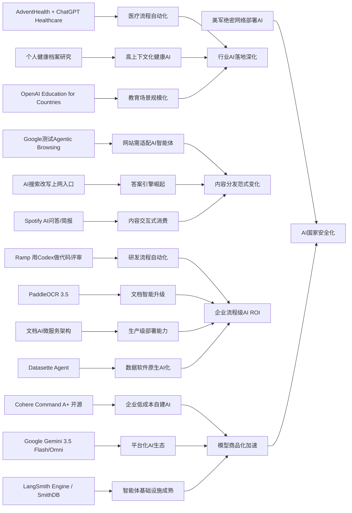

> AI 早报 · 每日早读 · 全网深度聚合

## **今日摘要**

本周AI动态显示，开源大模型、医疗与软件开发等行业应用，以及智能体基础设施都在快速成熟，AI正从“能用”走向“好用、可部署、可规模化”。  
同时，Google、OpenAI等公司持续推进多模态模型、代码评审、文档识别和智能体平台，说明AI竞争已从单一聊天能力转向完整生产力生态。  
更长远看，随着AI搜索和智能体式浏览兴起，网站、企业系统和用户上网方式都将被重塑，未来不仅要服务人，也要服务AI。

### 🔵 产品与功能更新

1. **Cohere开源最强模型Command A+。**  
Cohere发布了目前最强的语言模型（能理解和生成文本的AI模型）Command A+，并采用Apache 2.0开源许可，方便企业和开发者直接使用与修改。对市场来说，这意味着高性能大模型不再只掌握在少数闭源厂商手里。对于想低成本部署自有AI能力的团队，这是非常实用的更新。🚀  
[开源最强模型解读(briefing)](https://the-decoder.com/cohere-open-sources-its-strongest-model-yet/)

2. **AdventHealth用ChatGPT推进医疗工作流。**  
AdventHealth正在使用ChatGPT for Healthcare，目标是减少医护人员的行政负担，把更多时间还给患者。简单说，AI开始更多承担文书、整理和辅助流程工作，而不是直接替代医生判断。这类落地案例说明，医疗行业对生成式AI（可生成文字内容的AI）的应用正在从试点走向常态化。🚀  
[医疗AI落地案例(briefing)](https://openai.com/index/adventhealth)

3. **LangSmith Engine与SmithDB补齐智能体基础设施。**  
一篇行业汇总指出，围绕智能体（可自动执行多步骤任务的AI系统）的底层工具正在快速完善。LangSmith Engine提供类似CI/CD（持续集成与持续部署）的循环能力，方便团队持续测试和改进智能体；SmithDB则强化可观测性（追踪系统运行状态）与低延迟查询。对普通用户来说，这意味着未来AI助手会更稳定、可追踪，也更容易在企业内部规模化使用。🚀  
[智能体基建速览(briefing)](https://news.smol.ai/issues/26-05-18-not-much/)

### 🟢 前沿研究

1. **Google发布Gemini 3.5 Flash与Omni。**  
在Google I/O 2026上，Google把Gemini进一步定位为面向消费者和开发者的平台，并推出Gemini 3.5 Flash与Gemini Omni。前者强调快速处理智能体和编程任务，后者突出多模态（同时处理文字、图像、视频等多种内容）生成与编辑能力。Google还扩展了Agent Stack（智能体工具栈），显示其目标不只是聊天助手，而是更完整的AI操作平台。🚀  
[谷歌I/O核心更新(briefing)](https://news.smol.ai/issues/26-05-19-not-much/)

2. **Ramp用Codex把代码评审提速到分钟级。**  
OpenAI介绍了金融科技公司Ramp如何使用Codex与GPT-5.5做代码评审。原本可能要花数小时等待的工程反馈，现在可以在几分钟内拿到较完整的建议。对非技术读者来说，这代表AI正深入软件开发流程，帮助企业更快上线功能、减少重复沟通。🚀  
[代码评审提速案例(briefing)](https://openai.com/index/ramp)

3. **PaddleOCR 3.5接入Transformers后端。**  
PaddleOCR 3.5支持基于Transformers（擅长理解序列信息的一类神经网络架构）的后端来执行文字识别与文档解析任务。通俗地说，AI读取发票、合同、表格和扫描件的能力会更灵活，适配场景也更广。这类进展对企业数字化尤其重要，因为大量关键信息仍沉淀在文档里。🚀  
[文档识别能力升级(briefing)](https://huggingface.co/blog/PaddlePaddle/paddleocr-transformers)

### 🟡 行业展望与社会影响

1. **Google测试网站对AI智能体的兼容性。**  
Google正在Lighthouse分析工具中测试“Agentic Browsing（智能体式浏览）”分类，用来检查网站是否适合AI智能体访问与操作。它还会关注llms.txt这类面向大模型的站点说明文件。对网站和内容平台而言，未来不仅要考虑“搜索引擎是否看得懂”，还要考虑“AI助手是否用得顺”。🚀  
[网站迎接AI助手(briefing)](https://the-decoder.com/google-tests-websites-for-llms-txt-and-agent-compatibility/)

2. **AI搜索改写用户上网入口。**  
TechCrunch盘点了在Google日益AI化背景下，值得尝试的六款搜索引擎。背后信号很明确：搜索正在从“给链接”转向“先给答案”，用户获取信息的入口正在变化。这会影响媒体流量分配、广告模式以及普通人判断信息来源的方式。🚀  
[搜索入口正在变化(briefing)](https://techcrunch.com/2026/05/21/six-search-engines-worth-trying-now-that-google-isnt-really-google-anymore/)

3. **OpenAI推进面向国家的教育AI计划。**  
OpenAI宣布扩大“Education for Countries”计划，通过新合作、教师培训和工具部署，推动学校采用AI。其目标是改善学习效果，并帮助教育体系更系统地吸收AI能力。对社会层面来说，这类计划会加速AI在课堂中的普及，同时也会带来教学公平、依赖性和治理的新讨论。🚀  
[教育AI全球推进(briefing)](https://openai.com/index/the-next-phase-of-education-for-countries)

### 🟣 开源TOP项目

1. **OlmoEarth v1.1提升地球观测模型效率。**  
AllenAI发布OlmoEarth v1.1，这是一组更高效的地球观测模型，用于理解卫星和遥感数据。通俗说，它能帮助研究者更快分析土地、气候、环境与灾害变化。开源版本的持续迭代，也让环境监测相关AI工具更容易被科研和公益组织采用。🚀  
[地球观测模型升级(briefing)](https://huggingface.co/blog/allenai/olmoearth-v1-1)

2. **文档AI生产架构论文强调微服务落地。**  
一篇论文提出了面向生产环境的文档AI微服务架构，把分类、OCR（光学字符识别）和大语言模型流程拆分管理。重点不在单一模型多强，而在如何让整套系统稳定运行、便于扩展。对企业来说，这类方案更接近真实落地需求，也更能说明“AI上线后怎么长期维护”。🚀  
[文档AI架构实践(briefing)](https://arxiv.org/abs/2605.18818)

3. **Datasette Agent项目探索数据查询智能体。**  
Simon Willison介绍了Datasette Agent项目，展示如何把智能体能力接入Datasette这类数据工具。简单理解，就是让AI不仅能聊天，还能帮用户围绕数据做查询、分析和操作。虽然项目仍偏早期，但它代表了“数据软件原生集成AI”的一个清晰方向。🚀  
[数据智能体新尝试(briefing)](https://simonwillison.net/2026/May/21/datasette-agent/#atom-everything)

### 🔴 社媒分享

1. **美军网络司令部加速在绝密网络部署AI。**  
美国网络司令部已成立专项团队，准备把OpenAI、Google等公司的模型部署到最高机密网络中。推动力来自一个现实判断：先进AI在发现安全漏洞方面，可能很快接近甚至超过顶尖人工分析员。这显示AI不仅是商业工具，也正在快速成为国家安全能力的一部分。🚀  
[绝密网络部署AI(briefing)](https://the-decoder.com/us-cyber-command-races-to-deploy-ai-on-top-secret-networks/)

2. **Spotify为播客加入AI问答与简报功能。**  
Spotify开始给播客加入AI问答和自动生成简报功能，用户可以基于自己的提示词（输入要求）生成每日或每周内容摘要。对普通听众来说，这能降低获取长音频信息的门槛，也可能改变播客内容的消费方式。从平台角度看，AI正在把“听内容”扩展成“和内容互动”。🚀  
[播客AI互动升级(briefing)](https://techcrunch.com/2026/05/21/spotify-adds-ai-powered-qa-and-briefing-generation-features-to-podcasts/)

3. **个人健康档案或提升健康AI回答质量。**  
一项研究评估了个人健康记录（由患者自行管理的健康信息）对个性化健康AI的帮助。结果聚焦于一个实际问题：当AI获得更完整的个人医疗背景时，是否能提供更有用的健康建议。对公众而言，这类研究既意味着医疗AI可能更贴身，也提醒我们关注隐私与数据安全。🚀  
[健康档案与AI研究(briefing)](https://arxiv.org/abs/2605.18937)

---

📊 行业洞察

1. 事实  
  Cohere开源最强模型Command A+，采用Apache 2.0许可；Google在I/O推出Gemini 3.5 Flash、Gemini Omni，并扩展Agent Stack（智能体工具栈）；LangSmith Engine与SmithDB补齐智能体的测试、部署、可观测性基础设施。  
  【洞察】大模型竞争正在从“单点模型能力”转向“开源模型+平台工具链+智能体基建”的体系化竞争。开源许可降低了企业采用门槛，而Google这类厂商则试图通过平台化能力锁定开发者生态；与此同时，LangSmith一类基础设施说明，真正的护城河越来越不只是参数规模，而是围绕智能体生命周期管理（开发、评测、上线、监控）的工程体系。

2. 事实  
  AdventHealth使用ChatGPT for Healthcare减少医护行政负担；个人健康档案研究显示，更完整的患者背景可能提升健康AI回答质量；OpenAI扩大“Education for Countries”计划，推动学校系统化采用AI。  
  【洞察】AI正在从“通用助手”走向“高上下文（context-rich）行业助手”，医疗和教育是最先规模化落地的两大场景。其核心不是直接替代专业人员，而是结合机构流程、个体数据和治理框架提升辅助效率。这意味着未来行业AI的竞争重点，将从模型通用智力转向数据接入能力、合规能力和组织级部署能力。

3. 事实  
  Google测试网站对Agentic Browsing（智能体式浏览）与llms.txt的兼容性；TechCrunch指出AI搜索正在把搜索入口从“链接分发”改为“答案分发”；Spotify为播客加入AI问答与自动简报功能。  
  【洞察】内容分发逻辑正从“用户主动浏览网页/应用”转向“AI中介消费内容”。这不仅改变搜索引擎，也会重塑音频、媒体和知识平台的流量结构：未来内容方要优化的对象，不只是SEO（搜索引擎优化），还包括AEO（Answer Engine Optimization，答案引擎优化）与智能体可操作性。谁能被AI更好理解、引用、交互，谁就更可能成为新入口时代的受益者。

4. 事实  
  Ramp借助Codex与GPT-5.5将代码评审提速到分钟级；PaddleOCR 3.5接入Transformers后端增强文档解析；文档AI生产架构论文强调微服务（microservices）拆分；Datasette Agent探索数据查询智能体。  
  【洞察】企业AI正进入“流程级自动化”阶段，重点从聊天演示转向可衡量ROI（投资回报率）的具体工作流改造。代码评审、文档解析、数据查询等任务具备高频、标准化、可评估的特点，因此最容易率先形成稳定采购与长期预算。未来企业采购AI时，会更关注是否能嵌入既有系统、是否便于微服务化部署，以及是否能形成端到端闭环，而不是只看模型榜单表现。

🗺️ 今日关系图

