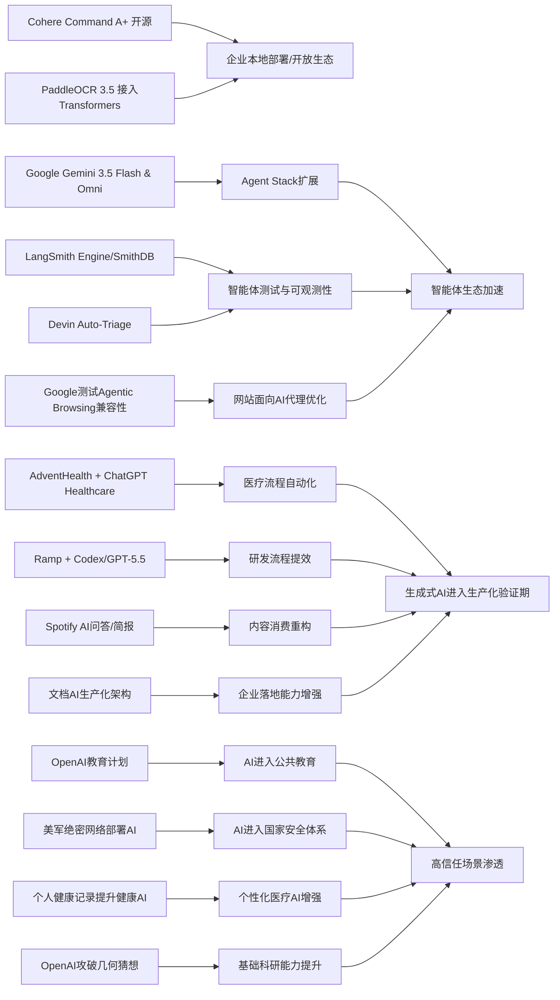

> AI 早报 · 每日早读 · 全网深度聚合

## **今日摘要**

Cohere开源最强模型 Command A+，Google发布 Gemini 3.5 Flash 与 Omni，PaddleOCR 3.5 接入 Transformers，说明高性能模型、多模态能力和文档 AI 生态都在快速升级。  
与此同时，AdventHealth、Ramp，以及 LangSmith/Devin 等案例表明，生成式 AI 正从“能用”走向“真正落地”，在医疗行政、代码审查和智能体基础设施中持续提升效率。  
从行业层面看，Google开始测试网站对 AI 代理和 llms.txt 的兼容性，也意味着未来互联网优化对象将不只是人和搜索引擎，还包括会替人执行任务的 AI 系统。

### 🔵 产品与功能更新

1. **Cohere开源最强模型Command A+。**
Cohere发布了目前最强的语言模型（能理解和生成文本的AI模型）Command A+，并采用Apache 2.0开源许可，企业和开发者可更自由地使用与修改。对市场来说，这意味着高性能大模型的可得性进一步提升，也会加快本地部署和行业应用落地。对于不想完全依赖闭源API的团队，这是一个值得关注的新选项🚀  
[查看开源模型详情briefing](https://the-decoder.com/cohere-open-sources-its-strongest-model-yet/)

2. **AdventHealth用ChatGPT减轻医疗行政负担。**
AdventHealth正在将ChatGPT for Healthcare用于优化医疗工作流（工作流程），目标是减少文书和重复性行政事务。官方表述强调，这能把更多时间还给医生和护理人员，让他们把精力放回病患照护本身。医疗场景一向对效率和合规要求很高，这类案例也说明生成式AI正从试点走向更务实的业务应用🚀  
[查看医疗落地案例briefing](https://openai.com/index/adventhealth)

3. **LangSmith与Devin推动智能体基础设施升级。**
当天的产品动态虽然不算密集，但“智能体基础设施”（支持AI自动完成任务的底层工具链）进展明显。摘要提到，LangSmith Engine正在提供类似CI/CD（持续集成/持续部署）的循环能力，帮助智能体更稳定地测试与迭代；SmithDB则面向可观测性（系统运行状态追踪）提供低延迟查询。与此同时，Cognition的Devin Auto-Triage也在把缺陷分流、记忆和子智能体协作做成更持久的自动化能力🚀  
[查看今日产品动态briefing](https://news.smol.ai/issues/26-05-18-not-much/)

### 🟢 前沿研究

1. **Google发布Gemini 3.5 Flash与Omni。**
在Google I/O 2026上，Google把Gemini重新定位为面向消费者和开发者的AI平台，并推出Gemini 3.5 Flash与Gemini Omni。前者主打更快的智能体任务和编程任务，后者则强调多模态（可同时处理文本、图片、音频、视频）生成与编辑能力。Google还同步扩展了Agent Stack（智能体工具栈），显示其正在把模型、工具和平台能力整合到同一生态中🚀  
[查看Google发布汇总briefing](https://news.smol.ai/issues/26-05-19-not-much/)

2. **Ramp用Codex把代码审查提速到分钟级。**
OpenAI介绍了Ramp工程团队如何用Codex配合GPT-5.5进行代码审查（检查代码质量与问题）。核心变化是，把原本可能需要数小时的反馈流程，压缩到几分钟内获得有实质内容的建议。对研发团队而言，这类工具价值不只在“写代码”，更在于加速协作和提升迭代效率🚀  
[查看代码审查案例briefing](https://openai.com/index/ramp)

3. **PaddleOCR 3.5接入Transformers后端。**
PaddleOCR 3.5开始支持基于Transformers（神经网络架构）的后端来执行OCR（光学字符识别）和文档解析任务。这个变化意味着文档AI（处理票据、合同、表格等文件的AI）可以更顺畅地接入当前主流模型生态。对企业来说，文档识别和信息抽取仍是最容易产生直接价值的AI场景之一🚀  
[查看文档解析更新briefing](https://huggingface.co/blog/PaddlePaddle/paddleocr-transformers)

### 🟡 行业展望与社会影响

1. **Google测试网站的AI代理兼容性。**
Google正在Lighthouse分析工具中测试“Agentic Browsing（智能体浏览）”新分类，用来检查网站对AI代理的支持情况。报道还提到，Google会关注网站是否提供llms.txt这类面向大模型的说明文件。若这项审计普及，未来网站优化对象可能不只是搜索引擎，也包括会“替人浏览网页”的AI系统🚀  
[查看代理浏览测试briefing](https://the-decoder.com/google-tests-websites-for-llms-txt-and-agent-compatibility/)

2. **搜索引擎格局因AI概览而变化。**
TechCrunch总结了6个值得尝试的搜索引擎，背景是Google搜索正因AI Overview（AI概览）而变得越来越不一样。对于用户而言，这不仅是界面变化，更是获取信息方式的转向：从“自己点链接筛选”，变成“先看AI整理结果”。这也会继续影响流量分发、内容发现以及用户对搜索可信度的判断🚀  
[查看搜索替代方案briefing](https://techcrunch.com/2026/05/21/six-search-engines-worth-trying-now-that-google-isnt-really-google-anymore/)

3. **OpenAI推进面向国家的教育计划。**
OpenAI公布了Education for Countries的新阶段，继续推动学校采用AI工具，并配套教师培训与合作项目。官方重点放在提升学习效果与扩大教育普及，但这也意味着AI正在更深入地进入公共教育体系。对各国来说，机会与挑战会并存，包括师资适应、课程设计和技术公平性问题🚀  
[查看教育计划进展briefing](https://openai.com/index/the-next-phase-of-education-for-countries)

### 🟣 开源TOP项目

1. **OlmoEarth v1.1提升地球观测效率。**
AllenAI发布了OlmoEarth v1.1，这是一组更高效的地球观测模型，可用于处理遥感（通过卫星或传感器获取地表信息）相关任务。此类模型通常应用在环境监测、土地利用分析和灾害评估等领域。效率提升意味着更低的算力成本，也有助于扩大实际部署范围🚀  
[查看地球观测模型briefing](https://huggingface.co/blog/allenai/olmoearth-v1-1)

2. **OpenAI模型攻破80年离散几何猜想。**
OpenAI宣布，其推理模型（擅长多步思考的AI模型）成功解决了一个有80年历史的单位距离问题，并推翻了离散几何中的一个重要猜想。这一结果被视为AI数学能力的重要里程碑，也说明模型开始在高度抽象的理论研究中发挥作用。虽然它不是传统意义上的“开源项目”，但无疑是今天最受关注的技术突破之一🚀  
[查看数学突破详情briefing](https://openai.com/index/model-disproves-discrete-geometry-conjecture)

3. **文档AI生产化架构研究补齐落地短板。**
一篇新论文提出了面向生产环境的文档AI微服务架构，把分类、OCR（光学字符识别）与大语言模型流程组合起来。它关注的不只是模型效果，而是如何在真实业务中稳定运行、扩展和维护。对很多企业来说，这类“怎么落地”的工程方法，往往比单点模型提升更有现实意义🚀  
[查看文档AI架构briefing](https://arxiv.org/abs/2605.18818)

### 🔴 社媒分享

1. **美军网络司令部加速在绝密网络部署AI。**
报道称，美国网络司令部已成立专门小组，计划把OpenAI、Google等公司的模型部署到五角大楼和NSA的绝密网络中。推动力来自一个判断：先进AI在发现安全漏洞方面，可能已接近甚至赶上顶尖人类黑客。若这一趋势成立，AI将更深度进入网络攻防与国家安全体系🚀  
[查看绝密网络进展briefing](https://the-decoder.com/us-cyber-command-races-to-deploy-ai-on-top-secret-networks/)

2. **Spotify为播客加入AI问答与简报生成。**
Spotify正在为播客增加AI问答和简报生成能力，用户可基于提示词生成每日或每周内容摘要。这个功能会改变播客消费方式，让原本线性的长音频内容变得更可检索、更适合快速浏览。对平台而言，这也是把AI从推荐系统进一步延伸到内容理解与再组织🚀  
[查看播客AI功能briefing](https://techcrunch.com/2026/05/21/spotify-adds-ai-powered-qa-and-briefing-generation-features-to-podcasts/)

3. **个人健康记录可提升健康AI回答质量。**
一篇新研究评估了个人健康记录（由患者管理的健康资料）在个性化健康AI中的作用。结果显示，当大模型获得临床数据支持时，更有机会对用户健康问题给出有帮助的回答。对普通用户来说，这代表未来医疗AI或许会更“懂你”，但也同时带来隐私与数据管理的新讨论🚀  
[查看健康AI研究briefing](https://arxiv.org/abs/2605.18937)

---

📊 行业洞察

1. 事实  
   Cohere开源最强模型Command A+，采用Apache 2.0许可；Google同步推出Gemini 3.5 Flash与Omni，并扩展Agent Stack（智能体工具栈）；PaddleOCR 3.5接入Transformers（神经网络架构）后端。  
   【洞察】大模型竞争正从“单点模型能力”转向“开放生态+工具链兼容+多模态平台”的体系化竞争。开源高性能模型降低企业自建门槛，Google则用模型、工具、平台一体化巩固生态，PaddleOCR的兼容升级说明垂直AI正主动靠拢主流模型栈。未来企业采购不会只看模型榜单，而会更关注部署自由度、生态适配性和二次开发效率。

2. 事实  
   AdventHealth将ChatGPT for Healthcare用于减少医疗行政负担；Ramp用Codex与GPT-5.5把代码审查反馈压缩到分钟级；Spotify为播客加入AI问答与简报生成；文档AI生产化架构研究聚焦分类、OCR与大语言模型流程的稳定落地。  
   【洞察】生成式AI的价值重心正在从“展示能力”转向“压缩流程时间、重构工作流”。无论是医疗、研发、内容平台还是文档处理，AI最先兑现ROI（投资回报）的场景都集中在高频、重复、信息密集型任务。行业进入“生产化验证期”：决定胜负的不是模型会不会，而是谁能把AI嵌入业务流程、形成可量化的效率提升。

3. 事实  
   LangSmith Engine提供类似CI/CD（持续集成/持续部署）的智能体循环能力，SmithDB强调可观测性（系统运行状态追踪）；Devin Auto-Triage推进缺陷分流、记忆和子智能体协作；Google在Lighthouse测试Agentic Browsing（智能体浏览）兼容性，并关注llms.txt。  
   【洞察】智能体正在从“能演示”走向“可运维、可测试、可接入外部环境”的基础设施阶段。上游是智能体开发平台补齐测试、观测、记忆与协作能力，下游是网站开始为AI代理访问做适配，意味着“Agent-ready（面向智能体就绪）”将成为新的软件与互联网基础标准。未来企业数字化建设的对象，不再只有人类用户，也包括代表用户执行任务的AI代理。

4. 事实  
   OpenAI推进面向国家的教育计划；美国网络司令部加速在绝密网络部署OpenAI、Google等模型；研究显示个人健康记录可提升健康AI回答质量；OpenAI模型攻破80年离散几何猜想。  
   【洞察】AI正快速进入“高信任、高影响”领域，包括教育、国防、医疗与基础科研。这表明AI产业已不只是互联网效率工具，而是在向国家级基础能力演进。与此同时，模型能力越强、应用越深入，对数据治理、隐私保护、可靠性验证与制度配套的要求就越高，监管与基础设施建设将逐步成为下一阶段竞争门槛。

🗺️ 今日关系图

