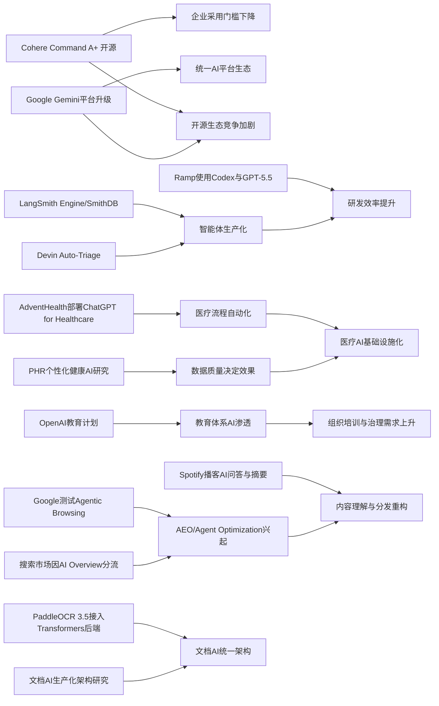

> AI 早报 · 每日早读 · 全网深度聚合

## **今日摘要**

近期AI进展显示，大模型正同时向“更开放可用”和“更深入行业流程”两端发展：Cohere开源最强模型 Command A+，医疗机构 AdventHealth 用 ChatGPT 优化临床与行政流程，文档处理与代码审查等专业场景也在快速落地。  
与此同时，竞争重点正从单纯的问答能力转向智能体基础设施与平台化能力，Google 在 I/O 2026 强化 Gemini 与多模态/智能体栈，LangSmith、Devin 等工具则提升了智能体的持续运行、观测和自动分流能力。  
从行业影响看，AI正在重塑网站、企业软件和服务体系的设计逻辑，未来企业不仅要关注模型性能和成本，还要考虑面向AI智能体的适配、合规与工作流重构。

### 🔵 产品与功能更新

1. **Cohere开源最强模型Command A+。**  
Cohere 发布了目前最强的语言模型 Command A+，并采用 Apache 2.0 许可证开源，方便企业和开发者直接使用与二次开发。对非技术团队来说，这意味着更低的试用门槛，也更容易把大模型接入客服、知识库和内容生成场景。开源还让模型能力更透明，便于评估成本、性能与合规性。🚀  
[查看开源模型详情(briefing)](https://the-decoder.com/cohere-open-sources-its-strongest-model-yet/)

2. **AdventHealth用ChatGPT优化医疗流程。**  
AdventHealth 正在使用 ChatGPT for Healthcare（面向医疗的ChatGPT）来简化工作流，减少文书与行政负担。对医院而言，这类工具的价值不只是“能回答问题”，更在于帮医生和护理团队节省时间，把更多精力放回患者照护。摘要也强调了“whole-person care（全人照护）”方向，说明AI正被纳入更完整的医疗服务体系。🚀  
[了解医疗应用案例(briefing)](https://openai.com/index/adventhealth)

3. **LangSmith与Devin推动智能体基础设施升级。**  
当天动态虽不算密集，但智能体（Agent，可自主执行任务的AI系统）底层能力在明显进步。LangSmith Engine 强调给智能体提供 CI/CD（持续集成与持续交付）闭环，SmithDB 则提升可观测性查询速度；Cognition 的 Devin Auto-Triage 则把缺陷分流（自动处理Bug分类）做成更持续的自动化流程。这说明产品竞争正从“会不会回答”转向“能不能稳定协作、持续运行”。🚀  
[查看智能体进展综述(briefing)](https://news.smol.ai/issues/26-05-18-not-much/)

### 🟢 前沿研究

1. **Google在I/O 2026强化Gemini与智能体栈。**  
Google 在 I/O 2026 上把 Gemini 进一步定位为面向消费者与开发者的统一AI平台。核心更新包括 Gemini 3.5 Flash（偏快速任务与编程）、Gemini Omni（多模态，可处理文字、图像、视频等）以及扩展后的智能体技术栈。Google 还披露其月处理量已达 3.2 quadrillion tokens（海量文本单位），显示大模型应用规模仍在高速增长。🚀  
[查看Google I/O要点(briefing)](https://news.smol.ai/issues/26-05-19-not-much/)

2. **Ramp工程团队用Codex加速代码审查。**  
Ramp 工程师正在用 Codex 与 GPT-5.5 进行代码审查，把原本需要数小时的反馈压缩到几分钟。这里的代码审查，是指对程序改动进行质量、风险与规范检查，是软件研发中的关键环节。案例说明，前沿模型的价值正体现在“提高专业工作流效率”，而不是只做通用问答。🚀  
[查看代码审查案例(briefing)](https://openai.com/index/ramp)

3. **PaddleOCR 3.5接入Transformers后端。**  
PaddleOCR 3.5 支持基于 Transformers（主流大模型架构）的后端来完成 OCR（光学字符识别）与文档解析任务。对企业来说，这意味着发票、表单、合同等文档处理可以更方便地接入统一的AI框架。文档AI正从单点识别，走向“识别+理解+结构化提取”的完整流程。🚀  
[了解文档解析升级(briefing)](https://huggingface.co/blog/PaddlePaddle/paddleocr-transformers)

### 🟡 行业展望与社会影响

1. **Google测试网站是否适配AI智能体访问。**  
Google 正在 Lighthouse（网站分析工具）中测试“Agentic Browsing（智能体式浏览）”新类别，用来检查网站对AI智能体是否友好。报道特别提到 llms.txt，这是一种帮助网站向大模型说明可访问规则的文本规范。对内容网站和电商平台来说，未来不只是“搜索引擎优化”，还要考虑“AI智能体优化”。🚀  
[查看网站适配趋势(briefing)](https://the-decoder.com/google-tests-websites-for-llms-txt-and-agent-compatibility/)

2. **搜索市场因AI概览变化而重新洗牌。**  
TechCrunch 盘点了六个值得尝试的搜索引擎，背景是 Google 搜索正在因 AI Overview（AI概览）发生明显变化。用户如果不喜欢AI先行总结的体验，可能会转向更传统或更垂直的替代产品。这反映出AI并不只是增强搜索，也在改变用户对“信息获取入口”的偏好。🚀  
[查看替代搜索推荐(briefing)](https://techcrunch.com/2026/05/21/six-search-engines-worth-trying-now-that-google-isnt-really-google-anymore/)

3. **OpenAI推进面向国家教育体系的AI计划。**  
OpenAI 正在推进 Education for Countries（面向国家的教育计划），通过新合作、教师培训和工具支持扩大AI在学校中的应用。重点不只是部署产品，还包括帮助教育体系建立使用能力与教学方法。对社会影响而言，这类项目可能加速全球教育数字化，也会带来公平性与教学质量的新讨论。🚀  
[了解教育计划扩展(briefing)](https://openai.com/index/the-next-phase-of-education-for-countries)

### 🟣 开源TOP项目

1. **OpenAI模型推翻离散几何经典猜想。**  
OpenAI 表示其模型解决了已有80年历史的 unit distance problem（单位距离问题）相关核心猜想，成为AI数学研究的里程碑。对大众来说，这意味着AI不再只是在“算得快”或“写得像”，而开始进入更高门槛的理论发现领域。这类成果也会推动外界重新评估AI在科研中的角色。🚀  
[查看数学突破原文(briefing)](https://openai.com/index/model-disproves-discrete-geometry-conjecture)

2. **OlmoEarth v1.1提升地球观测模型效率。**  
AllenAI 发布 OlmoEarth v1.1，这是一组更高效的 Earth observation models（地球观测模型）。这类模型通常用于卫星图像分析、环境监测和土地变化识别等任务。效率提升意味着相关机构可以用更低成本处理更大规模的地理数据。🚀  
[了解地球观测模型(briefing)](https://huggingface.co/blog/allenai/olmoearth-v1-1)

3. **文档AI生产化架构研究发布。**  
这篇 arXiv 论文提出了一种面向生产环境的微服务架构，用来整合 OCR（光学字符识别）、分类和大语言模型处理流程。相比单一模型论文，它更关注“如何把文档AI真正稳定跑起来”。对于企业落地来说，这类架构研究往往比单次模型刷新更接近现实价值。🚀  
[查看文档AI架构研究(briefing)](https://arxiv.org/abs/2605.18818)

### 🔴 社媒分享

1. **美军网络司令部加速在机密网络部署AI。**  
美国网络司令部正在推动把 OpenAI、Google 等公司的模型部署到最高机密网络中，用于安全与攻防任务。报道提到，先进模型已经能比顶尖人工黑客更快发现部分安全漏洞。若这一趋势持续，AI在国家安全领域的应用节奏可能会显著加快。🚀  
[查看机密网络部署(briefing)](https://the-decoder.com/us-cyber-command-races-to-deploy-ai-on-top-secret-networks/)

2. **Spotify为播客加入AI问答与简报功能。**  
Spotify 正在给播客加入AI驱动的问答与 briefing（摘要简报）生成功能，用户可按提示生成每日或每周内容摘要。对听众而言，这有助于更快筛选信息、回顾重点；对创作者而言，也可能提升内容分发和二次消费效率。音频平台正把AI从推荐系统延伸到内容理解层。🚀  
[了解播客AI新功能(briefing)](https://techcrunch.com/2026/05/21/spotify-adds-ai-powered-qa-and-briefing-generation-features-to-podcasts/)

3. **个人健康记录或提升个性化健康AI。**  
这篇 arXiv 研究评估了个人健康记录（PHR，患者自行管理的健康档案）在个性化健康AI中的作用。结果聚焦于：当模型获得临床数据支持后，是否能更好回答用户健康问题。它提示我们，未来健康AI的关键不只是模型更强，还包括能否获得更完整、结构化且可信的数据。🚀  
[查看健康AI研究(briefing)](https://arxiv.org/abs/2605.18937)

---

📊 行业洞察

1. 事实  
   Cohere 将最强模型 Command A+ 以 Apache 2.0 许可证开源；Google 在 I/O 2026 强化 Gemini 3.5 Flash、Gemini Omni 与智能体技术栈，并披露月处理量达 3.2 quadrillion tokens（万亿级文本单元）。  
   【洞察】判断：大模型竞争正在从“闭源能力领先”转向“开源生态扩张 + 平台规模运营”双线并行。Cohere 用开源降低企业采用门槛，Google 则用统一平台和超大规模推高生态黏性，意味着未来厂商护城河将更多体现在生态覆盖、部署便利性与持续服务能力，而非单次模型发布。

2. 事实  
   LangSmith Engine 提供智能体的 CI/CD（持续集成与持续交付）闭环与 SmithDB 可观测性；Cognition 推出 Devin Auto-Triage 自动化缺陷分流；Ramp 用 Codex 与 GPT-5.5 将代码审查反馈从数小时压缩到几分钟。  
   【洞察】判断：AI 智能体（Agent，可自主执行任务的AI系统）正从“演示型能力”进入“生产型能力”阶段。判断标准不再是能否完成单次任务，而是是否具备流程接入、质量监控、异常分流和持续优化能力。软件研发场景将成为首批规模化落地高地，因为其任务边界清晰、反馈数据丰富、ROI（投资回报）可量化。

3. 事实  
   AdventHealth 使用 ChatGPT for Healthcare 优化医疗流程；个人健康记录（PHR，患者自行管理健康档案）研究显示更完整临床数据有助于提升个性化健康AI；OpenAI 正推进面向国家教育体系的 Education for Countries 计划。  
   【洞察】判断：AI 正从单点工具采购走向“行业基础设施化”渗透，医疗与教育是两个代表性纵深场景。共同趋势是：模型本身已不是唯一瓶颈，真正决定成效的是数据可得性、组织培训、流程重构与合规治理。未来行业级AI竞争将更多发生在“谁能把模型嵌入制度与工作流”上。

4. 事实  
   Google 测试网站对 Agentic Browsing（智能体式浏览）的适配，并关注 llms.txt（面向大模型的访问规则文本规范）；搜索市场因 AI Overview 变化而分流，用户开始尝试替代搜索产品；Spotify 为播客加入 AI 问答与摘要功能。  
   【洞察】判断：互联网流量入口正在从“人类点击网页”迁移到“AI 先理解、再分发内容”。这意味着 SEO（搜索引擎优化）将逐步升级为 AEO/Agent Optimization（面向AI/智能体的内容优化），内容平台、媒体和电商未来不仅要争夺用户注意力，还要争夺被模型优先读取、总结和调用的机器可见性。

🗺️ 今日关系图

