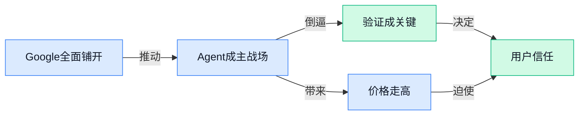

> AI 早报 · 每日早读 · 全网深度聚合

## **今日摘要**

```
Google I/O 一夜塞满 Gemini 新模型与云端 Agent，AI Search 升级，多家媒体称 Google 重夺消费级 AI 上风
OpenAI 模型推翻离散几何核心猜想，同日 OpenComputer（电脑操作考场）与 OmniGUI（手机操作评测）猛攻 Agent 实战
Google 上调 Gemini 3.5 Flash 价格、暂缓大型代码模型，Qwen3.7-Max 押注 Agent 前沿，AI 成本战开始分层
```

### 🔵 产品与功能更新

1. **Google I/O 发布新模型、Gemini 改版，还带来一个“不会下班”的云端 Agent（可自动执行任务的 AI 助手）。**
这次 Google 把 **Gemini** 产品线和应用体验一起打包升级，不只是发新模型，还重新设计了 Gemini 应用界面，让普通用户更容易把 AI 用进日常工作流里 💡。同时它还展示了云端 Agent（可在后台持续帮你处理任务的 AI 助手），强调“人不在线，任务也能继续跑”，这对客服、运营、信息整理等场景很有想象空间。对企业用户来说，重点不只是模型更强，而是 **AI 正在从“问答工具”变成“代办执行者”** 🚀。可参考 [Google I/O 解读(briefing)](https://the-decoder.com/googles-i-o-announcements-new-models-a-cloud-agent-that-never-sleeps-and-a-redesigned-gemini-app/)


2. **Gemini 3.5 Flash（Google 的轻量级大模型版本）价格明显上调，AI 成本战开始出现“高端化”。**
继 Anthropic 和 OpenAI 之后，Google 也在让新一代模型变得更贵，说明行业竞争已经不只拼“谁更便宜”，而是在拼 **性能、速度与单位价值**。其中 **Flash** 这类轻量模型原本主打更快、更省，但如今也出现明显提价，意味着企业以后选模型时，不能只看“能不能用”，还要更仔细算 **投入产出比**。对财务、采购和业务团队来说，这类变化会直接影响 AI 项目的预算测算和落地节奏 📈。相关情况见 [价格变化报道(briefing)](https://news.google.com/rss/articles/CBMixAFBVV95cUxQUU1ESWRyaTJHZHVobkN1SDFpaTFKWDYxLTlyeHYxVXF1SmxiZGxzbW1vRVcyYk5DR1RONloxSGZhMEZkaXUyWmQtTG0tX3duT3Z5enVJMnNoOU03eUItSkZhX3JudDJSYnZsclVqSVJBVTBHWnhXTjNET1hvRmhmS1dtU2tOT05yclQxY2JCREhWdE1JWG1JSDZIaktjdGJUMnZHQUlodkl6TWlRXzBTejk3V2xBWTJoaUJiSkV1T3N4NGFW?oc=5)

3. **Google CEO 总结 Google I/O 六项 AI 发布，Gemini 仍是整场升级的核心主线。**
从 CEO 的归纳来看，这次 Google I/O 的重点不是单点功能，而是围绕 **Gemini** 做成一整套产品推进：模型、应用和使用方式都在同步更新。这样的信号很明确——Google 想把 AI 从“某个新功能”升级成它各类产品里的 **基础能力层**，也就是以后很多服务默认都会带 AI。对普通职场人来说，最值得关注的是：未来你接触到的 Google 工具，可能会越来越像一个能理解意图、能协助执行的数字同事 🤖。更多梳理可看 [六大发布总结(briefing)](https://news.google.com/rss/articles/CBMiqgFBVV95cUxQaEF5QmZnemlHaTRVNHJ5bnlxSkNSaERpaUpvTmNscDJxUnJHekYzeUVvMjdjRXlOcXBNTnQtaklEVDZVeVUxcDB0TWpFUFZCUDR4TkJzbGxoQmpQYVpfcDdFQWVGaGQweldFYlVVejBMaFJfU1pXaGI5RXp0MDAyRXRuZkp4MjZqdm9LNGRFbGV3YjZ3aFRUaXRnYnY0cHZZemdvQWJuOFBvUQ?oc=5)

### 🟢 前沿研究

1. **OpenAI 模型推翻离散几何（研究点与距离关系的数学分支）核心猜想。**
OpenAI 表示，其模型解决了一个已有 **80 年历史**的 **单位距离问题**，并据此推翻了离散几何中的一个重要猜想，这也是 **AI 参与数学研究** 的里程碑事件 🧠。对普通职场同事来说，这件事的意义不在于公式本身，而在于 AI 正从“会总结、会写稿”走向“能参与原创科研发现”。如果后续被学界持续验证，这会让大家重新评估大模型在 **科研辅助**、**知识发现** 甚至高难度分析工作中的潜力。[OpenAI 官方说明(briefing)](https://openai.com/index/model-disproves-discrete-geometry-conjecture)

2. **OmniGUI（面向手机多模态环境的界面操作评测基准）想测清 AI 到底会不会“玩手机”。**
这篇论文聚焦 **GUI Agent（图形界面智能体，能像人一样点按钮、切页面完成任务）** 的评测，场景放在更贴近日常使用的 **智能手机环境** 里 📱。所谓 **多模态（让 AI 同时理解文字、图片、界面元素等多种信息）**，就是不只看文本说明，而是真正理解整个手机操作界面。对行业来说，谁能先把这类基准做好，谁就更有机会推动“会用 App 办事”的 AI 助手落地，比如客服流程、表单填写、订票下单等场景。[论文条目页(briefing)](https://huggingface.co/papers/2605.18758)

3. **OpenComputer（可验证的软件世界环境）为电脑操作型 Agent 搭“标准考场”。**
这项研究提出 **Verifiable Software Worlds（可验证的软件世界，用来让 AI 在可检查结果的虚拟软件环境里做任务）**，核心目标是更可靠地评估 **Computer-Use Agents（电脑操作型智能体，能直接使用电脑软件完成工作）** 💻。简单说，就是不只看 AI 说自己“会了”，而是给它一个能被核验的操作环境，看看它到底能不能真的把事做完。对企业用户很关键，因为未来无论是自动报销、后台录入还是跨系统操作，**可验证** 都比“看起来挺聪明”更重要。[论文条目页(briefing)](https://huggingface.co/papers/2605.19769)

4. **PEEK（长上下文 Agent 的“定位缓存”机制）想缓解 AI 看太多资料后迷路的问题。**
这篇工作提出 **Context Map（上下文地图，把超长信息整理成便于定位的结构）** 作为 **Orientation Cache（方向缓存，帮助 AI 在长材料里快速找回位置）**，服务于 **Long-Context LLM Agents（能处理超长文本的大模型智能体）** 🗺️。直白说，就是当 AI 面对很长的会议纪要、制度文档或项目档案时，不要每次都从头翻，而是先记住“重要内容在哪”。这对知识库问答、合规审阅、项目管理等工作尤其有用，因为真正难的往往不是“能不能读”，而是“读完还能不能迅速找到关键点”。[论文条目页(briefing)](https://huggingface.co/papers/2605.19932)

5. **AutoResearchClaw（人机协同的自主科研系统）探索“AI 帮人做研究”的闭环。**
从标题看，这项研究关注 **Autonomous Research（自主科研，让 AI 不只回答问题，还能连续推进研究过程）**，并强调 **Human-AI Collaboration（人机协作，即人负责判断与校正，AI 负责高频探索与整理）** 🔬。其中 **Self-Reinforcing（自我强化）** 指系统可能会根据已有结果持续改进后续研究步骤，形成循环推进。对公司管理者和业务团队而言，这类方向值得关注，因为它代表 AI 正尝试从“工具”升级为“研究搭子”，未来可能更深入参与市场洞察、情报整理和方案探索。[论文条目页(briefing)](https://huggingface.co/papers/2605.20025)

6. **CEPO（一种基于对比证据的策略优化方法）瞄准 RLVR 自蒸馏训练。**
这篇论文标题里的 **RLVR（可验证奖励强化学习，让 AI 根据“可检查的对错反馈”持续改进）** 和 **Self-Distillation（自蒸馏，让模型把自己较好的能力再提炼回自身）**，都属于当下模型训练里的前沿方向 ⚙️。作者提出 **Contrastive Evidence Policy Optimization（基于对比证据的策略优化，通过比较不同证据来优化模型决策）**，试图让模型学得更稳、更会判断。虽然普通用户暂时感知不到算法名，但这类研究会直接影响未来模型是否更可靠、更会推理、犯错是否更少。[论文条目页(briefing)](https://huggingface.co/papers/2605.19436)

7. **Draft Less, Retrieve More（少草拟多检索）的混合树构建方法改进 Speculative Decoding（推测式解码，加速大模型生成的一种办法）。**
**Speculative Decoding（推测式解码）** 的核心思路，是先让一个较小的辅助模型“打草稿”，再由大模型快速验证，从而提升回答速度 🚀。这篇研究从标题看，重点在 **Hybrid Tree Construction（混合树构建，把候选答案组织成树状结构以便更高效筛选）**，并强调“少草拟、多检索”，意味着它在寻找更节省计算资源的加速路径。对用户来说，这类工作最终会体现在模型 **响应更快**、**成本更低**，尤其适合需要大量调用 AI 的产品和企业服务。[论文条目页(briefing)](https://huggingface.co/papers/2605.20104)

8. **Delta Attention Residuals（注意力残差机制，一种改进大模型信息处理的结构）探索更高效的模型内部计算。**
标题中的 **Attention（注意力机制，决定模型在阅读时该重点看哪些内容）** 是大模型的核心部件，而 **Residuals（残差连接，让新信息和旧信息叠加，帮助模型更稳地学习）** 则是神经网络里的常见设计 🧩。这篇工作把两者结合成新的研究方向，重点很可能落在提升模型处理信息的效率或稳定性。虽然从标题还看不出具体效果数字，但这类底层结构创新往往决定了下一代模型能不能在 **速度、成本、效果** 之间取得更好平衡。[论文条目页(briefing)](https://huggingface.co/papers/2605.18855)

### 🟡 行业展望与社会影响

1. **Google I/O 2026 显示：Google 正把 Gemini 推向“Agent 时代”。**
从官方基调看，Google 这次想传递的核心很明确：**Gemini** 不再只是聊天工具，而是要升级成能主动帮你完成任务的 **Agent**（可根据目标自动分步骤执行任务的 AI 助手）🤖。Google 在大会上把重点放在“帮你做更多事”上，说明行业竞争已经从“谁更会回答问题”转向“谁更能真正替你干活”了。对普通办公场景来说，这意味着未来 AI 可能不只是写文案、做总结，还会更深入地参与日程、搜索、执行等流程。[Google 官方主题演讲(briefing)](https://blog.google/innovation-and-ai/sundar-pichai-io-2026/) 💡

2. **Google 宣布 AI Search（AI 搜索模式，把搜索引擎和生成式回答结合）进入新阶段。**
Google 公开提出 **AI Search** 的“新时代”，本质上是在重塑大家最熟悉的上网入口：**搜索** 🔍。官方说法强调把传统搜索引擎的查找能力，与 **生成式 AI**（能直接生成文字、图片、视频等内容的 AI）结合起来，这说明未来用户不一定只看一串链接，而会越来越多直接获得整理后的答案。对内容行业、品牌运营和流量获取来说，这会影响“用户怎么找到信息”，也会改变“企业怎么被看见”。[Google 搜索官方发布(briefing)](https://blog.google/products-and-platforms/products/search/search-io-2026/)

3. **多家媒体判断：Google 在消费级 AI（面向普通用户的 AI 产品）竞争中正重新占上风。**
从《经济学人》到 Marketplace，多篇报道都在讨论一个反转：外界原本以为 Google 会在 AI 竞赛中落后，但现在它反而展现出更强的整体势头 📈。这里的关键不只是单个模型厉不厉害，而是 Google 能把 **Gemini**、搜索、浏览器、手机和办公入口连成一张网，形成更完整的用户触点。对行业来说，这意味着 AI 竞争正在从“实验室比参数”转向“谁真正掌握日常使用场景”。[市场观察报道(briefing)](https://news.google.com/rss/articles/CBMihwFBVV95cUxNbDRteHJNOWpib2d0dllhbjB5bGY5VVZOUGZOcEZiR01iSXVSVzAtd2pjMHBUeWo3bHVxMjZ1YnA5TGU4WDA2Vkx0RU9DS3Y4aG5RMlJnSkp0TFhYV1FvTGI3RV9BUFhpUjBzd2ZrQzVjNmJia2tvUVhQSE0wc0lmY0l6SmdDRmM?oc=5) [经济学人分析(briefing)](https://news.google.com/rss/articles/CBMiogFBVV95cUxOYXJ2TUFGVnVEY19DZ3lyMVFGeFpxM2R2OGQwTUxLNGhuNjNhWmU3bFQwQS01ZzVQVzJORHlRWGZkNmtrZEFzN25BM0U0MUQyRlRQQ09qUzVaeDdndGw3SHJtN1ltYjVYZ25xc01FOHJRMEV1WS16S2kzQ1dDZkx5SDhJRU9qVVlYUGpsRER3bk80RjVNV1JONVNHemtTazVMRkE?oc=5)

4. **Google 据称暂缓推出大型代码模型，折射出 AI 编程赛道的压力与取舍。**
Business Insider 的报道提到，Google 按下了一个“大型新模型”的发布节奏，这件事之所以重要，是因为它反映出 **AI coding**（AI 编程辅助）赛道已经进入非常敏感的卡位期 🧭。在这个领域，企业不只是比模型能力，还要考虑发布时间、产品定位，以及会不会影响现有品牌与市场预期。对非技术团队也有启发：AI 竞争不再是“做出来就发”，而更像是“什么时候发、以什么形态发”同样决定胜负。[商业内幕报道(briefing)](https://news.google.com/rss/articles/CBMiiAFBVV95cUxOQWVOWUVfTWRmTHUyNTNnU1RvZXRkQmhYdHR3TWY2QjZ6U29rMHV6UjBvcHc4UTJfRUc5NEhZb0tiTVFlMEV3aUIwYk53WkswZlZuTFZBbElWNW5hak5rTmZURWI0UEg5Z296cjYwYXRaYXRCM1VUMDc3bkNkQ0JXWmhPM3I0c2hL?oc=5)

5. **Google 把生成式 AI 塞满 I/O，但“这到底是给谁用的”成了更现实的问题。**
Mashable 的观察点很有代表性：当 **生成式 AI** 几乎出现在所有发布内容里，用户最直接的疑问反而变成“这些功能究竟服务谁”🙋。这说明行业已经进入下一阶段——大家不再只被“AI 很强”打动，而开始追问它是否真的解决具体人群的具体问题。对企业内部做产品、运营、行政支持的人来说，这也是个提醒：AI 方案如果没有清晰对象和明确场景，再炫也可能难落地。[媒体观察原文(briefing)](https://news.google.com/rss/articles/CBMibEFVX3lxTFBXcjlZOXk0cmdvSW1NXzlmRUg0TUNZRlBkcWFqMDZBdkh3X0ZXYUlleVJMX2ZwQmd4ajI5SDhmQW50ZEVrVTJzbnpmbldWZkthNFYwTFBESzE2SkRjUmVnTkJpWWZhaUNaT0dWLQ?oc=5)

6. **Omni world model（全景世界模型，让 AI 理解并生成更连贯视频内容）与 Gemini Spark（Google 新推的 Agent 产品）说明 AI 正从“会说”走向“会看、会做”。**
Mashable 提到 Google 发布了 **Omni world model**（一种更强调理解世界状态与变化关系的模型，目标是让 AI 生成的视频更连贯）以及 **Gemini Spark**（Google 展示的新 Agent 形态）🎬。把视频理解/生成能力与 Agent 能力放到同一场大会里，释放出的信号很清楚：未来 AI 产品会越来越像“多面手”，既能理解内容，也能代替用户完成动作。对行业趋势来说，这种融合会推动 AI 从单点工具，逐步变成覆盖搜索、内容、执行三类任务的统一入口。[Omni 模型报道(briefing)](https://news.google.com/rss/articles/CBMiiAFBVV95cUxOV2JmNkhPV3BrVW5GZ00zMlJTUUJJVnJyOXd1RndQbEktdlVGaWRMSjJXbnlSLW5Hb052U3kxU1dhaEI2OTF6Y1lPQzFWOS1FR1hSeW0xMVZETVBXcG5BUUhJY3RPeUhQbHRlN0taZGp2dER4dmduQlhCc3hxQkNzdGdfYnYyY3Rz?oc=5) [Gemini Spark 报道(briefing)](https://news.google.com/rss/articles/CBMidEFVX3lxTE8tcjBMeFBZWEt4dXZrVy1vTXlZbXNlZk5xQ0gxZWV6TVV6U25iekF2X3R6N1FVWkN4SjRPSkRvb04za2g5REV5aEJ5ZGNPSllHelA2N0dqREVKaV9paGhSVGlfRG1kRGllY1lCb1ZvenV4M1pH?oc=5)

### 🟣 开源TOP项目

1. **CloakBrowser（一个可伪装浏览器指纹的 Chromium 浏览器）主打“像真人一样浏览网页”。**  
这个项目的核心卖点，是让基于 Chromium（Google Chrome 背后的开源浏览器内核）的自动化浏览器尽量通过各种**机器人检测** 🤖。它还强调自己可以作为 Playwright（常见的网页自动化测试工具，让程序像人在点网页）**直接替代**，并在源码层做了**指纹补丁**（修改浏览器会暴露给网站的设备与环境特征，避免被识别成机器）。按项目页描述，它在相关测试里达到了 **30/30 通过**，很适合关注自动化采集、网页测试和反检测能力的团队了解一下。[GitHub 项目页(briefing)](https://github.com/CloakHQ/CloakBrowser)


2. **openhuman（个人 AI 超级助手项目）想把“强大但私密”的 AI 放到个人手里。**  
这个项目把自己定位成 **Personal AI super intelligence（个人 AI 超级智能助手，帮个人持续处理信息、任务和决策）**，重点强调 **Private（隐私优先）**、**Simple（简单易用）** 和强能力 💡。从项目简介看，它瞄准的不是单点工具，而是更贴近“你的个人 AI 中枢”这一方向。对普通办公同事来说，这类项目的意义在于：未来 AI 可能不只是聊天窗口，而是长期帮你管理信息、理解习惯、承接任务的个人助手。[GitHub 仓库页(briefing)](https://github.com/tinyhumansai/openhuman)

3. **academic-research-skills（面向 Claude Code 的学术研究工作流模板）把研究流程拆成一整套步骤。**  
这个开源项目围绕 Claude Code，整理出从 **research（找资料）→ write（写作）→ review（审阅）→ revise（修改）→ finalize（定稿）** 的完整链路 📚。它更像是一套“研究型提示词与流程规范”，帮助 AI 按学术写作节奏分阶段推进，而不是一次性胡乱生成。对于需要写行业报告、方案文档、论文初稿的人来说，这类结构化工作流很有参考价值，因为它把“怎么让 AI 更像靠谱助理”这件事拆清楚了。[项目说明页(briefing)](https://github.com/Imbad0202/academic-research-skills)

4. **RuView（把 WiFi 信号变成空间感知工具的项目）尝试不用摄像头也看懂“人在哪里、状态怎样”。**  
它的思路很有意思：利用普通 **WiFi（无线网络信号）** 去做 **real-time spatial intelligence（实时空间感知，判断空间里是否有人、人在什么位置）**、**vital sign monitoring（生命体征监测，比如呼吸等细微变化）** 和 **presence detection（在场检测，判断是否有人存在）** 🛰️。而且项目特别强调，整个过程**不需要视频像素**，也就是不用摄像头。对企业场景来说，这类方向很值得关注，因为它把“感知能力”从视觉监控扩展到更低打扰、更重隐私保护的路线。[GitHub 项目介绍(briefing)](https://github.com/ruvnet/RuView)

5. **claude-for-legal（面向法律工作流的 Claude 插件套件）瞄准法律场景效率提升。**  
这是一个专门服务 **legal workflows（法律工作流程，比如合同处理、法务审阅、文书整理）** 的插件集合 ⚖️。从简介来看，它不是单个功能，而是一组围绕法律事务组织起来的工具，更适合法务团队或需要频繁处理合规文件的组织关注。对非技术同事来说，可以把它理解成“把 AI 直接嵌进法务日常操作”的尝试，重点不是炫技，而是让具体流程更顺。[GitHub 官方仓库(briefing)](https://github.com/anthropics/claude-for-legal)

6. **agentmemory（给 AI 编程助手做“长期记忆”的项目）想解决 Agent 用完就忘的问题。**  
这个项目主打 **Persistent memory（持久记忆，让 AI 过一段时间还能记住之前做过什么）**，面向的是 **AI coding agents（AI 编程 Agent，能自动写代码、改代码、执行任务的助手）** 🧠。它还特别提到自己基于 **real-world benchmarks（真实世界基准测试，用更接近实际工作的任务来评估效果）**，说明重点是实战表现而不只是概念展示。对团队协作来说，这类能力很关键，因为 AI 若能真正“记住项目上下文”，才更像能持续接手工作的同事，而不是每次都要重新交代一遍的新实习生。[GitHub 项目页(briefing)](https://github.com/rohitg00/agentmemory)

### 🔴 社媒分享

1. **Google 悄悄反击 AI 搜索结果被操纵的问题。**
随着越来越多人直接看 **AI 搜索摘要**，也有人开始研究怎么“喂偏”系统，让结果朝自己有利的方向倾斜 😶‍🌫️。这篇报道聚焦 Google 如何应对这类针对 **AI 结果** 的操纵风险，本质上是在打击一种新型“搜索作弊”——不只是骗传统排名，而是试图影响模型生成的答案。对普通用户和企业来说，这关系到以后看到的 AI 回答到底是更可靠，还是更容易被营销和垃圾内容带节奏。[BBC 完整报道(briefing)](https://www.bbc.com/future/article/20260519-google-tackles-attempts-to-hack-its-ai-results)


2. **Google 高管 James Manyika（谷歌高级管理者）押注“AI 不会毁掉工作”。**
Google 的 James Manyika 在讨论 **AI 与就业** 时，明确站在相对乐观的一边：他认为很多“工作末日论”判断过头了 🤖。这类表态的重点，不只是“岗位会不会消失”，更是“工作内容会怎么被重组”——也就是 AI 先接管一部分重复任务，而不是立刻整体替代一个职位。对公司管理者来说，这种判断会直接影响培训、招聘和组织设计：未来更重要的，可能是让员工学会与 AI 协作，而不是单纯担心被取代。[Platformer 报道原文(briefing)](https://www.platformer.news/james-manyika-google-ai-jobs-io-2026/)


3. **OpenAI 模型推翻离散几何中的一个核心猜想。**
OpenAI 发布消息称，其模型在 **离散几何**（研究点、线、图形如何组合的数学分支）中推翻了一个长期存在的中心猜想，说明 AI 已不只是“会总结资料”，而开始触及真正的 **数学发现** 🧠。这里的“猜想”可以理解为“很多人相信它对，但一直缺少最终证明或反例”的命题；而模型这次给出的，是直接否定它成立的结果。对外行人来说，这件事最值得关注的信号是：AI 正在从“辅助写作工具”往“科研助手”升级。[OpenAI 官方说明(briefing)](https://openai.com/index/model-disproves-discrete-geometry-conjecture/)

4. **Google I/O 与 Gemini Spark（Gemini 里的轻量创意工具）发布后，开发者更关心“什么时候能亲手试”。**
知名开发者博主 Simon Willison 在回顾 Google I/O 时提到，今年很多重磅内容还处于“即将推出”阶段，所以真正能评价的东西并不多 👀。他点名了 **Gemini Spark** 和 **Antigravity（Google 提到的新项目/功能名）**，但核心态度很务实：如果还不能上手，外界就很难判断这些能力到底是演示效果，还是真能落地。对业务团队来说，这也是看 AI 发布会常见的坑——概念很热闹，但真正值得跟进的，往往是那些已经能试、能接、能部署的产品。[博客原文解读(briefing)](https://simonwillison.net/2026/May/20/google-io/#atom-everything)

5. **Qwen3.7-Max（通义千问新模型）把重点押在 Agent 能力前沿。**
阿里发布 **Qwen3.7-Max**，并直接把主题定为 **Agent Frontier**，也就是更强调让模型自己拆任务、调工具、连续执行，而不只是“答一段话” 🚀。这里的 Agent 可以理解成“会自己分步骤干活的 AI 助手”，比普通聊天机器人更接近“交付结果”而不是“提供建议”。这类方向如果做成熟，对客服、运营、数据整理等流程影响会很大，因为很多原本要人工来回切换系统的工作，未来可能交给 AI 串起来做。[Qwen 官方发布页(briefing)](https://qwen.ai/blog?id=qwen3.7)

---



### 📊 行业洞察（今日 4 条）

1. Google 在 I/O 一口气推订阅分层、Gemini Spark（个人 Agent 助手）、AI 搜索和云端 Agent，媒体也判断它重回消费级 AI 上风
  【洞察】这些事放一起看，Google 赢面不只靠模型强，而是靠入口多、场景全，AI 竞争正从“谁更聪明”变成“谁离用户日常更近”

2. Google 一边上调 Gemini 3.5 Flash 价格，一边把 AI 订阅改成按计算量分层收费
  【洞察】行业开始默认“好用的 AI 就该更贵”，价格战在降温，之后比的不是最低价，而是谁能把贵解释成值，尤其是能不能直接交付结果

3. Google 高调讲 Agent 时代，但 Simon Willison（知名开发者博主）提醒很多能力还“即将推出”，Mashable 也追问“这到底给谁用”
  【洞察】Agent 已成全行业口号，但离真实普及还差两步：先能上手，再能证明对具体人群真有用，演示热闹不等于产品成立

4. OpenComputer（给电脑操作型 Agent 的可验证考场）、OmniGUI（手机操作评测基准）和 BBC 曝光 AI 搜索被操纵问题同天出现
  【洞察】行业开始从“让 Agent 会做事”转向“怎么证明它做对了”，未来真正值钱的不是自动化本身，而是可验证、可追责、抗操纵

### 💭 对我们的启发（今日 3 条）

1. Google 靠搜索、手机、办公入口做整合，说明我们别幻想靠“单个超强 Agent”赢；更该做跨模型、跨场景的选择层，把不同 Agent 编排成可交付结果。

2. Gemini 提价和按计算量收费提醒我们，平台价值不能建立在“更便宜”上，要尽早设计任务分级调度：低风险用便宜模型，高价值任务再上贵模型。

3. OpenComputer、OmniGUI 和 AI 搜索被操纵问题都在提醒我们，信任机制必须前置：过程可回放、结果可核验、关键步骤可人工接管，不然平台越强风险越大。


---

> 本周周报：[第21周综合分析](https://zhuxinfei.github.io/ai-daily-site/blog/weekly/2026-w21/)
