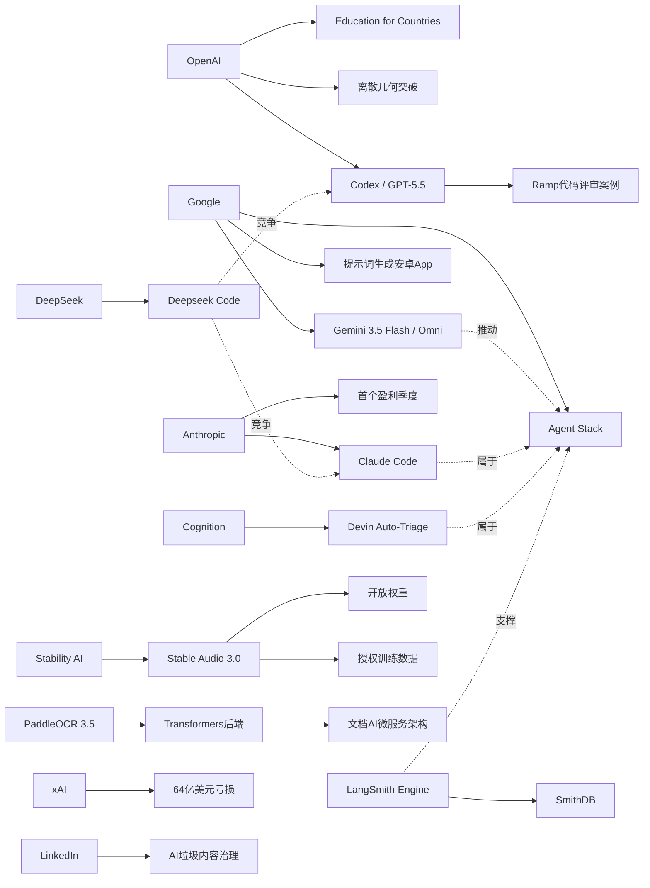

> AI 早报 · 每日早读 · 全网深度聚合

## **今日摘要**

本期动态显示，AI产品正同时向更强生成能力和更深行业落地推进：Stable Audio 3.0把音乐生成延长到6分钟并开放部分权重，OpenAI扩大国家级教育合作，Google则在I/O上发布Gemini 3.5 Flash、Omni和新版代理技术栈。  
研究与基础设施层面也在加速突破，OpenAI称其模型推翻了一个离散几何重要猜想，PaddleOCR 3.5进一步接入Transformers生态，而LangSmith、Devin、Claude Code等工具持续补齐AI代理开发、观测和自动执行能力。  
行业趋势上，竞争焦点正从单纯聊天助手转向“可执行任务的代理系统”，DeepSeek筹备编程代理Deepseek Code也说明，教育、科研、文档处理和软件开发正在成为AI深入改造的关键场景。

### 🔵 产品与功能更新

1. **Stability AI发布Stable Audio 3.0。**
新一代音频模型可生成最长6分钟的音乐片段，较适合更完整的歌曲创作与配乐场景🚀
其中三款模型提供开放权重（可下载并自行部署的模型参数），方便开发者二次开发。官方还强调训练数据全部来自已授权内容，有助于降低版权争议。
[稳定音频新版亮点(briefing)](https://the-decoder.com/stability-ai-launches-stable-audio-3-0-with-up-to-six-minute-tracks-and-open-weights/)

2. **OpenAI推进“Education for Countries”计划。**
OpenAI宣布扩大其面向各国教育系统的合作，重点包括学校中的AI落地、教师培训以及相关工具支持🚀
从描述看，这一计划不只是提供产品，还试图推动教育体系层面的长期采用。对非技术用户来说，这意味着AI正更系统地进入课堂与教学管理。
[教育合作计划进展(briefing)](https://openai.com/index/the-next-phase-of-education-for-countries)

3. **AI代理基础设施继续升温。**
smol.ai汇总显示，LangSmith Engine正在补足AI代理（可自动执行任务的程序）的CI/CD（持续集成/持续交付）闭环，SmithDB则主打低延迟观测查询🚀
Cognition推出Devin Auto-Triage，用于持续化处理缺陷分流，结合记忆与子代理结构提升自动化能力。Anthropic也在改进Claude Code，强化大代码库支持、提示缓存诊断和更快模式。
[代理工具更新综述(briefing)](https://news.smol.ai/issues/26-05-18-not-much/)

### 🟢 前沿研究

1. **OpenAI模型推翻离散几何重要猜想。**
OpenAI表示，其模型解决了已有80年历史的单位距离问题，并推翻了离散几何中的一个核心猜想🚀
这类成果通常被视为AI在数学研究中更进一步的标志，不再只是辅助计算，而是开始参与原创性推理。对行业来说，这也强化了“AI可进入高难度科研”的预期。
[数学突破事件解读(briefing)](https://openai.com/index/model-disproves-discrete-geometry-conjecture)

2. **Google I/O 2026发布Gemini 3.5 Flash与Omni。**
Google在I/O大会上把Gemini进一步定位为面向消费者和开发者/代理的平台，并推出Gemini 3.5 Flash、Gemini Omni与新版Agent Stack（代理技术栈）🚀
其中Flash面向更快的代理和编程任务，Omni则强调多模态（可同时处理文字、图片、视频等）生成与编辑。Google还称其每月处理的tokens（模型处理的文本单位）已超过3.2千万亿。
[谷歌大会核心发布(briefing)](https://news.smol.ai/issues/26-05-19-not-much/)

3. **PaddleOCR 3.5接入Transformers后端。**
PaddleOCR 3.5展示了如何用Transformers（基于注意力机制的主流模型框架）后端来运行OCR（光学字符识别）和文档解析任务🚀
这意味着文档理解工具链正更紧密地与大模型生态结合。对于企业用户，未来在票据、合同、表单等处理场景中，部署方式可能更加统一。
[文档识别方案更新(briefing)](https://huggingface.co/blog/PaddlePaddle/paddleocr-transformers)

### 🟡 行业展望与社会影响

1. **DeepSeek拟推出编程代理“Deepseek Code”。**
DeepSeek正在北京组建新团队，开发代号为“Deepseek Code”的AI编程代理，目标直指Claude Code、Codex与Cursor🚀
招聘信息显示，团队希望候选人熟悉agent loops（代理循环）、MCP（模型上下文协议）和context engineering（上下文工程）。这说明AI编程助手的竞争正从“聊天式问答”转向“可执行任务代理”。
[深度求索代码计划(briefing)](https://the-decoder.com/deepseek-wants-to-take-on-claude-code-and-openais-codex-with-deepseek-code/)

2. **Anthropic称即将迎来首个盈利季度。**
Anthropic向投资者表示，公司第二季度收入将增长至约109亿美元，并有望实现首个盈利季度🚀
如果成真，这将是生成式AI公司商业化能力的一个重要信号。它意味着高投入的大模型公司，开始出现更清晰的收入与利润路径。
[Anthropic盈利信号(briefing)](https://techcrunch.com/2026/05/20/anthropic-says-its-about-to-have-its-first-profitable-quarter/)

3. **Ramp工程团队用Codex加速代码评审。**
OpenAI分享了Ramp工程师如何结合Codex与GPT-5.5完成代码审查，把原本数小时的反馈缩短到几分钟🚀
这表明AI在企业软件开发中的价值，正更多体现在流程提效而非单点生成。对管理者而言，代码评审、修复建议和迭代速度都可能因此被重构。
[企业代码评审案例(briefing)](https://openai.com/index/ramp)

### 🟣 开源TOP项目

1. **OlmoEarth v1.1发布更高效地球观测模型。**
AllenAI在Hugging Face介绍了OlmoEarth v1.1，这是一组更高效率的地球观测模型🚀
这类模型面向遥感图像理解等场景，可用于环境监测、土地利用分析等任务。亮点在于“更高效”，意味着在成本和性能之间取得更实用的平衡。
[地球观测模型更新(briefing)](https://huggingface.co/blog/allenai/olmoearth-v1-1)

2. **文档AI生产化架构论文关注微服务部署。**
这篇论文提出了一种面向生产环境的微服务架构，用于整合分类、OCR和大语言模型流水线🚀
作者指出，学术界常关注模型本身，却较少讨论大规模稳定运行。对企业落地来说，这类架构研究更接近真实使用难题，例如扩展性、维护性和服务拆分。
[文档AI部署架构(briefing)](https://arxiv.org/abs/2605.18818)

3. **PaddleOCR 3.5方案延续开源文档理解热度。**
虽然它也可归入产品更新，但从开源生态角度看，PaddleOCR 3.5继续强化了OCR与文档解析在开源社区的吸引力🚀
借助Transformers后端，这类工具更容易与主流模型组件协同。对于开发者和企业团队，这有助于降低从识别到理解的整合门槛。
[开源OCR生态观察(briefing)](https://huggingface.co/blog/PaddlePaddle/paddleocr-transformers)

### 🔴 社媒分享

1. **Google开始测试“提示词生成安卓App”。**
Google AI Studio现在可根据提示词直接生成原生Android应用，使用Kotlin与Jetpack Compose，并能在浏览器模拟器中测试🚀
报道认为，这可能让简单工具类应用的开发门槛进一步下降，甚至冲击传统应用商店价值。相比之下，Apple仍在限制这类“vibe coding（氛围式编程）”应用。
[谷歌生成应用测试(briefing)](https://the-decoder.com/google-tests-the-app-version-of-the-saaspocalypse/)

2. **xAI去年烧掉64亿美元。**
TechCrunch援引SpaceX IPO文件称，xAI在2025年亏损64亿美元，同时仍在推进大规模Grok扩张计划🚀
这是外界首次较系统地看到马斯克AI业务的财务状况。信息也反映出，顶级大模型竞争依然是一场极度烧钱的基础设施战。
[xAI财务曝光要点(briefing)](https://techcrunch.com/2026/05/20/xai-burned-6-4b-last-year-spacexs-ipo-filing-shows-why-the-spending-is-far-from-over/)

3. **LinkedIn出手打击“AI垃圾内容”。**
LinkedIn正在加强治理所谓“AI slop（AI批量生成的低质内容）”，测试中据称能以94%的准确率识别泛化帖子🚀
这一动作本身说明，社交平台已切实感受到AI内容泛滥带来的信息质量问题。更有意思的是，LinkedIn母公司Microsoft本身也在积极推动AI工具使用。
[领英治理AI灌水(briefing)](https://the-decoder.com/linkedins-war-on-ai-slop-is-not-just-a-policy-update-it-is-an-admission-that-the-platform-lost-control-of-its-feed/)

---

📊 行业洞察

1. 事实  
   OpenAI推进“Education for Countries”计划，试图把AI更系统地嵌入各国教育体系；同时，OpenAI模型在离散几何中取得高水平研究突破。  
   【洞察】头部模型公司的竞争，正在从“提供通用工具”升级为“同时输出社会基础设施影响力+前沿认知能力”。教育合作强化的是制度入口，数学突破强化的是技术权威，两者叠加有利于OpenAI建立“平台标准制定者”地位，而不只是单一模型供应商。

2. 事实  
   Google I/O发布Gemini 3.5 Flash、Gemini Omni和新版Agent Stack（代理技术栈）；LangSmith Engine、SmithDB、Devin Auto-Triage、Claude Code等一系列AI代理基础设施同步演进；DeepSeek也在布局编程代理“Deepseek Code”。  
   【洞察】AI编程与代理赛道已从“模型能力竞赛”转向“工程化闭环竞赛”。关键差异不再只是代码生成效果，而是是否具备CI/CD（持续集成/持续交付）、观测性（observability，系统运行状态监控）、记忆、任务分流和大代码库协同等能力。未来胜出的产品更像“自动化软件工程系统”，而非聊天机器人。

3. 事实  
   Anthropic称即将迎来首个盈利季度；与此同时，xAI被披露去年烧掉64亿美元，仍在继续扩张；Ramp则展示了Codex在企业代码评审中的明确ROI（投资回报率）。  
   【洞察】生成式AI行业正进入“商业模式分化期”：一部分公司开始证明高价值企业场景可支撑利润，另一部分仍停留在高资本消耗的基础设施扩张阶段。市场接下来会更关注“单位经济模型（unit economics，单个客户/任务的盈利能力）”而非单纯参数规模，企业级提效场景将成为收入兑现最快的主战场。

4. 事实  
   Stability AI发布带开放权重（open weights，可下载部署参数）的Stable Audio 3.0，并强调训练数据已获授权；PaddleOCR 3.5接入Transformers后端，文档理解继续向主流大模型生态靠拢；开源文档AI架构论文则强调生产级微服务部署。  
   【洞察】开源AI正在从“能不能用”走向“能不能放心落地”。未来企业选择模型时，越来越重视三件事：版权合规、生态兼容、生产可运维性。开放权重+标准化后端+微服务架构的组合，意味着开源阵营正补齐商业化落地短板，对闭源API形成更现实的替代压力。

🗺️ 今日关系图

