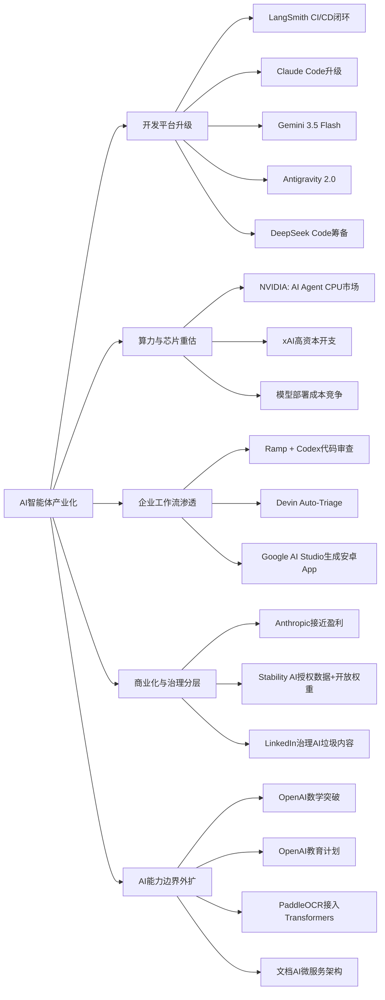

> AI 早报 · 每日早读 · 全网深度聚合

## **今日摘要**

智能体与AI编程基础设施正在快速成熟：LangSmith、Devin、Claude Code、Gemini 等产品同步升级，企业也开始把 AI 正式接入代码审查、测试发布和多模态开发流程。  
与此同时，生成式模型的能力边界继续扩大，例如 Stable Audio 3.0 可生成最长六分钟音乐并开放部分权重，PaddleOCR 也在加速融入 Transformer 主流生态。  
更值得关注的是，AI 不再只提升生产效率，还开始展现科研与产业突破潜力，包括 OpenAI 模型推翻 80 年几何猜想，以及英伟达押注面向 AI 智能体的全新 CPU 市场。

### 🔵 产品与功能更新

1. **LangSmith、Devin与Claude Code同步升级。**
面向智能体（Agent，能自动执行多步任务的AI程序）的基础设施正在加快完善：LangSmith Engine主打CI/CD（持续集成与持续交付）闭环，帮助团队更稳定地测试和发布智能体；SmithDB则强化低延迟观测查询。Cognition 推出的 Devin Auto-Triage 把缺陷分流自动化做得更进一步，强调长期记忆和子智能体协作。Anthropic 也在继续增强 Claude Code，针对大型代码库加入提示缓存诊断和更快模式，整体趋势是“让AI编程工具更可用、更可控”。🚀  
[查看产品更新汇总(briefing)](https://news.smol.ai/issues/26-05-18-not-much/)

2. **Stable Audio 3.0支持生成六分钟音乐。**
Stability AI 发布 Stable Audio 3.0，新一代音频模型可生成最长六分钟的音乐片段，明显提升了可用时长。此次还有三个模型提供开放权重（可供开发者下载和再利用的模型参数），对创作者和开发者更友好。公司还强调训练数据全部来自授权内容，这有助于缓解版权争议。🚀  
[查看音频模型发布(briefing)](https://the-decoder.com/stability-ai-launches-stable-audio-3-0-with-up-to-six-minute-tracks-and-open-weights/)

3. **OpenAI模型推翻80年几何猜想。**
OpenAI 表示，其模型解决了离散几何中的“单位距离问题”，并推翻了一个存在80年的核心猜想。这个结果的意义不仅在于数学突破，也在于展示AI在科研探索中的潜力。对于普通读者来说，可以把它理解为：AI开始不只会“总结已有知识”，也能参与发现新结论。🚀  
[查看数学突破详情(briefing)](https://openai.com/index/model-disproves-discrete-geometry-conjecture)

### 🟢 前沿研究

1. **Google I/O发布Gemini 3.5 Flash与Omni。**
Google 在 I/O 2026 上进一步把 Gemini 定位为面向消费者与开发者的平台。Gemini 3.5 Flash 主打更快的智能体任务与编程任务，Gemini Omni 则强调多模态（可同时处理文字、图像、音频、视频）生成与编辑能力。配套扩展的 Antigravity 2.0 智能体技术栈，也说明 Google 正在把模型能力打包成更完整的开发平台。🚀  
[查看Google发布汇总(briefing)](https://news.smol.ai/issues/26-05-19-not-much/)

2. **英伟达看好AI智能体CPU新市场。**
黄仁勋表示，英伟达看到了一个全新的2000亿美元级市场：面向AI智能体的CPU（中央处理器）。这意味着未来AI基础设施不只是拼GPU（图形处理器），也会在通用计算和系统协同层面展开竞争。若这一判断成立，AI硬件战场将从训练芯片进一步延伸到运行智能体的软件与硬件全链路。🚀  
[查看市场判断原文(briefing)](https://techcrunch.com/2026/05/20/jensen-huang-says-hes-found-a-brand-new-200b-market-for-nvidia/)

3. **Ramp用Codex把代码审查提速到分钟级。**
OpenAI 介绍了金融科技公司 Ramp 如何用 Codex 与 GPT-5.5 辅助代码审查。团队反馈称，原本需要数小时才能拿到的实质性反馈，如今可以在几分钟内完成。对企业来说，这类案例说明AI编程助手正从“写代码”走向“进入正式开发流程”。🚀  
[查看企业应用案例(briefing)](https://openai.com/index/ramp)

4. **PaddleOCR 3.5接入Transformers后端。**
PaddleOCR 3.5 开始支持基于 Transformers（主流深度学习模型架构）的后端，用于OCR（光学字符识别）与文档解析任务。对非技术用户而言，这意味着文档识别工具会更容易与当前主流AI生态整合。它也反映出传统视觉工具正在更快接入大模型时代的通用框架。🚀  
[查看OCR方案更新(briefing)](https://huggingface.co/blog/PaddlePaddle/paddleocr-transformers)

### 🟡 行业展望与社会影响

1. **DeepSeek正筹备AI编程智能体。**
DeepSeek 正在北京组建新团队，开发代号为“DeepSeek Code”的AI编程智能体，目标直指 Claude Code、Codex 与 Cursor。招聘信息显示，团队关注智能体循环、MCP（模型上下文协议）和上下文工程等方向。行业层面看，这说明AI编程助手竞争正在从模型能力扩展到产品形态和开发工作流。🚀  
[查看DeepSeek新动向(briefing)](https://the-decoder.com/deepseek-wants-to-take-on-claude-code-and-openais-codex-with-deepseek-code/)

2. **Anthropic称即将迎来首个盈利季度。**
Anthropic 向投资人表示，公司即将迎来首个盈利季度，并预计第二季度营收超过翻倍至约109亿美元。若消息兑现，这会成为生成式AI公司商业化的重要里程碑。它也说明，顶级模型公司正在从“高投入、高烧钱”逐步走向可持续经营。🚀  
[查看盈利进展报道(briefing)](https://techcrunch.com/2026/05/20/anthropic-says-its-about-to-have-its-first-profitable-quarter/)

3. **OpenAI推进面向各国的教育计划。**
OpenAI 宣布推进“Education for Countries”下一阶段，与更多国家和教育体系合作，推动学校中的AI应用。项目包括教师培训、工具部署和合作伙伴扩展，目标是改善全球学习效果。社会影响层面，这类计划将加速AI进入课堂，也会带来关于公平性、使用规范和教育质量的新讨论。🚀  
[查看教育合作计划(briefing)](https://openai.com/index/the-next-phase-of-education-for-countries)

### 🟣 开源TOP项目

1. **OlmoEarth v1.1提升地球观测模型效率。**
AllenAI 发布 OlmoEarth v1.1，这是一组更高效的地球观测模型，面向遥感（通过卫星或传感器远距离采集地表信息）等任务。效率提升意味着相关模型在资源要求和部署成本上更具吸引力。对于开源社区来说，这类项目有助于把AI能力扩展到气候、环境和地理分析等更广泛领域。🚀  
[查看地观模型更新(briefing)](https://huggingface.co/blog/allenai/olmoearth-v1-1)

2. **文档AI生产化架构强调微服务落地。**
这篇论文提出了一套面向生产环境的文档AI微服务架构，把分类、OCR和大语言模型（LLM）流程整合起来。它试图弥合“论文里模型效果很好”和“企业里真正能稳定跑起来”之间的差距。对关注落地的人来说，价值在于架构方法，而不只是单一模型指标。🚀  
[查看文档AI架构(briefing)](https://arxiv.org/abs/2605.18818)

### 🔴 社媒分享

1. **Google AI Studio开始生成原生安卓应用。**
Google AI Studio 现在可以根据提示词直接生成原生 Android 应用，使用 Kotlin 和 Jetpack Compose，并能在浏览器模拟器中测试。对简单工具类应用来说，这可能降低开发门槛，甚至改变应用商店的价值。相关讨论聚焦在：当“写App”越来越像“写一句话”，软件分发会不会被重塑。🚀  
[查看应用生成讨论(briefing)](https://the-decoder.com/google-tests-the-app-market-version-of-the-saaspocalypse/)

2. **xAI去年烧掉64亿美元引发热议。**
SpaceX 的 IPO 文件披露，xAI 在 2025 年亏损 64 亿美元，同时仍计划继续大规模扩张 Grok。这个数字首次较系统地展示了马斯克AI业务的财务压力，也反映出前沿模型竞争依旧高度烧钱。社交平台上的讨论集中在：巨额投入究竟是长期壁垒，还是高风险赌局。🚀  
[查看xAI财务曝光(briefing)](https://techcrunch.com/2026/05/20/xai-burned-6-4b-last-year-spacexs-ipo-filing-shows-why-the-spending-is-far-from-over/)

3. **LinkedIn开始打击“AI垃圾内容”。**
LinkedIn 正在加大对“AI slop”（低质量AI生成灌水内容）的治理力度，测试中称可识别出94%的通用型灌水帖。这个动作某种程度上说明，平台已经感受到AI内容泛滥对信息流质量的威胁。它也引发了一个更大的问题：当平台一边推广AI，一边又要治理AI内容，尺度该如何拿捏。🚀  
[查看平台治理变化(briefing)](https://the-decoder.com/linkedins-war-on-ai-slop-is-not-just-a-policy-update-it-is-an-admission-that-the-platform-lost-control-of-its-feed/)

---

📊 行业洞察

1. 事实  
   LangSmith Engine 与 SmithDB 强化智能体的 CI/CD（持续集成与持续交付）和可观测性（对系统运行状态的追踪分析）；Devin Auto-Triage 强调长期记忆与子智能体协作；Claude Code 针对大型代码库补上提示缓存诊断与加速模式；同时 DeepSeek 正筹备 DeepSeek Code，对标 Claude Code、Codex 与 Cursor。  
   【洞察】判断：AI 编程赛道正从“模型谁更强”转向“工作流谁更完整”。竞争焦点已升级为智能体基础设施、上下文工程（Context Engineering，围绕任务组织和管理模型上下文的能力）、企业级可控性三位一体，未来护城河更可能建立在开发流程嵌入深度，而非单次代码生成效果。

2. 事实  
   Google I/O 发布 Gemini 3.5 Flash、Gemini Omni 与 Antigravity 2.0 智能体技术栈；英伟达提出面向 AI 智能体的 2000 亿美元级 CPU（中央处理器）新市场；Ramp 使用 Codex 与 GPT-5.5 将代码审查反馈压缩到分钟级。  
   【洞察】判断：智能体正在从“演示能力”跨入“系统级产业化”。上游平台厂商在输出模型+工具链，中游基础设施厂商在重估算力结构，下游企业开始把智能体嵌入正式研发流程，说明 AI 智能体已形成“平台—芯片—应用”联动扩张，2026 年的关键变量将是吞吐成本、稳定性和组织协同效率，而不只是模型榜单排名。

3. 事实  
   Anthropic 称即将迎来首个盈利季度；xAI 去年亏损 64 亿美元且仍计划继续扩张；Stability AI 发布 Stable Audio 3.0 并强调授权训练数据与开放权重（开放模型参数）；LinkedIn 开始治理 AI slop（低质量AI灌水内容）。  
   【洞察】判断：生成式 AI 行业正在进入“商业化分层”阶段——一部分公司证明收入闭环和利润可见性，另一部分公司仍押注高资本开支换规模；与此同时，版权合规、内容质量治理和开放生态策略正在成为新的竞争维度。未来市场不会只奖励“最强模型”，而会更奖励“成本结构、合规能力、生态开放度”更平衡的公司。

4. 事实  
   OpenAI 模型推翻 80 年离散几何猜想；OpenAI 推进面向各国的教育计划；PaddleOCR 3.5 接入 Transformers 后端；文档 AI 生产化架构论文强调微服务（Microservices，将系统拆分为独立服务）落地。  
   【洞察】判断：AI 的价值链正在同时向“科研发现”和“行业基础设施普及”两端延伸。一端是模型开始具备辅助知识发现的潜力，提升 AI 作为“研究工具”的上限；另一端是教育、OCR、文档处理等通用能力加速标准化与生产化，推动 AI 从少数专家系统走向社会级基础能力，长期影响将体现在人才培养、知识生产和组织数字化方式的重构。

🗺️ 今日关系图

