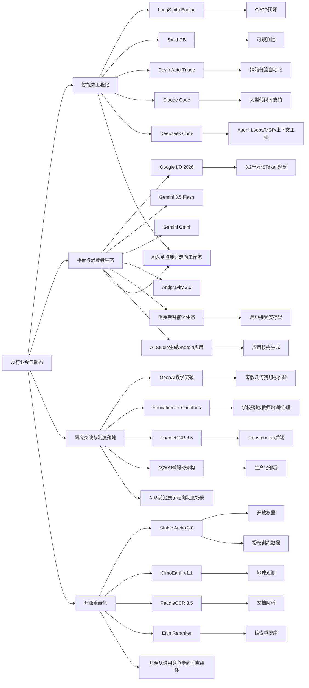

> AI 早报 · 每日早读 · 全网深度聚合

## **今日摘要**

近期 AI 领域一方面在产品层面快速迭代：LangSmith、SmithDB、Devin Auto-Triage 和 Claude Code 等工具持续增强智能体开发与大型代码库支持，Stable Audio 3.0 也把可生成音轨长度提升到六分钟。  
研究与平台方面，OpenAI 宣称模型推翻了离散几何领域一个 80 年猜想，Google I/O 则发布 Gemini 3.5 Flash、Omni 和更完整的智能体开发栈，PaddleOCR 3.5 也接入了 Transformers 后端。  
行业趋势上，Deepseek 正筹备 “Deepseek Code” 进军 AI 编程助手市场，显示竞争正从单纯的代码补全升级到更强调智能体能力、上下文工程和工程化落地的阶段。

### 🔵 产品与功能更新

1. **LangSmith Engine、SmithDB与Devin Auto-Triage推动智能体工具升级。**
面向开发者的“智能体基础设施”正在快速完善：LangSmith Engine 提供类似 CI/CD（持续集成/持续交付）的闭环能力，帮助团队持续测试和更新 AI 智能体。SmithDB 则强调低延迟查询，方便做可观测性（运行状态监控）分析。与此同时，Cognition 推出的 Devin Auto-Triage 可持续处理缺陷分流，并结合记忆与子智能体结构，让自动化排错更接近真实工程流程。Anthropic 也在改进 Claude Code，使其更适合大型代码库使用。🚀  
[查看产品更新汇总](https://news.smol.ai/issues/26-05-18-not-much/)

2. **Stable Audio 3.0发布，可生成最长六分钟音轨。**
Stability AI 推出新一代音频模型 Stable Audio 3.0，其中有三款提供开放权重（可下载并自行部署的模型参数）。这套模型可生成最长六分钟的音乐片段，明显提升了 AI 音乐创作的完整度。公司还表示训练数据全部来自授权内容，这对商用场景尤其重要。🚀  
[查看音频模型详情](https://the-decoder.com/stability-ai-launches-stable-audio-3-0-with-up-to-six-minute-tracks-and-open-weights/)

3. **Claude Code加强对大型代码库的支持。**
Anthropic 针对 Claude Code 增加了提示缓存诊断等能力，帮助开发者理解为什么某些上下文没有被高效复用。它还提供更快的运行模式，降低在大项目中使用 AI 编程助手时的等待成本。对于日常要处理复杂仓库的团队来说，这类优化往往比单纯“更强模型”更有价值。🚀  
[阅读功能改进摘要](https://news.smol.ai/issues/26-05-18-not-much/)

### 🟢 前沿研究

1. **OpenAI模型推翻离散几何80年猜想。**
OpenAI 表示，其模型解决了“单位距离问题”，并推翻了离散几何中的一个核心猜想。离散几何主要研究点、线、图形等有限或分离结构的性质，这次结果被视为 AI 参与数学发现的重要里程碑。它说明 AI 不只是辅助计算，也可能在提出或验证深层数学结论上发挥作用。🚀  
[查看研究官方说明](https://openai.com/index/model-disproves-discrete-geometry-conjecture)

2. **Google I/O 2026发布Gemini 3.5 Flash、Omni与智能体栈。**
Google 在 I/O 大会上把 Gemini 明确定位为既服务消费者、也服务开发者和智能体平台的核心体系。其中 Gemini 3.5 Flash 主打快速任务与编程，Gemini Omni 支持多模态（文本、图像、视频等）生成与编辑，Antigravity 2.0 则继续扩展智能体开发栈。Google 还披露其每月处理的 token（模型处理的文本单位）规模已超过 3.2 千万亿，显示平台级应用正在迅速放大。🚀  
[查看I/O发布梳理](https://news.smol.ai/issues/26-05-19-not-much/)

3. **PaddleOCR 3.5接入Transformers后端。**
PaddleOCR 3.5 开始支持基于 Transformers（主流深度学习模型架构）的后端，用于 OCR（光学字符识别）和文档解析任务。这样的升级有助于统一文本识别与理解流程，也让更多开发者可以复用现有 AI 生态中的工具链。对企业文档自动化、票据处理和知识录入等场景来说，实用价值很高。🚀  
[查看OCR方案介绍](https://huggingface.co/blog/PaddlePaddle/paddleocr-transformers)

### 🟡 行业展望与社会影响

1. **Deepseek筹备“Deepseek Code”进军AI编程助手。**
Deepseek 正在北京组建新团队，开发代号为“Deepseek Code”的 AI 代码智能体，目标直指 Claude Code、Codex 和 Cursor。招聘信息显示，团队看重 agent loops（智能体循环执行）、MCP（模型上下文协议）和 context engineering（上下文工程）等能力。这个动作说明 AI 编程工具的竞争，正从“聊天补全”转向更完整的软件工作流。🚀  
[查看竞争动态报道](https://the-decoder.com/deepseek-wants-to-take-on-claude-code-and-openais-codex-with-deepseek-code/)

2. **Google正向消费者推广智能体生态，但接受度仍存疑。**
TechCrunch 认为，Google 正在积极向普通消费者推销一个由多个 AI 智能体组成的生态体系。不过，消费者是否愿意为这种更复杂的交互方式买单，仍然是未知数。行业现在不缺“智能体概念”，真正稀缺的是让普通人一用就懂、愿意持续使用的产品体验。🚀  
[查看行业观察分析](https://techcrunch.com/2026/05/21/google-is-pitching-an-ai-agent-ecosystem-to-consumers-who-may-not-buy-it/)

3. **OpenAI推进“Education for Countries”教育合作计划。**
OpenAI 宣布推进面向各国的教育合作项目，重点包括学校中的 AI 工具落地、教师培训以及新的合作伙伴关系。该计划强调通过 AI 改善学习效果，并推动更广泛的教育普及。对于公共教育系统来说，这类合作不只是技术引入，也涉及课程设计、治理和长期能力建设。🚀  
[查看教育计划进展](https://openai.com/index/the-next-phase-of-education-for-countries)

### 🟣 开源TOP项目

1. **OlmoEarth v1.1发布，更高效处理地球观测任务。**
AllenAI 发布 OlmoEarth v1.1，这是一组更高效的地球观测模型，面向遥感图像等数据处理场景。此类模型通常用于环境监测、农业分析和灾害评估等任务。效率提升意味着在更有限的算力下，也能更快完成大规模地表数据分析。🚀  
[查看模型更新介绍](https://huggingface.co/blog/allenai/olmoearth-v1-1)

2. **文档AI生产化架构论文提出微服务方案。**
这篇论文聚焦“如何把文档 AI 真正跑到生产环境里”，提出了一个微服务架构来串联分类、OCR 和大语言模型流程。相比只讨论单个模型效果，它更关注系统层面的稳定性、扩展性和可运维性。对希望落地合同处理、表单识别、档案数字化的团队来说，这类工程方案非常关键。🚀  
[查看架构论文摘要](https://arxiv.org/abs/2605.18818)

3. **PaddleOCR 3.5展示开源文档解析能力升级。**
PaddleOCR 3.5 通过引入 Transformers 后端，进一步强化了开源 OCR 与文档解析的组合能力。它让字符识别与更深层的语义理解更容易协同工作，也便于开发者将其接入现有 AI 管线。对于中小团队来说，这类成熟开源方案有助于降低部署门槛。🚀  
[查看开源方案详情](https://huggingface.co/blog/PaddlePaddle/paddleocr-transformers)

### 🔴 社媒分享

1. **Google AI Studio可用提示词生成原生Android应用。**
Google AI Studio 现在可以根据文字提示直接生成原生 Android 应用，使用 Kotlin 和 Jetpack Compose 构建，还能在浏览器模拟器中测试。对于清单、追踪器等简单工具类应用，这可能进一步压缩传统应用商店的价值。报道认为，这像是在测试“应用版 SaaS 末日”——越来越多软件将按需生成，而不是预先发布。🚀  
[查看社媒热议报道](https://the-decoder.com/google-tests-the-app-version-of-the-saaspocalypse/)

2. **黄仁勋称Nvidia看到了2000亿美元新市场。**
Nvidia CEO 黄仁勋表示，面向 AI 智能体的 CPU（中央处理器）可能形成一个 2000 亿美元级别的新市场。这个判断反映出业界对“智能体时代”底层计算需求的重新估值。除了 GPU（图形处理器），未来围绕推理、调度和系统协同的芯片布局，也会越来越重要。🚀  
[查看高管最新表态](https://techcrunch.com/2026/05/20/jensen-huang-says-hes-found-a-brand-new-200b-market-for-nvidia/)

3. **Ettin Reranker系列发布，强化检索结果排序。**
Ettin Reranker 是一组用于重排序的模型，也就是在初步检索后，再对结果进行更精细排序。它常用于搜索、问答和知识库系统，以提升“真正相关内容”排在前面的概率。虽然这类组件不如聊天模型吸睛，但往往直接影响 AI 产品的回答质量。🚀  
[查看模型系列介绍](https://huggingface.co/blog/ettin-reranker)

---

📊 行业洞察

1. 事实  
   LangSmith Engine 提供面向智能体的 CI/CD（持续集成/持续交付）闭环，SmithDB 强调低延迟可观测性（运行状态监控）查询；Cognition 推出 Devin Auto-Triage 做缺陷分流；Anthropic 持续优化 Claude Code 对大型代码库的支持；Deepseek 也在筹备 Deepseek Code，重点招聘 agent loops（智能体循环执行）、MCP（模型上下文协议）和 context engineering（上下文工程）能力。  
   【洞察】AI 编程助手的竞争重心，正从“模型谁更会写代码”转向“谁能嵌入真实软件工程流程”。未来护城河更可能来自工程化基础设施、可观测性、上下文管理和任务闭环，而不是单次代码补全能力。

2. 事实  
   Google I/O 2026 发布 Gemini 3.5 Flash、Gemini Omni 和 Antigravity 2.0 智能体开发栈，并披露月度 token（模型处理文本单位）处理规模超 3.2 千万亿；与此同时，Google 正向消费者推广多智能体生态，但市场仍质疑普通用户是否愿意接受更复杂的交互方式；Google AI Studio 还开始支持通过提示词生成原生 Android 应用。  
   【洞察】Google 正在同时押注“平台规模扩张”和“终端体验重构”两条线：上游通过模型与智能体栈抢占开发平台，下游试图把 AI 从聊天入口推进到应用生成与多智能体协作。但平台能力领先不等于消费者心智领先，2026 年智能体商业化的关键变量将是体验简化，而非能力堆叠。

3. 事实  
   OpenAI 模型推翻了离散几何（研究有限/分离结构性质的数学分支）中的 80 年核心猜想；OpenAI 同时推进“Education for Countries”教育合作计划，强调学校工具落地、教师培训与长期治理；PaddleOCR 3.5 接入 Transformers（主流深度学习架构）后端，文档 AI 生产化架构论文则聚焦分类、OCR 与大语言模型的微服务落地。  
   【洞察】AI 正在从“证明前沿能力”走向“进入制度化场景”。一端是数学发现等高门槛研究突破，强化基础模型的认知能力叙事；另一端是教育、文档处理等高频公共与企业场景落地，推动 AI 从演示价值转向组织级基础设施价值。

4. 事实  
   Stability AI 发布 Stable Audio 3.0，可生成最长六分钟音轨，并提供开放权重（可下载自部署的模型参数），同时强调训练数据来自授权内容；AllenAI 推出 OlmoEarth v1.1 服务地球观测；PaddleOCR 3.5 和 Ettin Reranker 分别强化文档解析与检索重排序能力。  
   【洞察】开源 AI 正从“通用大模型替代”转向“垂直任务组件化”。市场更看重可部署、可商用、数据合规和任务效果明确的专用模型，这意味着未来开源生态的价值将更多体现在行业模块供给，而不是单一基础模型的参数竞赛。

🗺️ 今日关系图

