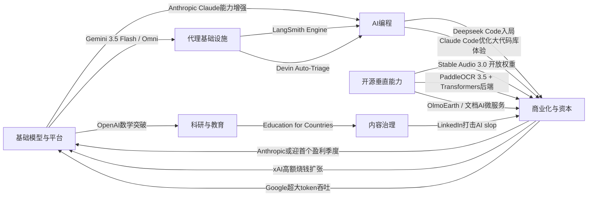

> AI 早报 · 每日早读 · 全网深度聚合

## **今日摘要**

Stable Audio 3.0、Claude Code、LangSmith/Devin 等更新显示，AI产品正从“能用”走向“更长输出、更快响应、可观测可运维”的实用化阶段，尤其在音频生成、代码开发和代理基础设施上加速成熟。  
前沿研究方面，OpenAI在离散几何上取得突破，Google发布 Gemini 3.5 Flash 与 Omni，PaddleOCR 3.5 接入 Transformers，说明 AI 正同时向数学原创研究、多模态平台化和文档理解一体化扩展。  
行业层面，Deepseek 准备推出面向编程代理的 Deepseek Code，进一步表明 AI 竞争焦点已从简单助手转向能自主完成复杂任务的代理系统。

### 🔵 产品与功能更新

1. **Stability AI发布Stable Audio 3.0。**
新一代音频模型可生成最长6分钟的音乐片段，比此前更适合完整歌曲、配乐等场景。官方表示其中有3个模型提供开放权重（可下载并自行部署的模型参数），并且训练数据全部来自授权内容。对创作者和开发者来说，这意味着更长音频生成能力与更灵活的本地使用空间同时到来。🚀
[查看音频模型发布](https://the-decoder.com/stability-ai-launches-stable-audio-3-0-with-up-to-six-minute-tracks-and-open-weights/)

2. **LangSmith Engine与Devin Auto-Triage推动AI代理落地。**
这组更新集中在AI代理（可自主执行多步任务的系统）基础设施上：LangSmith Engine主打CI/CD（持续集成/持续交付）式代理迭代，SmithDB负责低延迟观测查询，帮助团队更快发现问题。Cognition推出的Devin Auto-Triage则把缺陷分流自动化做成持续运行模式，还加入记忆与子代理结构。整体看，行业正在从“会演示的代理”转向“可运维、可观察、可持续优化的代理”。🚀
[查看代理更新汇总](https://news.smol.ai/issues/26-05-18-not-much/)

3. **Claude Code继续优化大代码库开发体验。**
Anthropic在原文中提到，Claude Code针对大型代码库加入提示词缓存诊断，并提供更快模式。对于经常处理复杂工程的开发团队，这类更新能减少等待时间，也更容易定位上下文（模型读取的代码与说明信息）使用是否高效。虽然面向程序员，但本质是在提升AI编程工具的稳定性与响应速度。🚀
[查看编程工具进展](https://news.smol.ai/issues/26-05-18-not-much/)

### 🟢 前沿研究

1. **OpenAI模型推翻80年离散几何猜想。**
OpenAI表示，其模型解决了“单位距离问题”，并推翻了离散几何中的一个核心猜想。离散几何可理解为研究点、线、距离等离散结构的数学分支，这类成果通常高度依赖人类数学家的长期推演。这一进展被视为AI参与数学研究的重要里程碑，显示模型开始在高难度理论问题中提出真正有原创性的答案。🚀
[查看数学突破原文](https://openai.com/index/model-disproves-discrete-geometry-conjecture)

2. **Google I/O 2026发布Gemini 3.5 Flash与Omni。**
Google在I/O大会上把Gemini进一步定位为面向消费者与开发者的统一AI平台，其中Gemini 3.5 Flash主打更快的代理式任务与编程场景。Gemini Omni则强调多模态（可同时处理文字、图片、视频等多种信息）生成与编辑能力，并配合扩展后的Agent Stack（代理工具栈）。Google还披露每月处理超过3.2千万亿token（模型处理的文本单位），显示其平台规模仍在快速扩大。🚀
[查看Google大会要点](https://news.smol.ai/issues/26-05-19-not-much/)

3. **PaddleOCR 3.5接入Transformers后端。**
PaddleOCR 3.5开始支持基于Transformers（当前主流深度学习模型架构）后端运行OCR（光学字符识别）与文档解析任务。对普通用户来说，这意味着票据、表格、扫描件等文档处理有望获得更统一的模型支持。它也反映出文档AI正从单点识别走向更完整的信息抽取与结构化理解。🚀
[查看OCR能力更新](https://huggingface.co/blog/PaddlePaddle/paddleocr-transformers)

### 🟡 行业展望与社会影响

1. **Deepseek筹备“Deepseek Code”切入AI编程代理赛道。**
Deepseek正在北京组建新团队，开发暂名为“Deepseek Code”的AI代码代理产品，直接对标Claude Code、Codex与Cursor。招聘信息显示，团队尤其关注agent loops（代理循环执行）、MCP（模型上下文协议）和context engineering（上下文工程）等能力。这个动作说明AI编程工具竞争正从“代码补全”升级为“能独立完成更多软件任务的代理系统”。🚀
[查看Deepseek新计划](https://the-decoder.com/deepseek-wants-to-take-on-claude-code-and-openais-codex-with-deepseek-code/)

2. **Anthropic称即将迎来首个盈利季度。**
Anthropic向投资人表示，公司第二季度营收将增长到约109亿美元以上，并有望迎来首个盈利季度。对于大模型公司来说，盈利不只是财务信号，也意味着企业级产品、开发工具和API（应用接口）商业化正在加速成熟。在“高投入、慢回报”一直是行业主旋律的背景下，这会强化外界对头部AI公司商业模式的信心。🚀
[查看Anthropic财务信号](https://techcrunch.com/2026/05/20/anthropic-says-its-about-to-have-its-first-profitable-quarter/)

3. **OpenAI推进“面向国家的教育计划”下一阶段。**
OpenAI宣布扩展Education for Countries项目，继续通过新合作、教师培训与工具部署推动学校采用AI。重点不只是把模型送进课堂，更在于提升教师使用能力和改善学习结果。对社会层面而言，这显示AI教育正在从试点项目走向更系统的国家级推进。🚀
[查看教育计划进展](https://openai.com/index/the-next-phase-of-education-for-countries)

### 🟣 开源TOP项目

1. **OlmoEarth v1.1更新地球观测模型家族。**
AllenAI发布OlmoEarth v1.1，主打更高效率的地球观测模型。地球观测通常用于分析卫星图像、土地变化、气候与环境数据，这类模型对科研和公共治理都有现实价值。作为开源方向的进展，它让更多团队能更低门槛地使用相关能力。🚀
[查看地观模型更新](https://huggingface.co/blog/allenai/olmoearth-v1-1)

2. **文档AI生产化架构论文聚焦微服务落地。**
这篇论文提出了一种面向生产环境的微服务架构，把分类、OCR和大语言模型流程封装成可组合的服务。它试图弥合“论文模型效果很好”和“企业真正上线很难”之间的差距。对非技术团队来说，价值在于文档AI不再只是实验室演示，而是更接近可维护、可扩展的企业系统。🚀
[查看文档AI架构](https://arxiv.org/abs/2605.18818)

3. **PaddleOCR 3.5的文档解析能力值得开源关注。**
虽然它也可归入产品更新，但从开源生态看，PaddleOCR 3.5接入Transformers后端同样是重要信号。OCR与文档解析长期是企业自动化中的高频需求，开源工具每一次兼容性提升，都会直接影响部署便利性与社区扩展速度。对开发者生态来说，这类基础项目的演进往往比单一炫技模型更有持续影响。🚀
[查看开源OCR进展](https://huggingface.co/blog/PaddlePaddle/paddleocr-transformers)

### 🔴 社媒分享

1. **Google测试“提示词生成原生安卓应用”。**
Google AI Studio现在可以根据提示词直接生成原生Android应用，代码基于Kotlin和Jetpack Compose，还能在浏览器模拟器中测试。报道认为，这可能让一些简单工具型应用绕过传统应用商店上架流程。若能力持续增强，未来“写一句需求就做出一个小应用”可能会改变普通人获取软件的方式。🚀
[查看Google应用实验](https://the-decoder.com/google-tests-the-app-version-of-the-saaspocalypse/)

2. **xAI去年烧掉64亿美元，扩张仍未结束。**
根据SpaceX IPO文件披露，xAI在2025年亏损64亿美元，这也是外界首次较完整看到马斯克AI业务的财务轮廓。报道指出，随着Grok继续扩张，巨额投入还远没到终点。对社交平台讨论来说，这再次凸显了顶级AI竞争不仅比模型能力，也比资本消耗速度。🚀
[查看xAI财务曝光](https://techcrunch.com/2026/05/20/xai-burned-6-4b-last-year-spacexs-ipo-filing-shows-why-the-spending-is-far-from-over/)

3. **LinkedIn开始打击“AI slop”垃圾内容。**
LinkedIn正在加强治理所谓“AI slop”，也就是大量模板化、低质量、由AI批量生成的内容。平台称在早期测试中，对这类泛泛而谈帖子识别准确率达到94%。这场治理反映出一个更广泛问题：当生成门槛越来越低，内容平台如何维持信息质量将成为新的核心挑战。🚀
[查看平台治理变化](https://the-decoder.com/linkedins-war-on-ai-slop-is-not-just-a-policy-update-it-is-an-admission-that-the-platform-lost-control-of-its-feed/)

---

📊 行业洞察

1. 事实  
   - LangSmith Engine与SmithDB强化AI代理的CI/CD（持续集成/持续交付）、观测与调试能力；Devin Auto-Triage加入记忆与子代理结构，转向持续运行的缺陷分流。  
   - Deepseek正筹备“Deepseek Code”，明确押注agent loops（代理循环执行）、MCP（模型上下文协议）、context engineering（上下文工程）。  
   - Claude Code继续优化大代码库场景中的提示词缓存诊断与响应速度。  
  【洞察】AI代理竞争已从“模型会不会做事”转向“系统能否稳定交付”。编程与企业流程将成为代理最先规模化落地的场景，因为这里对可观测性、可回滚性、上下文管理的要求最清晰，基础设施能力正开始比单次Demo效果更重要。

2. 事实  
   - Anthropic称即将迎来首个盈利季度，显示企业级API（应用程序接口）与开发工具商业化提速。  
   - xAI去年亏损64亿美元，且扩张仍未结束，反映头部竞赛仍高度资本密集。  
   - Google披露Gemini平台月处理超过3.2千万亿token（模型处理文本单位），继续扩大平台规模。  
  【洞察】大模型行业正出现明显分化：一端是“高消耗换规模”的基础模型军备竞赛，另一端是“靠开发者工具和企业服务兑现收入”的商业闭环。未来头部公司的胜负，不只取决于模型分数，更取决于谁能把推理成本、平台流量和付费产品结构联动起来。

3. 事实  
   - Stability AI发布Stable Audio 3.0，支持最长6分钟音乐生成，并提供3个开放权重（可下载并自行部署的模型参数）模型，且训练数据来自授权内容。  
   - PaddleOCR 3.5接入Transformers（主流深度学习模型架构）后端，推动OCR（光学字符识别）与文档解析统一化。  
   - OlmoEarth v1.1、文档AI微服务架构论文等开源项目持续推进垂直场景可部署能力。  
  【洞察】开源AI正在从“通用模型替代”走向“垂直能力组件化”。音频、文档、地球观测等领域的关键竞争点，已不只是参数规模，而是授权合规、本地部署、系统集成与行业工作流适配；这将加速企业采用“开源底座+定制工作流”的混合架构。

4. 事实  
   - OpenAI模型推翻离散几何领域80年猜想，显示AI在高阶数学研究中开始具备原创性输出。  
   - OpenAI同时推进“Education for Countries”下一阶段，把AI能力更系统地导入国家教育体系。  
   - LinkedIn开始打击“AI slop（低质量AI批量内容）”，识别准确率达94%。  
  【洞察】AI社会角色正在同步上升为“知识生产者”和“知识污染源”。一方面，模型已进入科研与教育核心流程；另一方面，内容平台必须建立质量治理机制。未来真正有竞争力的AI生态，不只是生成能力强，还要具备可信使用、质量筛选和制度化落地能力。

🗺️ 今日关系图

